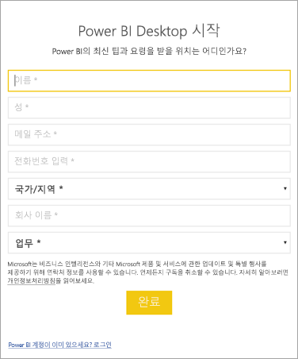

# <a name="administrators-manage-the-power-bi-desktop-sign-in-form"></a>관리자: Power BI Desktop 로그인 양식 관리
Power BI Desktop이 처음 시작되면 로그인 양식이 표시됩니다. 계속하려면 정보를 입력하거나 Power BI에 로그인합니다. 관리자는 레지스트리 키를 사용하여 이 양식을 관리합니다. 



관리자는 다음 레지스트리 키를 사용하여 로그인 양식을 사용하지 않도록 설정합니다. 글로벌 정책을 사용하여 전체 조직에 푸시할 수도 있습니다.

```
Key: HKEY_CURRENT_USER\SOFTWARE\Policies\Microsoft\Microsoft Power BI Desktop
valueName: ShowLeadGenDialog
```
구성에 따라 일부 고객에게 성공한 다음 키를 사용해 볼 수도 있습니다.

```
Key: HKEY_CURRENT_USER\SOFTWARE\Microsoft\Microsoft Power BI Desktop
valueName: ShowLeadGenDialog
```

값 0은 대화 상자를 사용하지 않도록 설정합니다.


궁금한 점이 더 있나요? [Power BI 커뮤니티에 질문합니다.](https://community.powerbi.com/)

