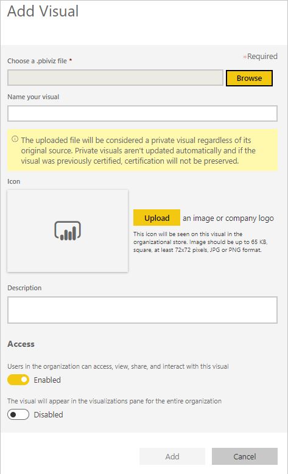

# Power BI 시각적 개체 관리 설정 관리

조직의 Power BI 관리자는 조직에서 사용자가 액세스할 수 있는 Power BI 시각적 개체의 유형을 제어할 수 있습니다.

Power BI 시각적 개체를 관리하려면 Office 365의 전역 관리자이거나 Power BI 서비스 관리자 역할이 할당되어 있어야 합니다. Power BI 서비스 관리자 역할에 대한 자세한 내용은 [Power BI 관리자 역할 이해](service-admin-role.md)를 참조하세요.

## 관리 포털에 액세스

이 문서에서 설명하는 설정을 사용하도록 설정하려면 관리 포털에 액세스해야 합니다.

1. Power BI 서비스에서 **설정**을 선택합니다.

2. 설정 드롭다운 메뉴에서 **관리 포털**을 선택합니다.

    

## Power BI 시각적 개체 테넌트 설정

조직의 Power BI 관리자는 조직에서 사용자가 액세스할 수 있는 Power BI 시각적 개체의 유형을 제어할 수 있습니다.

UI 테넌트 설정은 Power BI 서비스에만 영향을 줍니다. 이 설정을 Power BI Desktop에도 적용하고 싶다면 그룹 정책을 사용하세요. 각 섹션의 끝부분에 있는 표에 Power BI Desktop에서 설정을 사용하도록 설정하기 위한 정보가 안내되어 있습니다.

>[!NOTE]
>테넌트 설정을 변경해도 [조직의 시각적 개체](#organizational-visuals) 탭에 나열된 Power BI 시각적 개체에는 영향을 주지 않습니다.

### AppSource 또는 파일의 시각적 개체

다음 유형의 Power BI 시각적 개체에 대해 조직 액세스를 관리합니다.

* 개발자가 만들어서 .pbiviz 파일로 저장한 시각적 개체.

* AppSource에서 받을 수 있는 시각적 개체.

조직의 사용자가 .pbiviz 파일을 업로드하고 AppSource의 시각적 개체를 보고서 및 대시보드에 추가할 수 있도록 하려면 다음 지침을 따르세요.

1. **Power BI SDK를 사용하여 만든 시각적 개체 허용** 설정을 확장합니다.

2. **사용**을 클릭합니다.

3. .pbiviz 및 AppSource 시각적 개체를 누가 업로드할 수 있는지 선택합니다.

    * 조직의 모든 사용자가 .pbiviz 파일을 업로드하고 AppSource의 시각적 개체를 추가할 수 있도록 허용하려면 **전체 조직** 옵션을 선택합니다.

     * 보안 그룹을 사용하여 .pbiviz 파일의 업로드와 AppSource의 시각적 개체 추가를 관리하려면 **특정 보안 그룹**을 선택합니다. 관리하려는 보안 그룹을 ‘보안 그룹 입력’ 텍스트 상자에 추가합니다. 지정한 보안 그룹이 기본적으로 제외됩니다. 해당 보안 그룹을 포함하고 조직의 다른 모든 사용자를 제외하려면 **특정 보안 그룹 제외** 옵션을 선택합니다.

4. **적용**을 클릭합니다.

테넌트 설정에 대한 UI 변경은 Power BI 서비스에만 적용됩니다. 조직의 사용자가 .pbiviz 파일을 업로드하고 AppSource의 시각적 개체를 Power BI Desktop의 시각화 창에 추가할 수 있도록 하려면 [Azure AD 그룹 정책](/azure/active-directory-domain-services/manage-group-policy)을 사용합니다.

|키  |값 이름  |값  |
|---------|---------|---------|
|Software\Policies\Microsoft\Power BI Desktop\    |EnableCustomVisuals    |0 - 사용 안 함  1 - 사용(기본값)         |
|

### 인증된 Power BI 시각적 개체

이 설정을 사용하도록 설정하면 조직의 보고서와 대시보드에서 [인증된 Power BI 시각적 개체](../developer/visuals/power-bi-custom-visuals-certified.md)만 렌더링됩니다. AppSource 또는 파일의 Power BI 시각적 개체 중에서 인증되지 않은 시각적 개체는 오류 메시지를 반환합니다.

1. 관리 포털에서 **인증된 시각적 개체만 추가 및 사용**을 선택합니다.

2. **사용**을 클릭합니다.

3. **적용**을 클릭합니다.

테넌트 설정에 대한 UI 변경은 Power BI 서비스에만 적용됩니다. Power BI Desktop에서 인증된 시각적 개체 테넌트 설정을 관리하려면 [Azure AD 그룹 정책](/azure/active-directory-domain-services/manage-group-policy)을 사용합니다.

|키  |값 이름  |값  |
|---------|---------|---------|
|Software\Policies\Microsoft\Power BI Desktop\    |EnableUncertifiedVisuals    |0 - 사용 안 함  1 - 사용(기본값)         |
|

## 조직의 시각적 개체

Power BI 관리자는 조직의 [조직 스토어](../developer/visuals/power-bi-custom-visuals.md#organizational-store)에서 제공되는 Power BI 시각적 개체 목록을 관리할 수 있습니다. ‘관리 포털’의 **조직의 시각적 개체** 탭에서는 시각적 개체를 추가 및 제거하고 조직 사용자의 시각화 창에 어떤 시각적 개체를 자동으로 표시할지 정할 수 있습니다. 인증되지 않은 시각적 개체와 .pbiviz 시각적 개체를 포함하여 어떠한 유형의 시각적 개체도 목록에 추가할 수 있으며, 조직의 [테넌트 설정](#power-bi-visuals-tenant-settings)과 상충하는 시각적 개체도 가능합니다.

조직의 시각적 개체 설정은 Power BI Desktop에 자동으로 배포됩니다.

>[!NOTE]
>조직의 시각적 개체는 Power BI Report Server에서 지원되지 않습니다.

### 파일에서 시각적 개체 추가

.pbiviz 파일에서 새 Power BI 시각적 개체를 추가하려면 이 방법을 사용하세요.

> [!WARNING]
> 파일에서 업로드된 Power BI 시각적 개체에는 보안 또는 개인 정보 관련 위험이 있는 코드가 포함될 수 있습니다. 조직의 리포지토리로 배포하기 전에 시각적 개체의 작성자와 원본을 신뢰할 수 있는지 확인해야 합니다.

1. **시각적 개체 추가** > **파일에서**를 선택합니다.

    

2. 다음 필드를 작성합니다.

    * **.pbiviz 파일 선택** - 업로드할 시각적 개체 파일을 선택합니다.

    * **시각적 개체에 이름 지정** - 보고서 작성자가 보고서의 기능을 쉽게 알아볼 수 있도록 시각적 개체에 간단한 제목을 지정합니다.

    * **아이콘** - 시각화 창에 표시할 아이콘 파일을 업로드합니다.

    * **설명** - 시각적 개체에 대한 짧은 설명을 입력하여 사용자들에게 더 많은 컨텍스트를 제공합니다.

    * **액세스** - 이 섹션에는 두 가지 옵션이 있습니다.
    
        * 조직의 사용자가 이 시각적 개체에 액세스할 수 있는지 여부를 선택합니다. 이 설정은 기본적으로 사용하도록 설정됩니다.

        * 이 시각적 개체가 조직 사용자의 시각화 창에 표시되는지 여부를 선택합니다. 이 설정은 기본적으로 사용하지 않도록 설정됩니다. 자세한 내용은 [시각화 창에 시각적 개체 추가](#add-a-visual-to-the-visualization-pane)를 참조하세요.

    

3. **추가**를 선택하여 업로드 요청을 시작합니다. 업로드가 완료되면 조직의 시각적 개체 목록에 해당 시각적 개체가 표시됩니다.

### AppSource의 시각적 개체 추가(미리 보기)

AppSource에서 새 Power BI 시각적 개체를 추가하려면 이 방법을 사용하세요.

AppSource Power BI 시각적 개체는 자동으로 업로드됩니다. 조직의 사용자는 항상 최신 버전의 시각적 개체를 사용하게 됩니다.

1. **시각적 개체 추가** > **AppSource에서**를 선택합니다.

    

2. **Power BI 시각적 개체** 창에서 추가하려는 AppSource 시각적 개체를 찾아서 **추가**를 클릭합니다. 업로드가 완료되면 조직의 시각적 개체 목록에 해당 시각적 개체가 표시됩니다.

### 시각화 창에 시각적 개체 추가

조직의 시각적 개체 페이지에서 조직의 모든 사용자의 시각화 창에 자동으로 표시할 시각적 개체를 선택할 수 있습니다.

1. 추가하려는 시각적 개체의 행에서 **설정**을 클릭합니다.

    조직 창

2. 시각화 창 설정을 사용하도록 설정하고 **업데이트**를 클릭합니다.

    

### 파일에서 업로드한 시각적 개체 삭제

시각적 개체를 영구적으로 삭제하려면 리포지토리에서 시각적 개체의 휴지통 아이콘을 선택합니다.

> [!IMPORTANT]
> 삭제는 되돌릴 수 없습니다. 삭제되면 시각적 개체는 기존 보고서에서 렌더링을 즉시 중지합니다. 동일한 시각적 개체를 다시 업로드하더라도 삭제된 시각적 개체를 바꾸지 않습니다. 그러나 사용자는 새 시각적 개체를 다시 가져오고 해당 보고서에 있는 인스턴스를 대체할 수 있습니다.

### .pbiviz 시각적 개체를 사용하지 않도록 설정

.pbiviz 시각적 개체를 조직의 시각적 개체 목록에 그대로 유지하면서 [조직 스토어](../developer/visuals/power-bi-custom-visuals.md#organizational-store)에서 제공되지 않도록 설정할 수 있습니다.

1. 사용하지 않도록 설정하려는 .pbiviz 시각적 개체의 행에서 **설정**을 클릭합니다.

2. **액세스** 섹션에서 다음 설정을 사용하지 않도록 설정합니다. ‘조직의 사용자가 이 시각적 개체를 액세스하고 보고 공유하고 시각적 개체와 상호 작용할 수 있습니다.’

.pbiviz 시각적 개체를 사용하지 않도록 설정하면 시각적 개체가 기존 보고서에 렌더링되지 않고 아래와 같은 오류 메시지가 표시됩니다.

*이 사용자 지정 시각적 개체는 더 이상 사용할 수 없습니다. 자세한 내용은 관리자에게 문의하세요.*

>[!NOTE]
>책갈피에 추가되어 있어서 사용하지 않도록 설정된 후에도 계속해서 작동하는 .pbiviz 시각적 개체

### 시각적 개체 업데이트

AppSource 시각적 개체는 자동으로 업데이트됩니다. AppSource에서 새로운 버전을 사용할 수 있게 되면 새로운 버전이 조직의 시각적 개체 목록을 통해 배포된 기존 버전을 바꿉니다.

.pbiviz 시각적 개체를 업데이트하려면 아래 단계에 따라 시각적 개체를 바꾸세요.

1. 추가하려는 시각적 개체의 행에서 **설정**을 클릭합니다.

2. **찾아보기**를 클릭하고 현재 시각적 개체를 바꾸려는 .pbiviz를 선택합니다.

3. **업데이트**를 클릭합니다.

## 다음 단계

> [!div class="nextstepaction"]
>[관리 포털에서 Power BI 관리](service-admin-portal.md)

> [!div class="nextstepaction"]
>[Power BI의 시각적 개체](../developer/visuals/power-bi-custom-visuals.md)

> [!div class="nextstepaction"]
>[Power BI의 조직 시각적 개체](../developer/visuals/power-bi-custom-visuals-organization.md)