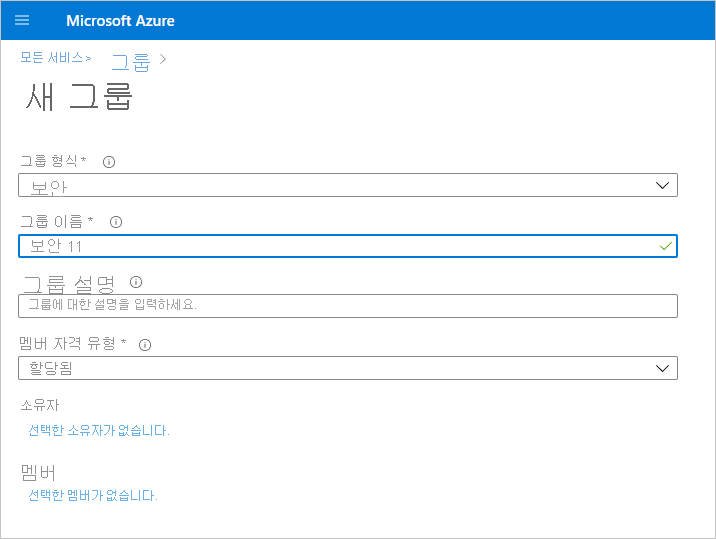
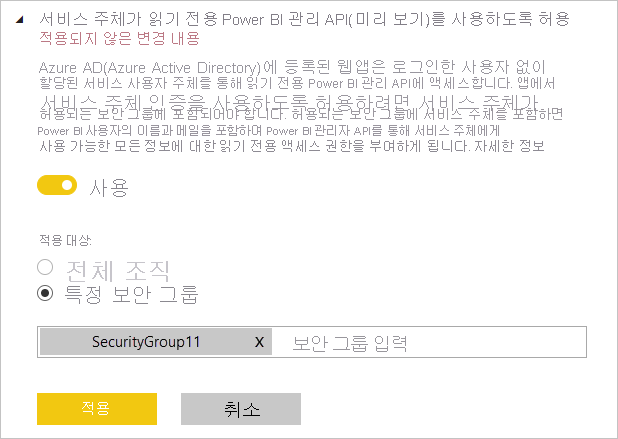

# 읽기 전용 관리 API에 대한 서비스 주체 인증 사용(미리 보기)

서비스 주체는 Azure Active Directory(Azure AD) 애플리케이션이 콘텐츠 및 API Power BI 서비스에 액세스하도록 하는 데 사용할 수 있는 인증 방법입니다.
Azure AD 앱을 만들 때 [서비스 주체 개체](https://docs.microsoft.com/azure/active-directory/develop/app-objects-and-service-principals#service-principal-object)가 만들어집니다. 서비스 주체 개체(서비스 주체라고도 함)는 Azure AD가 앱을 인증하도록 합니다. 인증된 앱은 Azure AD 테넌트 리소스에 액세스할 수 있습니다.

## 메서드

Power BI 읽기 전용 API에 대한 서비스 주체 인증을 사용하도록 설정하려면 다음 단계를 수행합니다.

1. [Azure AD 앱을 만듭니다](https://docs.microsoft.com/azure/active-directory/develop/howto-create-service-principal-portal). 이미 사용하고자 하는 Azure AD 앱이 있는 경우 이 단계를 건너뛰어도 됩니다. 이후 단계를 위해 앱 ID를 기록해 둡니다. 
2. Azure Active Directory에서 **보안 그룹** 이 생성됩니다. [Azure Active Directory를 사용하여 기본 그룹을 생성하고 멤버를 추가하는 방법에 대해 자세히 알아보세요](https://docs.microsoft.com/azure/active-directory/fundamentals/active-directory-groups-create-azure-portal). 사용할 보안 그룹이 이미 있는 경우 이 단계를 건너뛰어도 됩니다.
    그룹 종류로 **보안** 을 선택해야 합니다.

    

3. 생성한 보안 그룹의 멤버로 앱 ID를 추가합니다. 이를 수행하려면:
    1. **Azure Portal > Azure Active Directory > 그룹** 으로 이동한 다음 2단계에서 만든 보안 그룹을 선택합니다.
    1. **멤버 추가** 를 선택합니다.
    참고: 사용하는 앱에 Azure Portal에서 설정된 Power BI 관리자 역할이 없는지 확인합니다. 이를 확인하려면 다음 단계를 따르세요. 
       * 전역 관리자, 애플리케이션 관리자 또는 클라우드 애플리케이션 관리자로 **Azure Portal** 에 로그인합니다. 
        * **Azure Active Directory** 를 선택한 다음 **Enterprise 애플리케이션** 을 선택합니다. 
        * Power BI에 대한 액세스 권한을 부여할 애플리케이션을 선택합니다. 
        * **권한** 을 선택합니다. 이 애플리케이션에 필수로 설정된 Power BI 관리자 동의가 있는지 확인합니다. 자세한 내용은 [애플리케이션에 대한 동의 관리 및 동의 요청 평가](https://docs.microsoft.com/azure/active-directory/manage-apps/manage-consent-requests)를 참고하세요. 
4. Power BI 서비스 관리자 설정을 사용하도록 설정합니다. 가상 하드 디스크 파일에 대한 중요 정보를 제공하려면
    1. Power BI 관리자 포털에 로그인합니다. 테넌트 설정 페이지를 보려면 Power BI 관리자여야 합니다.
    1. **개발자 설정** 에 **서비스 주체가 읽기 전용 Power BI 관리자 API를 사용할 수 있도록 허용(미리 보기)** 이 표시됩니다. 아래와 같이 토글을 사용으로 설정하고 **특정 보안 그룹** 라디오 단추를 선택한 다음 아래에 나타나는 필드에서 2단계에서 만든 보안 그룹을 추가합니다.

        

 5. 읽기 전용 관리자 API 사용을 시작합니다. 지원되는 API 목록은 아래에서 확인하세요.

    >[!IMPORTANT]
    >Power BI로 서비스 주체를 사용하도록 설정하면 애플리케이션의 Azure AD 권한이 더 이상 적용되지 않습니다. 애플리케이션 사용 권한은 Power BI 관리 포털을 통해 관리됩니다.

## 고려 사항 및 제한 사항
* 서비스 주체를 사용하여 Power BI 포털에 로그인할 수 없습니다.
* Power BI 관리자 권한은 Power BI 관리 포털의 개발자 설정에서 서비스 주체를 활성화하는 데 필요합니다.
* 서비스 주체는 현재 다음 API를 지원합니다.
    * 대시보드, 데이터 세트, 보고서, 데이터 흐름의 $expand 포함 [GetGroupsAsAdmin](https://docs.microsoft.com/rest/api/power-bi/admin/groups_getgroupsasadmin) 
    * $expand 타일 포함 [GetDashboardsAsAdmin](https://docs.microsoft.com/rest/api/power-bi/admin/dashboards_getdashboardsasadmin)
    * [GetDatasourcesAsAdmin](https://docs.microsoft.com/rest/api/power-bi/admin/datasets_getdatasourcesasadmin) 
    * [GetDatasetToDataflowsLinksAsAdmin](https://docs.microsoft.com/rest/api/power-bi/admin/datasets_getdatasettodataflowslinksingroupasadmin)
    * [GetDataflowDatasourcesAsAdmin](https://docs.microsoft.com/rest/api/power-bi/admin/dataflows_getdataflowdatasourcesasadmin) 
    * [GetDataflowUpstreamDataflowsAsAdmin](https://docs.microsoft.com/rest/api/power-bi/admin/dataflows_getupstreamdataflowsingroupasadmin) 
    * [GetCapacitiesAsAdmin](https://docs.microsoft.com/rest/api/power-bi/admin/getcapacitiesasadmin)
    * [GetActivityLog](https://docs.microsoft.com/rest/api/power-bi/admin/getactivityevents)
    * [GetModifiedWorkspaces](https://docs.microsoft.com/rest/api/power-bi/admin/workspaceinfo_getmodifiedworkspaces)
    * [WorkspaceGetInfo](https://docs.microsoft.com/rest/api/power-bi/admin/workspaceinfo_postworkspaceinfo)
    * [WorkspaceScanStatus](https://docs.microsoft.com/rest/api/power-bi/admin/workspaceinfo_getscanstatus)
    * [WorkspaceScanResult](https://docs.microsoft.com/rest/api/power-bi/admin/workspaceinfo_getscanresult)
