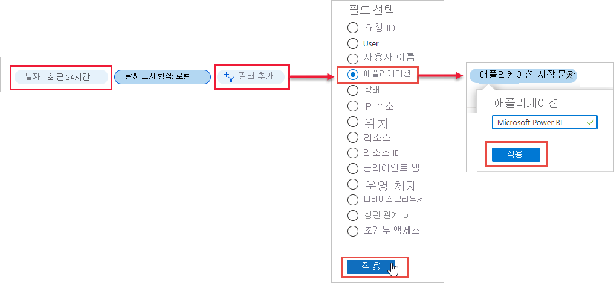

# 로그인한 Power BI 사용자 찾기

조직의 관리자로서 Power BI에 로그인했던 사람이 누구인지 알고자 하는 경우 [Azure Active Directory 액세스 및 사용 보고서](/azure/active-directory/reports-monitoring/concept-sign-ins)를 사용하세요.

> [!NOTE]
> **로그인** 보고서는 유용한 정보를 제공하지만, 각 사용자의 라이선스 유형을 식별하지는 않습니다. 라이선스를 보려면 Microsoft 365 관리 센터를 사용합니다.

## 요구 사항

모든 사용자는 자신의 로그인 보고서를 볼 수 있습니다. 모든 사용자에 대한 보고서를 보려면 다음 역할 중 하나여야 합니다. 전역 관리자, 보안 관리자, 보안 리더 또는 보고서 리더.

## Azure Active Directory 관리 센터를 사용하여 로그인 보기

로그인 활동을 보려면 다음 단계를 수행합니다.

1. [Azure Active Directory 관리 센터](https://aad.portal.azure.com)에 로그인한 다음, 포털 메뉴에서 **Azure Active Directory** 를 선택합니다.

1. 리소스 메뉴에서 **모니터링** > **로그인** 을 선택합니다.
   
    

1. 기본적으로 모든 사용자 및 모든 애플리케이션에 대해 지난 24시간 동안의 모든 로그인이 표시됩니다. 다른 기간을 선택하려면 작업 창에서 **날짜** 를 선택하고 사용 가능한 시간 간격 중에서 선택합니다. 지난 7일 동안의 정보만 사용할 수 있습니다. Power BI에 대한 로그인만 보려면 필터를 추가합니다. 필터링 기준으로 사용할 필드로 **필터 추가** > **애플리케이션** 을 선택하고 **적용** 을 선택합니다. 작업 창 상단에서 **애플리케이션 시작** 을 선택하고 앱 이름을 입력합니다. **적용** 을 선택합니다.

    **Microsoft Power BI** 는 서비스와 관련된 로그인 활동을 필터링합니다. **Power BI 게이트웨이** 는 온-프레미스 데이터 게이트웨이에 특정한 로그인 활동을 필터링합니다.
   
    

## 데이터 내보내기

CSV 파일 또는 JSON 파일의 두 가지 형식 중 하나로 [로그인 보고서를 다운로드](/azure/active-directory/reports-monitoring/quickstart-download-sign-in-report)할 수 있습니다.

1. **로그인** 보고서의 명령 모음에서 **다운로드** 를 선택한 후, 다음 옵션 중 하나를 선택합니다.

   * **CSV** - 현재 필터링된 데이터의 CSV 파일을 다운로드합니다.

   * **JSON** - 현재 필터링된 데이터의 JSON 파일을 다운로드합니다.

2. 파일 이름을 입력한 다음, **다운로드** 를 선택합니다.

## 데이터 보존

조직에 Azure AD 프리미엄 라이선스가 없는 경우 로그인 관련 데이터는 최대 7일 동안 사용할 수 있습니다. Azure AD Premium P1 또는 Azure AD Premium P2를 사용하는 경우 지난 30일 동안의 데이터를 볼 수 있습니다. 자세한 내용은 [Azure Active Directory 보고서 보존 정책](/azure/active-directory/reports-monitoring/reference-reports-data-retention)을 참조하세요.

## 다음 단계

[사용자 작업 감사](service-admin-auditing.md)

궁금한 점이 더 있나요? [Power BI 커뮤니티에 질문합니다.](https://community.powerbi.com/)