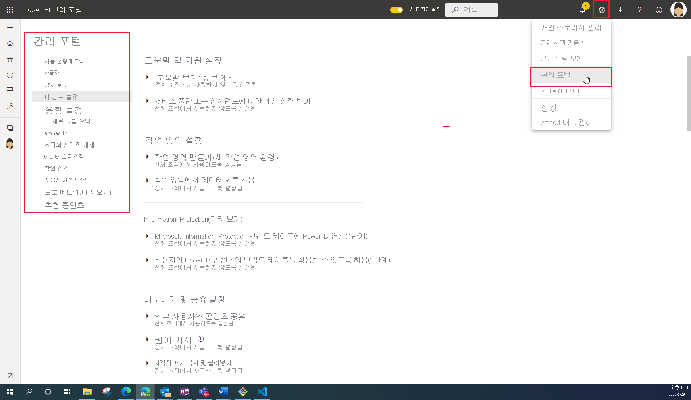

# Power BI 관리란?

Power BI 관리는 Power BI의 작동 방식을 제어하는 조직 전체 설정을 관리하는 것입니다. 관리자 역할에 할당된 사용자는 조직 리소스를 구성, 모니터링 및 프로비저닝합니다. 이 문서에서는 시작하는 데 도움이 되는 관리 역할, 작업 및 도구에 대한 개요를 제공합니다.

## Power BI와 관련된 관리자 역할

조직의 Power BI를 관리하기 위해 함께 동작하는 여러 역할이 있습니다. 대부분의 관리자 역할은 Microsoft 365 관리 센터에서 또는 PowerShell을 사용하여 할당됩니다. 용량을 만들 때 Power BI Premium 용량 및 Power BI Embedded 용량 관리자 역할이 할당됩니다. 각 관리자 역할에 대한 자세한 내용은 [관리자 역할 정보](https://docs.microsoft.com/microsoft-365/admin/add-users/about-admin-roles?view=o365-worldwide)를 참조하세요. 관리자 역할을 할당하는 방법에 대한 자세한 내용은 [관리자 역할 할당](https://docs.microsoft.com/microsoft-365/admin/add-users/assign-admin-roles?view=o365-worldwide)을 참조하세요.

| **관리자 유형** | **관리 범위** | **Power BI 작업** |
| --- | --- | --- |
| 전역 관리자 | Microsoft 365 | 조직의 모든 관리 기능에 무제한으로 액세스할 수 있음 |
| | | 다른 사용자에게 역할 할당 |
| 대금 청구 관리자 | Microsoft 365 | 구독 관리 |
| | | 라이선스 구매 |
| 라이선스 관리자 | Microsoft 365 | 사용자의 라이선스 할당 또는 제거 |
| 사용자 관리 | Microsoft 365 | 사용자와 그룹을 만들고 관리 |
| | | 사용자 암호 다시 설정 |
| Power BI 관리자 | Power BI 서비스 | Power BI 관리 작업에 대한 모든 권한|
| | | Power BI 기능 사용 및 사용 안 함 |
| | | 사용량 및 성능 보고 |
| | | 감사 검토 및 관리 |
| Power BI Premium 용량 관리자 | 단일 프리미엄 용량 | 용량에 작업 영역 할당|
| | | 용량에 대한 사용자 권한 관리 |
| | | 워크로드 관리로 메모리 사용량 구성 |
| | | 용량 다시 시작 |
| Power BI Embedded 용량 관리자 | 단일 포함 용량 | 용량에 작업 영역 할당|
| | | 용량에 대한 사용자 권한 관리 |
| | | 워크로드 관리로 메모리 사용량 구성 |
| | | 용량 다시 시작 |

## 관리 작업 및 도구

Power BI 관리자는 주로 Power BI 관리 포털에서 작업합니다. 그러나 관련 도구와 관리 센터에 대해 잘 알고 있어야 합니다. 위의 표를 살펴보면 여기에 나열된 도구를 사용하여 작업을 수행하는 데 어떤 역할이 필요한지 확인할 수 있습니다.

| **도구** | **일반 작업** |
| --- | --- |
| [Power BI 관리 포털](https://app.powerbi.com/admin-portal) | 프리미엄 용량 취득 및 사용 |
| | 서비스 품질 보장 |
| | 작업 영역 관리 |
| | Power BI 시각적 개체 게시 |
| | 다른 애플리케이션에 Power BI를 포함하는 데 사용되는 코드 확인 |
| | 데이터 액세스 및 기타 문제 해결 |
| [Microsoft 365 관리 센터](https://admin.microsoft.com) | 사용자 및 그룹 관리 |
| | 라이선스 구매 및 할당 |
| | 사용자가 Power BI에 액세스하지 못하도록 차단 |
| [Microsoft 365 보안 및 준수 센터](https://protection.office.com) | 감사 검토 및 관리 |
| | 데이터 분류 및 추적 |
| | 데이터 손실 방지 정책 |
| | 정보 거버넌스 |
| [Azure Portal의 AAD(Azure Active Directory)](https://aad.portal.azure.com) | Power BI 리소스에 대한 조건부 액세스 구성 |
| | Power BI Embedded 용량 프로비전 |
| [PowerShell cmdlet](https://docs.microsoft.com/powershell/power-bi/overview) | 스크립트를 통해 Power BI의 작업 영역 및 기타 측면 관리 |
| [관리 API 및 SDK](service-admin-reference.md) | 사용자 지정 관리 도구를 빌드합니다. 예를 들어 Power BI Desktop에서는 이러한 API를 사용하여 관리와 관련된 데이터 기반 보고서를 빌드할 수 있습니다. |

## 다음 단계

Power BI 관리와 관련된 기본 사항을 배웠으므로 다음 문서에서 자세한 내용을 확인하세요.

- [Power BI 관리 포털 사용](service-admin-portal.md)
- [테넌트 관리자 설정 지침](../guidance/admin-tenant-settings.md)
- [PowerShell cmdlet 사용](https://docs.microsoft.com/powershell/power-bi/overview)
- [Power BI 관리 FAQ](service-admin-faq.md)
- [조직의 사용자에 대한 Power BI 서비스 라이선스 부여](service-admin-licensing-organization.md)
- 궁금한 점이 더 있나요? [Power BI 커뮤니티에 질문합니다.](https://community.powerbi.com/)
- 제안? [Power BI 개선을 위한 아이디어 제공](https://ideas.powerbi.com/)
