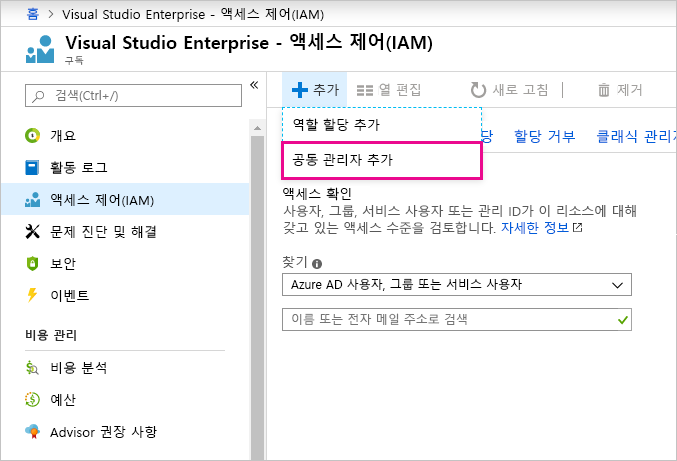

# Power BI 및 Azure에서 동일한 계정 사용

Power BI와 Azure 모두의 사용자인 경우 암호를 두 번 입력할 필요 없이 두 서비스에 같은 로그인을 사용하고자 할 수 있습니다.

Power BI는 직장 또는 학교 메일 주소와 연결된 조직 계정으로 로그인합니다.  Azure는 Microsoft 계정이나 조직 계정을 사용하여 로그인합니다.

Azure 및 Power BI 모두에 동일한 로그인을 사용하려면 조직 계정을 사용하여 Azure에 로그인합니다.

**내 Microsoft 계정으로 이미 Azure에 로그인한 경우**

다음 단계를 수행하여 조직 계정을 Azure에서 공동 관리자로 추가할 수 있습니다.

1. [Azure Portal](https://portal.azure.com/)에 로그인합니다. 여러 Azure 디렉터리가 있는 사용자의 경우 **구독**을 선택하고, 필터링하여 편집할 구독과 디렉터리만 표시합니다.

1. 탐색 창에서 **액세스 제어(IAM)** 를 선택한 다음, **추가** \> **공동 관리자 추가**를 선택합니다.

    

1. 조직 계정에 연결된 메일 주소를 입력하고 **추가**를 선택합니다.

1. 다음에 Azure Portal에 로그인할 때는 조직 메일 주소를 사용합니다.

궁금한 점이 더 있나요? [Power BI 커뮤니티를 이용하세요.](https://community.powerbi.com/)
