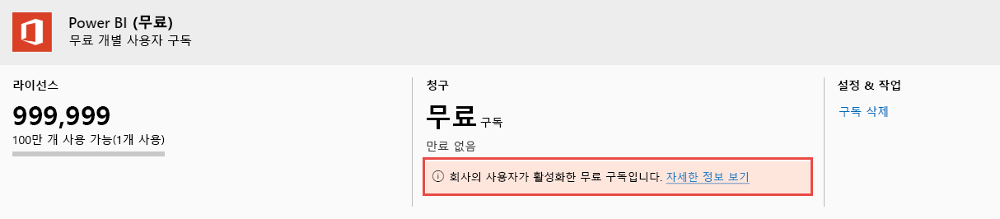

# Power BI 사용자 라이선스 보기 및 관리

이 문서에서는 관리자가 Microsoft 365 관리 센터 또는 Azure Portal을 사용하여 Power BI 서비스에 대한 사용자 라이선스를 보고 관리하는 방법을 설명합니다.

> [!NOTE]
>
>사용자에게 Power BI(무료)와 Power BI Pro 라이선스를 모두 할당할 수도 있습니다. 사용자가 무료 라이선스에 등록한 다음 나중에 Power BI Pro 라이선스가 할당되는 경우 이러한 상황이 발생할 수 있습니다. 이 경우에는 가장 높은 라이선스 수준이 적용됩니다.
>

## 구독 보기

조직에 포함된 Power BI 구독을 확인하려면 다음 단계를 수행합니다.

1. [Microsoft 365 관리 센터](https://admin.microsoft.com)에 로그인합니다.
2. 탐색 메뉴에서 **청구** > **제품 및 서비스**를 선택합니다.

활성 Power BI 구독이 보유하고 있는 다른 구독과 함께 나열됩니다. 여기에 표시된 것처럼 Power BI(무료)에 대한 예기치 않은 구독이 표시될 수 있습니다.

  

이 구독 유형은 사용자가 셀프 서비스 등록을 활용할 때 생성됩니다. 자세한 내용은 [조직의 Power BI](https://docs.microsoft.com/microsoft-365/admin/misc/power-bi-in-your-organization?view=o365-worldwide)를 참조하세요.

## Microsoft 365에서 사용자 라이선스 관리

Microsoft 365 관리 센터를 사용하여 사용자 라이선스를 관리하려면 [비즈니스 구독 및 청구 설명서](https://docs.microsoft.com/microsoft-365/commerce/?view=o365-worldwide)를 참조하세요.

## Azure Portal에서 사용자 라이선스 관리

Azure Portal을 사용하여 Power BI 라이선스를 확인하고 할당하려면 다음 단계를 따르세요.

1. [Azure Portal](https://portal.azure.com)에 로그인합니다.

2. **Azure Active Directory**를 검색하고 선택합니다.

3. Azure Active Directory 리소스 메뉴의 **관리**에서 **라이선스**를 선택합니다.

4. 리소스 메뉴에서 **모든 제품**을 선택한 다음 Power BI 라이선스 유형을 선택하여 허가된 사용자 목록을 표시합니다.

5. 라이선스를 할당하려면 명령 모음에서 **+ 할당**을 선택합니다. **라이선스 할당** 페이지에서 사용자를 선택한 다음 **할당 옵션**을 선택하여 선택된 사용자 계정에 대해 Power BI 라이선스를 설정합니다.

6. 라이선스를 제거하려면 사용자 이름 옆에 있는 확인란을 선택한 다음 **라이선스** 제거를 선택합니다.

## 다음 단계

- [Power BI Pro 구매](service-admin-purchasing-power-bi-pro.md)
- [조직에 대한 라이선싱](service-admin-licensing-organization.md)
