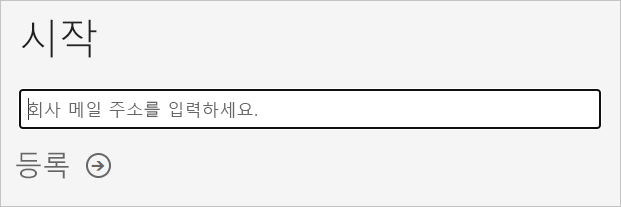
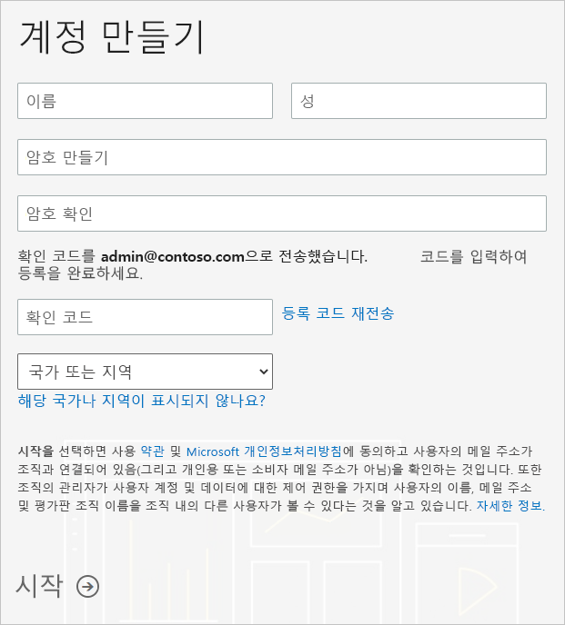

# 조직의 Power BI 구독 가져오기

관리자 권한으로 [Power BI 웹 사이트](https://powerbi.microsoft.com)를 통해 Power BI에 등록할 수 있습니다. 또한 Microsoft 365 관리 센터의 구매 서비스 페이지를 통해 등록할 수도 있습니다. 관리자가 Power BI에 등록할 때 액세스 권한이 있어야 하는 사용자에게 라이선스를 할당할 수 있습니다.

또한, 조직의 개별 사용자는 Power BI 웹 사이트를 통해 Power BI에 등록할 수 있습니다. 조직의 사용자가 Power BI에 등록할 때 해당 사용자에게 Power BI 라이선스가 자동으로 할당됩니다. 이 기능을 해제하려면 [셀프 서비스 등록 및 구매를 사용하거나 사용하지 않도록 설정](service-admin-disable-self-service.md)의 단계에 따릅니다.

## Power BI를 통해 등록

Power BI 구독에 등록하려면 회사 또는 학교 계정이 필요합니다. 소비자 전자 메일 서비스나 전자 통신 공급자가 제공하는 전자 메일 주소는 지원하지 않습니다.

등록하려면 다음 단계를 따르세요.

1. [Power BI 웹 사이트](https://powerbi.microsoft.com)로 이동합니다. **무료 체험**을 선택합니다.
2. 전자 메일 주소를 입력한 다음, **등록**을 선택합니다.

   

3. ID를 확인합니다. 사용할 확인 코드를 호출하거나 텍스트로 보냅니다.
4. **예**를 선택하여 회사에서 받은 전자 메일 주소를 사용하고 있는지 확인합니다.
5. 계정을 만듭니다. 전자 메일 주소로 확인 코드를 보내 등록을 완료합니다.

   

## Microsoft 365를 통해 등록

Microsoft 365 전역 관리자 또는 대금 청구 관리자의 경우 조직의 Power BI 구독을 가져올 수 있습니다. 자세한 내용은 [라이선스는 누가 구매하고 할당할 수 있나요?](../service-admin-licensing-organization.md#who-can-purchase-and-assign-licenses)를 참조하세요.

> [!NOTE]
>
> Microsoft 365 E5 구독은 이미 Power BI Pro 라이선스를 포함합니다. 라이선스를 관리하는 방법을 알아보려면 [사용자 라이선스 보기 및 관리](service-admin-manage-licenses.md)를 참조하세요.
>
>

Microsoft 365 관리 센터에서 Power BI Pro 라이선스를 구매하려면 다음 단계를 수행합니다.

1. [Microsoft 365 관리 센터](https://admin.microsoft.com)에 로그인합니다.

2. 탐색 메뉴에서 **청구** > **서비스 구매**를 선택합니다.
  
   

3. 구매할 구독을 검색하거나 스크롤해 찾습니다. 페이지 아래쪽의 **관심을 가질 만한 기타 범주**에서 **Power BI**를 찾을 수 있습니다. 조직에서 사용할 수 있는 Power BI 구독을 보려면 링크를 선택합니다.

4. Power BI Pro와 같은 제품을 선택합니다.

5. **서비스 구매** 페이지에서 **구매**를 선택합니다. 이전에 사용하지 않은 경우 Power BI Pro 무료 평가판 구독을 시작할 수 있습니다. 25개의 라이선스를 포함하고 1개월 후에 만료됩니다.

   

6. 원하는 결제 방식에 따라 **월정액** 또는 **1년 결제**를 선택합니다.

7. **원하는 사용자 수**에 구매할 라이선스 수를 입력한 다음 **지금 체크 아웃**을 선택해 트랜잭션을 완료합니다.

8. 구매를 확인하려면 **청구** > **제품 및 서비스**로 이동해 **Power BI Pro**를 찾습니다.

조직에서 Power BI 서비스를 획득하는 방법에 대한 자세한 내용은 [조직의 Power BI](https://docs.microsoft.com/microsoft-365/admin/misc/power-bi-in-your-organization?view=o365-worldwide)를 참조하세요.

## 다음 단계

- [사용자 라이선스 보기 및 관리](service-admin-manage-licenses.md)
- [셀프 서비스 등록 및 구매 사용 또는 사용 안 함](service-admin-disable-self-service.md)
- [비즈니스 구독 및 청구 설명서](https://docs.microsoft.com/microsoft-365/commerce/?view=o365-worldwide)
