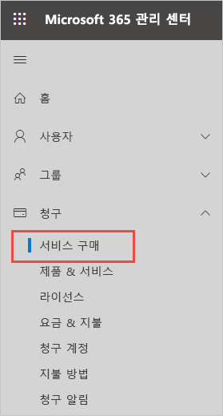
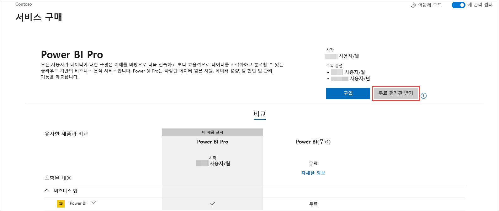
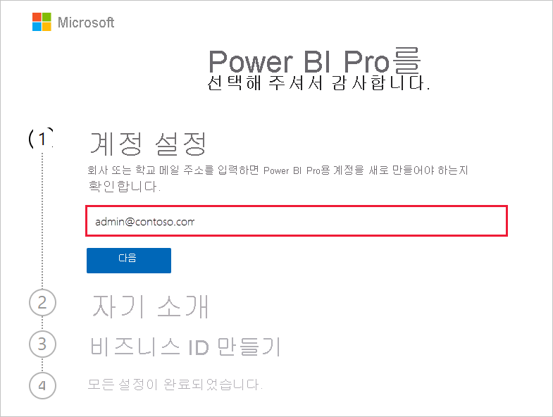
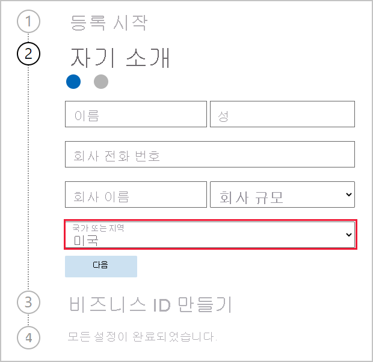
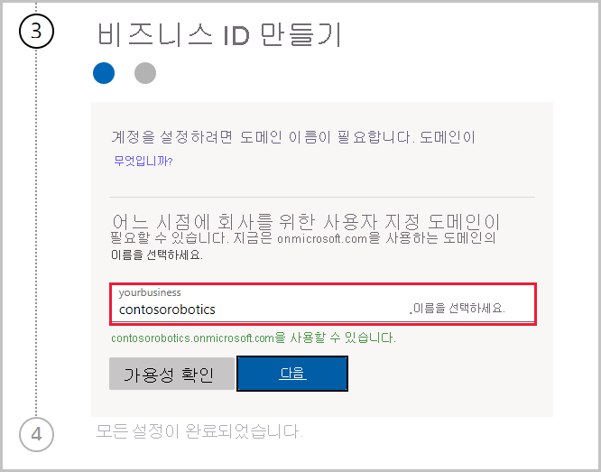

# 조직의 Power BI 서비스 구독 가져오기

관리자는 Microsoft 365 관리 센터의 **서비스 구매** 페이지를 통해 Power BI 서비스에 등록할 수 있습니다. 관리자가 Power BI에 등록할 때 액세스 권한이 있어야 하는 사용자에게 라이선스를 할당할 수 있습니다.

조직의 사용자는 Power BI 웹 사이트를 통해 Power BI에 등록할 수 있습니다. 조직의 사용자가 Power BI에 등록할 때 해당 사용자에게 Power BI 라이선스가 자동으로 할당됩니다. 셀프 서비스 기능을 해제하려면 [셀프 서비스 등록 및 구매를 사용하거나 사용하지 않도록 설정](service-admin-disable-self-service.md)의 단계에 따릅니다.

## Microsoft 365를 통해 등록

전역 관리자 또는 대금 청구 관리자의 경우 조직의 Power BI 구독을 가져올 수 있습니다. 자세한 내용은 [라이선스는 누가 구매하고 할당할 수 있나요?](service-admin-licensing-organization.md#who-can-purchase-and-assign-licenses)를 참조하세요.

> [!NOTE]
>
> Microsoft 365 E5 구독은 이미 Power BI Pro 라이선스를 포함합니다. 라이선스를 관리하는 방법을 알아보려면 [사용자 라이선스 보기 및 관리](service-admin-manage-licenses.md)를 참조하세요.
>
>

Microsoft 365 관리 센터에서 Power BI Pro 라이선스를 구매하려면 다음 단계를 수행합니다.

1. [Microsoft 365 관리 센터](https://admin.microsoft.com)에 로그인합니다.

2. 탐색 메뉴에서 **청구** > **서비스 구매** 를 선택합니다.
  
   

3. 구매할 구독을 검색하거나 스크롤해 찾습니다. 페이지 아래쪽의 **관심을 가질 만한 기타 범주** 에서 **Power BI** 를 찾을 수 있습니다. 조직에서 사용할 수 있는 Power BI 구독을 보려면 링크를 선택합니다.

4. Power BI Pro와 같은 제품을 선택합니다.

5. **서비스 구매** 페이지에서 **구매** 를 선택합니다. 이전에 사용하지 않은 경우 Power BI Pro 무료 평가판 구독을 시작할 수 있습니다. 25개의 라이선스를 포함하고 1개월 후에 만료됩니다.

   

6. 원하는 결제 방식에 따라 **월정액** 또는 **1년 결제** 를 선택합니다.

7. **원하는 사용자 수** 에 구매할 라이선스 수를 입력한 다음 **지금 체크 아웃** 을 선택해 트랜잭션을 완료합니다.

8. 구매를 확인하려면 **청구** > **제품 및 서비스** 로 이동해 **Power BI Pro** 를 찾습니다.

조직에서 Power BI 서비스를 제어 및 획득하는 방법에 대한 자세한 내용은 [조직의 Power BI](/microsoft-365/admin/misc/power-bi-in-your-organization?view=o365-worldwide)를 참조하세요.

## 조직용 Power BI를 얻는 기타 방법

아직 Microsoft 365 구독자가 아닌 경우 아래 단계에 따라 조직용 Power BI Pro 평가판을 받습니다. 또는 [새 Microsoft 365 평가판에 등록](service-admin-signing-up-for-power-bi-with-a-new-office-365-trial.md)한 다음 이전 섹션의 단계에 따라 Power BI를 추가할 수 있습니다.

Power BI 구독에 등록하려면 회사 또는 학교 계정이 필요합니다. 소비자 전자 메일 서비스나 전자 통신 공급자가 제공하는 전자 메일 주소는 지원하지 않습니다. 회사 또는 학교 계정이 없는 경우 등록할 때 만들 수 있습니다.

등록하려면 다음 단계를 따르세요.

1. [Power BI Pro 등록](https://signup.microsoft.com/create-account/signup?OfferId=d59682f3-3e3b-4686-9c00-7c7c1c736085&ali=1&products=d59682f3-3e3b-4686-9c00-7c7c1c736085)으로 이동합니다. 

2. 회사 또는 학교 메일 주소를 입력하고 **다음** 을 선택합니다. 회사 또는 학교 메일 주소로 간주되지 않는 메일 주소를 입력해도 괜찮습니다. 비즈니스 ID를 만들 때 새 계정을 설정해 드립니다.

   

3. 빠른 검사를 실행하여 새 계정을 만들어야 하는지 확인합니다. **계정 설정** 을 선택하여 등록 프로세스를 계속 진행합니다.

   > [!NOTE]
   >메일 주소를 이미 다른 Microsoft 서비스에서 사용 중인 경우 **로그인** 또는 **대신 새 계정 만들기** 를 선택할 수 있습니다. 새 계정을 만들도록 선택하는 경우 이 단계에 따라 등록을 계속합니다.
>
>
 
4. 양식을 작성하여 자신에 대해 알려줍니다. 올바른 국가 또는 지역을 선택해야 합니다. [Power BI 테넌트 위치를 확인하는 방법](service-admin-where-is-my-tenant-located.md#how-to-determine-where-your-power-bi-tenant-is-located)에 설명된 대로 선택하는 국가에 따라 데이터가 저장되는 위치가 결정됩니다.

   

5. **다음** 을 선택합니다. ID를 확인하기 위해 확인 코드를 받아야 합니다. 문자나 전화를 받을 전화번호를 입력합니다. 그런 다음 **확인 코드 보내기** 를 선택합니다.

6. 확인 코드를 입력한 다음 **비즈니스 ID 만들기** 를 계속합니다.

   

    회사의 짧은 이름을 입력하면 이름을 사용할 수 있는지 확인해 드립니다. 이 짧은 이름을 사용하여 데이터 센터에서 사용자 조직의 이름을 onmicrosoft.com의 하위 도메인으로 만듭니다. 나중에 사용자 고유의 비즈니스 도메인을 추가할 수 있습니다. 원하는 짧은 이름이 사용 중이어도 걱정할 필요가 없습니다. 회사 이름이 비슷한 사람이 다른 사람이 같은 짧은 이름을 선택했을 수 있으니 약간 변경해 보세요. **다음** 을 선택합니다.
    
7. 사용자 ID와 암호를 만들어 계정에 로그인합니다. **등록** 을 선택하면 설정이 모두 완료됩니다.

만든 계정은 이제 새 Power BI Pro 평가판 테넌트의 전역 관리자입니다. [Microsoft 365 관리 센터](https://admin.microsoft.com)에 로그인하여 사용자를 추가하고, 사용자 지정 도메인을 설정하고, 서비스를 추가로 구매하고, Power BI 구독을 관리할 수 있습니다.

## 다음 단계

- [사용자 라이선스 보기 및 관리](service-admin-manage-licenses.md)
- [셀프 서비스 등록 및 구매 사용 또는 사용 안 함](service-admin-disable-self-service.md)
- [비즈니스 구독 및 청구 설명서](/microsoft-365/commerce/?view=o365-worldwide)