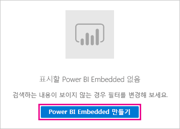

# 테스트용 Power BI Premium 구매

이 문서에서는 테스트 시나리오에서, 그리고 P SKU를 구매하는 데 필요한 권한(Microsoft 365 전역 관리자 역할 또는 대금 청구 관리자 역할)이 없는 경우에 Power BI Premium A SKU를 구매하는 방법을 설명합니다. A SKU는 시간 약정이 필요하지 않으며 시간 단위로 요금이 청구됩니다. A SKU는 [Azure Portal](https://portal.azure.com)에서 구매합니다.

Power BI Premium에 대한 자세한 내용은 [Power BI Premium이란?](service-premium-what-is.md)을 참조하세요. 최신 가격 책정 및 계획 정보는 [Power BI 가격 책정 페이지](https://powerbi.microsoft.com/pricing/) 및 [Power BI Premium 계산기](https://powerbi.microsoft.com/calculator/)를 참조하세요. 조직에서 Power BI Premium을 사용하더라도 콘텐츠 작성자는 여전히 [Power BI Pro 라이선스](service-admin-purchasing-power-bi-pro.md)가 필요합니다. 조직을 위한 Power BI Pro 라이선스를 하나 이상 구입하세요. A SKU를 사용하는 경우 콘텐츠를 사용하는 ‘모든 사용자’도 Pro 라이선스가 필요합니다.

> [!NOTE]
> Premium 구독이 만료되면 30일 동안 용량에 대한 전체 액세스 권한을 가집니다. 그 후에는 콘텐츠가 공유 용량으로 전환됩니다. 1GB보다 큰 모델은 공유 용량에서 지원되지 않습니다.

## 테스트 및 기타 시나리오를 위해 A SKU 구매

A SKU는 Azure Power BI Embedded 서비스를 통해 제공됩니다. A SKU는 다음과 같은 방법으로 사용할 수 있습니다.

- 타사 애플리케이션에서 Power BI 포함을 사용하도록 설정합니다. 자세한 내용은 [Power BI Embedded](../developer/embedded/azure-pbie-what-is-power-bi-embedded.md)를 참조하세요.

- P SKU를 구입하기 전에 Premium 기능을 테스트합니다.

- P SKU를 사용하는 프로덕션 환경과 함께 개발 및 테스트 환경을 만듭니다.

- Microsoft 365 전역 관리자 역할 또는 대금 청구 관리자 역할이 아니더라도 Power BI Premium을 구매합니다.

> [!NOTE]
> A4 이상 SKU를 구매하면 무제한 콘텐츠 공유를 제외한 모든 Premium 기능을 이용할 수 있습니다. A SKU를 사용하는 경우 콘텐츠를 사용하는 ‘모든 사용자’에게 Pro 라이선스가 필요합니다.

Azure Portal에서 A SKU를 구매하려면 다음 단계를 수행합니다.

1. Power BI에서 최소한 용량 관리자 권한이 있는 계정으로 [Azure Portal](https://portal.azure.com)에 로그인합니다.

1. _Power BI Embedded_ 를 검색하고 검색 결과에서 서비스를 선택합니다.

    

1. **Power BI Embedded 만들기** 를 선택합니다.

    

1. **Power BI Embedded** 만들기 화면에서 다음 정보를 지정합니다.

    - Power BI Embedded 서비스를 만들려는 **구독**

    - 서비스를 포함하는 리소스 그룹을 만들려는 물리적 **위치**. 성능 향상을 위해 이 위치는 Power BI의 Azure Active Directory 테넌트 위치에 가까워야 합니다.

    - 사용할 기존 **리소스 그룹**. 또는 예제와 같이 새 리소스 그룹을 만듭니다.

    - **Power BI 용량 관리자**. 용량 관리자는 Azure AD 테넌트의 서비스 주체 또는 멤버 사용자여야 합니다.

    

1. 무제한 공유를 제외한 Power BI Premium의 모든 기능을 사용하려면 최소한 A4 SKU가 필요합니다. **크기 변경** 을 선택합니다.

    

1. P1, P2, P3에 해당하는 A4, A5 또는 A6 용량 크기를 선택합니다.

    

1. **검토 + 만들기** 를 선택하고 선택한 옵션을 검토한 다음, **만들기** 를 선택합니다.

    

1. 배포가 완료될 때까지 몇 분 정도 걸릴 수 있습니다. 준비되면 **리소스로 이동** 을 선택합니다.

    

1. 관리 화면에서 사용하지 않을 때 서비스 일시 중지를 포함하여 사용 가능한 서비스 관리 옵션을 검토합니다.

    

용량을 구매한 후 [용량을 관리](service-admin-premium-manage.md#manage-capacity)하고 용량에 [작업 영역을 할당](service-admin-premium-manage.md#assign-a-workspace-to-a-capacity)하는 방법을 알아봅니다.

## 다음 단계

[Power BI Premium이란?](service-premium-what-is.md)
[Power BI Premium 구매 방법](service-admin-premium-purchase.md)
[Power BI Premium에서 용량 구성 및 관리](service-admin-premium-manage.md)\
[Power BI 가격 책정 페이지](https://powerbi.microsoft.com/pricing/)\
[Power BI Premium 계산기](https://powerbi.microsoft.com/calculator/)\
[Power BI Premium FAQ](service-premium-faq.md)\
[Power BI 엔터프라이즈 배포 계획 백서](https://aka.ms/pbienterprisedeploy)

궁금한 점이 더 있나요? [Power BI 커뮤니티에 질문합니다.](https://community.powerbi.com/)
