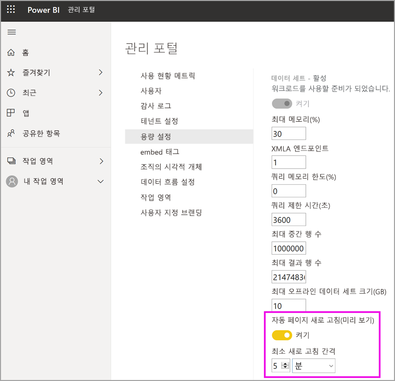

# 프리미엄 용량에서 워크로드 구성

이 문서에서는 Power BI Premium 용량에 대한 워크로드를 사용하도록 설정하고 구성하는 방법을 설명합니다. 기본적으로 용량은 Power BI 쿼리 실행과 관련된 워크로드만 지원합니다. **[AI(Cognitive Services)](../transform-model/service-cognitive-services.md)** , **[데이터 흐름](../transform-model/service-dataflows-overview.md#dataflow-capabilities-on-power-bi-premium)** 및 **[페이지를 매긴 보고서](../paginated-reports/paginated-reports-save-to-power-bi-service.md)** 에 대해 추가 워크로드를 사용하도록 설정하고 구성할 수도 있습니다.

## 기본 메모리 설정

쿼리 워크로드는 프리미엄 용량 SKU에 의해 결정되는 리소스에 최적화되며 제한됩니다. 또한 프리미엄 용량은 용량 리소스를 사용할 수 있는 추가 워크로드를 지원합니다. 이러한 워크로드에 대한 기본 메모리 값은 SKU에 사용 가능한 용량 노드를 기반으로 합니다. 최대 메모리 설정은 누적되지 않습니다. 지정된 최댓값까지의 메모리는 AI 및 데이터 흐름에 대해 동적으로 할당되지만, 페이지를 매긴 보고서에 대해서는 정적으로 할당됩니다.

|                   | EM1 / A1                  | EM2 / A2                  | EM3 / A3                  | P1 / A4                  | P2 / A5                  | P3 / A6                   |
|-------------------|---------------------------|---------------------------|---------------------------|--------------------------|--------------------------|---------------------------|
| AI                | 지원되지 않음               | 기본값 40%, 최소값 40%  | 기본값 20%, 최소값 20%  | 기본값 20%, 최솟값 8%  | 기본값 20%, 최솟값 4%  | 기본값 20%, 최솟값 2%   |
| 데이터 세트          | 기본값 100%, 최솟값 67% | 기본값 100%, 최솟값 40% | 기본값 100%, 최솟값 20% | 기본값 100%, 최솟값 8% | 기본값 100%, 최솟값 4% | 기본값 100%, 최솟값 2%  |
| 데이터 흐름         | 기본값 40%, 최소값 40%  | 기본값 24%, 최소값 24%  | 기본값 20%, 최소값 12%  | 기본값 20%, 최솟값 5%  | 기본값 20%, 최소값 3%  | 기본값 20%, 최솟값 2%   |
| 페이지를 매긴 보고서 | 지원되지 않음               | 지원되지 않음               | 지원되지 않음               | 기본값 20%, 최솟값 10% | 기본값 20%, 최솟값 5%  | 기본값 20%, 최솟값 2.5% |
|                   |                           |                           |                           |                          |                          |                           |

## 워크로드 설정

### AI(미리 보기)

AI 워크로드를 통해 Power BI에서 인식 서비스 및 자동화된 기계 학습을 사용할 수 있습니다. 워크로드 동작을 제어하려면 다음 설정을 사용합니다.

| 설정 이름 | 설명 |
|---------------------------------|----------------------------------------|
| **최대 메모리(%)** | AI 프로세스에서 용량으로 사용할 수 있는 사용 가능한 메모리의 최대 비율입니다. |
| **Power BI Desktop에서 사용 허용** | 이 설정은 나중에 사용하기 위해 예약되어 있으므로, 일부 테넌트에서는 표시되지 않습니다. |
| **기계 학습 모델 빌드 허용** | 비즈니스 분석가가 Power BI에서 직접 기계 학습 모델을 교육하고, 유효성을 검사하고, 호출할 수 있는지를 지정합니다. 자세한 내용은 [Power BI의 자동화된 기계 학습(미리 보기)](../transform-model/service-machine-learning-automated.md)을 참조하세요. |
| **AI 요청에 대한 병렬 처리 사용** | AI 요청을 병렬로 실행할 수 있는지를 지정합니다. |
|  |  |

### 데이터 세트

데이터 세트 워크로드는 기본적으로 사용되며, 사용하지 않도록 설정할 수 없습니다. 워크로드 동작을 제어하려면 다음 설정을 사용합니다. 일부 설정의 경우 테이블 아래에 추가 사용 정보가 있습니다.

| 설정 이름 | 설명 |
|---------------------------------|----------------------------------------|
| **최대 메모리(%)** | 데이터 세트가 용량으로 사용할 수 있는 사용 가능한 메모리의 최대 비율입니다. |
| **XMLA 엔드포인트** | 클라이언트 애플리케이션의 연결이 작업 영역 및 앱 수준에서 설정된 보안 그룹 멤버 자격을 따르도록 지정합니다. 자세한 내용은 [클라이언트 애플리케이션 및 도구를 사용하여 데이터 세트에 연결](service-premium-connect-tools.md)을 참조하세요. |
| **최대 중간 행 집합 수** | DirectQuery에서 반환되는 중간 행의 최대 수입니다. 기본값은 1000000이며, 허용 범위는 100000~2147483647입니다. |
| **최대 오프라인 데이터 세트 크기(GB)** | 메모리에 있는 오프라인 데이터 세트의 최대 크기입니다. 디스크의 압축 크기입니다. 기본값은 SKU에서 정의하는 최고 한도인 0입니다. 허용되는 범위는 0과 용량 크기 한도 사이입니다. |
| **최대 결과 행 집합 수** | DAX 쿼리에서 반환되는 행의 최대 수입니다. 기본값은 -1(제한 없음)이며, 허용 범위는 100000~2147483647입니다. |
| **쿼리 메모리 한도(%)** | MDX 또는 DAX 쿼리를 실행하는 데 사용할 수 있는 워크로드에서 사용 가능한 메모리의 최대 비율입니다. 기본값은 0이며, 이로 인해 SKU별 자동 쿼리 메모리 제한이 적용됩니다. |
| **쿼리 제한 시간(초)** | 쿼리 시간이 초과되기 전까지의 최대 시간입니다. 기본값은 3600초(1시간)입니다. 값이 0이면 쿼리가 시간 초과되지 않도록 지정됩니다. |
| **자동 페이지 새로 고침(미리 보기)** | 프리미엄 작업 영역이 자동 페이지 새로 고침을 사용하여 보고서를 포함할 수 있도록 토글을 설정/해제합니다. |
| **최소 새로 고침 간격** | 자동 페이지 새로 고침이 설정된 경우 페이지 새로 고침 간격에 허용되는 최소 간격. 기본값은 5분이고 허용되는 최소값은 1초입니다. |
|  |  |  |

#### 최대 중간 행 집합 수

이 설정을 사용하여 리소스를 많이 사용하거나 잘못 디자인된 보고서의 영향을 제어합니다. DirectQuery 데이터 세트에 대한 쿼리가 원본 데이터베이스에서 매우 큰 결과를 생성하는 경우 메모리 사용량과 처리 오버헤드가 급증할 수 있습니다. 이 경우 다른 사용자와 보고서의 리소스가 부족해질 수 있습니다. 용량 관리자는 이 설정을 사용하여 개별 쿼리에서 데이터 원본으로부터 가져올 행 수를 조정할 수 있습니다.

또는 용량이 100만 행 이상의 기본값을 지원할 수 있고 데이터 세트가 큰 경우 이 설정을 늘려 더 많은 행을 가져옵니다.

이 설정은 DirectQuery 쿼리에만 적용되는 반면 [최대 결과 행 세트 수](#max-result-row-set-count)는 DAX 쿼리에 영향을 줍니다.

#### 최대 오프라인 데이터 세트 크기

이 설정을 사용하여 보고서 작성자가 용량에 부정적인 영향을 미칠 수 있는 큰 데이터 세트를 게시하지 못하도록 합니다. 데이터 세트를 메모리로 로드할 때까지 Power BI는 실제 메모리 내 크기를 확인할 수 없습니다. 오프라인 크기가 작은 데이터 세트의 경우 오프라인 크기가 큰 데이터 세트보다 메모리 공간이 더 클 수 있습니다.

이 설정에 지정한 크기보다 더 큰 기존 데이터 세트가 있는 경우 사용자가 데이터 세트에 액세스하려고 할 때 데이터 세트가 로드되지 않습니다. 데이터 세트 워크로드에 대해 구성된 최대 메모리보다 큰 경우 데이터 세트를 로드하지 못할 수도 있습니다.

시스템 성능을 보호하기 위해, 구성된 값과 관계없이 최대 오프라인 데이터 세트 크기에 대해 SKU 관련 하드 최댓값이 추가로 적용됩니다. 대용량 데이터 크기에 최적화된 Power BI 데이터 세트에는 이 하드 최댓값이 적용되지 않습니다. 자세한 내용은 [Power BI Premium의 큰 모델](service-premium-large-models.md)을 참조하세요.

|                                           | EM1 / A1 | EM2 / A2 | EM3 / A3 | P1 / A4 | P2 / A5 | P3 / A6 |   
|-------------------------------------------|----------|----------|----------|---------|---------|---------|
| 최대 오프라인 데이터 세트 크기의 하드 최댓값 | 3GB     | 5GB     | 6GB     | 10GB   | 10GB   | 10GB   |
|                                           |          |          |          |         |         |         |

#### 최대 결과 행 세트 수

이 설정을 사용하여 리소스를 많이 사용하거나 잘못 디자인된 보고서의 영향을 제어합니다. DAX 쿼리에서 이 제한에 도달하면 보고서 사용자에게 다음과 같은 오류가 표시됩니다. 오류 정보를 복사하고 관리자에게 문의해야 합니다.

이 설정은 DAX 쿼리에만 적용되는 반면 [최대 결과 행 세트 수](#max-intermediate-row-set-count)는 DirectQuery 쿼리에 영향을 줍니다.

#### 쿼리 메모리 한도

이 설정을 사용하여 리소스를 많이 사용하거나 잘못 디자인된 보고서의 영향을 제어합니다. 일부 쿼리 및 계산에서 많은 메모리 용량을 사용하는 중간 결과가 발생할 수 있습니다. 이 경우 다른 쿼리가 매우 느리게 실행되고, 용량에서 다른 데이터 세트가 제거되고, 용량의 다른 사용자에게 메모리 부족 오류가 발생할 수 있습니다.

이 설정은 Power BI 보고서, Excel에서 분석 보고서, 그리고 XMLA 끝점을 통해 연결할 수 있는 기타 도구에 의해 실행되는 모든 DAX 및 MDX 쿼리에 적용됩니다.

데이터 새로 고침 작업은 데이터 세트의 데이터를 새로 고친 후 대시보드 타일 및 시각적 캐시를 새로 고치는 과정에서 DAX 쿼리를 실행할 수도 있습니다. 이 설정으로 인해 이러한 쿼리가 실패할 수도 있으며, 이 때문에 데이터 세트의 데이터가 성공적으로 업데이트되더라도 이 데이터 새로 고침 작업이 실패 상태로 표시될 수 있습니다.

기본 설정은 0이며, 이로 인해 다음과 같은 SKU별 자동 쿼리 메모리 제한이 적용됩니다.

|                              | EM1 / A1 | EM2 / A2 | EM3 / A3 | P1 / A4 | P2 / A5 | P3 / A6 |   
|------------------------------|----------|----------|----------|---------|---------|---------|
| 자동 쿼리 메모리 한도 | 1GB     | 2GB     | 2GB     | 6GB    | 6GB    | 10GB   |
|                              |          |          |          |         |         |         |

시스템 성능을 보호하기 위해, 사용자가 구성한 쿼리 메모리 한도와 관계없이 Power BI 보고서에서 실행하는 모든 쿼리에는 10GB 하드 최댓값이 적용됩니다. Analysis Services 프로토콜(XMLA라고도 함)을 사용하는 도구에서 실행된 쿼리에는 이 하드 최댓값이 적용되지 않습니다. 쿼리가 너무 많은 메모리를 사용하는 경우 사용자는 쿼리나 해당 계산을 간소화하는 것을 고려해야 합니다.

#### 쿼리 시간 제한

이 설정을 사용하면 사용자의 보고서가 느리게 로드되는 원인이 되는 장기 실행 쿼리를 효율적으로 제어할 수 있습니다.

이 설정은 Power BI 보고서, Excel에서 분석 보고서, 그리고 XMLA 끝점을 통해 연결할 수 있는 기타 도구에 의해 실행되는 모든 DAX 및 MDX 쿼리에 적용됩니다.

데이터 새로 고침 작업은 데이터 세트의 데이터를 새로 고친 후 대시보드 타일 및 시각적 캐시를 새로 고치는 과정에서 DAX 쿼리를 실행할 수도 있습니다. 이 설정으로 인해 이러한 쿼리가 실패할 수도 있으며, 이 때문에 데이터 세트의 데이터가 성공적으로 업데이트되더라도 이 데이터 새로 고침 작업이 실패 상태로 표시될 수 있습니다.

이 설정은 데이터 세트 또는 보고서 업데이트와 관련된 모든 쿼리를 실행하는 데 걸리는 시간이 아닌 단일 쿼리에 적용됩니다. 다음 예제를 살펴보겠습니다.

- **쿼리 시간 제한** 설정은 1200(20분)입니다.
- 실행할 쿼리가 5개 있고 각 쿼리는 15분 동안 실행됩니다.

전체 쿼리의 총 실행 시간은 75분이지만 모든 개별 쿼리가 실행되는 데 20분 미만이 걸리므로 설정 제한에 도달하지 않습니다.

Power BI 보고서에서는 용량에 대한 각 쿼리에 훨씬 적은 시간 제한을 사용하여 이 기본값을 재정의합니다. 각 쿼리의 시간 제한은 일반적으로 약 3분입니다.

#### 자동 페이지 새로 고침(미리 보기)

자동 페이지 새로 고침을 사용하도록 설정하면 프리미엄 용량의 사용자가 DirectQuery 원본에 대해 정의된 간격으로 보고서의 페이지를 새로 고칠 수 있습니다. 용량 관리자로서 사용자는 다음을 수행할 수 있습니다:

- 자동 페이지 새로 고침 설정 및 해제
- 최소 새로 고침 간격 설정

다음 이미지는 자동 새로 고침 간격 설정의 위치를 보여줍니다:

자동 페이지 새로 고침을 통해 만든 쿼리는 데이터 원본으로 직접 이동하므로 조직에서 자동 페이지 새로 고침을 허용하는 경우 해당 원본에 대한 안정성과 부하를 고려하는 것이 중요합니다. 

### 데이터 흐름

데이터 흐름 워크로드를 사용하면 데이터 흐름 셀프 서비스 데이터 준비를 사용하여 데이터를 수집, 변환, 통합 및 보강할 수 있습니다. 워크로드 동작을 제어하려면 다음 설정을 사용합니다.

| 설정 이름 | 설명 |
|---------------------------------|----------------------------------------|
| **최대 메모리(%)** | 데이터 흐름이 용량으로 사용할 수 있는 사용 가능한 메모리의 최대 비율입니다. |
| **향상된 데이터 흐름 컴퓨팅 엔진(미리 보기)** | 대규모 데이터 볼륨으로 작업할 때 컴퓨팅된 엔터티를 최대 20배 더 빠르게 계산하려면 이 옵션을 사용하도록 설정합니다. **새 엔진을 활성화하려면 용량을 다시 시작해야 합니다.** 자세한 내용은 [향상된 데이터 흐름 컴퓨팅 엔진](#enhanced-dataflows-compute-engine)을 참조하세요. |
| **컨테이너 크기** | 데이터 흐름에서 각 엔터티에 대해 데이터 흐름이 사용하는 컨테이너의 최대 크기입니다. 기본값은 700MB입니다. 자세한 내용은 [컨테이너 크기](#container-size)를 참조하세요. |
|  |  |

#### 향상된 데이터 흐름 컴퓨팅 엔진

새 컴퓨팅 엔진의 이점을 활용하려면 데이터 수집을 개별 데이터 흐름으로 분할하고 변환 논리를 다른 데이터 흐름의 컴퓨팅된 엔터티에 배치합니다. 이 방법은 컴퓨팅 엔진이 기존 데이터 흐름을 참조하는 데이터 흐름에서 작동하기 때문에 권장됩니다. 수집 데이터 흐름에서는 작동하지 않습니다. 이 지침을 따르면 새 컴퓨팅 엔진에서 최적의 성능을 위해 조인 및 병합 등의 변환 단계를 처리하는지 확인할 수 있습니다.

#### 컨테이너 크기

데이터 흐름을 새로 고치면, 데이터 흐름 워크로드에서 데이터 흐름의 각 엔터티에 대한 컨테이너를 생성합니다. 각 컨테이너는 컨테이너 크기 설정에 지정된 볼륨까지 메모리를 사용할 수 있습니다. 모든 SKU의 기본값은 700MB입니다. 다음과 같은 경우 이 설정을 변경하는 것이 좋습니다.

- 데이터 흐름을 새로 고치는 데 너무 오래 걸리거나, 시간이 초과되어 데이터 흐름 새로 고침이 실패하는 경우.
- 데이터 흐름 엔터티에 조인 등의 계산 단계가 포함된 경우.  

[Power BI Premium 용량 메트릭](service-admin-premium-monitor-capacity.md) 앱을 사용하여 데이터 흐름 워크로드 성능을 분석하는 것이 좋습니다.

컨테이너 크기를 늘려도 성능이 향상되지 않는 경우도 있습니다. 예를 들어 데이터 흐름에서 계산을 많이 수행하지 않고 원본에서 데이터만 가져오는 경우에는 컨테이너 크기를 변경해도 도움이 되지 않습니다. 컨테이너 크기를 늘릴 경우 데이터 흐름 워크로드에서 엔터티 새로 고침 작업에 더 많은 메모리를 할당할 수 있다면 도움이 될 수 있습니다. 메모리를 더 많이 할당하면 계산을 많이 사용하는 엔터티를 새로 고치는 데 걸리는 시간을 줄일 수 있습니다.

컨테이너 크기 값은 데이터 흐름 워크로드의 최대 메모리를 초과할 수 없습니다. 예를 들어 P1 용량에는 25GB 메모리가 있습니다. 데이터 흐름 워크로드의 최대 메모리(%)가 20%로 설정된 경우, 컨테이너 크기(MB)는 5000을 초과할 수 없습니다. 더 높은 값을 설정하더라도 컨테이너 크기는 항상 최대 메모리를 초과할 수 없습니다.

### 페이지를 매긴 보고서

페이지를 매긴 보고서 워크로드를 통해 Power BI 서비스에서 표준 SQL Server Reporting Services 형식을 기반으로 페이지를 매긴 보고서를 실행할 수 있습니다. 워크로드 동작을 제어하려면 다음 설정을 사용합니다.

| 설정 이름 | 설명 |
|---------------------------------|----------------------------------------|
| **최대 메모리(%)** | 페이지를 매긴 보고서에서 용량으로 사용할 수 있는 사용 가능한 메모리의 최대 비율입니다. |
|  |  |

페이지를 매긴 보고서는 보고서 작성자가 사용자 지정 코드를 추가하는 기능을 포함하여 현재는 SSRS(SQL Server Reporting Services) 보고서와 동일한 기능을 제공합니다.  따라서 작성자는 코드 식을 기반으로 텍스트 색을 변경하는 것과 같이 보고서를 동적으로 변경할 수 있습니다.  적절한 격리를 보장하기 위해 페이지를 매긴 보고서는 용량별로 보호된 샌드박스 내에서 실행됩니다. 동일한 용량으로 실행되는 보고서는 보고서 간에 부작용을 초래할 수 있습니다. SSRS 인스턴스에 콘텐츠를 게시할 수 있는 작성자를 제한하는 것과 마찬가지로, 페이지를 매긴 보고서에도 비슷한 방법을 따르는 것이 좋습니다. 용량에 콘텐츠를 게시하는 작성자를 조직에서 신뢰하는지 확인합니다. 여러 용량을 프로비저닝하고 각 용량에 다른 작성자를 할당하여 환경을 추가로 보호할 수 있습니다. 

페이지를 매긴 보고서 워크로드를 사용할 수 없는 경우도 있습니다. 이런 경우 워크로드에서 관리 포털에 오류 상태를 표시하고, 사용자에게 보고서 렌더링 시간 초과가 표시됩니다. 이 문제를 완화하려면 워크로드를 사용하지 않도록 설정했다가 다시 사용하도록 설정합니다.

## 워크로드 구성

워크로드를 사용할 예정인 경우에만 워크로드를 사용하도록 설정하여 용량의 사용 가능한 리소스를 최대화합니다. 기본 설정이 용량 리소스 요구 사항을 충족하지 않음을 확인한 경우에만 메모리 및 기타 설정을 변경합니다.

### Power BI 관리 포털에서 워크로드를 구성하려면

1. **용량 설정** > **프리미엄 용량**에서 용량을 선택합니다.

1. **추가 옵션**에서 **워크로드**를 확장합니다.

1. 하나 이상의 워크로드를 사용하도록 설정하고 **최대 메모리** 및 기타 설정의 값을 지정합니다.

1. **적용**을 선택합니다.

### REST API

[용량](https://docs.microsoft.com/rest/api/power-bi/capacities) REST API를 사용하여 워크로드를 사용하도록 설정하고 용량에 할당할 수 있습니다.

## 워크로드 모니터링

[Power BI Premium 용량 메트릭 앱](service-admin-premium-monitor-capacity.md)은 용량을 사용하도록 설정한 워크로드를 모니터링할 데이터 세트, 데이터 흐름 및 페이지를 매긴 보고서 메트릭을 제공합니다. 

> [!IMPORTANT]
> Power BI Premium 용량의 리소스 사용률이 높아서 성능 또는 안정성 문제가 발생할 경우 문제를 식별하고 해결할 수 있도록 알림 메일을 받을 수 있습니다. 이는 오버로드된 용량 문제를 해결하는 간소화된 방법이 될 수 있습니다. 자세한 내용은 [용량 및 안정성 알림](service-interruption-notifications.md#capacity-and-reliability-notifications)을 참조하세요.

## 다음 단계

[Power BI Premium 용량 최적화](service-premium-capacity-optimize.md)
[데이터 흐름을 사용한 Power BI의 셀프 서비스 데이터 준비](../transform-model/service-dataflows-overview.md)
[Power BI Premium에서 페이지를 매긴 보고서란?](../paginated-reports/paginated-reports-report-builder-power-bi.md)
[Power BI Desktop의 자동 페이지 새로 고침(미리 보기)](../create-reports/desktop-automatic-page-refresh.md)

궁금한 점이 더 있나요? [Power BI 커뮤니티에 문의](https://community.powerbi.com/)
