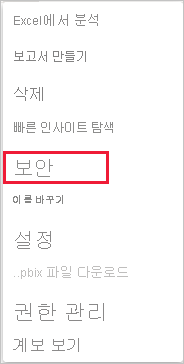
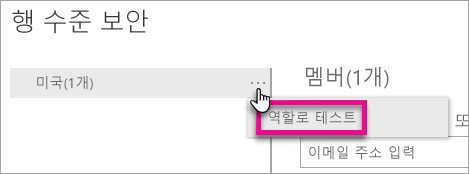
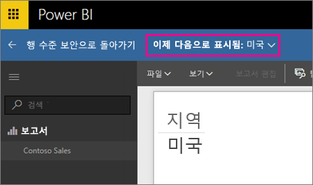
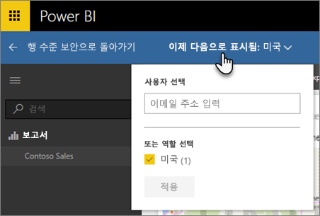

# Power BI를 사용하는 행 수준 보안(RLS)

Power BI를 사용하는 행 수준 보안(RLS)은 지정된 사용자에 데이터 액세스를 제한하는 데 사용됩니다. 필터는 행 수준에서 데이터 액세스를 제한하고 역할 내에서 필터를 정의할 수 있습니다. Power BI 서비스에서 작업 영역의 구성원은 작업 영역의 데이터 세트에 액세스할 수 있습니다. RLS는 이 데이터 액세스를 제한하지 않습니다.

Power BI Desktop으로 Power BI로 가져온 데이터 모델에 대한 RLS를 구성할 수 있습니다. SQL Server와 같은 DirectQuery를 사용하는 데이터 세트에서 RLS를 구성할 수도 있습니다. Analysis Services 또는 Azure Analysis Services 라이브 연결의 경우 Power BI Desktop이 아니라 모델에서 행 수준 보안을 구성합니다. 라이브 연결 데이터 세트에 보안 옵션이 표시되지 않습니다.

[!INCLUDE [include-short-name](../includes/rls-desktop-define-roles.md)]

기본적으로 행 수준 보안 필터링은 관계가 단방향으로 설정되었는지 양방향으로 설정되었는지 여부에 관계없이 단방향 필터를 사용합니다. 관계를 선택하고 **보안 필터 양방향으로 적용** 확인란을 선택하여 행 수준 보안으로 양방향 교차 필터링을 수동으로 활성화할 수 있습니다. 행 수준 보안이 사용자 이름 또는 로그인 ID에 기반하는 서버 수준의 동적 행 수준 보안도 구현한 경우에는 이 옵션을 선택하세요.

자세한 내용은 [Power BI Desktop에서 DirectQuery를 사용하여 양방향 교차 필터링](../transform-model/desktop-bidirectional-filtering.md) 및 [테이블 형식 BI 의미 체계 모델 보안](https://download.microsoft.com/download/D/2/0/D20E1C5F-72EA-4505-9F26-FEF9550EFD44/Securing%20the%20Tabular%20BI%20Semantic%20Model.docx) 기술 문서를 참조하세요.

[!INCLUDE [include-short-name](../includes/rls-desktop-view-as-roles.md)]

## 모델에 대한 보안 관리

데이터 모델에 대한 보안을 관리하려면 다음을 수행합니다.

1. Power BI 서비스에서 데이터 세트의 **추가 옵션** 메뉴를 선택합니다. 탐색 메뉴나 작업 영역 페이지에서 데이터 세트 이름을 마우스로 가리키면 이 메뉴가 표시됩니다.

    

    

1. **보안** 을 선택합니다.

   

보안을 선택하면 Power BI Desktop에서 만든 역할에 멤버를 추가할 수 있는 RLS 페이지로 이동합니다. 데이터 세트의 소유자에게만 보안이 표시됩니다. 데이터 세트가 그룹에 있는 경우 그룹의 관리자에게만 보안 옵션이 표시됩니다.

Power BI Desktop 내에서 역할을 만들거나 수정할 수만 있습니다.

## 멤버 작업

### 멤버 추가

사용자의 이메일 주소나 이름 또는 보안 그룹을 입력하여 역할에 멤버를 추가합니다. Power BI에서 만든 그룹은 추가할 수 없습니다. [조직 외부](../guidance/whitepaper-azure-b2b-power-bi.md#data-security-for-external-partners) 멤버를 추가할 수 있습니다.

역할 이름 옆이나 멤버 옆에 있는 괄호에 있는 숫자로 역할에 속한 멤버의 수를 확인할 수도 있습니다.

### 멤버 제거

해당 이름 옆에 있는 X를 선택하여 멤버를 제거할 수 있습니다. 

## Power BI 서비스 내에서 역할 유효성 검사

역할을 테스트하여 사용자가 정의한 역할이 제대로 작동하는지 확인할 수 있습니다.

1. 역할 옆에 있는 **추가 옵션**(...)을 선택합니다.
2. **역할로 테스트** 를 선택합니다.

이 역할이 사용할 수 있는 보고서가 표시됩니다. 이 보기에는 대시보드가 표시되지 않습니다. 페이지 머리글에는 적용되는 역할이 표시됩니다.

**이제 다음으로 표시됨:** 을 선택하여 다른 역할 또는 역할의 조합을 테스트합니다.

특정 사용자로 데이터를 보거나 사용 가능한 역할의 조합을 선택하여 역할이 작동하는지 확인할 수 있습니다.

일반 보기로 돌아가려면 **행 수준 보안으로 돌아가기** 를 선택합니다.

[!INCLUDE [include-short-name](../includes/rls-usernames.md)]

## Power BI에서 작업 영역과 함께 RLS 사용

Power BI 서비스의 작업 영역에 Power BI Desktop 보고서를 게시하는 경우, 읽기 전용 멤버에게 역할이 적용됩니다. 멤버가 작업 영역 설정에서 Power BI 콘텐츠를 볼 수만 있다고 표시해야 합니다.

> [!WARNING]
> 멤버가 편집 권한을 갖도록 작업 영역을 구성한 경우에는 RLS 역할이 멤버에게 적용되지 않습니다. 사용자는 모든 데이터를 볼 수 있습니다.

[!INCLUDE [include-short-name](../includes/rls-limitations.md)]

[!INCLUDE [include-short-name](../includes/rls-faq.md)]

## 다음 단계

- [Power BI Desktop에 대해 RLS(행 수준 보안)를 사용하여 데이터 액세스 제한](../create-reports/desktop-rls.md)
- [Power BI Desktop의 행 수준 보안(RLS) 지침](../guidance/rls-guidance.md)
- 궁금한 점이 더 있나요? [Power BI 커뮤니티에 질문합니다.](https://community.powerbi.com/)
- 제안? [Power BI 개선을 위한 아이디어 제공](https://ideas.powerbi.com/)
