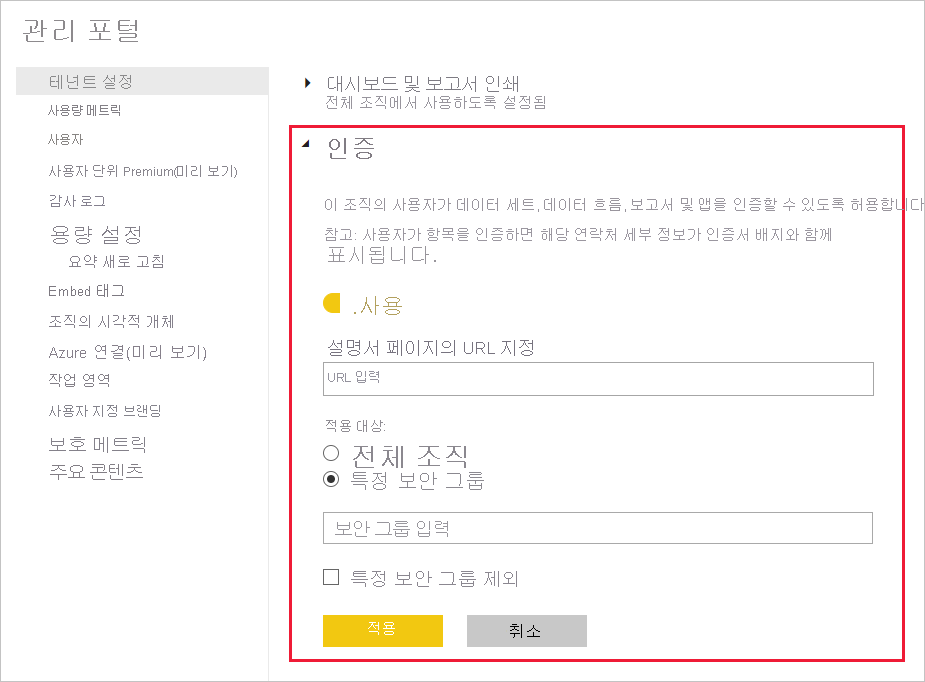

# 콘텐츠 인증 사용

조직은 선택한 콘텐츠를 인증하여 중요한 정보의 신뢰할 수 있는 원본으로 식별할 수 있습니다. 현재 다음과 같은 콘텐츠 형식을 인증할 수 있습니다.
* 데이터 세트
* 데이터 흐름(미리 보기)
* 보고서(미리 보기)
* 앱(미리 보기)

Power BI 관리자는 조직의 인증 프로세스를 활성화하고 설정해야 합니다. 이것은 다음을 의미합니다.
* 테넌트에서 인증 사용
* 멤버에게 콘텐츠를 인증할 수 있는 권한이 있는 보안 그룹 목록 정의
* 조직의 콘텐츠 인증 프로세스에 대한 설명서가 있는 경우 이러한 설명서를 가리키는 URL 제공

인증은 Power BI *보증* 기능의 일부입니다. 자세한 내용은 [보증: Power BI 콘텐츠 승격 및 인증](../collaborate-share/service-endorsement-overview.md)을 참조하세요.

## 인증 설정

1. 관리 포털에서 테넌트 설정으로 이동합니다.
1. 설정 내보내기 및 공유 섹션에서 인증 섹션을 펼칩니다.

   

1. 토글을 **사용** 으로 설정합니다.
1. 조직에 게시된 인증 정책이 있는 경우 여기에 해당 URL을 제공합니다. 그러면 [보증 설정 대화 상자](../collaborate-share/service-endorse-content.md#request-content-certification)의 인증 섹션에 있는 **자세한 정보** 링크가 됩니다. 링크를 제공하지 않으면 콘텐츠의 인증을 요청하려는 사용자가 Power BI 관리자에게 문의하는 것이 좋습니다.
1. 멤버에게 콘텐츠를 인증할 수 있는 권한이 있는 보안 그룹을 하나 이상 지정합니다. 권한 있는 인증자는 [보증 설정 대화 상자](../collaborate-share/service-endorse-content.md#certify-content)의 인증 섹션에 있는 인증 단추를 사용할 수 있습니다.
    
    보안 그룹에 인증 권한을 제공하지 않으려는 하위 보안 그룹이 포함된 경우 **특정 보안 그룹 제외** 상자를 선택하고 텍스트 상자가 표시되면 해당 그룹의 이름을 입력할 수 있습니다.
1. **적용** 을 클릭합니다.

## 다음 단계
* [콘텐츠 승격 또는 인증](../collaborate-share/service-endorse-content.md)
* [Power BI의 보증에 대해 읽어보기](../collaborate-share/service-endorsement-overview.md)
* 질문이 있으신가요? [Power BI 커뮤니티에 질문합니다.](https://community.powerbi.com/)
