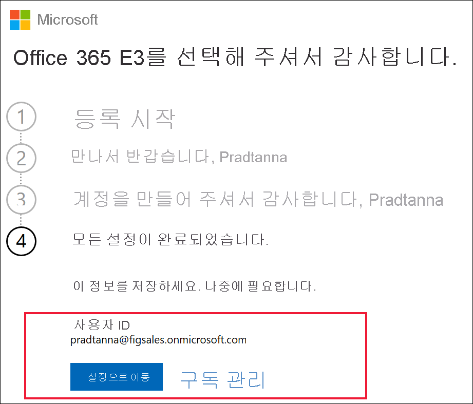

# 새 Microsoft 365 평가판으로 Power BI에 가입

이 문서에서는 회사 또는 학교 메일 계정이 없는 경우 Power BI 서비스에 가입하는 다른 방법에 관해 설명합니다.

이메일 주소를 사용하여 Power BI에 가입하는 데 문제가 있는 경우 먼저 [Power BI에 사용할 수 있는 이메일 주소](../fundamentals/service-self-service-signup-for-power-bi.md#supported-email-addresses)인지 확인합니다. 성공하지 못하면 Microsoft 365 평가판에 가입하고 회사 계정을 만듭니다. 그런 다음, 새 회사 계정을 사용하여 Power BI 서비스에 가입합니다. Microsoft 365 평가판이 만료된 후에도 Power BI를 사용할 수 있습니다.

## Office의 Microsoft 365 평가판 등록

[Microsoft 365 웹 사이트](https://www.microsoft.com/microsoft-365/business/compare-more-office-365-for-business-plans)에서 Microsoft 365 평가판에 가입합니다. 계정이 아직 없는 경우 계정을 만드는 단계를 안내해 드립니다. Hotmail 및 Gmail 같은 상업용 메일 계정은 Microsoft 365에서 사용할 수 없으므로 새 계정을 만듭니다.  해당 메일 계정은 *zalan\@onmicrosoft.com*과 같이 표시됩니다.

**Office 365 E5**를 선택하면 평가판에 Power BI Pro가 포함됩니다. Power BI Pro 평가판의 만료 시점은 Office 365 E5 평가판과 동일하게 현재 30일입니다. 대신 **Office 365 E3**를 선택하는 경우 Power BI에 등록하고 60일 평가판으로 **Pro**로 업그레이드하여 체험할 수 있습니다. 

1. 전자 메일 주소를 입력합니다. 메일 주소가 Microsoft 365에서 작동하는지, 아니면 새 메일 주소를 만들어야 하는지 알려 드립니다.  

    새 메일 주소가 필요한 경우 단계별로 안내해 드립니다. 첫 번째 단계로 새 계정을 만듭니다. **계정 설정**을 선택합니다.

    

2. 새 계정의 세부 정보를 입력합니다.

    

3. 새 메일 주소 및 암호를 만듭니다. you@yourcompany.onmicrosoft.com과 비슷한 새 로그인 이름을 만듭니다. 이 로그인은 새 회사 또는 학교 계정 및 Power BI에 사용 됩니다.

    

4. 이것으로 끝입니다.  이제 Power BI에 가입하는 데 사용할 수 있는 이메일 주소가 있습니다. [개별적으로 Power BI 서비스에 가입](../fundamentals/service-self-service-signup-for-power-bi.md)으로 이동합니다.

     

    새 테넌트가 만들어질 때까지 기다려야 할 수도 있습니다.

## 중요 고려 사항

새 계정으로 로그인하는 데 문제가 있는 경우 프라이빗 브라우저 세션을 사용해 보세요.

이 가입 방법을 통해 새 조직 테넌트를 만들면 해당 테넌트의 관리자가 됩니다. 자세한 내용은 [Power BI 관리란?](service-admin-administering-power-bi-in-your-organization.md)을 참조하세요. [Microsoft 365 관리 설명서](https://support.office.com/article/Add-users-individually-to-Office-365---Admin-Help-1970f7d6-03b5-442f-b385-5880b9c256ec)에서 설명한 대로 새 사용자를 테넌트에 추가한 다음, 해당 사용자와 공유할 수 있습니다.

## 다음 단계

[Power BI 관리란?](service-admin-administering-power-bi-in-your-organization.md)  
[조직의 Power BI 라이선스 부여](service-admin-licensing-organization.md)  
[Power BI에 개별 가입](../fundamentals/service-self-service-signup-for-power-bi.md)

궁금한 점이 더 있나요? [Power BI 커뮤니티에 질문합니다.](https://community.powerbi.com/)