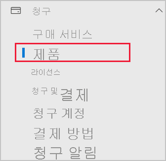
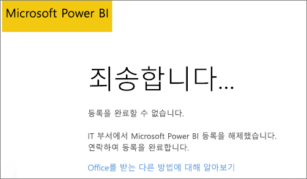

# Microsoft 365 파트너 구독에 Power BI 추가

Microsoft 365는 회사에서 Microsoft 365를 자사의 솔루션에 통합하여 재판매함으로써 고객에게 구매, 청구 및 지원을 위한 단일 접점을 제공할 수 있도록 합니다.

Microsoft 365 구독에 Power BI를 추가하는 데 관심이 있는 경우 파트너에게 문의하여 이 작업을 수행하는 것이 좋습니다. 파트너가 현재 Power BI를 제공하지 않는 경우 아래에 설명된 옵션을 사용할 수 있습니다.

## 파트너와 협업하여 Power BI 구매

Power BI Pro 또는 Power BI Premium에 대한 구독을 구매하려면 파트너와 협업하여 어떤 옵션이 있는지 고려합니다.

* 파트너가 Power BI를 포트폴리오에 추가하는 데 동의하여 고객이 파트너에게서 구매할 수 있도록 합니다.

* 파트너는 Microsoft로부터 직접 또는 Power BI를 제공하는 다른 파트너로부터 Power BI를 구매할 수 있는 모델로 전환할 수 있습니다.

## Microsoft 또는 다른 채널에서 구매

파트너와 관계에 따라 Microsoft 또는 다른 파트너로부터 직접 Power BI를 구매할 수 있습니다. Microsoft 365 관리 센터에서 Power BI 구독을 추가할 수 있는지 확인할 수 있습니다(전역 관리자 또는 청구 관리자 역할의 멤버 자격 필요).

1. [Microsoft 365 관리 센터](https://admin.microsoft.com/AdminPortal/Home#/homepage)로 이동합니다.

1. 왼쪽 메뉴에서 **청구**를 열고 **제품**을 선택합니다.

   

 1. 아래 이미지에 나와 있는 것 처럼**구독**을 찾습니다. **구독**이 표시되면 Microsoft에서 직접 서비스를 구매하거나 Power BI를 제공하는 다른 파트너에게 문의할 수 있습니다.

    

    **구독**이 표시되지 않으면 Microsoft에서 직접 또는 다른 파트너로부터 구매할 수 없습니다.

파트너가 Power BI를 제공하지 않고 Microsoft 또는 다른 파트너로부터 직접 구매할 수 없는 경우에는 평가판에 가입하는 것이 좋습니다.

## 무료 평가판 가입

Power BI 무료 평가판에 가입할 수 있습니다. 평가판 기간이 끝날 때 Power BI Pro를 구매하지 않아도 Power BI의 많은 기능을 제공하는 무료 라이선스가 계속 유지됩니다. 자세한 내용은 [Power BI에 개인으로 가입](../fundamentals/service-self-service-signup-for-power-bi.md)을 참조하세요.

### 임시 구독 사용

기본적으로 임시 구독이라고도 하는 개별 가입은 사용하지 않도록 설정됩니다. 이 경우 등록하려고 하면 *IT 부서에서 Microsoft Power BI 등록을 해제했습니다.* 라는 메시지가 표시됩니다.

임시 구독을 사용하도록 설정하려면 파트너에게 연락하여 임시 구독을 설정해 달라고 요청할 수 있습니다. 테넌트 관리자이고 Azure Active Directory PowerShell 명령을 사용하는 방법을 알고 있는 경우 직접 임시 구독을 사용하도록 설정할 수 있습니다. 자세한 내용은 [셀프 서비스 구매 사용 또는 사용 안 함](service-admin-disable-self-service.md)의 단계를 따르세요.

## 다음 단계

* [조직의 Power BI 라이선스 부여](service-admin-licensing-organization.md)
* [Power BI Pro 라이선스 구매 및 할당](service-admin-purchasing-power-bi-pro.md)

궁금한 점이 더 있나요? [Power BI 커뮤니티에 질문합니다.](https://community.powerbi.com/)