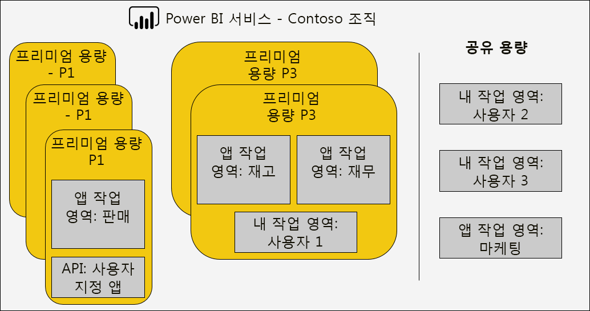
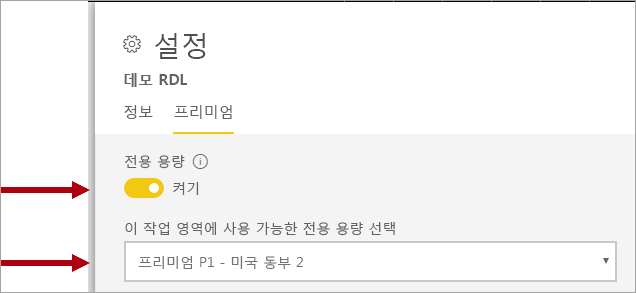
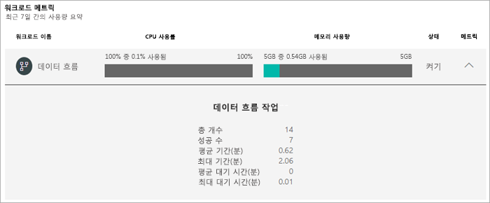
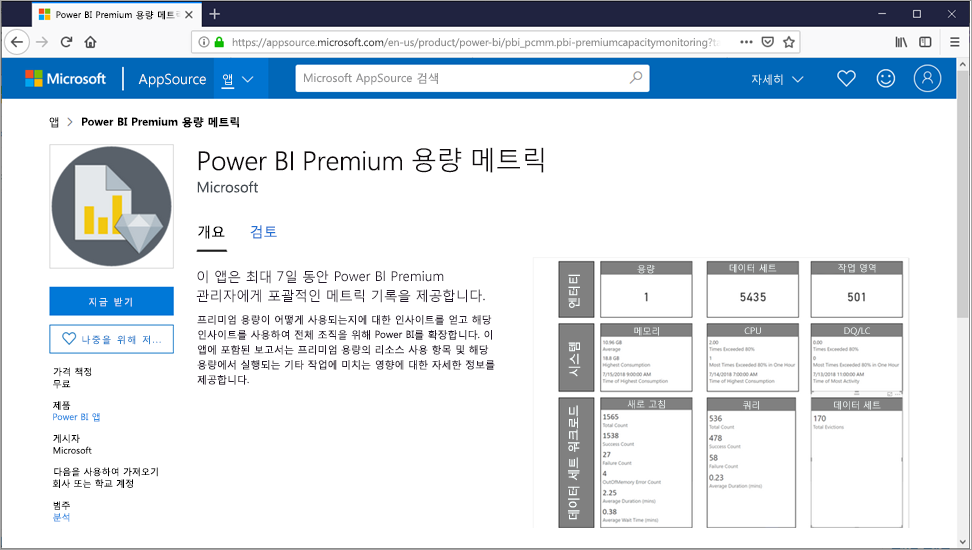

# 프리미엄 용량 관리

Power BI Premium 관리에는 Premium 용량을 만들고, 관리하고, 모니터링하는 작업이 포함됩니다. 이 문서에서는 용량에 대한 개요를 제공합니다. 단계별 지침은 [용량 구성 및 관리](service-admin-premium-manage.md)를 참조하세요.

## 용량 만들기 및 관리

Power BI 관리 포털의 **용량 설정** 페이지에는 구매한 V 코어 수와 사용 가능한 Premium 용량이 표시됩니다. 이 페이지에서 전역 관리자 또는 Power BI 서비스 관리자는 사용 가능한 V 코어에서 프리미엄 용량을 만들거나 기존 프리미엄 용량을 수정할 수 있습니다.

> [!NOTE]
> Power BI Premium은 최근 **Premium Gen2** 라는 새 버전의 Premium을 출시했으며, 이 버전은 현재 미리 보기로 제공됩니다. Premium Gen2는 프리미엄 용량 관리를 간소화하고 관리 오버헤드를 줄입니다. 자세한 내용은 [Power BI Premium 2세대(미리 보기)](service-premium-what-is.md#power-bi-premium-generation-2-preview)를 참조하세요.

Premium 용량을 만들 때 관리자는 다음을 정의해야 합니다.

- 용량 이름(테넌트 내에서 고유).
- 용량 관리자.
- 용량 크기.
- 데이터 상주 지역.

용량 관리자를 하나 이상 할당해야 합니다. 용량 관리자로 할당된 사용자는 다음을 수행할 수 있습니다.

- 용량에 작업 영역을 할당.
- 사용자 권한을 관리(추가 용량 관리자 또는 할당 권한이 있는 사용자를 추가하여 작업 영역을 용량에 할당할 수 있도록 허용).
- 워크로드를 관리(페이지를 매긴 보고서 및 데이터 흐름 워크로드에 대한 최대 메모리 사용량을 구성).
- 용량을 재시작(시스템 오버로드로 인해 모든 작업을 재설정).

작업 영역 권한에서 명시적으로 할당된 경우가 아니면 용량 관리자는 작업 영역 콘텐츠에 액세스할 수 없습니다. 또한 사용 메트릭, 감사 로그 또는 테넌트 설정과 같은 모든 Power BI 관리 영역에 대한 액세스 권한이 없습니다(명시적으로 할당되지 않은 경우). 중요한 것은 용량 관리자에게 새 용량을 만들거나 기존 용량을 확장할 수 있는 권한이 없다는 것입니다. 관리자는 할당된 용량을 확인 및 관리만 할 수 있도록 각 용량 단위로 할당됩니다.

용량 크기는 풀에서 사용 가능한 V 코어 수에 의해 제한되는 사용 가능한 SKU 옵션 목록에서 선택됩니다. 하나 이상의 구매한 SKU에서 소싱할 수 있는 풀에서 여러 용량을 만들 수 있습니다. 예를 들어 P3 SKU(V 코어 32개)를 사용하여 3개의 용량을 만들 수 있습니다. 1개는 P2(V 코어 16개)이고, 2개는 P1(V 코어 8개씩 2개)입니다. [Premium 용량 최적화](service-premium-capacity-optimize.md) 문서에 설명된 대로 더 작은 크기의 용량을 만들어 성능 및 확장성을 향상시킬 수 있습니다. 다음 이미지는 각각 작업 영역을 포함하는 5개의 프리미엄 용량(3 x P1 및 2 x P3)과 공유 용량에 있는 여러 작업 영역으로 구성된 가상 Contoso 조직의 예제 설정을 보여 줍니다.

Premium 용량은 다중 지역이라고 하는 Power BI 테넌트의 홈 지역이 아닌 지역에 할당할 수 있습니다. 다중 지역에서는 Power BI 콘텐츠가 상주하는 정의된 지리적 지역 내에서 데이터 센터에 대한 관리 제어를 제공합니다. 다중 지역 배포에 대한 이론적 원리는 일반적으로 성능 및 확장성이 아니라 회사 또는 정부 규정 준수를 위한 것입니다. 보고서 및 대시보드 로드에는 여전히 홈 지역에 대한 메타데이터 요청이 포함됩니다. 자세한 내용은 [Power BI Premium에 대한 다중 지역 지원](service-admin-premium-multi-geo.md)을 참조하세요.

Power BI 서비스 관리자와 전역 관리자는 프리미엄 용량을 수정할 수 있습니다. 특히 다음을 수행할 수 있습니다.

- 용량 크기를 변경하여 리소스를 확장 또는 축소.
- 용량 관리자를 추가 또는 제거.
- 할당 권한이 있는 사용자를 추가 또는 제거.
- 추가 워크로드를 추가 또는 제거.
- 지역 변경.

할당 권한은 특정 Premium 용량에 작업 영역을 할당하는 데 필요합니다. 권한은 전체 조직, 특정 사용자 또는 그룹에게 부여할 수 있습니다.

기본적으로 Premium 용량은 Power BI 쿼리 실행과 관련된 워크로드를 지원합니다. 또한 Premium 용량은 다음과 같은 추가 워크 로드도 지원합니다. **AI(Cognitive Services)** , **페이지를 매긴 보고서** 및 **데이터 흐름**. 각 워크로드마다 워크로드에서 사용할 수 있는 최대 메모리(사용 가능한 총 메모리의 백분율)를 구성해야 합니다. 최대 메모리 할당을 늘릴 경우 호스트할 수 있는 활성 모델 수와 새로 고침 처리량에 영향을 줄 수 있다는 것을 이해해야 합니다. 

메모리는 데이터 흐름에는 동적으로 할당되지만 페이지를 매긴 보고서에는 정적으로 할당됩니다. 최대 메모리를 정적으로 할당하는 이유는 페이지를 매긴 보고서가 용량의 제한된 보안 공간 내에서 실행되기 때문입니다. 모델을 로드하는 데 사용할 수 있는 메모리가 줄어들기 때문에 페이지를 매긴 보고서 메모리를 설정할 때는 주의해야 합니다. 자세한 내용은 [기본 메모리 설정](service-admin-premium-workloads.md#default-memory-settings)을 참조하세요.

Premium 용량을 삭제하는 것은 가능하며 작업 영역 및 콘텐츠가 삭제되지 않습니다. 대신 할당된 작업 영역을 공유 용량으로 이동합니다. Premium 용량이 다른 지역에서 생성된 경우 작업 영역이 홈 지역의 공유 용량으로 이동됩니다.

### 용량에 작업 영역 할당

Power BI 관리 포털이나 작업 영역의 **작업 영억** 창에서 작업 영역을 프리미엄 용량에 할당할 수 있습니다.

용량 관리자는 물론 전역 관리자 또는 Power BI 서비스 관리자는 Power BI 관리 포털에서 작업 영역을 대량으로 할당할 수 있습니다. 대량 할당은 다음에 적용될 수 있습니다.

- **사용자의 작업 영역** - 개인 작업 영역을 포함하여 해당 사용자가 소유하는 모든 작업 영역이 Premium 용량에 할당됩니다. 여기에는 이미 다른 Premium 용량에 할당된 작업 영역을 다시 할당하는 작업이 포함됩니다. 또한 사용자에게 작업 영역 할당 권한도 할당됩니다.

- **특정 작업 영역**
- **전체 조직의 작업 영역** - 개인 작업 영역을 비롯한 모든 작업 영역이 Premium 용량에 할당됩니다. 모든 현재 및 향후 사용자에게 작업 영역 할당 권한이 할당됩니다. 이 방법은 권장하지 않습니다. 보다 구체적으로 대상을 지정하는 것이 좋습니다.

사용자가 작업 영역 관리자이고 할당 권한이 있는 경우 **작업 공간** 창을 사용하여 작업 영역을 Premium 용량에 추가할 수 있습니다.

작업 영역 관리자는 할당 권한이 없어도 작업 영역을 용량에서 (공유 용량으로) 제거할 수 있습니다. 전용 용량에서 작업 영역을 제거하면 작업 영역이 공유 용량에 유효하게 재배치됩니다. Premium 용량에서 작업 영역을 제거하면 부정적인 결과가 발생할 수 있습니다. 예를 들어, Power BI 무료 라이선스 사용자가 공유 콘텐츠를 사용할 수 없게 되거나 공유 용량에서 지원하는 허용량을 초과하는 경우 예약된 새로 고침이 일시 중단될 수 있습니다.

Power BI 서비스에서 Premium 용량에 할당된 작업 영역은 작업 영역 이름을 장식하는 다이아몬드 아이콘으로 쉽게 식별할 수 있습니다.

## 용량 모니터링

Premium 용량 모니터링을 통해 관리자는 용량의 작동 방식을 이해할 수 있습니다. Power BI 관리 포털 또는 **Power BI Premium 용량 메트릭**(Power BI) 앱을 사용하여 용량을 모니터링할 수 있습니다.

### Power BI 관리 포털

관리 포털에서 각 용량에 대해 **상태** 탭은 용량 및 각 사용 설정된 워크로드에 대한 요약 메트릭을 제공합니다. 메트릭은 과거 7일간 평균을 표시합니다.  

용량 수준에서 메트릭은 사용 가능한 모든 워크로드에 대해 누적됩니다. 제공되는 메트릭은 다음과 같습니다.

- **CPU 사용률** - 평균 CPU 사용률을 용량에 대해 사용 가능한 총 CPU의 백분율로 제공합니다.  
- **메모리 사용** - 평균 메모리 사용량(GB)을 용량의 총 가용 메모리로 제공합니다. 

사용하도록 설정된 각 워크로드에 대해 CPU 사용률 및 메모리 사용뿐만 아니라 다양한 워크로드별 메트릭이 제공됩니다. 예를 들어 데이터 흐름 워크로드의 경우 **총 개수** 는 각 데이터 흐름에 대한 총 새로 고침 수를 표시하고, **평균 기간** 은 데이터 흐름의 평균 새로 고침 기간을 보여 줍니다.

각 워크로드에 대해 사용 가능한 모든 메트릭에 대한 자세한 내용은 [관리 포털에서 용량 모니터링](service-admin-premium-monitor-portal.md)을 참조하세요.

Power BI 관리 포털의 모니터링 기능은 주요 용량 메트릭에 대한 간략한 요약을 제공하도록 설계되었습니다. 보다 상세한 모니터링은 **Power BI Premium 용량 메트릭** 앱을 사용하는 것이 좋습니다.

### Power BI Premium 용량 메트릭 앱

[Power BI Premium 용량 메트릭 앱](https://appsource.microsoft.com/en-us/product/power-bi/pbi_pcmm.capacity-metrics-dxt?tab=Overview)은 용량 관리자가 사용할 수 있는 Power BI 앱이며 다른 Power BI 앱과 같이 설치됩니다. 대시보드 및 보고서가 포함되어 있습니다.

앱이 열리면 대시보드가 로드되어 사용자가 용량 관리자인 모든 용량에 대해 집계 보기를 표현하는 다양한 타일을 표시합니다. 대시보드 레이아웃에는 5개 주요 섹션이 포함되어 있습니다.

- **개요** - 앱 버전, 용량 및 작업 영역 수
- **시스템 요약** - 메모리 및 CPU 메트릭
- **데이터 세트 요약** - 데이터 세트 수, DQ/LC, 새로 고침 및 쿼리 메트릭
- **데이터 흐름 요약** - 데이터 흐름 수 및 데이터 세트 메트릭
- **페이지를 매긴 보고서 요약** - 메트릭 새로 고침 및 보기

대시보드 타일이 고정된 기본 보고서는 대시보드 타일을 클릭하여 액세스할 수 있습니다. 각 대시보드 섹션을 보다 자세히 표시하고 대화형 필터링을 지원합니다. 

날짜 범위, 용량, 작업 영역 및 워크로드(보고서, 데이터 세트, 데이터 흐름)별로 슬라이서를 설정하고 보고서 페이지를 교차 필터링하기 위해 보고서 시각적 개체 내에서 요소를 선택하여 필터링을 수행할 수 있습니다. 교차 필터링은 특정 기간, 용량, 작업 영역, 데이터 세트 등으로 범위를 좁힐 수 있는 강력한 기술이며, 근본 원인 분석을 수행할 때 매우 유용할 수 있습니다.

앱의 대시보드 및 보고서 메트릭에 대한 자세한 내용은 [앱을 사용하여 Premium 용량 모니터링](service-admin-premium-monitor-capacity.md)을 참조하세요.

### 메트릭 해석

리소스 사용 및 워크로드 활동에 대한 기준선을 이해하려면 메트릭을 모니터링해야 합니다. 용량이 느려지는 경우 모니터링할 메트릭과 수행할 수 있는 결론을 이해하는 것이 중요합니다.

쿼리를 1초 이내에 완료하여 보고서 사용자에게 응답성이 뛰어난 환경을 제공하고 더 높은 쿼리 처리량을 사용하는 것이 이상적입니다. 일반적으로 백그라운드 프로세스(새로 고침 포함)를 완료하는 데 시간이 더 오래 걸린다면 문제는 덜 심각한 것입니다.

일반적으로 보고서가 느리게 표시되는 것은 용량이 과열되고 있다는 징후일 수 있습니다. 보고서를 로드하지 못한다면 이는 용량이 과열되었음을 나타냅니다. 어느 경우든 근본 원인은 다음을 비롯한 다양한 요인으로 인해 발생할 수 있습니다.

- **실패한 쿼리** 는 메모리 부족 때문에 모델을 메모리에 로드하지 못한 것을 확실히 나타냅니다. Power BI 서비스는 실패하기 전에 30초 동안 모델을 로드하려고 시도합니다.

- **과도한 쿼리 대기 시간** 은 여러 가지 이유로 발생할 수 있습니다.
  - Power BI 서비스가 먼저 모델을 제거하고 쿼리 가능한 모델을 로드해야 합니다(메모리 쓰래싱을 나타내는 긴 쿼리 대기 시간이 수반되지 않는 한 데이터 세트 제거 비율 증가가 용량 스트레스를 나타내는 것은 아니라는 것에 주의).
  - 모델 로드 시간(특히 대형 모델을 메모리로 로드할 때까지 대기).
  - 장기 실행 쿼리.
  - LC\DQ 연결이 너무 많습니다(용량 제한을 초과).
  - CPU가 포화 상태입니다.
  - 페이지에 너무 많은 시각적 개체를 포함하는 복잡한 보고서 디자인(각 시각적 개체는 쿼리라는 사실에 주의).

- **긴 쿼리 기간** 은 모델 디자인이 최적화되지 않았음을 나타낼 수 있습니다. 특히 한 용량 내에서 여러 데이터 세트가 활성화되고 하나의 데이터 세트만 긴 쿼리 기간을 보이는 경우에 해당합니다. 이는 용량이 충분한 리소스를 갖고 있으며 문제의 데이터 세트가 최적화되지 않았거나 속도가 느리다는 것을 암시합니다. 장기 실행 쿼리는 다른 프로세스에 필요한 리소스에 대한 액세스를 차단할 수 있으므로 문제가 될 수 있습니다.
- **긴 새로 고침 대기 시간** 은 메모리를 소비하는 여러 활성 모델 때문에 메모리가 부족하거나 문제가 있는 새로 고침이 다른 새로 고침을 차단하는 것을 의미합니다(병렬 새로 고침 제한 초과).

메트릭을 사용하는 방법에 대한 자세한 설명은 [Premium 용량 최적화](service-premium-capacity-optimize.md) 문서에서 설명합니다.

## 승인

이 문서는 데이터 플랫폼 MVP이자 [Bitwise Solutions](https://www.bitwisesolutions.com.au/)의 독립 BI 전문가인 Peter Myers가 작성한 것입니다.

## 다음 단계

> [!div class="nextstepaction"]
> [Premium 용량 최적화](service-premium-capacity-optimize.md)   
> [!div class="nextstepaction"]
> [Premium 용량에서 워크로드 구성](service-admin-premium-workloads.md)   

궁금한 점이 더 있나요? [Power BI 커뮤니티에 질문합니다.](https://community.powerbi.com/)

Power BI는 Power BI Premium Gen2를 미리 보기 버전으로 소개했습니다. 이 버전은 다음과 같은 향상된 기능을 통해 Power BI Premium 환경을 개선합니다.
* 성능
* 사용자 단위 라이선싱
* 더 큰 규모
* 개선된 메트릭
* 자동 확장
* 관리 오버헤드 감소

Power BI Premium Gen2에 대한 자세한 내용은 [Power BI Premium 2세대(미리 보기)](service-premium-what-is.md#power-bi-premium-generation-2-preview)를 참조하세요.
