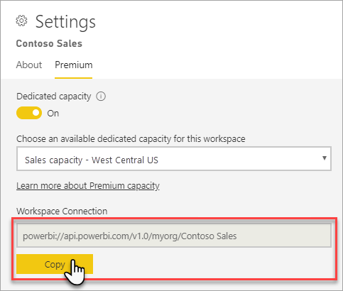
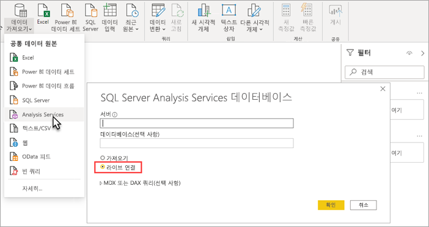

# XMLA 엔드포인트로 데이터 세트 연결

1500 이상 호환성 수준에서 Power BI Premium 작업 영역 및 데이터 세트는 *XMLA 엔드포인트* 를 사용하여 Microsoft 및 타사 클라이언트 애플리케이션/도구로부터의 오픈 플랫폼 연결을 지원합니다.

## XMLA 엔드포인트란?

Power BI Premium은 클라이언트 애플리케이션과 Power BI 작업 영역 및 데이터 세트를 관리하는 엔진 간의 통신을 위해 [XMLA(XML for Analysis)](/analysis-services/xmla/xml-for-analysis-xmla-reference?view=power-bi-premium-current&preserve-view=true) 프로토콜을 사용합니다. 이러한 통신은 일반적으로 XMLA 엔드포인트라고 하는 것을 통해 이루어집니다. XMLA는 내부적으로 Power BI의 의미 체계 모델링, 거버넌스, 수명 주기 및 데이터 관리를 실행하는 Microsoft Analysis Services 엔진에서 사용되는 것과 동일한 통신 프로토콜입니다. XMLA 프로토콜을 통해 전송되는 데이터는 완전히 암호화됩니다.

기본적으로 엔드포인트를 사용한 *읽기 전용* 연결은 용량의 **데이터 세트 워크로드** 에 대해 사용하도록 설정됩니다. 읽기 전용에서 데이터 시각화 애플리케이션 및 도구는 데이터 세트 모델 데이터, 메타데이터, 이벤트 및 스키마를 쿼리할 수 있습니다. 엔드포인트를 사용한 *읽기/쓰기* 작업을 사용하도록 설정하여 추가 데이터 세트 관리, 거버넌스, 고급 의미 체계 모델링, 디버깅 및 모니터링을 제공할 수 있습니다. 읽기/쓰기를 사용하는 경우 Power BI Premium 데이터 세트에는 Azure Analysis Services 및 SQL Server Analysis Services 엔터프라이즈급 테이블 형식 모델링 도구와 프로세스에 대한 더 많은 패리티가 있습니다.

> [!NOTE]
> 특히 XMLA 엔드포인트를 사용하여 데이터 세트에 연결하는 경우에는 최신 작업 영역 환경을 사용하는 것이 좋습니다. 데이터 세트 생성 또는 삭제와 같은 작업은 클래식 작업 영역에서 지원되지 않습니다. 클래식 작업 영역을 최신 환경으로 업그레이드하려면 [Power BI에서 클래식 작업 영역 업그레이드](../collaborate-share/service-upgrade-workspaces.md)를 참조하세요.

## 데이터 모델링 및 관리 도구

다음 목록은 Azure Analysis Services 및 SQL Server Analysis Services에서 사용되는 가장 일반적인 도구이며 이제 Power BI Premium 데이터 세트에서 지원됩니다.

**Analysis Services 프로젝트 포함 Visual Studio** - SQL Server Data Tools 또는 간단히 **SSDT** 라고도 하며, Analysis Services 테이블 형식 모델을 위한 엔터프라이즈급 모델 작성 도구입니다. Analysis Services 프로젝트 확장은 무료 Community 버전을 포함하여 모든 Visual Studio 2017 이상 버전에서 지원됩니다. 프리미엄 작업 영역에 테이블 형식 모델을 배포하려면 확장 버전 2.9.14 이상이 필요합니다. Premium 작업 영역에 배포하는 경우 모델은 1500 이상 호환성 수준에 있어야 합니다. 데이터 세트 워크로드에 XMLA 읽기/쓰기가 필요합니다. 더 자세히 알아보려면 [Analysis Services용 도구](/analysis-services/tools-and-applications-used-in-analysis-services?view=power-bi-premium-current&preserve-view=true)를 참조하세요.

**SSMS(SQL Server Management Studio)**  - DAX, MDX 및 XMLA 쿼리를 지원합니다. TMSL([테이블 형식 모델 스크립팅 언어](/analysis-services/tmsl/tabular-model-scripting-language-tmsl-reference))을 사용하여 세밀한 새로 고침 작업 및 데이터 세트 메타데이터 스크립팅을 수행합니다. 쿼리 작업에는 읽기 전용이 필요합니다. 메타데이터 스크립팅에는 읽기/쓰기가 필요합니다. SSMS 버전 18.7.1 이상이 필요합니다.  [여기](/sql/ssms/download-sql-server-management-studio-ssms)에서 다운로드하세요.

**SQL Server Profiler** – SSMS와 함께 설치되는 이 도구는 데이터 세트 이벤트를 추적 및 디버그하는 기능을 제공합니다. 공식적으로는 SQL Server에 사용되지 않지만 Profiler는 SSMS에 계속 포함되며 Analysis Services 및 Power BI Premium에서 계속 지원됩니다. XMLA 읽기 전용이 필요합니다. 자세한 내용은  [Analysis Services용 SQL Server Profiler](/analysis-services/instances/use-sql-server-profiler-to-monitor-analysis-services?view=power-bi-premium-current&preserve-view=true)를 참조하세요.

**Analysis Services 배포 마법사** – SSMS와 함께 설치되는 이 도구는 Visual Studio에서 작성된 테이블 형식 모델 프로젝트를 Analysis Services 및 Power BI Premium 작업 영역에 배포하는 기능을 제공합니다. 대화형으로 실행하거나 자동화를 위해 명령줄에서 실행할 수 있습니다. XMLA 읽기/쓰기가 필요합니다. 더 자세히 알아보려면 [Analysis Services 배포 마법사](/analysis-services/deployment/deploy-model-solutions-using-the-deployment-wizard?view=power-bi-premium-current&preserve-view=true)를 참조하세요.

**PowerShell cmdlet** – Analysis Services cmdlet을 사용하여 새로 고침 작업과 같은 데이터 세트 관리 작업을 자동화할 수 있습니다. XMLA 읽기/쓰기가 필요합니다. **21.1.18221** 이상 버전의 [SqlServer PowerShell 모듈](https://www.powershellgallery.com/packages/SqlServer/)이 필요합니다. Az.AnalysisServices 모듈의 Azure Analysis Services cmdlet은 Power BI Premium에서 지원되지 않습니다. 더 자세히 알아보려면 [Analysis Services PowerShell 참조](/analysis-services/powershell/analysis-services-powershell-reference?view=power-bi-premium-current&preserve-view=true)를 참조하세요.

**Power BI Report Builder** - 페이지를 매긴 보고서를 작성하기 위한 도구입니다. 검색할 데이터, 가져올 위치 및 표시 방법을 지정하는 보고서 정의를 만듭니다. Report Builder에서 보고서를 미리 본 후 Power BI 서비스에 게시할 수 있습니다. XMLA 읽기 전용이 필요합니다. 더 자세히 알아보려면 [Power BI Report Builder](../paginated-reports/report-builder-power-bi.md)를 참조하세요.

**테이블 형식 편집기** - 직관적인 경량 편집기를 사용하여 테이블 형식 모델을 만들고, 유지 관리하고, 관리하기 위한 오픈 소스 도구입니다. 계층 구조 보기는 테이블 형식 모델의 모든 개체를 표시합니다. 개체는 다중 선택 속성 편집 및 DAX 구문 강조 표시를 지원하는 표시 폴더로 구성됩니다. 쿼리 작업에는 XMLA 읽기 전용이 필요합니다. 메타데이터 작업에는 읽기/쓰기가 필요합니다. 더 자세히 알아보려면 [tabulareditor.github.io](https://tabulareditor.github.io/)를 참조하세요.

**DAX Studio** – DAX 작성, 진단, 성능 조정 및 분석을 위한 오픈 소스 도구입니다. 기능에는 개체 검색, 통합 추적, 세부 통계를 포함하는 쿼리 실행 분석, DAX 구문 강조 표시 및 서식 지정이 포함됩니다. 쿼리 작업에는 XMLA 읽기 전용이 필요합니다. 자세한 내용은 [daxstudio.org](https://daxstudio.org/)를 참조하세요.

**ALM 도구 키트** - Power BI 데이터 세트용 오픈 소스 스키마 비교 도구로, ALM(애플리케이션 수명 주기 관리) 시나리오에 가장 많이 사용됩니다. 환경 간 배포를 수행하고 증분 새로 고침 기록 데이터를 유지합니다. 메타데이터 파일, 분기 및 리포지토리를 비교하고 병합합니다. 공통 정의를 여러 데이터 세트에 다시 사용합니다. 쿼리 작업에는 읽기 전용이 필요합니다. 메타데이터 작업에는 읽기/쓰기가 필요합니다. 더 자세히 알아보려면 [alm-toolkit.com](http://alm-toolkit.com/)을 참조하세요.

**Microsoft Excel** – Excel 피벗 테이블은 Power BI 데이터 세트를 요약, 분석, 탐색 및 요약 데이트를 표시하는 데 사용되는 가장 일반적인 도구 중 하나입니다. 쿼리 작업에는 읽기 전용이 필요합니다. Office 16.0.11326.10000 이상의 간편 실행 버전이 필요합니다.

**타사** - Power BI Premium의 데이터 세트에 연결, 쿼리 및 사용할 수 있는 클라이언트 데이터 시각화 애플리케이션 및 도구가 포함됩니다. 대부분의 도구에는 MSOLAP 클라이언트 라이브러리의 최신 버전이 필요하지만 일부는 ADOMD를 사용할 수 있습니다. 읽기 전용 또는 읽기/쓰기 XMLA 엔드포인트는 작업에 따라 결정됩니다.

### 클라이언트 라이브러리

클라이언트 애플리케이션은 XMLA 엔드포인트와 직접 통신하지 않습니다. 대신 *클라이언트 라이브러리* 를 추상화 계층으로 사용합니다. 이러한 클라이언트 라이브러리는 애플리케이션이 Azure Analysis Services 및 SQL Server Analysis Services에 연결하는 데 사용하는 것과 동일합니다. Visual Studio용 Excel, SSMS(SQL Server Management Studio) 및 Analysis Services 프로젝트 확장과 같은 Microsoft 애플리케이션은 세 가지 클라이언트 라이브러리를 모두 설치하고 일반 애플리케이션 및 확장 업데이트와 함께 업데이트합니다. 또한 개발자는 클라이언트 라이브러리를 사용하여 사용자 지정 애플리케이션을 빌드할 수 있습니다. 애플리케이션과 함께 설치되지 않은 경우, 특히 타사 애플리케이션을 사용하는 경우에는 최신 버전의 클라이언트 라이브러리를 설치해야 할 수 있습니다. 클라이언트 라이브러리는 매월 업데이트됩니다. 자세한 내용은 [Analysis Services에 연결하기 위한 클라이언트 라이브러리](/azure/analysis-services/analysis-services-data-providers)를 참조하세요.

## 대형 모델을 사용하도록 설정하여 쓰기 작업을 위한 데이터 세트 최적화

쓰기 작업을 통해 데이터 세트 관리에 XMLA 엔드포인트를 사용하는 경우에는 대형 모델에 데이터 세트를 사용하도록 설정하는 것이 좋습니다. 이렇게 하면 쓰기 작업의 오버헤드를 줄여 작업 속도를 훨씬 높일 수 있습니다. 크기(압축 후)가 1GB를 초과하는 데이터 세트라면 그 차이가 클 수 있습니다. 더 자세히 알아보려면 [Power BI Premium에서의 대형 모델](service-premium-large-models.md)을 참조하세요.

## XMLA 읽기/쓰기 사용

기본적으로 Premium 용량에는 읽기 전용으로 설정된 XMLA 엔드포인트 속성 설정이 있습니다. 즉, 애플리케이션이 데이터 세트를 쿼리만 할 수 있습니다. 애플리케이션에서 쓰기 작업을 수행하려면 XMLA 엔드포인트 속성을 읽기/쓰기로 설정해야 합니다. 용량에 대한 XMLA 엔드포인트 속성 설정은 **데이터 세트 워크로드** 에서 구성됩니다. XMLA 엔드포인트 설정은 용량에 할당된 *모든 작업 영역 및 데이터 세트* 에 적용됩니다.

### 용량에 대해 읽기/쓰기를 사용하도록 설정하려면

1. 관리 포털에서 **용량 설정** > **Power BI Premium** > 용량 이름을 선택합니다.
2. **워크로드** 를 확장합니다. **XMLA 엔드포인트** 설정에서 **읽기 쓰기** 를 선택합니다.

    

## 프리미엄 작업 영역에 연결

용량에 할당된 작업 영역에는 다음과 같은 URL 형식의 연결 문자열이 있습니다.  
`powerbi://api.powerbi.com/v1.0/[tenant name]/[workspace name]`.

작업 영역에 연결하는 애플리케이션은 이 URL을 Analysis Services 서버 이름으로 사용합니다. 예를 들면 다음과 같습니다.  
`powerbi://api.powerbi.com/v1.0/contoso.com/Sales Workspace`.

동일한 테넌트(B2B가 아님)의 UPN을 가진 사용자는 테넌트 이름을 `myorg`로 바꿀 수 있습니다. 예를 들면   
`powerbi://api.powerbi.com/v1.0/myorg/Sales Workspace`입니다.

B2B 사용자는 테넌트 이름에서 해당 조직 UPN을 지정해야 합니다. 예를 들면 다음과 같습니다.  
`powerbi://api.powerbi.com/v1.0/fabrikam.com/Sales Workspace`.

### 작업 영역 연결 URL을 가져오려면

작업 영역 **설정** > **Premium** > **작업 영역 연결** 에서 **복사** 를 선택합니다.

## 연결 요구 사항

### 초기 카탈로그

SQL Server Profiler와 같은 일부 도구에서는 *초기 카탈로그* 를 지정해야 할 수 있습니다. 작업 영역에 데이터 세트(데이터베이스)를 지정합니다. **서버에 연결** 대화 상자에서 **옵션** > **연결 속성** > **데이터베이스에 연결** 을 선택하고 데이터 세트 이름을 입력합니다.

### 중복 작업 영역 이름

Power BI의 [새 작업 영역](../collaborate-share/service-new-workspaces.md)(새 작업 영역 환경을 사용하여 만듦)은 중복된 이름을 가진 작업 영역을 만들거나 이름을 바꿀 수 없도록 유효성 검사를 적용합니다. 마이그레이션되지 않은 작업 영역은 중복될 수 있습니다. 다른 작업 영역과 이름이 같은 작업 영역에 연결할 때 다음 오류가 발생할 수 있습니다.

**powerbi://api.powerbi.com/v1.0/[tenant name]/[workspace name]에 연결할 수 없습니다.**

이 오류를 해결하려면 작업 영역 이름 외에 URL의 작업 영역 objectID에서 복사할 수 있는 ObjectIDGuid를 지정합니다. 연결 URL에 objectID를 추가합니다. 예제:  
'powerbi://api.powerbi.com/v1.0/myorg/Contoso Sales - 9d83d204-82a9-4b36-98f2-a40099093830'.

### 중복 데이터 세트 이름

동일한 작업 영역에서 다른 데이터 세트와 동일한 이름을 가진 데이터 세트에 연결할 때 데이터 세트 이름에 데이터 세트 guid를 추가합니다. SSMS의 작업 영역에 연결하는 경우 데이터 세트 이름 및 guid를 모두 가져올 수 있습니다.

### 표시된 데이터 세트의 지연

작업 영역에 연결할 때 새 데이터 세트, 삭제된 데이터 세트 및 이름이 바뀐 데이터 세트의 변경 내용이 표시되는 데 최대 몇 분이 소요될 수 있습니다.

### 지원되지 않는 데이터 세트

다음 데이터 세트는 XMLA 엔드포인트에서 액세스할 수 없습니다. 이러한 데이터 세트는 SSMS 또는 다른 도구의 작업 영역 아래에 나타나지 않습니다.

- Azure Analysis Services 또는 SQL Server Analysis Services 모델에 대한 라이브 연결을 기반으로 하는 데이터 세트. 
- 다른 작업 영역의 Power BI 데이터 세트에 대한 라이브 연결을 기반으로 하는 데이터 세트. 더 자세히 알아보려면 [작업 영역 간 데이터 세트 소개](../connect-data/service-datasets-across-workspaces.md)를 참조하세요.
- REST API를 사용하여 Push 데이터를 포함하는 데이터 세트.
- Excel 통합 문서 데이터 세트.

## 보안

용량 관리자가 읽기/쓰기를 사용하도록 XMLA 엔드포인트 속성을 설정하는 것 외에도, 관리 포털에서 테넌트 수준 설정 **온-프레미스 데이터 세트를 사용하여 XMLA 엔드포인트 및 Excel의 분석 허용** 을 사용하도록 설정해야 합니다. XMLA 엔드포인트에 연결되는 AIXL 파일을 생성해야 하는 경우 테넌트 수준 설정 **라이브 연결 허용** 도 사용하도록 설정해야 합니다. 이 설정은 모두 기본적으로 사용하도록 설정되어 있습니다.

**온-프레미스 데이터 세트를 사용하여 XMLA 엔드포인트 및 Excel의 분석 허용** 은 통합 설정입니다.

:::image type="content" source="media/service-premium-connect-tools/allow-xmla-endpoints.png" alt-text="통합 설정에서 XMLA 엔드포인트 허용":::

**라이브 연결 허용** 은 내보내기 및 공유 설정입니다.

:::image type="content" source="media/service-premium-connect-tools/allow-live-connections.png" alt-text="내보내기 및 공유 설정에서 라이브 연결 허용":::

XMLA 엔드포인트를 통한 액세스는 작업 영역/앱 수준에서 설정된 보안 그룹 멤버 자격을 인식합니다.

작업 영역 참가자 이상은 데이터 세트에 대한 쓰기 권한이 있으며, 따라서 Analysis Services 데이터베이스 관리자와 동등합니다. 이들은 Visual Studio에서 새 데이터 세트를 배포하고 SSMS에서 TMSL 스크립트를 실행할 수 있습니다.

[EffectiveUserName](/analysis-services/instances/connection-string-properties-analysis-services?view=power-bi-premium-current&preserve-view=true#bkmk_auth) 연결 문자열 속성을 사용한 서버 수준 추적 및 사용자 가장과 같이 Analysis Services 서버 관리자 권한이 필요한 작업은 현재 Power BI Premium에서 지원되지 않습니다.

데이터 세트에 대한 [빌드 권한](../connect-data/service-datasets-build-permissions.md)이 있는 다른 사용자는 Analysis Services 데이터베이스 독자와 동등합니다. 이들은 데이터 세트에 연결하고 검색하여 데이터를 사용하고 시각화할 수 있습니다. RLS(행 수준 보안) 규칙이 적용되며 내부 데이터 세트 메타데이터를 볼 수 없습니다.

### 모델 역할

XMLA 엔드포인트를 사용하면 데이터 세트에 대한 역할을 정의할 수 있으며 AAD(Azure Active Directory) 사용자에 대해 역할 멤버 자격을 정의할 수 있고 RLS(행 수준 보안) 필터를 정의할 수 있습니다. Power BI의 모델 역할은 RLS에만 사용됩니다. Power BI 보안 모델을 사용하여 RLS를 초과하는 권한을 제어합니다.

Visual Studio에서 작성되는 테이블 형식 모델 프로젝트의 경우 모델 디자이너에서 역할 관리자를 사용하여 역할을 정의할 수 있습니다. Power BI의 데이터 세트에 대해 SSMS를 사용하여 역할을 정의하여 역할 개체를 만들고 역할 속성을 정의할 수 있습니다. 그러나 대부분의 경우에는 TMSL을 통해 역할 개체 정의를 스크립팅하여 [역할 개체](/analysis-services/tmsl/roles-object-tmsl?view=power-bi-premium-current&preserve-view=true)를 만들거나 수정할 수 있습니다. TMSL 스크립트는 SSMS에서 실행하거나 [Invoke-ASCmd](/powershell/module/sqlserver/invoke-ascmd?view=sqlserver-ps&preserve-view=true) PowerShell cmdlet을 사용하여 실행할 수 있습니다.

XMLA 엔드포인트를 통해 데이터 세트 역할로 작업할 때 다음과 같은 제한 사항이 적용됩니다.

- Power BI 데이터 세트에 대해 설정할 수 있는 ‘역할’에 대한 권한은 읽기 권한이 유일합니다. Power BI 보안 모델을 사용하여 다른 사용 권한을 부여합니다.
- 데이터 세트 역할이 있는지 관계없이 XMLA 엔드포인트를 통한 읽기 액세스에는 데이터 세트에 대한 빌드 권한이 필요합니다.
- OLS(개체 수준 보안) 규칙은 현재 Power BI에서 지원되지 않습니다.

자세한 내용은 [테이블 형식 모델의 역할](/analysis-services/tabular-models/roles-ssas-tabular)을 참조하세요.

### 데이터 원본 자격 증명 설정

XMLA 엔드포인트를 통해 지정된 메타데이터는 데이터 원본에 대한 연결을 만들 수 있지만 데이터 원본 자격 증명을 설정할 수 없습니다. 대신 Power BI 서비스의 데이터 세트 설정 페이지에서 자격 증명을 설정할 수 있습니다.

### 서비스 주체

서비스 주체는 리소스 및 서비스 수준의 무인 작업을 수행하기 위해 테넌트 내에서 만드는 Azure Active Directory 앱 등록입니다. 이 고유한 사용자 ID 유형에는 앱 이름, 애플리케이션 ID, 테넌트 ID 및 암호용 클라이언트 암호 또는 인증서가 있습니다. Power BI Premium은 Power BI Embedded와 동일한 서비스 주체 기능을 사용합니다.

Power BI Premium에서 서비스 주체를 XMLA 엔드포인트와 함께 사용하여 작업 영역 프로비저닝, 모델 배포, 데이터 세트 새로 고침 등의 데이터 세트 관리 작업을 자동화할 수도 있습니다.

- PowerShell
- Azure Automation
- Azure Logic Apps
- 사용자 지정 클라이언트 애플리케이션

자세한 내용은 [서비스 주체를 사용하여 Premium 작업 영역 및 데이터 세트 작업 자동화](service-premium-service-principal.md)를 참조하세요.

## Visual Studio에서 모델 프로젝트 배포(SSDT)

Visual Studio에서 Power BI Premium 작업 영역에 테이블 형식 모델 프로젝트를 배포하는 것은 Azure 또는 SQL Server Analysis Services 서버에 배포하는 것과 거의 동일합니다. 차이점이라면 프로젝트에 지정된 배포 서버 속성과 처리 작업이 데이터 원본에서 작업 영역에 있는 새 데이터 세트로 데이터를 가져올 수 있도록 데이터 원본 자격 증명이 지정된 방식입니다.

Visual Studio에서 작성된 테이블 형식 모델 프로젝트를 배포하려면 먼저 프로젝트 **배포 서버** 속성에서 작업 영역 연결 URL을 설정해야 합니다. Visual Studio의 **솔루션 탐색기** 에서 프로젝트를 마우스 오른쪽 단추로 클릭하고 **속성** 을 클릭합니다. **서버** 속성에 작업 영역 연결 URL을 붙여넣습니다.

배포 서버 속성이 지정되었으면 프로젝트를 배포할 수 있습니다.

**처음 배포된 경우** model.bim의 메타데이터를 사용하여 작업 영역에 데이터 세트가 만들어집니다. 배포 작업의 일부로 모델 메타데이터의 작업 영역에서 데이터 세트를 만든 후 데이터 원본에서 데이터 세트로 데이터를 로드하는 프로세스는 실패합니다.

프로세스가 실패하는 이유는 Azure 또는 SQL Server Analysis Server 인스턴스로 배포할 때는 배포 작업의 일부로 데이터 원본 자격 증명을 입력하라는 메시지가 표시되는 것과 달리, Premium 작업 영역에 배포할 때는 데이터 원본 자격 증명을 배포 작업의 일부로 지정할 수 없기 때문입니다. 대신 메타데이터 배포가 성공하고 데이터 세트가 만들어진 후 Power BI 서비스의 데이터 세트 설정에서 데이터 원본 자격 증명을 지정합니다. 작업 영역에서 **데이터 세트** > **설정** > **데이터 원본 자격 증명** > **자격 증명 편집** 을 선택합니다.

데이터 원본 자격 증명을 지정하면 Power BI 서비스에서 데이터 세트를 새로 고치거나, 새로 고침 예약을 구성하거나, SQL Server Management Studio에서 데이터 세트로 데이터를 로드하는 프로세스(새로 고침)를 수행할 수 있습니다.

Visual Studio의 프로젝트에 지정된 배포 **처리 옵션** 속성이 준수됩니다. 그러나 Power BI 서비스에서 아직 데이터 원본에 자격 증명을 지정하지 않은 경우 메타데이터 배포가 성공하더라도 처리가 실패합니다. 속성을 **처리하지 않음** 으로 설정하여 배포의 일부로 처리를 시도하는 것을 방지할 수 있지만, 새 데이터 세트에 대한 데이터 원본 설정에서 데이터 원본 자격 증명이 지정된 후에는 후속 배포 작업의 일부로 처리가 성공하기 때문에 속성을 **기본** 으로 다시 설정해야 할 수 있습니다.

## SSMS를 사용하여 연결

SSMS를 사용하여 작업 영역에 연결하는 것은 Azure 또는 SQL Server Analysis Services 서버에 연결하는 것과 같습니다. 차이점이라면 서버 이름에 작업 영역 URL을 지정하고 **Active Directory - MFA를 통한 유니버설** 인증을 사용해야 하는 것입니다.

### SSMS를 사용하여 작업 영역에 연결

1. SQL Server Management Studio에서 **연결** > **서버에 연결** 을 선택합니다.

2. **서버 유형** 에서 **Analysis Services** 를 선택합니다. **서버 이름** 에 작업 영역 URL을 입력합니다. **인증** 에서 **Active Directory - MFA를 통한 유니버설 인증** 을 선택한 다음, **사용자 이름** 에 조직 사용자 ID를 입력합니다.

    

연결되면 작업 영역은 Analysis Services 서버로 표시되고 작업 영역의 데이터 세트는 데이터베이스로 표시됩니다.  

SSMS를 사용하여 메타데이터를 스크립팅하는 방법에 대한 자세한 내용은 [Analysis Services 스크립트 만들기](/analysis-services/instances/create-analysis-services-scripts-in-management-studio?view=power-bi-premium-current&preserve-view=true) 및 [TMSL(테이블 형식 모델 스크립팅 언어)](/analysis-services/tmsl/tabular-model-scripting-language-tmsl-reference?view=power-bi-premium-current&preserve-view=true)을 참조하세요.

## 데이터 세트 새로 고침

XMLA 엔드포인트는 SSMS, PowerShell을 사용한 자동화, [Azure Automation](/azure/automation/automation-intro) 및 TOM을 사용한 [Azure Functions](/azure/azure-functions/functions-overview)를 사용하여 세분화된 새로 고침 기능을 위한 다양한 시나리오를 지원합니다. 예를 들어 모든 기록 데이터를 다시 로드할 필요 없이 특정 [증분 새로 고침](service-premium-incremental-refresh.md) 기록 파티션을 새로 고칠 수 있습니다.

Power BI 서비스에서 새로 고침을 구성하는 것과 달리 XMLA 엔드포인트를 통한 새로 고침 작업은 하루 48번 새로 고침으로 제한되지 않으며 [예약된 새로 고침 제한 시간](../connect-data/refresh-troubleshooting-refresh-scenarios.md#scheduled-refresh-timeout) 적용되지 않습니다.

## 동적 관리 뷰(DMV)

Analysis Services [DMV](/analysis-services/instances/use-dynamic-management-views-dmvs-to-monitor-analysis-services)는 데이터 세트 메타데이터, 계보 및 리소스 사용에 대한 가시성을 제공합니다. Power BI에서 XMLA 엔드포인트를 통해 쿼리하는 데 사용할 수 있는 DMV는 데이터베이스 관리자 권한이 필요한 것으로 제한됩니다. 예를 들어 일부 DMV는 Analysis Services 서버 관리자 권한이 필요하기 때문에 액세스할 수 없습니다.

## Power BI Desktop에서 작성된 데이터 세트

### 향상된 메타데이터

Power BI Desktop에서 작성되고 Premium 작업 영역에 게시된 데이터 세트에 대한 XMLA 쓰기 작업을 수행하려면 향상된 메타데이터가 설정되어야 합니다. 더 자세히 알아보려면 [향상된 데이터 세트 메타데이터](../connect-data/desktop-enhanced-dataset-metadata.md)를 참조하세요.

> [!CAUTION]
> 현재 Power BI Desktop에서 작성된 데이터 세트에 대한 쓰기 작업은 이를 PBIX 파일로 다시 다운로드하지 못하게 합니다. 원래 PBIX 파일을 유지해야 합니다.

### 데이터 원본 선언

데이터 원본에 연결하고 데이터를 쿼리할 때 Power BI Desktop은 파워 쿼리 M 식을 인라인 데이터 원본 선언으로 사용합니다. 파워 쿼리 M 인라인 데이터 원본 선언은 Power BI Premium 작업 영역에서는 지원되지만 Azure Analysis Services 또는 SQL Server Analysis Services에서는 지원되지 않습니다. 대신, Visual Studio와 같은 Analysis Services 데이터 모델링 도구는 *구조적* 및/또는 *공급자* 데이터 원본 선언을 사용하여 메타데이터를 만듭니다. XMLA 엔드포인트를 사용하면 Power BI Premium은 구조적 데이터 원본 및 공급자 데이터 원본도 지원하지만, Power BI Desktop 모델에서 파워 쿼리 M 인라인 데이터 원본 선언의 일부로는 지원하지 않습니다. 더 자세히 알아보려면 [공급자 이해](/azure/analysis-services/analysis-services-datasource#understanding-providers)를 참조하세요.

### Power BI Desktop의 라이브 연결 모드

Power BI Desktop은 라이브 연결을 사용하여 Power BI Premium 데이터 세트에 연결할 수 있습니다. 라이브 연결을 사용하는 경우 데이터를 로컬로 복제하지 않아도 되므로 사용자가 유의적 모델을 더 쉽게 사용할 수 있습니다. 사용자는 다음과 같은 두 가지 방법으로 연결할 수 있습니다.

**Power BI 데이터 세트** 를 선택한 다음 데이터 세트를 선택하여 보고서를 만듭니다. 이는 사용자가 데이터 세트에 실시간으로 연결하는 **권장** 방법입니다. 이 방법은 데이터 세트의 보증 수준을 보여주는 향상된 검색 환경을 제공합니다. 사용자는 작업 영역 URL을 찾아서 추적할 필요가 없습니다. 사용자는 간단히 데이터 세트 이름을 입력하거나 스크롤하여 원하는 데이터 세트를 찾을 수 있습니다.

사용자가 연결할 수 있는 다른 방법은 **데이터 가져오기** > **Analysis Services** 를 사용하고, Power BI Premium 작업 영역 이름을 URL로 지정하고, **라이브 연결** 을 선택한 다음, 탐색기에서 데이터 세트를 선택하는 것입니다. 이 경우 Power BI Desktop은 XMLA 엔드포인트를 사용하여 Analysis Services 데이터 모델인 것처럼 데이터 세트에 라이브 연결합니다. 

기존 보고서가 Power BI Premium 데이터 세트로 마이그레이션하려는 Analysis Services 데이터 모델에 라이브 연결된 조직은 **데이터 변환** > **데이터 원본 설정** 에서 서버 이름 URL을 변경하기만 하면 됩니다.

## 감사 로그

애플리케이션이 작업 영역에 연결하는 경우 XMLA 엔드포인트를 통한 액세스는 다음 작업에서 Power BI 감사 로그에 기록됩니다.

|작업 식별 이름   |작업 이름   |
|---------|---------|
|외부 애플리케이션에서 Power BI 데이터 세트에 연결함      |  ConnectFromExternalApplication        |
|외부 애플리케이션에서 Power BI 데이터 세트 새로 고침을 요청함      | RefreshDatasetFromExternalApplication        |
|외부 애플리케이션에서 Power BI 데이터 세트를 생성함      |  CreateDatasetFromExternalApplication        |
|외부 애플리케이션에서 Power BI 데이터 세트를 편집함     |  EditDatasetFromExternalApplication        |
|외부 애플리케이션에서 Power BI 데이터 세트를 삭제함      |  DeleteDatasetFromExternalApplication        |

더 자세히 알아보려면  [Power BI 감사](service-admin-auditing.md)를 참조하세요.

## 참고 항목

궁금한 점이 더 있나요? [Power BI 커뮤니티에 질문합니다.](https://community.powerbi.com/)
