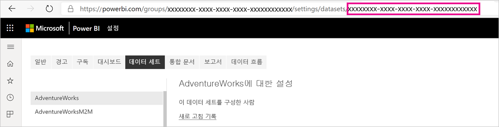
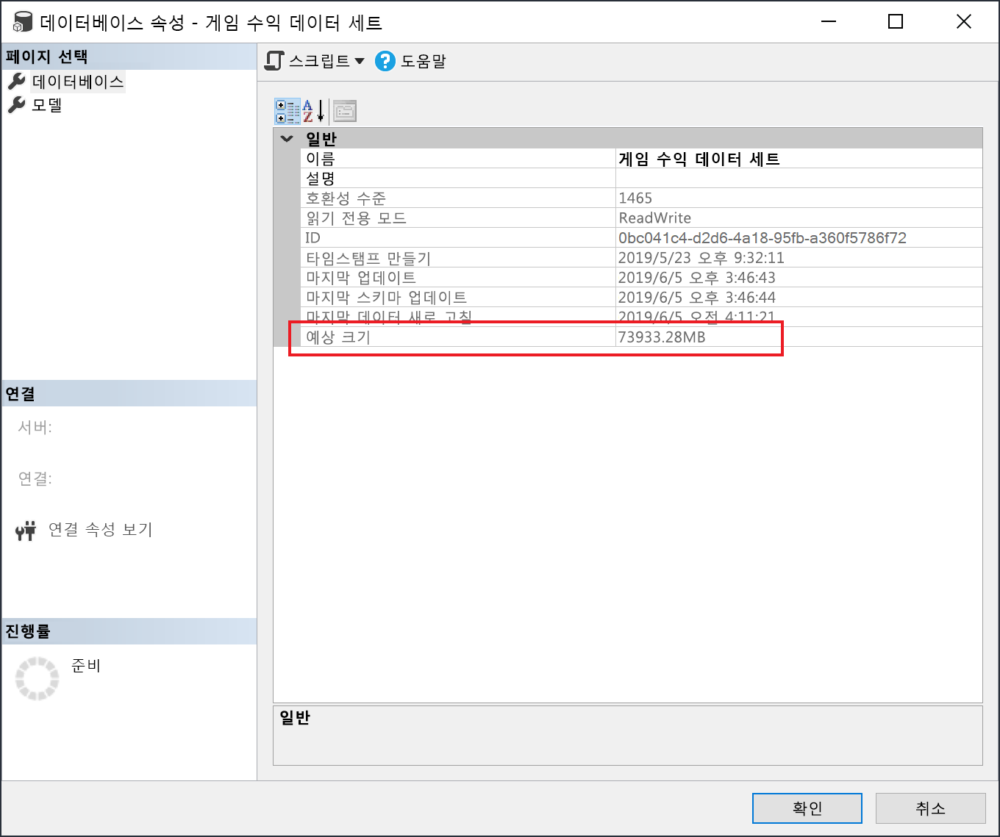

# <a name="large-datasets-in-power-bi-premium"></a>Power BI Premium의 대규모 데이터 세트

Power BI 데이터 세트는 압축률이 높은 메모리 내 캐시에 데이터를 저장하여 쿼리 성능을 최적화하므로 빠른 사용자 대화형 작업이 가능합니다. Premium 용량의 경우 **대용량 데이터 세트 스토리지 형식** 설정으로 기본 10GB 한도를 초과하는 대규모 데이터 세트를 사용하도록 설정할 수 있습니다. 사용하도록 설정하면 데이터 세트 크기는 프리미엄 *용량* 크기 또는 관리자가 설정한 최대 크기로 제한됩니다.

모든 Premium P SKU 및 Embedded A SKU에 대해 대규모 데이터 세트를 사용하도록 설정할 수 있습니다. Premium의 대규모 데이터 세트 크기 제한은 데이터 모델 크기 제한과 관련하여 Azure Analysis Services와 비교할 수 있습니다.

데이터 세트를 10GB 이상으로 확장하는 데 필요한 반면, 대용량 데이터 세트 스토리지 형식 설정을 사용하도록 설정하는 것은 추가 이점이 있습니다. 데이터 세트 쓰기 작업에 XMLA 엔드포인트 기반 도구를 사용하려는 경우 ‘대규모’ 데이터 세트로 구분하지 않는 데이터 세트의 경우에도 설정을 사용하도록 설정해야 합니다. 사용하도록 설정하면 대용량 데이터 세트 스토리지 형식이 XMLA 쓰기 작업 성능을 향상시킬 수 있습니다.

서비스의 대규모 데이터 세트는 Power BI Desktop 모델 업로드 크기에 영향을 주지 않으며 여전히 10GB로 제한됩니다. 대신 새로 고칠 때 데이터 세트 크기가 10GB를 초과할 수 있습니다.

## <a name="enable-large-datasets"></a>대규모 데이터 세트 사용

여기 설명된 단계에서는 서비스에 게시된 새 모델에 대해 대규모 데이터 세트를 사용하도록 설정합니다. 기존 데이터 세트의 경우에는 3단계만 필요합니다.

1. Power BI Desktop에서 모델을 만듭니다. 데이터 세트가 커지고 점진적으로 더 많은 메모리를 사용하는 경우 [증분 새로 고침](service-premium-incremental-refresh.md)을 구성해야 합니다.

1. 모델을 데이터 세트로 서비스에 게시합니다.

1. 서비스 > 데이터 세트 > **설정** 에서 **대용량 데이터 세트 스토리지 형식** 을 확장하고 슬라이더를 **On**(켜기)으로 클릭한 후 **적용** 을 클릭합니다.

    :::image type="content" source="media/service-premium-large-models/enable-large-dataset.png" alt-text="대규모 데이터 세트 슬라이더 사용":::

1. 새로 고침을 호출하여 증분 새로 고침 정책에 따라 기록 데이터를 로드합니다. 처음 새로 고칠 때 기록을 로드하는 데 시간이 걸릴 수 있습니다. 이후 새로 고침은 증분 새로 고침 정책에 따라 더 빨라야 합니다.

## <a name="set-default-storage-format"></a>기본 스토리지 형식 설정

Premium 용량에 할당된 작업 영역에서 만든 모든 새 데이터 세트에는 기본적으로 사용하도록 설정된 대용량 데이터 세트 스토리지 형식이 있을 수 있습니다.

1. 작업 영역에서 **설정** > **Premium** 을 클릭합니다.

1. **기본 스토리지 형식** 에서 **대용량 데이터 세트 스토리지 형식** 을 선택한 다음 **저장** 을 클릭합니다.

    :::image type="content" source="media/service-premium-large-models/default-storage-format.png" alt-text="기본 스토리지 형식 사용":::

### <a name="enable-with-powershell"></a>PowerShell을 통해 사용하도록 설정

PowerShell을 사용하여 대용량 데이터 세트 스토리지 형식을 사용하도록 설정할 수도 있습니다. PowerShell cmdlet을 실행하려면 용량 관리자 및 작업 영역 관리자 권한이 있어야 합니다.

1. 데이터 세트 ID(GUID)를 찾습니다. 작업 영역에 대한 **데이터 세트** 탭의 데이터 세트 설정 아래에 표시되는 URL에서 ID를 확인할 수 있습니다.

    

1. PowerShell 관리자 프롬프트에서 [MicrosoftPowerBIMgmt](/powershell/module/microsoftpowerbimgmt.data/) 모듈을 설치합니다.

    ```powershell
    Install-Module -Name MicrosoftPowerBIMgmt
    ```

1. 다음 cmdlet을 실행하여 로그인하고 데이터 세트 스토리지 모드를 확인합니다.

    ```powershell
    Login-PowerBIServiceAccount

    (Get-PowerBIDataset -Scope Organization -Id <Dataset ID> -Include actualStorage).ActualStorage
    ```

    다음과 같은 응답을 받습니다. 스토리지 모드가 기본값인 ABF(Analysis Services 백업 파일)입니다.

    ```
    Id                   StorageMode

    --                   -----------

    <Dataset ID>         Abf
    ```

1. 다음 cmdlet을 실행하여 스토리지 모드를 설정합니다. Premium Files로 변환하는 데 몇 초 정도 걸릴 수 있습니다.

    ```powershell
    Set-PowerBIDataset -Id <Dataset ID> -TargetStorageMode PremiumFiles

    (Get-PowerBIDataset -Scope Organization -Id <Dataset ID> -Include actualStorage).ActualStorage
    ```

    다음과 같은 응답을 받습니다. 스토리지 모드가 Premium Files로 설정되었습니다.

    ```
    Id                   StorageMode
    
    --                   -----------
    
    <Dataset ID>         PremiumFiles
    ```

[Get-PowerBIWorkspaceMigrationStatus](/powershell/module/microsoftpowerbimgmt.workspaces/get-powerbiworkspacemigrationstatus) cmdlet을 사용하여 Premium Files에서 또는 Premium Files로 데이터 세트 변환 상태를 확인할 수 있습니다.

## <a name="dataset-eviction"></a>데이터 세트 제거

Power BI는 동적 메모리 관리를 사용하여 메모리에서 비활성 데이터 세트를 제거합니다. 사용자 쿼리 처리를 위해 다른 데이터 세트를 로드할 수 있도록 Power BI에서 데이터 세트를 제거할 수 있습니다. 동적 메모리 관리를 사용하면 데이터 세트 크기의 합이 용량에서 사용할 수 있는 메모리보다 훨씬 클 수 있지만 단일 데이터 세트가 메모리에 맞아야 합니다. 동적 메모리 관리에 대한 자세한 내용은 [용량 함수 작동 방법](service-premium-what-is.md#how-capacities-function)을 참조하세요.

제거가 대형 모델에 미치는 영향을 고려해야 합니다. 데이터 세트 로드 시간이 비교적 빠름에도 불구하고, 제거된 큰 데이터 세트가 다시 로드될 때까지 기다려야 하는 경우 상당한 지연이 발생할 수 있습니다. 이러한 이유로 대형 모델 기능은 셀프 서비스 BI 요구 사항과 혼합된 용량이 아닌 엔터프라이즈 BI 요구 사항 전용 용량에 주로 권장됩니다. 엔터프라이즈 BI 요구 사항 전용 용량은 제거를 자주 트리거하고 데이터 세트를 다시 로드해야 할 가능성이 낮습니다. 반면 셀프 서비스 BI용 용량에는 메모리에서 더 자주 로드되는 작은 데이터 세트가 많을 수 있습니다.

## <a name="checking-dataset-size"></a>데이터 세트 크기 확인

기록 데이터를 로드한 후 [XMLA 엔드포인트](service-premium-connect-tools.md)를 통해 [SSMS](/sql/ssms/download-sql-server-management-studio-ssms)를 사용하여 모델 속성 창에서 예상 데이터 세트 크기를 확인할 수 있습니다.



SSMS에서 다음 DMV 쿼리를 실행하여 데이터 세트 크기를 확인할 수도 있습니다. 출력에서 DICTIONARY\_SIZE 열과 USED\_SIZE 열의 합을 구하여 데이터 세트 크기(바이트 단위)를 확인합니다.

```sql
SELECT * FROM SYSTEMRESTRICTSCHEMA
($System.DISCOVER_STORAGE_TABLE_COLUMNS,
 [DATABASE_NAME] = '<Dataset Name>') //Sum DICTIONARY_SIZE (bytes)

SELECT * FROM SYSTEMRESTRICTSCHEMA
($System.DISCOVER_STORAGE_TABLE_COLUMN_SEGMENTS,
 [DATABASE_NAME] = '<Dataset Name>') //Sum USED_SIZE (bytes)
```

## <a name="limitations-and-considerations"></a>제한 사항 및 고려 사항

대규모 데이터 세트 사용 시 다음 제한 사항에 유의하세요.

- **새 작업 영역이 필요함**: 대규모 데이터 세트는 [새 작업 영역](../collaborate-share/service-create-the-new-workspaces.md)에서만 작동합니다.

- **Power BI Desktop으로 다운로드**: 데이터 세트가 Premium Files에 저장되는 경우 [.pbix 파일로 다운로드](../create-reports/service-export-to-pbix.md)가 실패합니다.
- **지원되는 지역**: Premium Files Storage를 지원하는 모든 Azure 지역에서 대규모 데이터 세트가 지원됩니다. 자세히 알아보려면 [지역별로 사용할 수 있는 제품](https://azure.microsoft.com/global-infrastructure/services/?products=storage)과 다음 섹션의 테이블을 참조하세요.

- **최대 데이터 세트 크기 설정**: 관리자는 최대 데이터 세트 크기를 설정할 수 있습니다. 최댓값은 0.1GB에서 SKU의 최대 용량까지 설정할 수 있습니다.

## <a name="region-availability"></a>지역 가용성

Power BI의 대규모 데이터 세트는 [Azure Premium Files Storage](/azure/storage/files/storage-files-planning#storage-tiers)를 지원하는 일부 Azure 지역에서만 사용할 수 있습니다.

다음 목록에는 Power BI의 대규모 데이터 세트를 사용할 수 있는 지역이 나와 있습니다. 다음 목록에 없는 지역에서는 대형 모델이 지원되지 않습니다.

|Azure 지역  |Azure 지역 약어  |
|---------|---------|
|오스트레일리아 동부     | australiaeast        |
|오스트레일리아 남동부     | australiasoutheast        |
|캐나다 동부     | canadaeast        |
|캐나다 중부     | canadacentral        |
|인도 중부     | centralindia        |
|미국 중부     | centralus        |
|동아시아     | eastasia        |
|미국 동부     | eastus        |
|미국 동부 2     | eastus2        |
|일본 동부     | japaneast        |
|일본 서부     | japanwest        |
|한국 중부     | koreacentral        |
|한국 남부     | koreasouth        |
|미국 중북부     | northcentralus        |
|북유럽     | northeurope        |
|미국 중남부     | southcentralus        |
|동남 아시아     | southeastasia        |
|영국 남부     | uksouth        |
|영국 서부     | ukwest        |
|서유럽     | westeurope        |
|인도 서부     | westindia        |
|미국 서부     | westus        |
|미국 서부 2     | westus2        |

## <a name="next-steps"></a>다음 단계

다음 링크는 대형 모델 작업 시 유용할 수 있는 정보를 제공합니다.

* [Azure Premium Files Storage](/azure/storage/files/storage-files-planning#storage-tiers)
* [Power BI Premium에 대한 다중 지역 지원 구성](service-admin-premium-multi-geo.md)
* [Power BI의 BYOK(Bring Your Own Encryption Key)](service-encryption-byok.md)
* [용량 함수 작동 방법](service-premium-what-is.md#how-capacities-function)
* [증분 새로 고침](service-premium-incremental-refresh.md).

Power BI는 Power BI Premium Gen2를 미리 보기 버전으로 소개했습니다. 이 버전은 다음과 같은 향상된 기능을 통해 Power BI Premium 환경을 개선합니다.
* 성능
* 사용자 단위 라이선싱
* 더 큰 규모
* 개선된 메트릭
* 자동 확장
* 관리 오버헤드 감소

Power BI Premium Gen2에 대한 자세한 내용은 [Power BI Premium 2세대(미리 보기)](service-premium-what-is.md#power-bi-premium-generation-2-preview)를 참조하세요.
