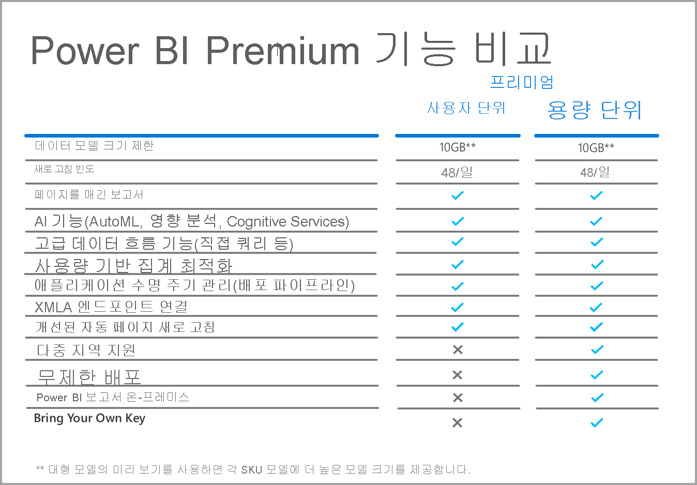

# 사용자 단위 Power BI Premium FAQ(미리 보기)

**사용자 단위 Power BI Premium** 을 사용하면 조직에서 사용자 단위로 Premium 기능의 라이선스를 부여할 수 있습니다. PPU(사용자 단위 Premium)는 모든 Power BI Pro 라이선스 기능을 포함하며, 페이지를 매긴 보고서와 AI 같은 기능 및 Premium 구독자만 사용할 수 있는 기타 기능을 추가합니다. 

이 문서에서는 사용자 단위 Premium 라이선싱에 대한 일반적인 질문과 답변을 제공합니다. 이 문서의 모든 정보는 사용자 단위 Premium이 미리 보기 기간을 지나 GA(일반 공급)로 출시됨에 따라 변경되고 구체화될 수 있습니다. 

이 문서에서는 질문과 대답을 다음 범주로 그룹화합니다.
* 일반적인 질문 
* 관리 질문 
* 최종 사용자 환경 질문 

## 일반적인 질문

1.  **PPU(사용자 단위 Premium)란 무엇인가요?** 

    PPU(사용자 단위 Premium)는 사용자 단위로 프리미엄 기능의 라이선스를 부여하는 새로운 방법입니다. 여기에는 현재 Premium에서만 사용할 수 있는 페이지를 매긴 보고서와 AI 같은 기능 및 기타 기능과 함께 모든 Power BI Pro 라이선스 기능이 포함되어 있습니다.

2.  **예상 구매 시기는 언제인가요?**

    현재 개발이 진행 중이며 2021년까지는 PPU의 GA 출시가 어려울 것 같습니다. 일반 공급이 가능할 때까지 모든 조직에서는 공개 미리 보기를 무료로 이용할 수 있습니다.

3.  **Power BI Pro 및 사용자 단위 Premium 라이선스가 필요한가요?**

    아니요, 사용자 단위 Premium 라이선스로 Power BI Pro의 모든 기능을 이용할 수 있습니다.

4.  **평가판을 어떻게 이용하나요?**

    제품 내 평가판 환경과 Microsoft 365를 통해 사용할 수 있는 평가판 환경이 있습니다. 조직이 PPU를 제한하지 않았다는 가정 하에, 모든 사용자는 작업 영역에 대해 사용자 단위 Premium을 설정하여 제품 내 평가판 환경에 액세스할 수 있습니다. Power BI Pro 평가판이 오늘 시작된 것처럼 포털을 통해 Microsoft 365를 통한 평가판 환경을 사용하도록 설정할 수 있습니다.  

5.  **사용자 단위 Premium에서 사용할 수 있는 기능은 무엇인가요?**

    기능 비교 표는 다음과 같습니다.    

    

6.  **조직에 이미 Power BI Premium이 있습니다. 이제 내 용량에 콘텐츠를 게시하는 데 사용자 단위 Premium 라이선스가 필요한가요?**
    
    조직은 프리미엄 용량을 사용자 단위 Premium 라이선스로 보충하도록 선택할 수 있지만, 기존 용량에 콘텐츠를 게시하는 데에는 사용자 단위 Premium이 필요하지 않습니다.  

## 관리 질문

1.  **내 테넌트에 대해 PPU(사용자 단위 Premium)를 사용하도록 설정하려면 어떻게 하나요?**
    
    테넌트용 PPU에 대해 라이선스가 프로비저닝되면, 사용하도록 설정하는 모든 작업 영역에서 PPU 기능을 사용할 수 있습니다. 미리 보기의 경우 다음 이미지에 나와 있는 것처럼, 사용자 단위 Premium 항목을 선택하여 용량 드롭다운에서 사용자 단위 Premium 기능을 사용하도록 설정하기만 하면 됩니다.

    

2.  **이것은 프리미엄 용량처럼 작동하나요? 기능을 설정/해제할 수 있나요?**

    아니요, PPU에 대한 메모리 또는 CPU의 관리가 없습니다. 이런 점에서 현재의 Power BI Pro와 같은 방식으로 작동합니다. 테넌트 관리자는 일부 기능 설정을 관리할 수 있지만, 현재 대시보드를 해제할 수 없는 것처럼 페이지를 매긴 보고서와 같은 워크로드를 사용하지 않도록 설정할 수 없습니다. 

3.  **노출되는 사용자 단위 Premium 설정은 어디서 관리해야 하나요?**

    사용자 단위 Premium에 대한 테넌트 설정의 새 메뉴 옵션을 통해 관리자는 이러한 설정을 관리할 수 있습니다.

4.  **PPU 작업 영역을 만들 수 있는 사용자를 제한할 수 있나요?**

    예, 동일한 방법으로 현재 작업 영역을 만들 수 있는 사용자를 제한할 수 있습니다.

5.  **테넌트 관리자가 사용자 단위 Premium으로 표시되는 작업 영역을 볼 수 있나요?**

    예, 이러한 작업 영역은 테넌트 관리자 화면의 작업 영역 메뉴 항목에서 호출되며, 여기서 Premium으로 표시된 작업 영역을 보여 줍니다.

6.  **사용자 단위 Premium 용량과 Premium 용량 간에 작업 영역을 이동할 수 있나요?**

    예. GA(일반 공급)의 경우 프리미엄 용량으로 다시 이동하면 작업 영역에 있는 모든 데이터 세트 또는 데이터 흐름을 완전히 새로 고쳐야 합니다. 이 요구 사항은 Premium Gen2 CPU 요금 부과 메커니즘을 우회하려는 회사의 남용을 방지합니다.

7.  **사용자 단위 Premium에서 용량 API를 사용할 수 있나요?**

    제한된 API 세트를 사용하여 작업 영역을 이동할 수 있지만, 워크로드 끄기 같은 작업 및 기타 유사한 작업을 수행할 수 없습니다.  

## 최종 사용자 환경 질문

1.  **작업 영역을 사용자 단위 Premium으로 표시한 경우 다른 사용자가 어떻게 알 수 있나요?**
    
    다음 이미지에 나와 있는 것처럼, 사용자 단위 Premium 작업 영역을 보여 주기 위해 새 아이콘이 추가되었습니다.

        

2.  **사용자 단위 Premium 작업 영역/앱의 콘텐츠에는 누가 액세스할 수 있나요?**

    사용자 단위 Premium 작업 영역의 콘텐츠를 보려는 사용자는 사용자 단위 Premium 라이선스가 있어야 합니다. 여기에는 사용자가 XMLA 엔드포인트, Excel에서 분석, 복합 모델 등을 통해 콘텐츠에 액세스하는 시나리오가 포함됩니다. 아직 PPU 라이선스가 없는 사용자에게 작업 영역에 액세스할 권한을 부여할 수는 있지만, 그렇게 할 경우 콘텐츠에 액세스할 수 없다는 메시지가 표시됩니다. 자격이 있는 경우 평가판 라이선스를 묻는 메시지가 표시됩니다. 자격이 없는 경우 테넌트 관리자가 라이선스를 할당해야 합니다.

3.  **라이선스 유형을 사용하는 사용자에게 공유될 때 표시되는 콘텐츠는 무엇인가요?**

    다음 차트에서는 PPU를 사용하여 어떤 종류의 콘텐츠를 볼 수 있는지를 설명합니다.

       

4.  **포함된 사용 사례에 대해 사용자 단위 Premium을 사용할 수 있나요?**

    Pro 라이선스를 사용하는 경우 사용자 단위 Premium은 포함된 사용 사례와 동일한 방식으로 작동합니다. 콘텐츠를 포함할 수 있으며 각 사용자에게는 이를 볼 수 있는 PPU 라이선스가 필요합니다.

5.  **평가판이 만료되면 내 PPU 작업 영역이 어떻게 되나요?**

    사용자는 여전히 작업 영역에 액세스할 수 있지만, 해당 라이선스 유형을 요구하는 콘텐츠를 사용할 수는 없습니다. 작업 영역을 프리미엄 용량으로 이동하거나 단순히 요구 사항을 해제해야 합니다. 
6.  **사용자 단위 Premium에서 얻을 수 있는 총 스토리지는 얼마인가요?**

    전체 테넌트는 스토리지 측면에서 프리미엄 용량과 동일한 100TB 제한을 갖게 됩니다.

7.  **사용자 단위 Premium에서 내보내기 API를 사용할 수 있나요?**

    이는 현재 페이지를 매긴 보고서에 사용할 수 있으며, 5분마다 한 번의 호출로 제한됩니다.  Power BI 보고서는 현재 지원되지 않습니다.  

8.  **전자 메일 구독은 PPU에서 어떻게 작동하나요?**

    PPU 라이선스 또는 Pro 라이선스가 있는 사용자는 누구나 구독 및 구독에 포함된 첨부 파일(첨부 파일이 모든 사용자에게 동일한 경우)을 받을 수 있습니다. Pro 사용자는 제품 포털에서 콘텐츠를 볼 수 없습니다. 받는 사람마다 서로 다른 데이터 보기를 허용하는 추가 구독 기능이 도입된 경우, 해당 기능을 사용하려면 PPU 라이선스(또는 프리미엄 용량)가 필요합니다.

9.  **새로 고침 API를 통해 포털에서 48회 새로 고침을 초과할 수 있나요?**

    지금은 새로 고침이 제한되지 않습니다.  

10. **Power BI Premium Capacity Metrics 앱을 사용하여 사용자 단위 프리미엄 용량을 모니터링할 수 있나요?**

    Power BI Premium Capacity Metrics 앱은 Premium Gen2에서 작동하지 않으므로 사용자는 PPU 항목을 볼 수 없습니다.  

11. **PPU 작업 영역에 Power BI 데이터 세트를 호스트하고, 이에 대한 보고서를 작성하고, PPU 이외의 작업 영역에 게시하고, 사용자가 PPU 라이선스 없이 이 보고서에 액세스하도록 허용할 수 있나요?**

    아니요. 데이터 세트는 사용자 단위 Premium 작업 영역에 있으므로 라이선스가 없는 사용자는 PPU 이외의 작업 영역에 있는 보고서에 액세스할 수 있더라도 데이터 세트를 볼 수 없습니다.

12. **여러 10GB 데이터 모델을 동시에 새로 고칠 수 있나요?**

    Premium Gen2의 병렬 새로 고침에 적용되는 것과 동일한 제한 사항이 적용됩니다.

13. **웹에 게시를 통해 사용자 단위 Premium에 호스트되는 콘텐츠를 공유할 수 있나요?**

    웹에 게시는 현재 프리미엄 용량에 호스트되는 콘텐츠와 동일한 방식으로 작동합니다.

14. **사용자 단위 Premium 작업 영역에서 데이터 흐름을 실행하고, 다른 작업 영역의 Power BI 데이터 세트로 가져올 수 있나요? 해당 콘텐츠를 사용하는 사용자에게는 사용자 단위 Premium 라이선스가 필요하지 않나요?**

    사용자 단위 Premium 라이선스가 있는 Power BI 보고서 작성자는 PPU 미리 보기 기간에 이 작업을 수행할 수 있습니다.

15. **사용자 단위 Premium으로 Power BI 모바일 앱을 사용할 수 있나요?**

    예, Power BI 모바일 앱은 사용자 단위 Premium 앱 또는 작업 영역에 게시된 콘텐츠와 함께 작동하도록 업데이트되었습니다.

**다음 단계**

* [Power BI 프리미엄이란?](service-premium-what-is.md)
* [Microsoft Power BI 프리미엄 백서](https://aka.ms/pbipremiumwhitepaper)
* [Power BI 엔터프라이즈 배포 계획 백서](https://aka.ms/pbienterprisedeploy)
* [Extended Pro 평가판 활성화](../fundamentals/service-self-service-signup-for-power-bi.md)
* [Power BI Embedded FAQ](../developer/embedded/embedded-faq.md)

궁금한 점이 더 있나요? [Power BI 커뮤니티에 질문합니다.](https://community.powerbi.com/)
