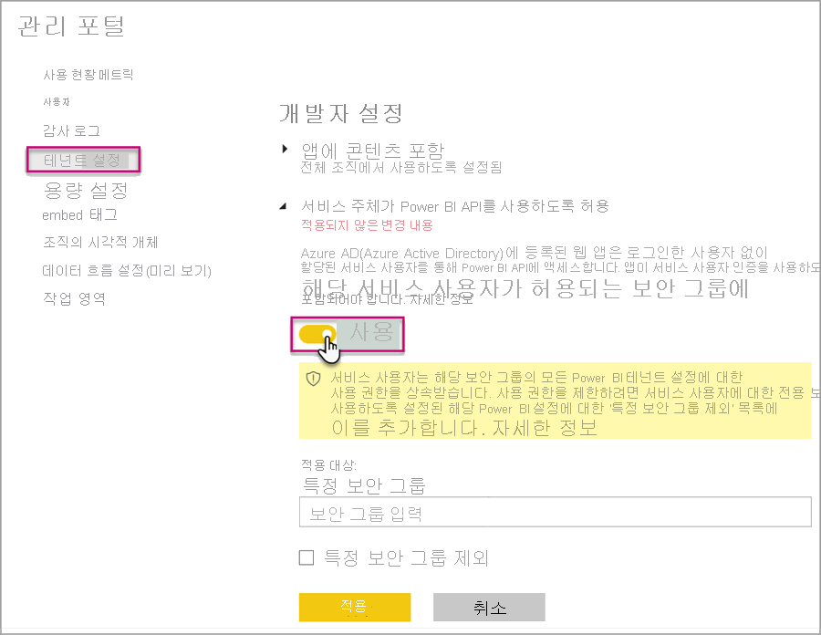
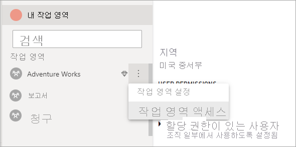

# <a name="automate-premium-workspace-and-dataset-tasks-with-service-principals"></a>서비스 주체를 사용하여 Premium 작업 영역 및 데이터 세트 작업 자동화

서비스 주체는 리소스 및 서비스 수준의 무인 작업을 수행하기 위해 테넌트 내에서 만드는 Azure Active Directory *앱 등록*입니다. 이 고유한 사용자 ID 유형에는 앱 이름, 애플리케이션 ID, 테넌트 ID 및 암호용 *클라이언트 암호* 또는 인증서가 있습니다.

Power BI Premium은 Power BI Embedded와 동일한 서비스 주체 기능을 사용합니다. 자세한 내용은 [서비스 주체를 사용하여 Power BI 콘텐츠 포함](../developer/embedded/embed-service-principal.md)을 참조하세요.

**Power BI Premium**에서 서비스 주체를 [XMLA 엔드포인트](service-premium-connect-tools.md)와 함께 사용하여 작업 영역 프로비저닝, 모델 배포, 데이터 세트 새로 고침 등의 데이터 세트 관리 작업을 자동화할 수도 있습니다.

- PowerShell
- Azure Automation
- Azure Logic Apps
- 사용자 지정 클라이언트 애플리케이션

[새 작업 영역](../collaborate-share/service-new-workspaces.md)만 서비스 주체를 사용한 XMLA 엔드포인트 연결을 지원합니다. 클래식 작업 영역은 지원되지 않습니다. 서비스 주체는 할당된 작업 영역에 대한 작업을 수행하는 데 필요한 권한만 갖습니다. 권한은 일반 UPN 계정과 마찬가지로 작업 영역 액세스를 통해 할당됩니다.

쓰기 작업을 수행하려면 용량의 **데이터 세트 워크로드**에 [읽기-쓰기가 사용하도록 설정된 XMLA 엔드포인트](service-premium-connect-tools.md#enable-xmla-read-write)가 있어야 합니다. Power BI Desktop에서 게시된 데이터 세트는 [향상된 메타데이터 형식](../connect-data/desktop-enhanced-dataset-metadata.md) 기능이 사용하도록 설정되어 있어야 합니다.

> [!NOTE]
> Power BI Premium의 XMLA 엔드포인트 기능은 **미리 보기**입니다. 미리 보기 상태의 기능은 프로덕션 환경에서 사용하면 안 됩니다. 특정 기능, 지원 및 설명서는 제한적입니다.  자세한 내용은 [Microsoft OST(온라인 서비스 사용 약관)](https://www.microsoft.com/licensing/product-licensing/products?rtc=1)를 참조하세요.

## <a name="create-a-service-principal"></a>서비스 주체 만들기

서비스 주체는 Azure Portal에서 또는 PowerShell을 사용하여 앱 등록으로 만듭니다. 서비스 주체를 만들 때는 앱 이름, 애플리케이션(클라이언트) ID, 디렉터리(테넌트) ID 및 클라이언트 암호를 별도로 복사하고 저장해야 합니다. 서비스 주체를 만드는 방법의 단계는 다음을 참조하세요.

[서비스 사용자 만들기 - Azure Portal](https://docs.microsoft.com/azure/active-directory/develop/howto-create-service-principal-portal)   
[서비스 사용자 만들기 - PowerShell](https://docs.microsoft.com/azure/active-directory/develop/howto-authenticate-service-principal-powershell)

## <a name="create-an-azure-ad-security-group"></a>Azure AD 보안 그룹 만들기

기본적으로 서비스 주체는 사용하도록 설정된 모든 테넌트 설정에 액세스할 수 있습니다. 관리자 설정에 따라 액세스가 특정 보안 그룹으로 제한되거나 전체 조직으로 확대될 수 있습니다.

서비스 주체 액세스를 특정 테넌트 설정으로 제한하려면 특정 보안 그룹에만 액세스를 허용할 수 있습니다. 또는 서비스 주체에 대한 전용 보안 그룹을 만들고 원하는 테넌트 설정에서 제외할 수 있습니다. 보안 그룹을 만들고 서비스 주체를 추가하는 방법의 단계는 [Azure Active Directory를 사용하여 기본 그룹 만들기 및 멤버 추가](https://docs.microsoft.com/azure/active-directory/fundamentals/active-directory-groups-create-azure-portal)를 참조하세요.

## <a name="enable-service-principals"></a>서비스 주체를 사용하도록 설정

Power BI에서 서비스 주체를 사용하려면 먼저 관리자가 Power BI 관리 포털에서 서비스 주체 액세스를 사용하도록 설정해야 합니다.

Power BI **관리 포털** > **테넌트 설정**에서 **서비스 주체가 Power BI API를 사용하도록 허용**을 확장하고 **사용**을 클릭합니다. 보안 그룹에 사용 권한을 적용하려면 **특정 보안 그룹**에 그룹 이름을 추가합니다.



## <a name="workspace-access"></a>작업 영역 액세스

서비스 주체가 Premium 작업 영역 및 데이터 세트 작업을 수행하는 데 필요한 권한을 갖도록 하려면 서비스 주체를 작업 영역 멤버 또는 관리자로 추가해야 합니다. Power BI 서비스에서 작업 영역 액세스를 사용하는 방법은 여기에 설명되어 있지만 [그룹 사용자 추가 REST API](https://docs.microsoft.com/rest/api/power-bi/groups/addgroupuser)를 사용할 수도 있습니다.

1. Power BI 서비스에서 작업 영역에 대해 **기타** > **작업 영역 액세스**를 선택합니다.

    

2. 애플리케이션 이름으로 검색하고 서비스 주체를 **관리자** 또는 **멤버**로 작업 영역에 추가합니다.

    

## <a name="connection-strings-for-the-xmla-endpoint"></a>XMLA 엔드포인트의 연결 문자열

서비스 주체를 만들고 테넌트에 대해 서비스 주체를 사용하도록 설정하고 서비스 주체를 작업 영역 액세스에 추가하면, XMLA 엔드포인트를 통해 연결 문자열에서 서비스 주체를 사용자 ID로 사용할 수 있습니다. 차이는 사용자 ID 및 암호 매개 변수에 애플리케이션 ID, 테넌트 ID 및 애플리케이션 암호를 지정한다는 것입니다.

`Data Source=powerbi://api.powerbi.com/v1.0/myorg/<workspace name>; Initial Catalog=<dataset name>;User ID=app:<appId>@<tenantId>;Password=<app_secret>;`

### <a name="powershell"></a>PowerShell

#### <a name="using-sqlserver-module"></a>SQLServer 모듈 사용

다음 예제에서는 AppId, TenantId 및 AppSecret을 사용하여 데이터 세트 새로 고침 작업을 인증합니다.

```powershell
Param (
        [Parameter(Mandatory=$true)] [String] $AppId,
        [Parameter(Mandatory=$true)] [String] $TenantId,
        [Parameter(Mandatory=$true)] [String] $AppSecret
       )
$PWord = ConvertTo-SecureString -String $AppSecret -AsPlainText -Force

$Credential = New-Object -TypeName "System.Management.Automation.PSCredential" -ArgumentList $AppId, $PWord

Invoke-ProcessTable -Server "powerbi://api.powerbi.com/v1.0/myorg/myworkspace" -TableName "mytable" -DatabaseName "mydataset" -RefreshType "Full" -ServicePrincipal -ApplicationId $AppId -TenantId $TenantId -Credential $Credential
```

### <a name="amo-and-adomd"></a>AMO 및 ADOMD

클라이언트 애플리케이션 및 웹앱에 연결할 때 NuGet의 [AMO 및 ADOMD 클라이언트 라이브러리](https://docs.microsoft.com/azure/analysis-services/analysis-services-data-providers) 버전 15.0.2 이상 설치 가능한 패키지는 다음 구문 `app:AppID` 및 암호 또는 `cert:thumbprint`를 사용하여 연결 문자열에서 서비스 사용자를 지원합니다.

다음 예제에서는 `appID` 및 `password`가 모델 데이터베이스 새로 고침 작업을 수행하는 데 사용됩니다.

```csharp
string appId = "xxx";
string authKey = "yyy";
string connString = $"Provider=MSOLAP;Data source=powerbi://api.powerbi.com/v1.0/<tenant>/<workspacename>;Initial catalog=<datasetname>;User ID=app:{appId};Password={authKey};";
Server server = new Server();
server.Connect(connString);
Database db = server.Databases.FindByName("adventureworks");
Table tbl = db.Model.Tables.Find("DimDate");
tbl.RequestRefresh(RefreshType.Full);
db.Model.SaveChanges();
```

## <a name="next-steps"></a>다음 단계

[XMLA 엔드포인트로 데이터 세트 연결](service-premium-connect-tools.md)  
[Azure Automation](https://docs.microsoft.com/azure/automation)  
[Azure Logic Apps](https://docs.microsoft.com/azure/logic-apps/)  
[Power BI REST API](https://docs.microsoft.com/rest/api/power-bi/)
