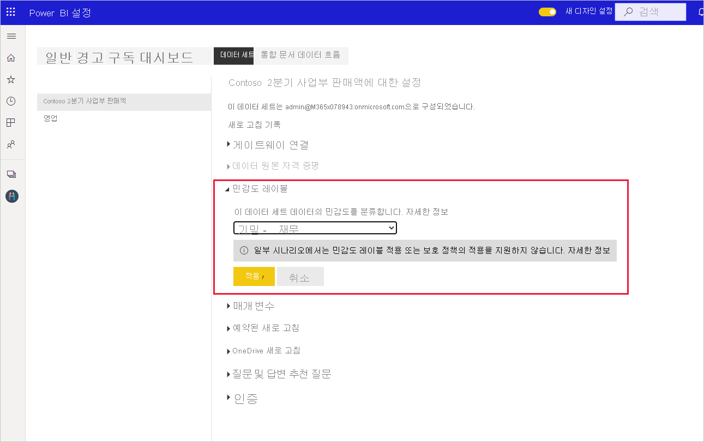

# Power BI에서 민감도 레이블을 적용하는 방법

보고서, 대시보드, 데이터 세트 및 데이터 흐름에 대한 Microsoft Information Protection 민감도 레이블은 무단 데이터 액세스 및 누출로부터 중요한 콘텐츠를 보호할 수 있습니다. 민감도 레이블을 사용하여 데이터에 올바른 레이블을 지정하면 권한 있는 사용자만 데이터에 액세스할 수 있습니다. 이 문서에서는 콘텐츠에 민감도 레이블을 적용하는 방법을 보여 줍니다.

Power BI에서 민감도 레이블을 적용할 수 있으려면:
* Power BI Pro 라이선스와 레이블을 추가하려는 콘텐츠에 대한 편집 권한이 있어야 합니다.
* [Power BI에서 민감도 레이블 사용](./service-security-enable-data-sensitivity-labels.md#enable-sensitivity-labels) 문서에 설명된 대로, 민감도 레이블을 적용할 수 있는 권한이 있는 보안 그룹에 속해 있어야 합니다.
* 모든 [필수 구성 요소](./service-security-sensitivity-label-overview.md#requirements-for-using-sensitivity-labels-in-power-bi) 및 [라이선스 요구 사항](./service-security-data-protection-overview.md#licensing)을 충족해야 합니다.

Power BI의 민감도 레이블에 대한 자세한 내용은 [Power BI의 민감도 레이블](service-security-sensitivity-label-overview.md)을 참조하세요.

## 민감도 레이블 적용

테넌트에서 데이터 보호를 사용하도록 설정하면 대시보드, 보고서, 데이터 세트 및 데이터 흐름 목록 보기의 민감도 열에 민감도 레이블이 표시됩니다.

**보고서 또는 대시보드에 민감도 레이블을 적용하거나 변경하려면**
1. **기타 옵션(...)** 을 클릭합니다.
1. **설정**을 선택합니다.
1. 설정 사이드 창에서 적절한 민감도 레이블을 선택합니다.
1. 설정을 저장합니다.

다음 이미지는 보고서의 이러한 단계를 보여 줍니다.

**데이터 세트 또는 데이터 흐름에서 민감도 레이블을 적용하거나 변경하려면**

1. **기타 옵션(...)** 을 클릭합니다.
1. **설정**을 선택합니다.
1. 설정 사이드 창에서 적절한 민감도 레이블을 선택합니다.
1. 설정을 적용합니다.

다음 두 이미지는 데이터 세트의 이러한 단계를 보여 줍니다.

**기타 옵션(...)** 을 선택한 다음 **설정**을 선택합니다.

설정 페이지에서 민감도 레이블 섹션을 열고 원하는 민감도 레이블을 선택한 다음 **적용**을 클릭합니다.

## 민감도 레이블 제거
보고서, 대시보드, 데이터 세트 또는 데이터 흐름에서 민감도 레이블을 제거하려면 [레이블을 적용하는 데 사용된 절차와 동일한 프로시저](#applying-sensitivity-labels)를 수행하되 데이터의 민감도를 분류하라는 메시지가 표시되면 **(없음)** 을 선택합니다. 

## 고려 사항 및 제한 사항

Power BI의 민감도 레이블 제한 목록은 [Power BI의 민감도 레이블](service-security-sensitivity-label-overview.md#limitations)을 참조하세요.

## 다음 단계

이 문서에서는 Power BI에서 민감도 레이블을 적용하는 방법을 설명했습니다. 다음 문서에서는 Power BI의 데이터 보호에 대해 자세히 설명합니다. 

* [Power BI의 민감도 레이블 개요](./service-security-sensitivity-label-overview.md)
* [Power BI에서 민감도 레이블 사용](./service-security-enable-data-sensitivity-labels.md)
* [Power BI에서 Microsoft Cloud App Security 제어 사용](./service-security-using-microsoft-cloud-app-security-controls.md)