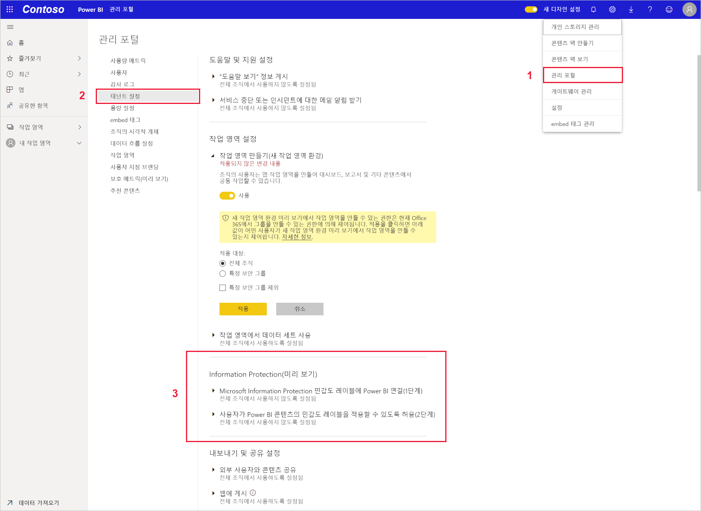
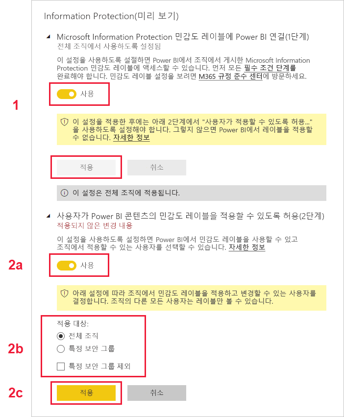

# Power BI에서 민감도 레이블 사용

[Microsoft Information Protection 민감도 레이블](https://docs.microsoft.com/microsoft-365/compliance/sensitivity-labels)을 Power BI에서 사용할 수 있도록 하려면 테넌트에서 사용하도록 설정해야 합니다. 이 문서에서는 이 작업을 수행하는 방법을 Power BI 테넌트 관리자에게 보여 줍니다. Power BI의 민감도 레이블에 대한 자세한 개요를 보려면 [Power BI의 민감도 레이블](service-security-sensitivity-label-overview.md)을 참조하세요. Power BI에서 민감도 레이블을 적용하는 방법에 대한 자세한 내용은 [민감도 레이블 적용](./service-security-apply-data-sensitivity-labels.md)을 참조하세요. 

민감도 레이블을 사용하도록 설정한 경우:

* 조직의 특정 사용자와 보안 그룹이 [민감도 레이블](./service-security-apply-data-sensitivity-labels.md)을 분류하고 Power BI 보고서, 대시보드, 데이터 세트 및 데이터 흐름에 적용할 수 있습니다.
* 조직의 모든 구성원이 해당 레이블을 볼 수 있습니다.

민감도 레이블을 사용하려면 Azure Information Protection 라이선스가 필요합니다. 자세한 내용은 [라이선스 및 요구 사항](#licensing-and-requirements)을 참조하세요.

## 라이선싱 및 요구 사항

* Power BI에서 Microsoft Information Protection 민감도 레이블을 적용하거나 보려면 Azure Information Protection 프리미엄 P1 또는 프리미엄 P2 라이선스가 필요합니다. Azure Information Protection은 독립 실행형으로 구입하거나 Microsoft 라이선스 제품군 중 하나를 통해 구입할 수 있습니다. 자세한 내용은 [Azure Information Protection 가격 책정](https://azure.microsoft.com/pricing/details/information-protection/)을 참조하세요.

* Power BI 콘텐츠에 레이블을 적용할 수 있으려면 사용자에게 위에서 언급한 Azure Information Protection 라이선스 외에도 Power BI Pro 라이선스가 있어야 합니다.

* Office 앱에는 [민감도 레이블을 보고 적용하기 위한 자체 라이선싱 요구 사항]( https://docs.microsoft.com/microsoft-365/compliance/get-started-with-sensitivity-labels#subscription-and-licensing-requirements-for-sensitivity-labels )이 있습니다.

* 테넌트에서 민감도 레이블을 사용하도록 설정하기 전에 민감도 레이블이 정의되고 관련 사용자 및 그룹에 대해 게시되었는지 확인합니다. 자세한 내용은 [민감도 레이블 및 해당 정책 만들기 및 구성](https://docs.microsoft.com/microsoft-365/compliance/create-sensitivity-labels?view=o365-worldwide)을 참조하세요.

>[!NOTE]
> 조직에서 Azure Information Protection 민감도 레이블을 사용하는 경우 Power BI에서 사용할 수 있도록 Microsoft Information Protection 통합 레이블 지정 플랫폼으로 마이그레이션해야 합니다. [민감도 레이블 마이그레이션에 대해 자세히 알아보세요](https://docs.microsoft.com/azure/information-protection/configure-policy-migrate-labels).

## 민감도 레이블 사용

Power BI **관리 포털**로 이동하여 **테넌트 설정** 창을 열고 **정보 보호** 섹션을 찾습니다.

**Information Protection** 섹션에서 다음 단계를 수행합니다.
1. **사용자가 Power BI 콘텐츠의 민감도 레이블을 적용할 수 있도록 허용**을 엽니다.
1. 설정/해제합니다.
1. Power BI 자산에서 민감도 레이블을 적용하고 변경할 수 있는 사람을 정의합니다. 기본적으로 조직의 모든 사용자가 민감도 레이블을 적용할 수 있습니다. 그러나 특정 사용자나 보안 그룹만 민감도 레이블을 설정할 수 있도록 선택할 수 있습니다. 전체 조직이나 특정 보안 그룹을 선택한 상태에서 사용자 또는 보안 그룹의 특정 하위 집합을 제외할 수 있습니다.
   
   * 전체 조직에 대해 민감도 레이블을 사용하도록 설정한 경우 예외는 일반적으로 보안 그룹입니다.
   * 특정 사용자나 보안 그룹에 대해서만 민감도 레이블을 사용하도록 설정한 경우 예외는 일반적으로 특정 사용자입니다.  
    이 방법을 사용하면 특정 사용자가 해당 권한이 있는 그룹에 속해 있더라도 Power BI에서 민감도 레이블을 적용하지 못하도록 방지할 수 있습니다.

1. **적용**을 누릅니다.

> [!IMPORTANT]
> 자산에 대한 *‘만들기’* 및 *‘편집’* 권한이 있고, 이 섹션에서 설정된 관련 보안 그룹에 속해 있는 Power BI Pro 사용자만 민감도 레이블을 설정하고 편집할 수 있습니다. 이 그룹에 속하지 않는 사용자는 레이블을 설정하거나 편집할 수 없습니다.  

## 문제 해결

Power BI는 Microsoft Information Protection 민감도 레이블을 사용합니다. 따라서 민감도 레이블을 사용하도록 설정할 때 오류 메시지가 발생하는 경우 다음 중 하나 때문일 수 있습니다.

* Azure Information Protection [라이선스](#licensing-and-requirements)가 없습니다.
* 민감도 레이블이 Power BI에서 지원하는 Microsoft Information Protection 버전으로 [마이그레이션되지](#enable-sensitivity-labels) 않았습니다.
* Microsoft Information Protection 민감도 레이블이 [조직에 정의](#enable-sensitivity-labels)되어 있지 않습니다.

## 고려 사항 및 제한 사항

Power BI의 민감도 레이블 제한 목록은 [Power BI의 민감도 레이블](service-security-sensitivity-label-overview.md#limitations)을 참조하세요.

## 다음 단계

이 문서에서는 Power BI에서 민감도 레이블을 사용하도록 설정하는 방법을 설명했습니다. 다음 문서에서는 Power BI의 데이터 보호에 대해 자세히 설명합니다. 

* [Power BI의 민감도 레이블 개요](service-security-sensitivity-label-overview.md)
* [Power BI에서 민감도 레이블을 적용하는 방법](../collaborate-share/service-security-apply-data-sensitivity-labels.md)
* [Power BI에서 Microsoft Cloud App Security 제어 사용](service-security-using-microsoft-cloud-app-security-controls.md)
* [보호 메트릭 보고서](service-security-data-protection-metrics-report.md)