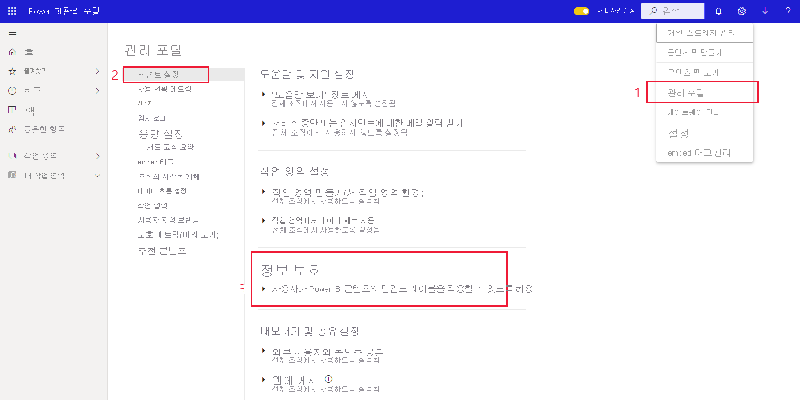
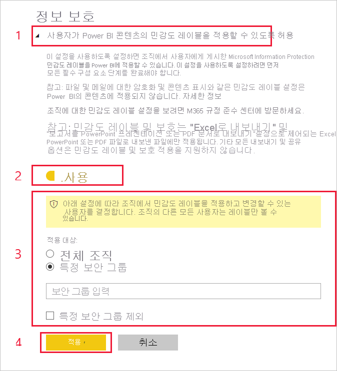

# Power BI에서 데이터 민감도 레이블 사용

[Microsoft Information Protection 데이터 민감도 레이블](https://docs.microsoft.com/microsoft-365/compliance/sensitivity-labels)을 Power BI에서 사용할 수 있도록 하려면 테넌트에서 사용하도록 설정해야 합니다. 이 문서에서는 이 작업을 수행하는 방법을 Power BI 테넌트 관리자에게 보여 줍니다. Power BI의 데이터 민감도 레이블에 대한 개요는 [Power BI의 데이터 보호](service-security-data-protection-overview.md)를 참조하세요. Power BI에서 민감도 레이블을 적용하는 방법에 대한 자세한 내용은 [민감도 레이블 적용](../collaborate-share/service-security-apply-data-sensitivity-labels.md)을 참조하세요. 

민감도 레이블을 사용하도록 설정한 경우:

* 조직의 특정 사용자와 보안 그룹이 [민감도 레이블](../collaborate-share/service-security-apply-data-sensitivity-labels.md)을 분류하고 Power BI 보고서, 대시보드, 데이터 세트 및 데이터 흐름에 적용할 수 있습니다.
* 조직의 모든 구성원이 해당 레이블을 볼 수 있습니다.

데이터 민감도 레이블을 사용하려면 Azure Information Protection 라이선스가 필요합니다. 자세한 내용은 [라이선스](service-security-data-protection-overview.md#licensing)를 참조하세요.

## 데이터 민감도 레이블 사용

Power BI **관리 포털**로 이동하여 **테넌트 설정** 창을 열고 **정보 보호** 섹션을 찾습니다.

**Information Protection** 섹션에서 다음 단계를 수행합니다.
1. **사용자가 Power BI 콘텐츠의 민감도 레이블을 적용할 수 있도록 허용**을 엽니다.
1. 설정/해제합니다.
1. Power BI 자산에서 민감도 레이블을 적용하고 변경할 수 있는 사람을 정의합니다. 기본적으로 조직의 모든 사용자가 민감도 레이블을 적용할 수 있습니다. 그러나 특정 사용자나 보안 그룹만 민감도 레이블을 설정할 수 있도록 선택할 수 있습니다. 전체 조직이나 특정 보안 그룹을 선택한 상태에서 사용자 또는 보안 그룹의 특정 하위 집합을 제외할 수 있습니다.
   
   * 전체 조직에 대해 민감도 레이블을 사용하도록 설정한 경우 예외는 일반적으로 보안 그룹입니다.
   * 특정 사용자나 보안 그룹에 대해서만 민감도 레이블을 사용하도록 설정한 경우 예외는 일반적으로 특정 사용자입니다.  
    이 방법을 사용하면 특정 사용자가 해당 권한이 있는 그룹에 속해 있더라도 Power BI에서 민감도 레이블을 적용하지 못하도록 방지할 수 있습니다.

1. **적용**을 누릅니다.

> [!IMPORTANT]
> 자산에 대한 *‘만들기’* 및 *‘편집’* 권한이 있고, 이 섹션에서 설정된 관련 보안 그룹에 속해 있는 Power BI Pro 사용자만 민감도 레이블을 설정하고 편집할 수 있습니다. 이 그룹에 속하지 않는 사용자는 레이블을 설정하거나 편집할 수 없습니다.  

## 문제 해결

Power BI는 Microsoft Information Protection 민감도 레이블을 사용합니다. 따라서 민감도 레이블을 사용하도록 설정할 때 오류 메시지가 발생하는 경우 다음 중 하나 때문일 수 있습니다.

* Azure Information Protection [라이선스](service-security-data-protection-overview.md#licensing)가 없습니다.
* 민감도 레이블이 Power BI에서 지원하는 Microsoft Information Protection 버전으로 마이그레이션되지 않았습니다. [민감도 레이블을 마이그레이션](https://docs.microsoft.com/azure/information-protection/configure-policy-migrate-labels)하는 방법을 자세히 알아보세요.
* 조직에 Microsoft Information Protection 민감도 레이블이 정의되어 있지 않습니다. 게시된 정책에 포함된 레이블만 사용할 수 있습니다. [민감도 레이블에 대해 자세히 알아보거나](https://docs.microsoft.com/Office365/SecurityCompliance/sensitivity-labels), [Microsoft 보안 및 규정 준수 센터](https://sip.protection.office.com/sensitivity?flight=EnableMIPLabels)를 방문하여 조직의 레이블 및 게시 정책을 정의하는 방법을 알아보세요.

## 고려 사항 및 제한 사항

다음 목록은 Power BI에서 민감도 레이블의 몇 가지 제한 사항입니다.

**일반**
* 민감도 레이블은 대시보드, 보고서, 데이터 세트 및 데이터 흐름에만 적용할 수 있습니다. 현재, [페이지를 매긴 보고서](../paginated-reports/report-builder-power-bi.md) 및 통합 문서에서는 민감도 레이블을 사용할 수 없습니다.
* Power BI 자산의 민감도 레이블은 작업 영역 목록, 계보, 즐겨찾기, 최근 항목 및 앱에 표시됩니다. 현재 “공유한 항목” 보기에는 레이블이 표시되지 않습니다. 그러나 Power BI 자산에 적용된 레이블은 표시되지 않는 경우에도 Excel, PowerPoint 및 PDF 파일로 내보낸 데이터에 항상 유지됩니다.
* 민감도 레이블은 글로벌(퍼블릭) 클라우드의 테넌트에만 지원됩니다. 다른 클라우드의 테넌트에서는 민감도 레이블이 지원되지 않습니다.
* 템플릿 앱에 대해서는 데이터 민감도 레이블이 지원되지 않습니다. 앱이 추출되고 설치될 때 템플릿 앱 작성자가 설정한 민감도 레이블은 제거되고 앱 소비자가 설치된 템플릿 앱의 아티팩트에 추가한 민감도 레이블은 앱이 업데이트될 때 손실됩니다(nothing으로 다시 설정됨).
* Power BI는 [전달 금지](https://docs.microsoft.com/microsoft-365/compliance/encryption-sensitivity-labels?view=o365-worldwide#let-users-assign-permissions), [사용자 정의](https://docs.microsoft.com/microsoft-365/compliance/encryption-sensitivity-labels?view=o365-worldwide#let-users-assign-permissions) 및 [HYOK](https://docs.microsoft.com/azure/information-protection/configure-adrms-restrictions) 보호 유형의 민감도 레이블을 지원하지 않습니다. 전달 금지 및 사용자 정의 보호 유형은 [Microsoft 365 보안 센터](https://security.microsoft.com/) 또는 [Microsoft 365 준수 센터](https://compliance.microsoft.com/)에 정의된 레이블을 참조합니다.
* 사용자가 Power BI 내에서 부모 레이블을 적용하는 것을 허용하지 않는 것이 좋습니다. 부모 레이블이 콘텐츠에 적용되는 경우 해당 콘텐츠에서 파일(Excel, PowerPoint 및 PDF)로 데이터 내보내기가 실패합니다. [하위 레이블(그룹화 레이블)](https://docs.microsoft.com/microsoft-365/compliance/sensitivity-labels?view=o365-worldwide#sublabels-grouping-labels)을 참조하세요.

**내보내기**
* 레이블 및 보호 컨트롤은 데이터를 Excel, PowerPoint 및 PDF 파일로 내보낼 때만 적용됩니다. 데이터를 .csv 또는 .pbix 파일, Excel의 분석 또는 다른 내보내기 경로로 내보낼 때는 레이블 및 보호가 적용되지 않습니다.
* 내보낸 파일에 민감도 레이블 및 보호를 적용해도 콘텐츠 표시가 파일에 추가되지 않습니다. 그러나 레이블이 콘텐츠 표시를 적용하도록 구성된 경우에는 Office 데스크톱 앱에서 해당 파일을 열 때 Azure Information Protection 통합 레이블 지정 클라이언트에 의해 자동으로 적용됩니다. 데스크톱, 모바일 또는 웹앱에 대해 기본 제공 레이블을 사용하는 경우 콘텐츠 표시가 자동으로 적용되지 않습니다. 자세한 내용은 [Office 앱에서 콘텐츠 표시 및 암호화를 적용할 때](https://docs.microsoft.com/microsoft-365/compliance/sensitivity-labels-office-apps?view=o365-worldwide#when-office-apps-apply-content-marking-and-encryption)를 참조하세요.
* Power BI에서 파일을 내보내는 사용자는 민감도 레이블 설정에 따라 해당 파일에 대한 액세스 및 편집 권한을 갖습니다. 데이터를 내보내는 사용자는 파일의 소유자 권한을 얻지 못합니다.
* 데이터를 파일로 내보낼 때 레이블을 적용할 수 없는 경우 내보내기가 실패합니다. 레이블을 적용할 수 없어 내보내기가 실패했는지 확인하려면 제목 표시줄의 가운데에 있는 보고서 또는 대시보드 이름을 클릭하면 열리는 정보 드롭다운에 “민감도 레이블을 로드할 수 없습니다”라는 메시지가 표시되는지 확인합니다. 이는 보안 관리자가 적용된 레이블을 게시 취소 또는 삭제하거나 임시 시스템 문제로 인해 발생할 수 있습니다.

## 다음 단계

이 문서에서는 Power BI에서 데이터 민감도 레이블을 사용하도록 설정하는 방법을 설명했습니다. 다음 문서에서는 Power BI의 데이터 보호에 대해 자세히 설명합니다. 

* [Power BI의 데이터 보호 개요](service-security-data-protection-overview.md)
* [Power BI에서 데이터 민감도 레이블 적용](../collaborate-share/service-security-apply-data-sensitivity-labels.md)
* [Power BI에서 Microsoft Cloud App Security 제어 사용](service-security-using-microsoft-cloud-app-security-controls.md)
* [데이터 보호 메트릭 보고서](service-security-data-protection-metrics-report.md)