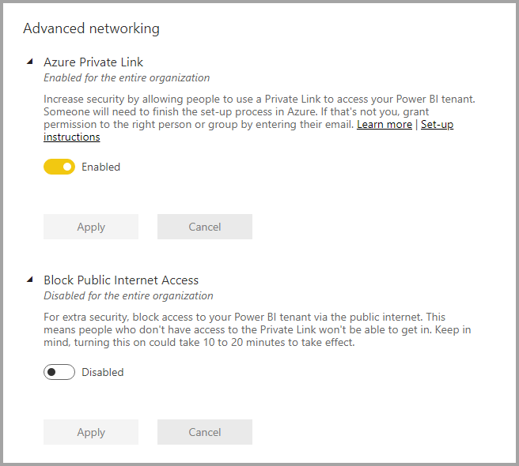
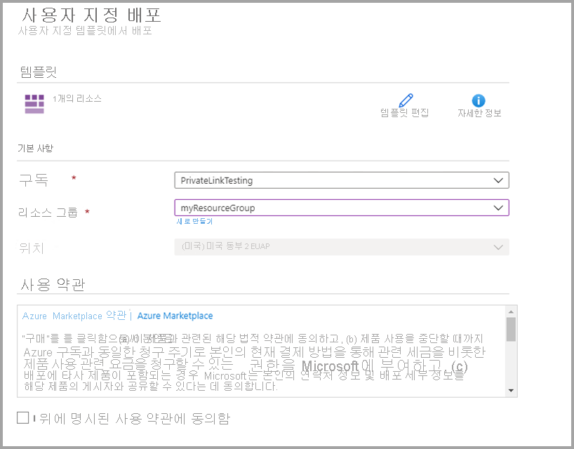
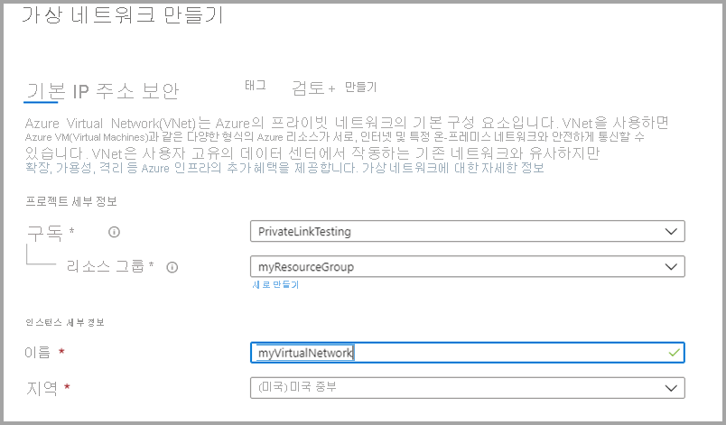
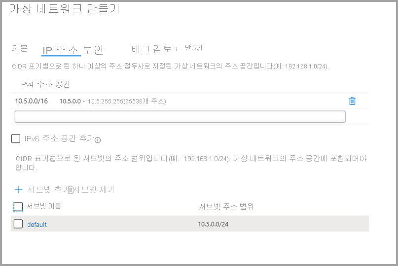
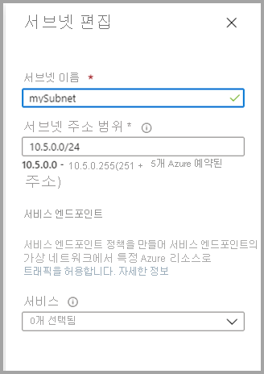
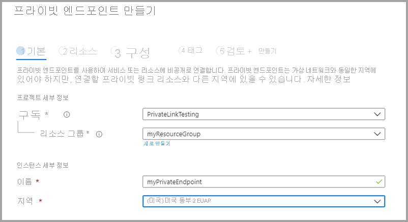
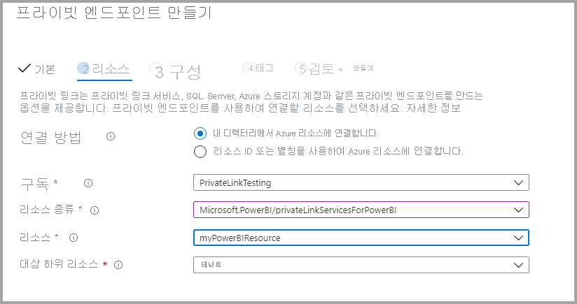
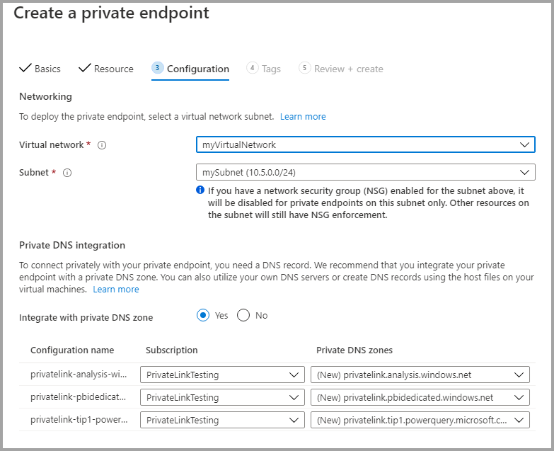

# <a name="private-links-for-accessing-power-bi"></a>Power BI 액세스를 위한 프라이빗 링크

Power BI에서 조직이 비공개로 Power BI에 액세스할 수 있도록 하는 엔드포인트를 구성 및 사용할 수 있습니다. 프라이빗 링크를 구성하려면 Power BI 관리자여야 하며, Azure에서 VM(Virtual Machines) 및 V-Net(가상 네트워크) 같은 리소스를 만들고 구성할 수 있는 권한이 있어야 합니다. 

프라이빗 링크에서 Power BI에 안전하게 액세스하기 위한 단계는 다음과 같습니다.

1. [Power BI에 대한 프라이빗 링크를 사용하도록 설정](#enable-private-links-for-power-bi)
2. [Azure Portal에서 Power BI 리소스 만들기](#create-a-power-bi-resource-in-the-azure-portal)
3. [가상 네트워크 만들기](#create-a-virtual-network)
4. [VM(가상 머신) 만들기](#create-a-virtual-machine-vm)
5. [프라이빗 엔드포인트 만들기](#create-a-private-endpoint)
6. [RDP(원격 데스크톱)를 사용하여 VM에 연결](#connect-to-a-vm-using-remote-desktop-rdp)
7. [가상 머신에서 비공개로 Power BI에 액세스](#access-power-bi-privately-from-the-vm)
8. [Power BI에 대한 공용 액세스를 사용하지 않도록 설정](#disable-public-access-for-power-bi)

다음 섹션에서는 각 단계에 대한 추가 정보를 제공합니다.

## <a name="enable-private-links-for-power-bi"></a>Power BI에 대한 프라이빗 링크를 사용하도록 설정

시작하려면 app.powerbi.com에서 관리자 권한으로 Power BI에 로그인하고 관리 포털로 이동합니다. **테넌트 설정**을 선택하고 **고급 네트워킹**으로 스크롤한 후, 다음 이미지에 보이는 것처럼 라디오 단추를 토글하여 **Azure Private Link**를 켭니다. 

테넌트의 프라이빗 링크를 구성하는 데 약 15분이 소요됩니다. 여기에는 Power BI 서비스와 비공개로 통신하기 위해 별도의 테넌트용 FQDN을 구성하는 것이 포함됩니다.



완료되면 다음 단계로 이동할 수 있습니다.

## <a name="create-a-power-bi-resource-in-the-azure-portal"></a>Azure Portal에서 Power BI 리소스 만들기

그런 다음 [Azure Portal](https://portal.azure.com)에 로그인하고 **Azure 템플릿**을 사용하여 Power BI 리소스를 만듭니다. 다음 표에 나와 있는 ARM 템플릿 예제의 매개 변수를 대체하여 Power BI 리소스를 만듭니다.


|**매개 변수**  |**값**  |
|---------|---------|
|```<resource-name>```    | myPowerBIResource         |
|```<tenant-object-id>```     | 52d40f65-ad6d-48c3-906f-1ccf598612d4         |

ARM 템플릿 만들기 

```
{
  "$schema": "http://schema.management.azure.com/schemas/2015-01-01/deploymentTemplate.json#",
  "contentVersion": "1.0.0.0",
  "parameters": {},
  "resources": [
      {
          "type":"Microsoft.PowerBI/privateLinkServicesForPowerBI",
          "apiVersion": "2020-06-01",
          "name" : "<resource-name>",
          "location": "global",
          "properties" : 
          {
               "tenantId": "<tenant-object-id>"
          }
      }
  ]
}
```

표시되는 대화 상자에서 사용 약관에 동의하는 확인란을 선택한 다음 **구매**를 선택합니다.




## <a name="create-a-virtual-network"></a>가상 네트워크 만들기

다음 단계는 가상 네트워크 및 서브넷을 만드는 것입니다. 가상 네트워크 및 서브넷을 만들려면 아래 표의 샘플 매개 변수를 자신의 것으로 바꿉니다.

| 매개 변수 |   값| 
|---------|---------|
| ```<resource-group-name>```   | myResourceGroup |
| ```<virtual-network-name>```  | myVirtualNetwork |
| ```<region-name>```   | 미국 중부  |
| ```<IPv4-address-space>```    | 10.1.0.0/16 |
| ```<subnet-name>```   | mySubnet |
| ```<subnet-address-range>```  | 10.1.0.0/24 |

1. 화면의 왼쪽 위에서 **리소스 만들기 > 네트워킹 > 가상 네트워크**를 차례로 선택하거나, 검색 상자에서 **가상 네트워크**를 검색합니다.
2. **가상 네트워크 만들기**의 **기본** 탭에서 다음 정보를 입력하거나 선택합니다.

    |설정 | 값 |
    |-------------------|---------|
    |**프로젝트 세부 정보**|
    |Subscription | Azure 구독 선택 |
    |리소스 그룹 |   **새로 만들기**를 선택하고, ```<resource-group-name>```을 입력한 다음, **확인**을 선택하거나 매개 변수를 기반으로 기존 ```<resource-group-name>```을 선택합니다. |
    |**인스턴스 세부 정보** |
    | 속성  | ```<virtual-network-name>```을 입력합니다. |
    |Region | ```<region-name>``` 선택 |
    
    다음 이미지는 **기본** 탭을 보여 줍니다.
    
    


3. 이제 **IP 주소** 탭을 선택하거나 양식 하단의 **다음: IP 주소 단추**를 선택합니다. IP 주소 탭에서 다음 정보를 입력합니다.

    |설정 | 값 |
    |-------------------|---------|
    |IPv4 주소 공간 |```<IPv4-address-space>```을 입력합니다. |
    
    
    

4. **서브넷 이름**에서 *기본값*을 선택하고 **서브넷 편집**에서 다음 정보를 입력합니다.

    |설정 | 값 |
    |-------------------|---------|
    | 서브넷 이름 |```<subnet-name>```을 입력합니다. |
    | 서브넷 주소 범위 | ```<subnet-address-range>```을 입력합니다. |
    
    
    

5. 그런 다음 **저장**을 선택한 후 **검토 + 만들기** 탭을 선택하거나 **검토 + 만들기** 단추를 선택합니다. 

6. 그런 다음 **만들기**를 선택합니다.

이러한 단계를 완료한 후에는 다음 섹션에 설명된 대로 VM(가상 머신)을 만들 수 있습니다.

## <a name="create-a-virtual-machine-vm"></a>VM(가상 머신) 만들기


다음 단계는 가상 네트워크 및 VM(가상 머신)을 호스트하는 서브넷을 만드는 것입니다.

1. Azure Portal 화면의 왼쪽 위에서 **리소스 만들기 > 컴퓨팅 > 가상 머신**을 선택합니다.

2. **가상 머신 만들기 - 기본**에서 다음 정보를 입력하거나 선택합니다.

    |설정 | 값 |
    |-------------------|---------|
    |**프로젝트 세부 정보**||
    |Subscription | Azure 구독 선택 |
    |리소스 그룹 |   이전 섹션에서 만든 **myResourceGroup**을 선택합니다. |
    |**인스턴스 세부 정보** ||
    |속성 | **myVm**을 입력합니다. |
    |Region | **미국 중부**를 선택합니다. |
    |가용성 옵션| 기본값인 **인프라 중복이 필요하지 않습니다.** 를 그대로 둡니다. |
    |이미지 | **Windows 10 Pro**를 선택합니다. |
    |크기 | 기본값인 **표준 DS1 v2**를 그대로 둡니다. |
    |관리자 계정 ||
    |사용자 이름 |선택한 사용자 이름을 입력합니다. |
    |암호 | 선택한 암호를 입력합니다. 암호는 12자 이상이어야 하며 [정의된 복잡성 요구 사항](/azure/virtual-machines/windows/faq#what-are-the-password-requirements-when-creating-a-vm)을 충족해야 합니다. |
    |암호 확인 | 암호를 다시 입력합니다. |
    |인바운드 포트 규칙 ||
    |공용 인바운드 포트 | 기본값인 **없음**을 그대로 둡니다. |
    |비용 절감 ||
    |이미 Windows 라이선스가 있나요? |  기본값인 **아니요**를 그대로 둡니다. |

3. 그런 다음, **Next: 디스크**를 선택합니다.
4. **가상 머신 만들기 - 디스크**에서 기본값을 그대로 두고 **다음: 네트워킹**을 선택합니다.
5. **가상 머신 만들기 - 네트워킹**에서 다음 정보를 선택합니다.

    |설정 | 값 |
    |-------------------|---------|
    |가상 네트워크|   기본값인 **MyVirtualNetwork**를 그대로 둡니다.|
    |주소 공간| 기본값인 **10.1.0.0/24**를 그대로 둡니다.|
    |서브넷 |기본값인 **mySubnet(10.1.0.0/24)** 을 그대로 둡니다.|
    |공용 IP| 기본값 **(신규) myVm-ip**를 그대로 둡니다.|
    |공용 인바운드 포트|  **선택한 포트 허용**을 선택합니다.|
    |인바운드 포트 선택|  **RDP**를 선택합니다.|

6. **검토 + 만들기**를 선택합니다. **검토 + 만들기** 페이지로 이동됩니다. 여기서 구성이 유효한지 검사됩니다.
7. **유효성 검사 통과** 메시지가 표시되면 **만들기**를 선택합니다.


## <a name="create-a-private-endpoint"></a>프라이빗 엔드포인트 만들기

이 섹션에서 설명하는 다음 단계는 Power BI의 프라이빗 엔드포인트를 만드는 것입니다.

1. Azure Portal 화면의 왼쪽 위에서 **리소스 만들기 > 네트워킹 > Private Link 센터(미리 보기)** 를 선택합니다.
2. **프라이빗 링크 센터 - 개요**의 **서비스에 대한 프라이빗 연결 구축** 옵션에서 **프라이빗 엔드포인트 만들기**를 선택합니다.
3. **프라이빗 엔드포인트 만들기(미리 보기) - 기본**에서 다음 정보를 입력하거나 선택합니다.

    |설정 | 값 |
    |-------------------|---------|
    |**프로젝트 세부 정보** ||
    |Subscription|  Azure 구독 선택|
    |리소스 그룹|    **myResourceGroup**을 선택합니다. 이전 섹션에서 만든 것입니다.|
    |**인스턴스 세부 정보** ||
    |속성|  *myPrivateEndpoint*를 입력합니다. 이 이름을 사용하는 경우 고유한 이름을 만듭니다.|
    |Region|    **미국 중부**를 선택합니다.|
    
    다음 이미지는 **프라이빗 엔드포인트 만들기 - 기본** 창을 보여 줍니다.
    
    

4. 위 정보가 완료되면 **다음: 리소스** 및 **프라이빗 엔드포인트 만들기 - 리소스** 페이지에서 다음 정보를 입력하거나 선택합니다.

    |설정 | 값 |
    |-------------------|---------|
    |연결 방법| “내 디렉터리의 Azure 리소스에 연결”을 선택합니다.|
    |구독|  구독 선택|
    |리소스 종류| **Microsoft.PowerBI/privateLinkServicesForPowerBI**를 선택합니다. |
    |리소스|  myPowerBIResource|
    |대상 하위 리소스|   테넌트|
    
    다음 이미지는 **프라이빗 엔드포인트 만들기 - 리소스** 창을 보여 줍니다.
    
    

5. 위 정보를 적절히 입력했으면 **다음: 구성**을 선택하고 **프라이빗 엔드포인트 만들기(미리 보기) - 구성**에서 다음 정보를 입력하거나 선택합니다.

    |설정 | 값 |
    |-------------------|---------|
    |**네트워킹** ||
    |가상 네트워크|   *myVirtualNetwork*를 선택합니다. |
    |서브넷 |*mySubnet*을 선택합니다. |
    |**프라이빗 DNS 통합** ||
    |프라이빗 DNS 영역과 통합|   **예**를 선택합니다. |
    |프라이빗 DNS 영역   |선택 <br> *(New)privatelink.analysis.windows.net* <br> *(New)privatelink.pbidedicated.windows.net* <br> *(New)privatelink.tip1.powerquery.microsoft.com* |
    
    다음 이미지는 **프라이빗 엔드포인트 만들기 - 구성** 창을 보여 줍니다.
    
    
    
    이제 **검토 + 만들기**를 선택합니다. 그러면 Azure가 구성의 유효성을 검사하는 **검토 + 만들기** 페이지가 표시됩니다. **유효성 검사 통과** 메시지가 표시되면 **만들기**를 선택합니다.

## <a name="connect-to-a-vm-using-remote-desktop-rdp"></a>RDP(원격 데스크톱)를 사용하여 VM에 연결

**myVM**이라는 가상 머신을 만들었으면 다음 단계를 사용하여 인터넷에서 여기에 연결합니다.

1. 포털의 검색 창에 *myVm*을 입력합니다.
2. **연결** 단추를 선택합니다. **연결** 단추를 선택하면 **가상 머신에 연결**이 열립니다.
3. **RDP 파일 다운로드**를 선택합니다. Azure에서 원격 데스크톱 프로토콜( .rdp) 파일을 만들고, 컴퓨터에 다운로드합니다.
4. 다운로드한 rdp 파일을 엽니다.
5. 메시지가 표시되면 **연결**을 선택합니다.
6. 이전 단계에서 VM을 만들 때 지정한 사용자 이름과 암호를 입력합니다.
7. **확인**을 선택합니다.
8. 로그인 프로세스 중에 인증서 경고가 나타날 수 있습니다. 인증서 경고가 표시되면 **예** 또는 **계속**을 선택합니다.

## <a name="access-power-bi-privately-from-the-vm"></a>VM에서 비공개로 Power BI에 액세스

이제 다음과 같은 단계를 사용하여 이전 단계에서 만든 가상 머신에서 비공개로 Power BI에 액세스합니다. 

1. myVM의 원격 데스크톱에서 PowerShell을 엽니다.
2. nslookup 52d40f65ad6d48c3906f1ccf598612d4-api.privatelink.analysis.windows.net을 입력합니다.
3. 다음과 유사한 메시지가 표시됩니다.

    ```
    Server:  UnKnown
    Address:  168.63.129.16
    
    Non-authoritative answer:
    Name:    52d40f65ad6d48c3906f1ccf598612d4-api.privatelink.analysis.windows.net
    Address:  10.1.0.4
    ```

4. 브라우저를 열고 app.powerbi.com으로 이동하여 비공개로 Power BI에 액세스합니다.

## <a name="disable-public-access-for-power-bi"></a>Power BI에 대한 공용 액세스를 사용하지 않도록 설정

마지막으로 Power BI에 대한 공용 액세스를 사용하지 않도록 설정해야 합니다. 

app.powerbi.com에 관리자 권한으로 로그인하고 **관리 포털**로 이동합니다. **테넌트 설정**을 선택하고 **고급 네트워킹** 섹션으로 스크롤합니다. 다음 이미지에서와같이 **공용 인터넷 액세스 차단** 섹션에서 토글 단추를 사용하도록 설정합니다. 시스템에서 조직이 공용 인터넷을 통해 Power BI에 액세스하지 못하도록 설정하는 데 약 15분이 걸립니다.

또한 이러한 단계가 완료되면, 프라이빗 링크를 통해서만 조직의 Power BI에 액세스할 수 있으며 공용 인터넷에서는 액세스할 수 없습니다. 

## <a name="considerations-and-limitations"></a>고려 사항 및 제한 사항

Power BI에서 프라이빗 링크를 사용하여 작업하는 동안 유의해야 할 몇 가지 고려 사항이 있습니다.

* 프라이빗 링크 환경을 사용하는 동안에는 외부 이미지 또는 테마를 사용할 수 없으며, 사용 시 사용자 지정 시각적 개체에 영향이 미칠 수 있습니다.
* 프라이빗 링크 환경을 사용하는 동안에는 PDF로 내보내기, 보고서에서 Excel로 내보내기 등의 내보내기 서비스 및 기타 내보내기 서비스가 작동하지 않습니다.
* 일반적으로 RDL 파일(*.rdl 형식 파일)이라고 알려진 SQL Server Reporting Services 보고서는 프라이빗 링크 환경에서 렌더링되지 않습니다.
* 인터넷 액세스를 사용하지 않고 데이터 세트 또는 데이터 흐름이 데이터 원본인 Power BI 데이터 세트 또는 데이터 흐름에 연결하는 경우 연결이 실패합니다.


## <a name="next-steps"></a>다음 단계

- [조직에서 Power BI 관리](service-admin-administering-power-bi-in-your-organization.md)  
- [Power BI 관리자 역할 이해](service-admin-role.md)  
- [조직에서 Power BI 감사](service-admin-auditing.md)  

궁금한 점이 더 있나요? [Power BI 커뮤니티에 질문합니다.](https://community.powerbi.com/)
