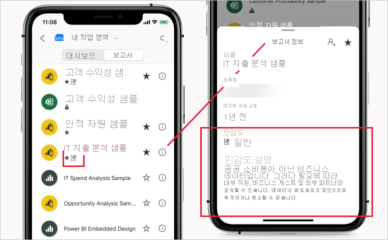

# Power BI의 민감도 레이블

이 문서에서는 Power BI의 [Microsoft Information Protection 민감도 레이블](https://docs.microsoft.com/microsoft-365/compliance/sensitivity-labels?view=o365-worldwide) 기능에 대해 설명합니다. Power BI 보고서, 대시보드, 데이터 세트 및 데이터 흐름에 민감도 레이블을 적용하는 방법에 대한 자세한 내용은 [Power BI에서 민감도 레이블을 적용하는 방법](./service-security-apply-data-sensitivity-labels.md)을 참조하세요. 테넌트에서 민감도 레이블을 사용하는 방법에 대한 자세한 내용은 [Power BI에서 데이터 민감도 레이블 사용](service-security-enable-data-sensitivity-labels.md)을 참조하세요.

Microsoft Information Protection 민감도 레이블은 사용자가 생산성이나 협업 기능을 저해하지 않고 Power BI에서 중요한 콘텐츠를 분류할 수 있는 간단한 방법을 제공합니다.

민감도 레이블은 데이터 세트, 보고서, 대시보드 및 데이터 흐름에만 적용할 수 있습니다. Power BI에서 Excel이나 PowerPoint 또는 PDF 파일로 데이터를 내보내면 Power BI에서는 내보낸 파일에 대해 자동으로 민감도 레이블을 적용하고 레이블의 파일 암호화 설정에 따라 보호합니다. 이러한 방식으로 중요한 데이터는 어디에 있든 관계없이 보호되는 상태로 유지됩니다.

Power BI 보고서, 대시보드, 데이터 세트 및 데이터 흐름에 적용되는 민감도 레이블은 Power BI 서비스의 여러 위치에서 볼 수 있습니다. 보고서 및 대시보드에 대한 민감도 레이블은 Power BI iOS 및 Android 모바일 앱과 포함된 시각적 개체에서도 표시됩니다.

Power BI 관리 포털에서 사용할 수 있는 [보호 메트릭 보고서](service-security-data-protection-metrics-report.md)를 통해 Power BI 관리자는 Power BI 테넌트의 중요한 데이터를 전체적으로 확인할 수 있습니다. 또한 Power BI 감사 로그에는 레이블 적용, 제거, 변경과 같은 활동에 대한 민감도 레이블 정보뿐만 아니라 보고서나 대시보드 보기 및 모니터링, 조사, 보안 경고의 목적으로 Power BI 및 보안 관리자에게 중요한 데이터 소비에 대한 가시성 제공하기와 같은 활동에 대한 정보도 포함됩니다.

## 중요 고려 사항

민감도 레이블 지정은 Power BI 내의 콘텐츠에 대한 액세스에는 영향을 주지 **않습니다**. Power BI 내의 콘텐츠에 대한 액세스는 Power BI 사용 권한으로만 관리됩니다. 레이블이 표시되는 동안 연결된 모든 암호화 설정([Microsoft 365 보안 센터](https://security.microsoft.com/) 또는 [Microsoft 365 준수 센터](https://compliance.microsoft.com/)에서 구성)이 적용되지 않습니다. 이러한 설정은 Excel, PowerPoint 및 PDF 파일로 내보낸 데이터에만 적용됩니다.

민감도 레이블 및 파일 암호화는 Excel, PowerPoint 및 PDF로 내보내기 이외의 내보내기 경로에는 적용되지 **않습니다**. Power BI 테넌트 관리자는 민감도 레이블 및 관련 파일 암호화 설정의 적용을 지원하지 않는 모든 내보내기 경로를 사용하지 않도록 설정할 수 있습니다.

>[!NOTE]
> 보고서에 대한 액세스 권한이 부여된 사용자에게는 [RLS(행 수준 보안)](./service-admin-rls.md)가 액세스를 제한하지 않는 한 전체 기본 데이터 세트에 대한 액세스 권한이 부여됩니다. 보고서 작성자는 민감도 레이블을 사용하여 보고서를 분류하고 레이블을 지정할 수 있습니다. 민감도 레이블에 보호 설정이 있는 경우 Power BI는 보고서 데이터를 Excel, PowerPoint 또는 PDF 파일로 내보낼 때 이러한 보호 설정을 적용합니다. 보호된 파일은 권한 있는 사용자만 열 수 있습니다.

## Power BI에서 민감도 레이블 작동 방식

Power BI 대시보드, 보고서, 데이터 세트 또는 데이터 흐름에 민감도 레이블을 적용하는 경우 다음과 같은 이점을 제공하는 태그를 해당 리소스에 적용하는 것과 비슷합니다.
* **사용자 지정 가능** - 조직에 있는 다양한 수준의 중요한 콘텐츠를 위해 개인, 공용, 일반, 기밀, 매우 기밀 등의 범주를 만들 수 있습니다.
* **일반 텍스트** - 레이블은 일반 텍스트로 작성되므로 사용자가 민감도 레이블 지침에 따라 콘텐츠 처리 방법을 쉽게 이해할 수 있습니다.
* **영구적** - 민감도 레이블이 콘텐츠에 적용된 후에는 Excel, PowerPoint 및 PDF 파일로 내보낼 때 해당 콘텐츠를 포함하며 정책을 적용하기 위한 기초가 됩니다.

Power BI의 민감도 레이블이 작동하는 방식의 빠른 예제는 다음과 같습니다. 아래 이미지는 Power BI 서비스에서 보고서에 민감도 레이블이 적용되는 방법, 그런 다음 보고서의 데이터를 Excel 파일로 내보내는 방법, 마지막으로 민감도 레이블 및 해당 보호가 내보낸 파일에서 유지되는 방법을 보여 줍니다.

Microsoft Office 애플리케이션에서 민감도 레이블은 위의 이미지에 표시된 바와 같이 메일 또는 문서의 태그로 표시됩니다.

Power BI 전체에서 콘텐츠를 사용 및 공유할 때 콘텐츠와 함께 이동하고 지속되는 분류를 스티커처럼 콘텐츠에 할당할 수도 있습니다. 이 분류를 사용하여 사용량 리포지토리 보고서를 생성하고 중요한 콘텐츠의 활동 데이터를 볼 수 있습니다. 이 정보에 따라 나중에 언제든지 보호 설정을 적용하도록 선택할 수 있습니다.

## 새 콘텐츠를 만들 때 민감도 레이블 상속

Power BI 서비스에서 만드는 새 보고서 및 대시보드는 이전에 부모 데이터 세트 또는 보고서에 적용된 민감도 레이블을 자동으로 상속합니다. 예를 들어 “극비” 민감도 레이블이 있는 데이터 세트를 기반으로 생성된 새 보고서에도 자동으로 “극비” 레이블이 지정됩니다.

다음 이미지는 데이터 세트의 민감도 레이블이 데이터 세트를 기반으로 구축된 새 보고서에 자동으로 적용되는 방법을 보여 줍니다.

>[!NOTE]
>어떤 이유로든 새 보고서 또는 대시보드에 민감도 레이블을 적용할 수 없는 경우 Power BI에서는 새 항목 생성을 **차단하지 않습니다**.

## 내보낸 데이터에 대한 민감도 레이블 및 보호

Power BI에서 Excel이나 PowerPoint 또는 PDF 파일로 데이터를 내보내면 Power BI에서는 내보낸 파일에 대해 자동으로 민감도 레이블을 적용하고 레이블의 파일 암호화 설정에 따라 보호합니다. 이러한 방식으로 중요한 데이터는 어디에 있든 관계없이 보호되는 상태로 유지됩니다.

Power BI에서 파일을 내보내는 사용자는 민감도 레이블 설정에 따라 해당 파일에 대한 액세스 및 편집 권한을 갖습니다. 파일에 대한 소유자 권한은 가지지 않습니다.

데이터를 .csv 또는 .pbix 파일, Excel의 분석 또는 다른 내보내기 경로로 내보낼 때는 민감도 레이블 및 보호가 적용되지 않습니다.

내보낸 파일에 민감도 레이블 및 보호를 적용해도 콘텐츠 표시가 파일에 추가되지 않습니다. 그러나 레이블이 콘텐츠 표시를 적용하도록 구성된 경우에는 Office 데스크톱 앱에서 해당 파일을 열 때 Azure Information Protection 통합 레이블 지정 클라이언트에 의해 표시가 자동으로 적용됩니다. 데스크톱, 모바일 또는 웹앱에 대해 기본 제공 레이블을 사용하는 경우 콘텐츠 표시가 자동으로 적용되지 않습니다. 자세한 내용은 [Office 앱에서 콘텐츠 표시 및 암호화를 적용할 때](https://docs.microsoft.com/microsoft-365/compliance/sensitivity-labels-office-apps?view=o365-worldwide#when-office-apps-apply-content-marking-and-encryption)를 참조하세요.

데이터를 파일로 내보낼 때 레이블을 적용할 수 없는 경우 내보내기가 실패합니다. 레이블을 적용할 수 없어 내보내기가 실패했는지 확인하려면 제목 표시줄의 가운데에 있는 보고서 또는 대시보드 이름을 클릭하면 열리는 정보 드롭다운에 “민감도 레이블을 로드할 수 없습니다”라는 메시지가 표시되는지 확인합니다. 이는 임시 시스템 문제의 결과로 발생하거나 보안 관리자가 적용된 레이블을 게시 취소 또는 삭제한 경우 발생할 수 있습니다.

## 포함된 보고서 및 대시보드의 민감도 레이블 지속성

Microsoft Teams 및 SharePoint 같은 비즈니스 애플리케이션이나 조직의 웹 사이트에 Power BI 보고서, 대시보드 및 시각적 개체를 포함할 수 있습니다. 민감도 레이블이 적용된 시각적 개체, 보고서 또는 대시보드를 포함하면 포함된 뷰에 민감도 레이블이 표시되고 데이터를 Excel로 내보내면 레이블과 해당 보호가 지속됩니다.

다음과 같은 포함 시나리오가 지원됩니다.
* [조직에 포함](../developer/embedded/embed-sample-for-your-organization.md)
* Microsoft 365 앱(예: [Teams](../collaborate-share/service-collaborate-microsoft-teams.md) 및 [SharePoint](../collaborate-share/service-embed-report-spo.md))
* [보안 URL 포함](../collaborate-share/service-embed-secure.md)(Power BI 서비스에서 포함) 

## Power BI 모바일 앱의 민감도 레이블

Power BI 모바일 앱에서 보고서 및 대시보드에 대한 민감도 레이블을 볼 수 있습니다. 보고서 또는 대시보드의 이름 근처에 있는 아이콘은 민감도 레이블이 있으며 레이블 및 해당 설명의 유형을 보고서 또는 대시보드 정보 상자에서 찾을 수 있음을 나타냅니다.

## 지원되는 클라우드
민감도 레이블은 글로벌(퍼블릭) 클라우드에만 지원되고, 국가 클라우드와 같은 클라우드의 테넌트에서는 지원되지 않습니다.

## Power BI에서 민감도 레이블을 사용하기 위한 요구 사항

Power BI에서 민감도 레이블을 사용하도록 설정하고 사용하려면 먼저 다음 필수 조건을 충족해야 합니다.
* [Microsoft 365 보안 센터](https://security.microsoft.com/) 또는 [Microsoft 365 규정 준수 센터](https://compliance.microsoft.com/)에서 민감도 레이블을 정의했는지 확인합니다.
* Power BI에서 [민감도 레이블을 사용](service-security-enable-data-sensitivity-labels.md)합니다.
* 사용자에게 [적절한 라이선스](#licensing)가 있는지 확인합니다.

## 라이선싱

* Power BI에서 Microsoft Information Protection 민감도 레이블을 적용하고 보려면 Azure Information Protection Premium P1 또는 Premium P2 라이선스가 필요합니다. Microsoft Azure Information Protection은 독립 실행형으로 구입하거나 Microsoft 라이선스 제품군 중 하나를 통해 구입할 수 있습니다. 자세한 내용은 [Azure Information Protection 가격 책정](https://azure.microsoft.com/pricing/details/information-protection/)을 참조하세요.
* Office 앱에서 레이블을 보고 적용하려면 [라이선스 요구 사항](https://docs.microsoft.com/microsoft-365/compliance/get-started-with-sensitivity-labels#subscription-and-licensing-requirements-for-sensitivity-labels)을 충족해야 합니다.
* Power BI 콘텐츠에 레이블을 적용하려면 사용자에게 위에서 언급한 Azure Information Protection 라이선스 외에도 Power BI Pro 라이선스가 있어야 합니다.

## 민감도 레이블 만들기 및 관리

민감도 레이블은 [Microsoft 365 보안 센터](https://security.microsoft.com/) 또는 [Microsoft 365 규정 준수 센터](https://compliance.microsoft.com/)에서 만들고 관리합니다.

두 센터 중 하나에서 민감도 레이블에 액세스하려면 **분류 > 민감도 레이블**로 이동합니다. 이러한 민감도 레이블은 Azure Information Protection, Office 앱, Office 365 서비스 등의 여러 Microsoft 서비스에서 사용할 수 있습니다.

>[!Important]
> 조직에서 Azure Information Protection 민감도 레이블을 사용하는 경우 Power BI에서 레이블을 사용하려면 이전에 나열된 서비스 중 하나로 [마이그레이션](https://docs.microsoft.com/azure/information-protection/configure-policy-migrate-labels)해야 합니다.

## 제한 사항

다음 목록은 Power BI에서 민감도 레이블의 몇 가지 제한 사항입니다.

* 민감도 레이블은 대시보드, 보고서, 데이터 세트 및 데이터 흐름에만 적용할 수 있습니다. 현재, [페이지를 매긴 보고서](../paginated-reports/report-builder-power-bi.md) 및 통합 문서에서는 민감도 레이블을 사용할 수 없습니다.
* Power BI 자산의 민감도 레이블은 작업 영역 목록, 계보, 즐겨찾기, 최근 항목 및 앱에 표시됩니다. 현재 “공유한 항목” 보기에는 레이블이 표시되지 않습니다. 그러나 Power BI 자산에 적용된 레이블은 표시되지 않는 경우에도 Excel, PowerPoint 및 PDF 파일로 내보낸 데이터에 항상 유지됩니다.
* 템플릿 앱에 대해서는 데이터 민감도 레이블이 지원되지 않습니다. 앱이 추출되고 설치될 때 템플릿 앱 작성자가 설정한 민감도 레이블은 제거되고 앱 소비자가 설치된 템플릿 앱의 아티팩트에 추가한 민감도 레이블은 앱이 업데이트될 때 손실됩니다(nothing으로 다시 설정됨).
* Power BI는 [전달 금지](https://docs.microsoft.com/microsoft-365/compliance/encryption-sensitivity-labels?view=o365-worldwide#let-users-assign-permissions), [사용자 정의](https://docs.microsoft.com/microsoft-365/compliance/encryption-sensitivity-labels?view=o365-worldwide#let-users-assign-permissions) 및 [HYOK](https://docs.microsoft.com/azure/information-protection/configure-adrms-restrictions) 보호 유형의 민감도 레이블을 지원하지 않습니다. 전달 금지 및 사용자 정의 보호 유형은 [Microsoft 365 보안 센터](https://security.microsoft.com/) 또는 [Microsoft 365 준수 센터](https://compliance.microsoft.com/)에 정의된 레이블을 참조합니다.
* 사용자가 Power BI 내에서 부모 레이블을 적용하는 것을 허용하지 않는 것이 좋습니다. 부모 레이블이 콘텐츠에 적용되는 경우 해당 콘텐츠에서 파일(Excel, PowerPoint 및 PDF)로 데이터 내보내기가 실패합니다. [하위 레이블(그룹화 레이블)](https://docs.microsoft.com/microsoft-365/compliance/sensitivity-labels?view=o365-worldwide#sublabels-grouping-labels)을 참조하세요.

## 다음 단계

이 문서에서는 Power BI의 데이터 보호에 대해 간략하게 설명했습니다. 다음 문서에서는 Power BI의 데이터 보호에 대해 자세히 설명합니다. 

* [Power BI에서 민감도 레이블 사용](service-security-enable-data-sensitivity-labels.md)
* [Power BI에서 민감도 레이블을 적용하는 방법](service-security-apply-data-sensitivity-labels.md)
* [Power BI에서 Microsoft Cloud App Security 제어 사용](service-security-using-microsoft-cloud-app-security-controls.md)
* [보호 메트릭 보고서](service-security-data-protection-metrics-report.md)