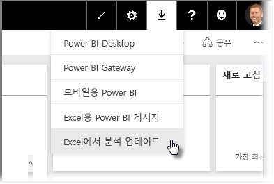
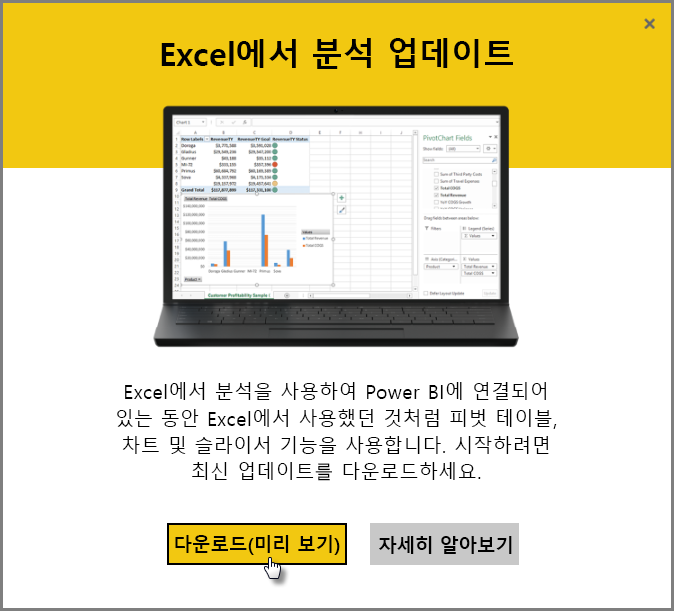
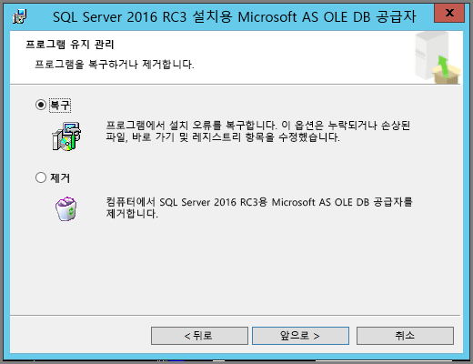
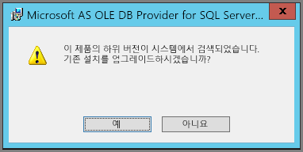

# Excel에서 분석 문제 해결

Excel에서 분석을 사용할 때 예기치 않은 결과를 얻거나 기능이 예상대로 작동하지 않는 경우가 있을 수 있습니다. 이 페이지에서는 Excel에서 분석을 사용할 때 일반적인 문제에 대한 해결 방법을 제공합니다.

> [!NOTE]
> [Excel에서 분석](service-analyze-in-excel.md)을 설명하고 사용하도록 설정하는 별도의 전용 페이지가 제공됩니다.
> 
> 아래 나열되어 있지 않은 시나리오가 발생하고 문제를 발생시킨 경우 [커뮤니티 사이트](https://community.powerbi.com/)에 추가 지원을 요청하거나 [지원 티켓](https://powerbi.microsoft.com/support/)을 만들 수 있습니다.
> 
> 

이 문서는 다음과 같은 문제 해결 섹션을 포함합니다.

* OLE DB 공급자에 대한 Excel 라이브러리 업데이트
* Excel 라이브러리를 업데이트해야 하는지 여부 결정
* 연결할 수 없음 오류
* 사용할 수 없음 오류
* 데이터 모델 없음
* 토큰 만료 오류
* 온-프레미스 Analysis Services에 액세스할 수 없음
* 피벗 테이블 값 영역으로 아무것도 끌어올 수 없음(측정값 없음)

## OLE DB 공급자에 대한 Excel 라이브러리 업데이트
**Excel에서 분석**을 사용하려면 컴퓨터에 최신 AS OLE DB 공급자가 설치되어 있어야 합니다. 이 [커뮤니티 게시물](https://community.powerbi.com/t5/Service/Analyze-in-Excel-Initialization-of-the-data-source-failed/m-p/30837#M8081)은 OLE DB 공급자의 설치를 확인하거나 최신 버전을 다운로드하는 데 훌륭한 소스입니다.

Excel 라이브러리는 비트 수준 측면에서 Windows 버전과 일치해야 합니다. 64비트 Windows가 설치되어 있으면 64비트 OLE DB 공급자를 설치해야 합니다.

최신 Excel 라이브러리를 다운로드하려면 Power BI를 방문하고 Power BI 서비스의 오른쪽 위에서 **아래쪽 화살표**를 선택한 다음 **Excel에서 분석 업데이트**를 선택합니다.

나타나는 대화 상자에서 **다운로드(미리 보기)** 를 선택합니다.

## Excel 라이브러리를 업데이트해야 하는지 여부 결정
이전 섹션의 링크에서 최신 버전의 Excel OLE DB 공급자 라이브러리를 다운로드할 수 있습니다. 해당 OLD DB 공급자 라이브러리를 다운로드하고 설치를 시작한 후에는 현재 설치된 버전에 대한 확인이 수행됩니다.

Excel OLE DB 공급자 클라이언트 라이브러리가 최신 상태이면 다음과 같은 대화 상자가 표시됩니다.

또는 컴퓨터에 있는 버전보다 최신 버전을 설치하는 경우 다음 대화 상자가 나타납니다.

업그레이드할지 묻는 대화 상자가 표시되면 설치를 계속하여 컴퓨터에 설치된 OLE DB 공급자의 최신 버전을 가져와야 합니다.

## 연결할 수 없음 오류
*연결할 수 없음* 오류의 주요 원인은 컴퓨터의 OLE DB 공급자 클라이언트 라이브러리가 최신이 아니기 때문입니다. 올바른 업데이트를 확인하는 방법과 다운로드 링크에 대한 자세한 내용은 이 문서의 앞부분에 있는 **OLE DB 공급자에 대한 Excel 라이브러리 업데이트**를 참조하세요.

## 사용할 수 없음 오류
일부 사용자는 두 개 이상의 Power BI 계정을 보유하며 Excel에서 기존 자격 증명을 사용하여 Power BI에 연결을 시도하는 경우, 액세스하려는 데이터 세트 또는 보고서에 액세스할 권한이 없는 자격 증명을 사용할 수 있습니다.

이 경우 **사용할 수 없음**이라는 오류가 발생할 수 있으며 해당 데이터 세트에 대한 권한이 없는 자격 증명으로 Power BI에 로그인했을 수 있습니다. **사용할 수 없음** 오류가 발생한 후 자격 증명을 입력하라는 메시지가 표시되면 사용하려는 데이터 세트에 대한 권한이 있는 자격 증명을 사용하세요.

오류가 계속 발생하는 경우 권한이 있는 계정으로 Power BI에 로그인하고 Excel에서 액세스를 시도 중인 Power BI의 해당 데이터 세트를 보고 액세스할 수 있는지 확인합니다.

## 데이터 모델 없음
**OLAP 큐브 모델을 찾을 수 없음** 오류가 발생하는 경우 액세스를 시도하는 데이터 세트에 데이터 모델이 없으므로 Excel에서 분석할 수 없습니다.

## 토큰 만료 오류
**토큰 만료** 오류가 발생하면 사용 중인 컴퓨터에서 **Excel에서 분석** 기능을 최근에 사용하지 않은 것입니다. 자격 증명을 다시 입력하거나 파일을 다시 열기만 하면 오류가 사라집니다.

## 온-프레미스 Analysis Services에 액세스할 수 없음
온-프레미스 Analysis Services 데이터에 연결된 데이터 세트에 액세스하려는 경우 오류 메시지가 발생할 수 있습니다. **Excel에서 분석**은 컴퓨터가 **Analysis Services** 서버와 같은 도메인에 있고 계정이 **Analysis Services** 서버에 액세스할 수 있는 한, 연결 문자열을 사용하여 온-프레미스 **Analysis Services**에서 데이터 세트 및 보고서에 연결하는 것을 지원합니다.

## 피벗 테이블 값 영역으로 아무것도 끌어올 수 없음(측정값 없음)
**Excel에서 분석**이 외부 OLAP 모델에 연결되면(Excel이 Power BI에 연결되는 방식), 모든 계산이 서버에서 수행되기 때문에 피벗 테이블의 **측정값**이 외부 모델에 정의되어야 합니다. 이것은 로컬 데이터 원본(예: Excel 테이블 또는 **Power BI Desktop**이나 **Power BI 서비스**의 데이터 세트)으로 작업하는 것과 다릅니다. 이런 경우 테이블 형식 모델을 로컬에서 사용할 수 있으며 데이터 모델에 저장되지 않고 동적으로 생성되는 측정값인 [암시적 측정값을 사용할 수 있습니다](https://support.microsoft.com/en-us/office/measures-in-power-pivot-86484821-a324-4da3-803b-82fd2e5033f4). 이런 경우 Excel에서의 동작은 **Power BI Desktop** 또는 **Power BI 서비스**에서의 동작과 다릅니다. Power BI에서 측정값으로 처리될 수 있는 데이터에 열이 있을 수 있지만 Excel에서 값(측정값)으로 사용될 수 없습니다.

이 문제를 해결하기 위한 옵션이 몇 가지 있습니다.

1. [**Power BI Desktop**에서 데이터 모델에 측정값](../transform-model/desktop-tutorial-create-measures.md)을 만든 다음, 데이터 모델을 **Power BI 서비스**에 게시하고 게시된 데이터 세트를 Excel에서 액세스합니다.
2. [Excel PowerPivot에서 데이터 모델에 측정값](https://support.office.com/article/Create-a-Measure-in-Power-Pivot-d3cc1495-b4e5-48e7-ba98-163022a71198)을 만듭니다.
3. 테이블만 포함된(데이터 모델은 없는) Excel 통합 문서에서 데이터를 가져온 경우에는, [테이블을 데이터 모델에 추가](https://support.office.com/article/Add-worksheet-data-to-a-Data-Model-using-a-linked-table-d3665fc3-99b0-479d-ba09-a37640f5be42)한 후에 바로 위에 있는 옵션 2의 단계에 따라 데이터 모델에 측정값을 만듭니다.

Power BI 서비스에서 모델에 측정값이 정의되면, Excel 피벗 테이블의 **값** 영역에서 측정값을 사용할 수 있게 됩니다.

## 다음 단계
[Excel에서 분석](service-analyze-in-excel.md)

[자습서: Power BI Desktop에서 고유한 측정값 만들기](../transform-model/desktop-tutorial-create-measures.md)

[PowerPivot의 측정값](https://support.microsoft.com/en-us/office/measures-in-power-pivot-86484821-a324-4da3-803b-82fd2e5033f4)

[PowerPivot에서 측정값 만들기](https://support.office.com/article/Create-a-Measure-in-Power-Pivot-d3cc1495-b4e5-48e7-ba98-163022a71198)

[연결된 테이블을 사용하여 데이터 모델에 워크시트 데이터 추가](https://support.office.com/article/Add-worksheet-data-to-a-Data-Model-using-a-linked-table-d3665fc3-99b0-479d-ba09-a37640f5be42)
