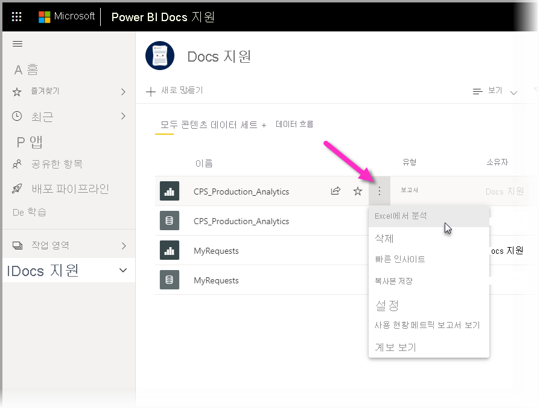
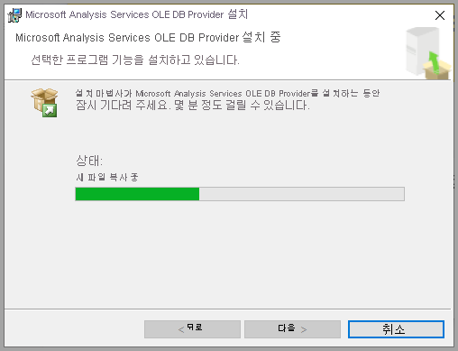

# Excel에서 분석
**Excel에서 분석**을 사용하면 Power BI 데이터 세트를 Excel로 가져온 다음 피벗 테이블, 차트, 슬라이서 및 기타 Excel 기능을 사용하여 데이터 세트를 보고 상호 작용할 수 있습니다. **Excel에서 분석**을 사용하려면 먼저 Power BI에서 이 기능을 다운로드하여 설치한 후 Excel에서 사용할 데이터 세트를 하나 이상 선택해야 합니다. 

이 문서에서는 Excel에서 분석을 설치 및 사용하는 방법을 보여 주고, 제한 사항을 설명하고, 몇 가지 다음 단계를 제공합니다. 다음 내용을 학습하게 됩니다.

* [Excel에서 분석 설치](#install-analyze-in-excel)
* [Power BI 데이터에 연결](#connect-to-power-bi-data)
* [Excel을 사용하여 데이터 분석](#use-excel-to-analyze-the-data)
* [통합 문서 저장 및 공유](#saving-and-sharing-your-new-workbook)
* [요구 사항](#requirements)

이제 설치 프로세스부터 시작하겠습니다.

## Excel에서 분석 설치

Power BI 서비스에서 제공하는 링크를 통해 **Excel에서 분석**을 설치해야 합니다. Power BI는 컴퓨터에 설치된 Excel 버전을 검색하여 적절한 버전(32비트 또는 64비트)을 자동으로 다운로드합니다. Power BI 서비스는 브라우저에서 실행됩니다. 다음 링크를 사용하여 Power BI에 로그인할 수 있습니다.

* [Power BI에 로그인](https://app.powerbi.com)

사용자가 로그인하고 브라우저에서 Power BI 서비스가 실행하면 오른쪽 위 모서리에서 **추가 옵션** 항목(...)을 선택한 다음 **다운로드 > Excel에서 분석 업데이트**를 선택합니다. 이 메뉴 항목은 Excel에서 분석 업데이트를 새로 설치하는 경우에 적용됩니다.

또는 Power BI 서비스에서 분석할 데이터 세트로 이동하여 데이터 세트, 보고서 또는 기타 Power BI 항목에 대한 **추가 옵션** 항목을 선택할 수 있습니다. 다음 이미지와 같이 표시되는 메뉴에서 **Excel에서 분석** 옵션을 선택합니다.

어떤 방법이든 Power BI가 Excel에서 분석이 설치되어 있는지 검색하고, 그렇지 않은 경우 다운로드하라는 메시지가 표시됩니다. 

다운로드를 선택하면 Power BI가 설치된 Excel 버전을 검색하여 적절한 버전의 Excel에서 분석 설치 관리자를 다운로드합니다. 브라우저 아래쪽에 다운로드 상태가 표시되거나 브라우저의 임의의 위치에 다운로드 진행률이 표시됩니다. 

다운로드가 완료되면 설치 관리자(.msi)를 실행하여 Excel에서 분석을 설치합니다. 설치 프로세스의 이름은 Excel에서 분석과 다릅니다. 다음 이미지에 표시된 것처럼 이 이름은 **Microsoft Analysis Services OLE DB Provider**입니다(또는 이와 비슷함).

설치가 완료되면 Power BI 서비스(또는 데이터 세트와 같은 다른 Power BI 데이터 요소)에서 보고서를 선택한 다음 Excel에서 분석할 수 있습니다.

## Power BI 데이터에 연결

Power BI 서비스에서 Excel로 분석할 데이터 세트 또는 보고서로 이동하고 **추가 옵션** 메뉴(...)를 선택하여 **Excel에서 분석** 메뉴 옵션을 찾습니다. 다음 그림에서는 보고서를 선택하는 방법을 보여 줍니다.

Power BI 서비스에서 Excel로 데이터 세트를 가져오는 몇 가지 단계가 있습니다.

1. **추가 옵션** 메뉴를 선택합니다.
2. 표시되는 메뉴 항목에서 **Excel에서 분석**을 선택합니다.

    그러면 Power BI 서비스가 **Excel에서 분석**에 사용하기 위해 디자인되고 구조화된 데이터 세트 파일(확장명 .ODC)을 만듭니다. 파일이 만들어진 다음 브라우저에서 자동으로 다운로드 프로세스를 시작합니다.
    
    
    
    파일 이름은 파일이 파생된 데이터 세트(또는 보고서, 기타 데이터 원본)과 일치합니다. 따라서 보고서 이름이 *Latest-Sales*라면 다운로드된 파일은 **Latest-Sales.ODC**가 됩니다.

3. .ODC 파일 시작

파일은 이미 **Excel에서 분석**과 연결되어 있으므로, .ODC 파일을 선택하거나 시작하면 Excel이 시작되어 자동으로 .ODC 파일을 로드하기 시작합니다. 그러나 외부 데이터 원본 위협에 대한 경고가 표시될 수 있습니다.

**Excel에서 분석**을 위해 .ODC 파일을 로드하도록 **사용**을 선택합니다. 그러면 Excel이 파일을 로드합니다. 

## Excel을 사용하여 데이터 분석

보안 알림에서 **사용**을 선택하여 .ODC 파일 로드를 허용하면 Excel이 분석할 준비가 된 Power BI 데이터 세트에서 **피벗 테이블** 및 **필드** 목록을 제공합니다.

.ODC 파일에는 Power BI에 있는 데이터 세트에 연결하는 MSOLAP 연결 문자열이 있습니다. 데이터를 분석하거나 작업하는 경우, Excel은 Power BI의 해당 데이터 세트를 쿼리하고 결과를 Excel로 반환합니다. 데이터 세트가 DirectQuery를 사용하여 라이브 데이터 원본에 연결된 경우 Power BI는 데이터 원본을 쿼리하고 결과를 Excel로 반환합니다.

이제 Power BI 데이터에 대한 연결이 설정되었으므로 Excel에서 로컬 데이터 세트를 사용하는 것처럼 피벗 테이블, 차트를 만들고 해당 데이터 세트를 분석할 수 있습니다.

**Excel에서 분석**은 다음과 같은 데이터 원본에 연결하는 데이터 세트 및 보고서에 특히 유용합니다.

* Analysis Services 테이블 형식 또는 다차원 데이터베이스
* DAX(Data Analysis Expressions)를 사용하여 만든 모델 측정값이 있는 데이터 모델을 사용하는 Power BI Desktop 파일 또는 Excel 통합 문서.

> [!IMPORTANT]
> **Excel에서 분석**에서는 데이터 세트에 대한 권한이 있는 사용자에게 모든 세부 수준 데이터가 노출됩니다.

Excel에서 분석을 사용할 때 고려해야 할 몇 가지 사항이 있습니다. 이를 위해 한두 가지 추가 단계가 필요합니다. 이러한 가능성은 다음 섹션에서 설명합니다. 

### Power BI에 로그인
브라우저에서 Power BI로 로그인했더라도 Excel에서 처음으로 새 .ODC 파일을 열면 Power BI 계정으로 Power BI에 로그인하라는 메시지가 나타날 수 있습니다. Excel에서 Power BI에 대한 연결을 인증합니다.

### Power BI 계정이 여러 개인 사용자
일부 사용자는 여러 개의 Power BI 계정이 있습니다. 이 경우 한 계정으로 Power BI에 로그인했지만 Excel에서 분석에 사용되는 데이터 세트에 대한 액세스 권한은 다른 계정에 있을 수 있습니다. 이런 상황이라면 Excel에서 분석 통합 문서에 사용되는 데이터 세트에 액세스를 시도할 경우 **사용할 수 없음** 오류가 발생하거나 로그인에 실패할 수 있습니다.

이 경우 다시 로그인할 수 있는 기회가 제공되며, 이 때 Excel에서 분석에서 액세스하는 데이터 세트에 대한 액세스가 있는 Power BI 계정으로 로그인할 수 있습니다. Excel 맨 위에 있는 리본에서 사용자 이름을 선택하여 현재 로그인한 계정을 확인할 수도 있습니다. 로그아웃하고 다른 계정으로 다시 로그인합니다.

## 새 통합 문서 저장 및 공유

Power BI 데이터 세트를 사용하여 만든 Excel 통합 문서는 다른 통합 문서와 마찬가지로 **저장**할 수 있습니다. 하지만 테이블에 데이터가 있거나 데이터 모델이 있는 Power BI에 통합 문서를 게시하거나 가져올 수만 있기 때문에, Power BI로 통합 문서를 다시 가져오거나 게시할 수는 없습니다. 새 통합 문서는 Power BI에 있는 데이터 세트에 대한 연결만을 포함하기 때문에, 그 문서를 Power BI에 가져오면 연결이 맴돌게 됩니다.

통합 문서가 저장되면 조직에서 다른 Power BI 사용자와 공유할 수 있습니다. 

통합 문서를 공유 받은 사용자가 통합 문서를 열면, 피벗 테이블과 데이터는 공유한 사용자가 통합 문서를 마지막으로 저장한 상태로 표시됩니다. 하지만 이것은 데이터의 최신 버전이 아닐 수 있습니다. 최신 데이터를 가져오려면, **데이터** 리본의 **새로 고침** 단추를 사용해야 합니다. 통합 문서가 Power BI의 데이터 세트에 연결되어 있기 때문에, 통합 문서를 새로 고치려는 사용자는 이 방법을 사용하여 업데이트를 처음 시도할 때 Power BI에 로그인해야 하고 Excel 업데이트를 설치해야 합니다.

데이터 세트를 새로 고쳐야 하고, Excel Online에서 외부 연결에 대한 새로 고침이 지원되지 않기 때문에 컴퓨터의 데스크톱 버전 Excel에서 통합 문서를 여는 것이 좋습니다.

> [!NOTE]
> Power BI 테넌트 관리자는 온-프레미스 데이터 세트를 Analysis Services(AS) 데이터베이스에 저장하고 *Power BI 관리 포털*을 사용하여 **Excel에서 분석** 사용을 비활성화할 수 있습니다. 이 옵션을 비활성화하면 AS 데이터베이스에서 **Excel에서 분석**이 비활성화되지만 다른 데이터 세트에는 계속 사용할 수 있습니다.

## Excel에서 Power BI 데이터 세트에 액세스하는 다른 방법
특정 Office SKU를 사용하는 사용자는 Excel에서 **데이터 가져오기** 기능을 사용하여 Excel 내에서 Power BI 데이터 세트에 연결할 수도 있습니다. SKU에서 이 기능을 지원하지 않는 경우 **데이터 가져오기** 메뉴 옵션이 나타나지 않습니다.

다음 그림에 표시된 것처럼 **데이터** 리본 메뉴에서 **데이터 가져오기 > Power BI 데이터 세트에서**를 선택합니다.

사용자가 액세스할 수 있는 데이터 세트를 검색하고, 데이터 세트가 인증 또는 승격되었는지 확인하고, 데이터 보호 레이블이 해당 데이터 세트에 적용되었는지 여부를 알 수 있는 창이 나타납니다. 

이러한 방식으로 Excel로 데이터를 가져오는 방법에 대한 자세한 내용은 Excel 설명서의 [Power BI 데이터 세트에서 피벗 테이블 만들기](https://support.office.com/article/31444a04-9c38-4dd7-9a45-22848c666884)를 참조하세요.

Excel의 **데이터 형식** 갤러리에서 **주요 테이블**에 액세스할 수도 있습니다. 주요 테이블에 대한 자세한 설명과 주요 테이블에 액세스하는 방법에 대한 자세한 내용은 [Excel에서 Power BI 주요 테이블 액세스(미리 보기)](service-excel-featured-tables.md)를 참조하세요.

## 요구 사항
**Excel에서 분석**을 사용하려면 몇 가지 요구 사항이 있습니다.

* **Excel에서 분석**은 Microsoft Excel 2010 SP1 이상에 지원됩니다.

* Excel 피벗 테이블은 숫자 필드의 집계를 끌어서 놓도록 지원하지 않습니다. Power BI에서 데이터 세트는 *미리 정의된 측정값이어야 합니다*. [측정값 만들기](../transform-model/desktop-measures.md)에 대해 알아보세요.
* 일부 조직에서는 Excel에 필수 **Excel에서 분석** 업데이트 설치를 막는 그룹 정책 규칙이 있을 수 있습니다. 업데이트를 설치할 수 없는 경우 관리자에게 확인합니다.
* **Excel에서 분석**에서는 데이터 세트가 Power BI Premium에 위치하거나 사용자에게 Power BI Pro 라이선스가 필요합니다. 라이선스 유형 간 기능 차이에 대한 자세한 내용은 [Power BI 가격](https://powerbi.microsoft.com/pricing/)의 _Power BI 기능 비교_ 섹션을 참조하세요.
* 사용자에게 기본 데이터 세트의 권한이 있는 경우 해당 사용자는 Excel에서 분석을 통해 데이터 세트에 연결할 수 있습니다.  사용자는 데이터 세트를 포함하는 작업 영역의 구성원 역할을 가지거나, 데이터 세트를 사용하는 사용자와 보고서 및 대시보드를 공유하거나, 데이터 세트가 포함된 작업 영역이나 앱에서 데이터 세트의 빌드 권한을 가지는 것과 같은 다양한 방법으로 이 권한을 얻을 수 있습니다. 데이터 세트 [빌드 권한](../connect-data/service-datasets-build-permissions.md)에 대해 자세히 알아보세요.
* 게스트 사용자는 다른 테넌트에서 전송되는(시작되는) 데이터 세트에 **Excel에서 분석**을 사용할 수 없습니다. 
* **Excel에서 분석**은 Power BI 서비스 기능이며, Power BI Report Server 또는 Power BI Embedded에서는 사용할 수 없습니다. 
* **Excel에서 분석**은 Microsoft Windows를 실행하는 컴퓨터에서만 지원됩니다.

**Excel에서 분석** 기능을 제거해야 하는 경우 Windows 컴퓨터의 **프로그램 추가/제거** 시스템 설정을 사용하여 이 작업을 수행할 수 있습니다.

## 문제 해결
Excel에서 분석을 사용할 때 예기치 않은 결과를 얻거나 기능이 예상대로 작동하지 않는 경우가 있을 수 있습니다. [이 페이지에서는 Excel에서 분석을 사용할 때 발생하는 일반적인 문제의 솔루션을 제공합니다](desktop-troubleshooting-analyze-in-excel.md).

## 다음 단계

다음 문서에도 관심이 있을 수 있습니다.

* [Power BI Desktop에서 교차 보고서 드릴스루 사용](../create-reports/desktop-cross-report-drill-through.md)
* [Power BI Desktop에서 슬라이서 사용](../visuals/power-bi-visualization-slicers.md)
* [Excel에서 분석 문제 해결](desktop-troubleshooting-analyze-in-excel.md)
* [Excel에서 Power BI 주요 테이블에 액세스(미리 보기)](service-excel-featured-tables.md).

