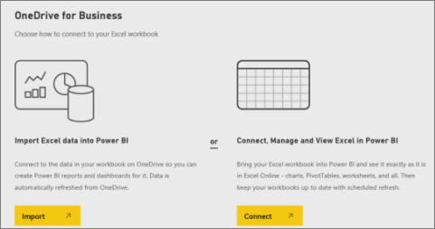
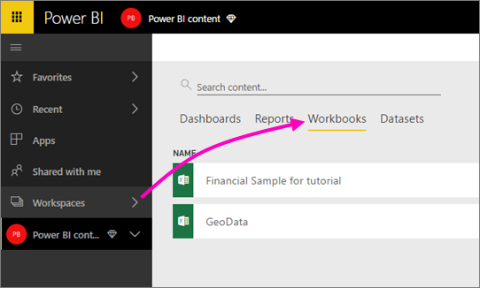

# Power BI 작업 영역의 OneDrive에 저장된 파일에 연결
[Power BI에서 작업 영역을 생성](service-create-workspaces.md)할 때 연결된 비즈니스용 OneDrive가 있는 Microsoft 365 그룹도 생성됩니다. 이 문서에서는 비즈니스용 OneDrive에서 Excel, CSV 및 Power BI Desktop 파일을 저장하고 업데이트하는 방법을 설명합니다. 이러한 업데이트는 파일에 따라 Power BI 보고서 및 대시보드에 자동으로 반영됩니다.

> [!NOTE]
> 새 작업 영역 환경에서 Power BI 작업 영역과 Microsoft 365 그룹 간의 관계를 변경합니다. 새 작업 영역을 하나 만들 때마다 Microsoft 365 그룹이 자동으로 만들어지지는 않습니다. [새 작업 영역 만들기](service-create-the-new-workspaces.md)를 참조하세요.

작업 영역에 파일을 추가하는 과정은 다음 두 단계로 이루어집니다. 

1. 먼저 작업 영역의 [비즈니스용 OneDrive에 파일을 업로드](#1-upload-files-to-the-onedrive-for-business-for-your-workspace)합니다.
2. 그런 다음 [Power BI에서 해당 파일에 연결](#2-import-excel-files-as-datasets-or-as-excel-online-workbooks)합니다.

> [!NOTE]
> 작업 영역은 [Power BI Pro 라이선스](../fundamentals/service-features-license-type.md)를 통해서만 사용할 수 있습니다.
> 

## 1 작업 영역의 비즈니스용 OneDrive에 파일 업로드
1. Power BI 서비스에서 작업 영역 옆에 있는 화살표를 선택하고 작업 영역 이름 옆에 있는 줄임표( **...** )를 선택합니다. 
   
   
2. **파일** 을 선택하여 Microsoft 365에서 작업 영역의 비즈니스용 OneDrive를 엽니다.
   
   > [!NOTE]
   > 작업 영역 메뉴에 **파일** 이 표시되지 않는 경우, **구성원** 을 선택하여 작업 영역의 비즈니스용 OneDrive를 엽니다. 거기에서 **파일** 을 선택합니다. Microsoft 365가 앱의 그룹 작업 영역 파일에 대한 OneDrive 스토리지 위치를 설정합니다. 이 프로세스에는 다소 시간이 걸릴 수 있습니다.
   > 
   > 
3. 여기서 작업 영역의 비즈니스용 OneDrive에 파일을 업로드할 수 있습니다. **업로드** 를 선택하고, 자신의 파일로 이동합니다.
   
   

## 2 Excel 파일을 데이터 세트 또는 Excel 온라인 통합 문서로 가져오기
이제 작업 영역의 비즈니스용 OneDrive에 파일이 있으므로 원하는 작업을 선택할 수 있습니다. 다음을 할 수 있습니다. 

* [Excel 통합 문서에서 데이터 세트로 데이터를 가져옵니다](../connect-data/service-get-data-from-files.md). 그런 다음 데이터를 사용하여 웹 브라우저와 모바일 디바이스에서 볼 수 있는 보고서 및 대시보드를 작성합니다.
* 또는 [Power BI에서 전체 Excel 통합 문서에 연결하고](../connect-data/service-excel-workbook-files.md) Excel Online에 표시된 대로 정확하게 표시합니다.

### 작업 영역의 파일 가져오기 또는 연결
1. Power BI에서 작업 영역으로 전환하여 작업 영역 이름이 왼쪽 위에 표시되도록 합니다. 
2. 탐색 창 아래쪽에서 **데이터 가져오기** 를 선택합니다. 
   
   
3. **파일** 상자에서 **가져오기** 를 선택합니다.
   
   
4. **OneDrive** - ‘작업 영역 이름’을 선택합니다.
   
    
5. 원하는 파일을 선택하고 **연결** 을 선택합니다.
   
    이 시점에서 [Excel 통합 문서에서 데이터를 가져올지](../connect-data/service-get-data-from-files.md) 또는 [전체 Excel 통합 문서에 연결할지](../connect-data/service-excel-workbook-files.md) 여부를 결정합니다.
6. **가져오기** 또는 **연결** 을 선택합니다.
   
    
7. **가져오기** 를 선택하는 경우 **데이터 세트** 탭에 통합 문서가 나타납니다. 
   
    
   
    **연결** 을 선택하는 경우 통합 문서는 **통합 문서** 탭에 있습니다.
   
    

## 다음 단계
* [Power BI에서 앱과 작업 영역 만들기](../collaborate-share/service-create-distribute-apps.md)
* [Excel 통합 문서에서 데이터 가져오기](../connect-data/service-get-data-from-files.md)
* [전체 Excel 통합 문서에 연결](../connect-data/service-excel-workbook-files.md
* 궁금한 점이 더 있나요? [Power BI 커뮤니티를 이용하세요.](https://community.powerbi.com/)
* 의견이 있으신가요? [Power BI Ideas(영문)](https://ideas.powerbi.com/forums/265200-power-bi)을 방문하세요.
