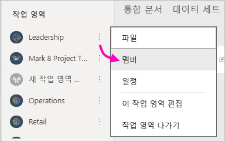
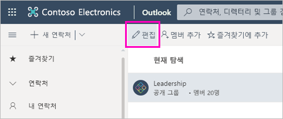
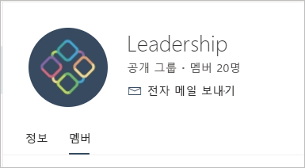

# Power BI에서 클래식 작업 영역 만들기

Power BI에서 대시보드, 보고서 및 페이지를 매긴 보고서 컬렉션을 만들고 구체화하기 위해 동료와 협업하는 공간인 ‘작업 영역’을 만들 수 있습니다. Power BI에는 원본 또는 ‘클래식’ 작업 영역과 새 작업 영역이 있습니다. 이 문서에서는 클래식 작업 영역 만들기에 대해 설명합니다.

**알고 계십니까?** Power BI는 현재 기본값인 새 작업 영역 환경을 제공합니다. 새 작업 영역에 대한 자세한 내용은 [새 작업 영역에서 작업 구성](service-new-workspaces.md)을 참조하세요. 클래식 작업 영역을 마이그레이션할 준비가 되셨나요? 자세한 내용은 [Power BI에서 클래식 작업 영역을 새 작업 영역으로 업그레이드](service-upgrade-workspaces.md)를 참조하세요.

클래식 작업 영역을 만들면, 연결된 기본 Microsoft 365 그룹을 만들게 됩니다. 모든 작업 영역 관리는 Microsoft 365에 위치합니다. 동료를 이러한 작업 영역에 구성원 또는 관리자로 추가할 수 있습니다. 작업 영역에 있는 대시보드, 보고서는 물론, 더 광범위한 대상 그룹에 게시할 계획이 있는 기타 문서에 대해 공동 작업할 수 있습니다. 작업 영역에 추가하는 모든 사용자는 Power BI Pro 라이선스가 필요합니다.

## 비디오: 앱 및 작업 영역
<iframe width="640" height="360" src="https://www.youtube.com/embed/Ey5pyrr7Lk8?showinfo=0" frameborder="0" allowfullscreen></iframe>

## Microsoft 365 그룹을 기준으로 클래식 작업 영역 만들기

작업 영역을 만들 때 Microsoft 365 그룹을 기반으로 합니다.

[!INCLUDE [powerbi-service-create-app-workspace](../includes/powerbi-service-create-app-workspace.md)]

처음 만들 때 작업 영역에서 Microsoft 365에 전파하도록 한 시간 정도 기다려야 합니다.

### Microsoft 365 작업 영역에 이미지 추가(선택 사항)
기본적으로 Power BI는 해당 앱에 앱의 이니셜이 포함된 작은 컬러 원을 만듭니다. 하지만 이미지로 사용자 지정할 수도 있습니다. 이미지를 추가하려면 Exchange Online 라이선스가 필요합니다.

1. **작업 영역** 을 선택하고 작업 영역 이름 옆에 있는 **추가 옵션** (...)을 선택한 다음, **구성원** 을 선택합니다. 
   
     
   
    작업 영역에 대한 Microsoft 365 Outlook 계정은 새로운 브라우저 창에서 열립니다.
2. **편집** 연필을 선택합니다.
   
     
3. 카메라 이미지를 선택하고 사용하려는 이미지를 찾습니다.
   
     

     이미지는 .png, .jpg 또는 .bmp 파일일 수 있습니다. 파일 크기는 최대 3MB일 수 있습니다. 

4. **확인** 과 **저장** 을 차례로 선택합니다.
   
    이미지는 Microsoft 365 Outlook 창에서 색상이 있는 원을 대체합니다.
   
     
   
    몇 분 후 Power BI의 앱에도 나타납니다.

## 작업 영역에 콘텐츠 추가

작업 영역을 만들면 콘텐츠를 추가할 수 있습니다. 이 작업은 작업 영역의 다른 사람이 보고 작업할 수도 있다는 점을 제외하고 내 작업 영역에 콘텐츠를 추가하는 것과 같습니다. 큰 차이점은 완료되면 콘텐츠를 앱으로 게시할 수 있다는 것입니다. 작업 영역에서 콘텐츠 목록의 콘텐츠를 볼 때 작업 영역의 이름이 소유자로 나열됩니다.

### 작업 영역에서 타사 서비스에 연결

앱은 Power BI에서 지원하는 모든 타사 서비스에 제공됩니다. 그러면 Microsoft Dynamics CRM, Salesforce 또는 Google Analytics 등 사용하는 서비스에서 데이터를 가져올 수 있습니다. 조직 앱을 게시하여 필요한 데이터를 사용자에게 제공할 수 있습니다.

현재 작업 영역에서 Microsoft Dynamics CRM, Salesforce 또는 Google Analytics 등 조직 콘텐츠 팩 및 타사 콘텐츠 팩을 사용하여 연결할 수 있습니다. 앱에 조직 콘텐츠 팩을 마이그레이션하는 것이 좋습니다.

## 앱 배포

조직 내의 많은 대상 그룹에 공식 콘텐츠를 배포하려는 경우 작업 영역에서 앱을 게시할 수 있습니다.  콘텐츠가 준비되면 게시할 대시보드 및 보고서를 선택한 다음, ‘앱’으로 게시합니다. 각 작업 영역에서 하나의 앱을 만들 수 있습니다.

탐색 창의 앱 목록에는 설치한 모든 앱이 표시됩니다. 동료는 몇 가지 다른 방법으로 앱을 설치할 수 있습니다. 
- Microsoft AppSource에서 앱을 찾아 설치할 수 있습니다.
- 직접 링크를 보낼 수 있습니다. 
- Power BI 관리자가 사용자에게 사용 권한을 부여한 경우 동료의 Power BI 계정에서 해당 앱을 자동으로 설치할 수 있습니다. 

작업 영역에서 업데이트를 게시한 후에는 사용자에게 자동으로 업데이트된 앱 콘텐츠가 표시됩니다. 작업 영역의 앱 콘텐츠에 사용되는 데이터 세트에서 새로 고침 일정을 설정하여 데이터를 새로 고치는 빈도를 제어할 수 있습니다. 자세한 내용은 [Power BI의 새 작업 영역에서 앱 게시](service-create-distribute-apps.md)를 참조하세요.

## Power BI 클래식 앱 FAQ

### 앱이 조직 콘텐츠 팩과 다른점
앱은 조직 콘텐츠 팩이 진화된 것입니다. 조직 콘텐츠 팩이 이미 있는 경우 앱과 함께 계속 작동합니다. 앱 및 콘텐츠 팩에는 몇 가지 주요 차이점이 있습니다. 

* 비즈니스 사용자가 콘텐츠 팩을 설치한 후에는 그룹화된 ID를 잃게 됩니다. 그저 다른 대시보드 및 보고서가 혼재된 대시보드 및 보고서 목록일 뿐입니다. 한편으로, 앱은 설치 후에도 그룹화와 ID를 유지합니다. 이 그룹화를 통해 비즈니스 사용자는 시간이 지나도 계속 해당 앱으로 쉽게 이동할 수 있습니다.
* 어떠한 작업 영역에서도 여러 콘텐츠 팩을 만들 수 있지만 앱은 해당 작업 영역과 일대일 관계를 맺습니다. 
* 시간이 지나면 조직 콘텐츠 팩의 사용을 중단할 계획이므로, 지금부터 앱을 만드는 것이 좋습니다.  
* 새 작업 영역 환경을 사용하여 조직 콘텐츠 팩의 사용을 중단하는 첫 번째 조치를 취합니다. 새 작업 영역에서 해당 앱을 사용하거나 만들 수 없습니다.

두 작업 영역을 비교하려면 [새 작업 영역과 클래식 작업 영역의 차이점](service-new-workspaces.md#new-and-classic-workspace-differences)을 참조하세요. 

## 다음 단계
* [Power BI에서 앱 설치 및 사용](service-create-distribute-apps.md)
- [새 작업 영역 만들기](service-create-the-new-workspaces.md)
* 궁금한 점이 더 있나요? [Power BI 커뮤니티에 질문합니다.](https://community.powerbi.com/)
