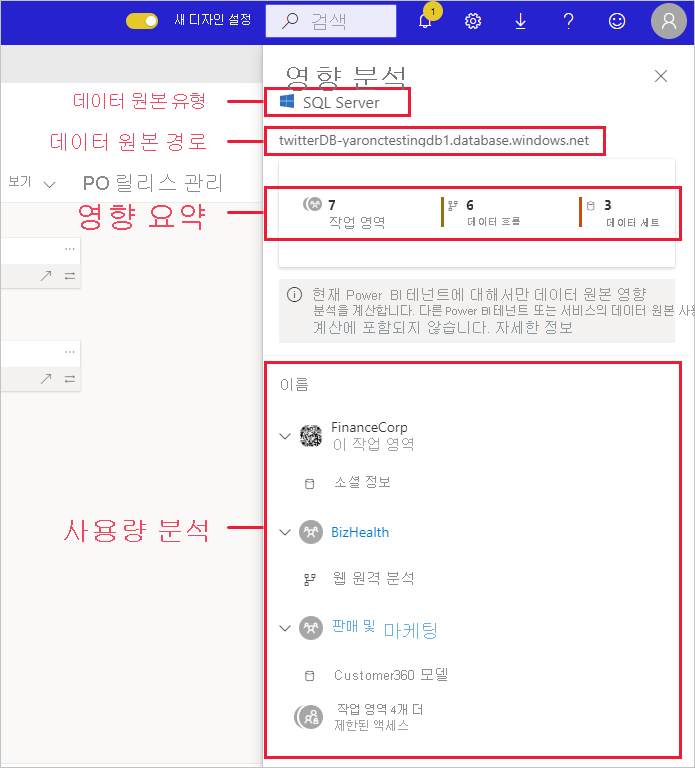
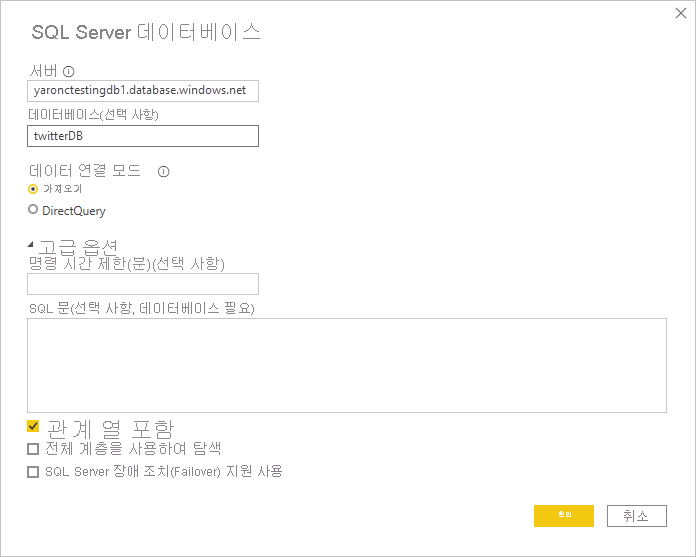

# 데이터 원본 영향 분석

데이터 원본 영향 분석을 사용하면 조직 전체에서 데이터 원본이 사용되는 위치를 확인할 수 있습니다. 해당 분석은 데이터 원본이 일시적 또는 영구적으로 오프라인으로 전환되거나 영향을 받는 사람에 관한 아이디어를 얻으려는 경우 유용할 수 있습니다. 데이터 원본을 사용하는 작업 영역, 데이터 흐름 및 데이터 세트의 수를 표시하며 추가로 조사할 수 있도록 영향을 받는 데이터 흐름 및 데이터 세트가 있는 작업 영역을 쉽게 탐색할 수 있습니다.

예를 들어 데이터 원본 영향 분석을 사용하면 여러 사용자가 동일한 데이터 원본을 기반으로 유사한 모델을 빌드하는 경우 테넌트에서 데이터 중복을 포착할 수도 있습니다. 중복 데이터 세트 및 데이터 흐름 검색을 지원함으로써 데이터 원본 영향 분석은 “단일 데이터 원본”의 목표를 지원합니다.

## 데이터 원본 영향 분석 수행

데이터 원본 영향 분석을 수행하려면:

1. 원하는 데이터 원본이 포함된 작업 영역으로 이동하고 [계보 보기](service-data-lineage.md)를 엽니다.
1. 데이터 원본의 카드를 찾고 영향 분석 아이콘을 클릭합니다.

    
 
영향 분석 사이드 패널이 열립니다.

 
* **데이터 원본 유형**: 데이터 원본 유형을 지정합니다.
* **데이터 원본 경로**: Power BI Desktop에 정의된 데이터 원본의 경로입니다. 예를 들어 위의 이미지에서 SQL Server 데이터베이스 데이터 원본의 경로는 Power BI Desktop에 정의된 연결 문자열 “twitterDB-yaronctestingdb1.database.windows.net”입니다(아래 참조). 데이터베이스 이름 “twitterDB” 및 서버 이름 “yaronctestingdb1.database.windows.net”으로 구성됩니다.

    
 
* **영향 요약**: 잠재적으로 영향을 받는 작업 영역, 데이터 흐름 및 데이터 세트의 수를 표시합니다. 해당 개수는 액세스할 수 없는 작업 영역을 포함합니다.
* **사용량 분석**: 각 작업 영역에서 영향을 받는 데이터 흐름 및 데이터 세트의 이름을 표시합니다. 특정 작업 영역에 미치는 영향을 자세히 살펴보려면 작업 영역 이름을 클릭하여 작업 영역을 엽니다. 영향을 받은 작업 영역에서 [데이터 세트 영향 분석](service-dataset-impact-analysis.md)을 사용하여 연결된 보고서 및 대시보드에 관한 사용량 세부 정보를 확인합니다.

## 개인 정보

영향 분석 사이드 창에는 액세스할 수 있는 작업 영역, 데이터 세트 및 데이터 흐름의 실제 이름만 표시됩니다. 액세스 권한이 없는 항목은 제한된 액세스로 나열됩니다. 항목 이름에 개인 정보가 포함되어 있을 수 있기 때문입니다.
영향 요약 개수에는 액세스할 수 없는 작업 영역에 있는 항목을 포함하여 영향을 받는 모든 데이터 흐름 및 데이터 세트가 포함됩니다.

## 제한 사항

데이터 원본 영향 분석은 아직 페이지를 매긴 보고서에서 지원되지 않으므로 데이터 원본이 테넌트에서 해당 종류의 보고서에 직접 영향을 주는지 알 수 없습니다.

## 다음 단계

* [데이터 세트 영향 분석](service-dataset-impact-analysis.md)
* [데이터 계보](service-data-lineage.md)