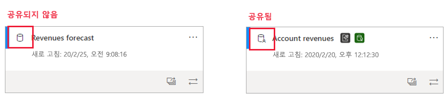
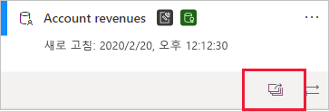
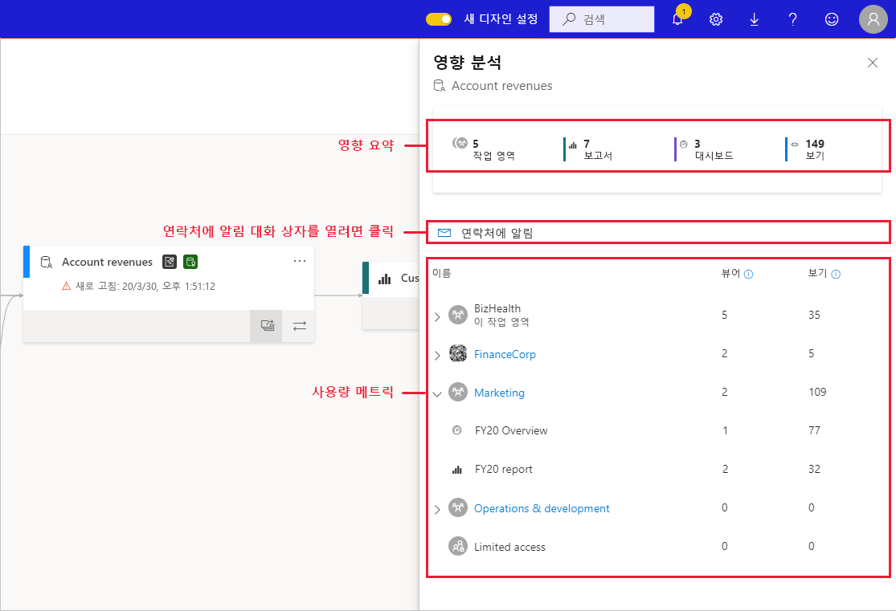
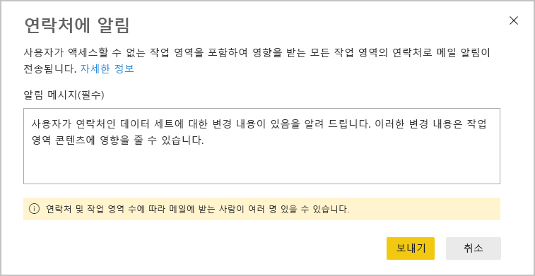
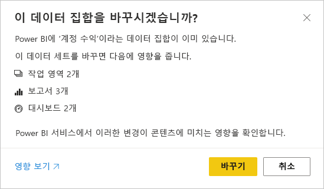

# 데이터 집합 영향 분석

데이터 세트를 변경했거나 변경을 고려 중인 경우 해당 변경 내용이 데이터 세트에 종속된 다운스트림 보고서와 대시보드에 미치는 영향을 평가할 수 있어야 합니다. **데이터 세트 영향 분석**은 평가를 수행하는 데 도움이 되는 정보를 제공합니다.
* 변경 내용의 영향을 받을 수 있는 작업 영역, 보고서 및 대시보드 수를 표시하고, 추가 조사를 위해 영향을 받는 보고서와 대시보드가 있는 작업 영역을 쉽게 탐색할 수 있게 합니다.
* 여기에는 잠재적으로 영향을 받는 항목의 고유 방문자 수와 보기 수가 표시됩니다. 이 정보를 통해 다운스트림 항목에 미치는 변경 내용의 전반적인 영향을 확인할 수 있습니다. 예를 들어 보기 권한자가 3명인 보고서에 미치는 변경 내용의 영향을 조사하는 것보다 고유 보기 권한자가 20,000명인 보고서에 미치는 변경 내용의 영향을 조사하는 것이 더 중요할 것입니다.
* 변경했거나 변경을 고려 중인 내용에 대해 관련 사용자에게 알리는 편리한 방법도 제공합니다.

데이터 세트 영향 분석은 [데이터 계보 보기](service-data-lineage.md) 내에서 쉽게 시작할 수 있습니다.

## 공유 데이터 세트 확인

공유 데이터 세트와 비공유 데이터 세트에 대해 모두, 데이터 세트 영향 분석을 수행할 수 있습니다. 그러나 모든 종속성이 데이터 세트 자체와 동일한 작업 영역에 있는 비공유 데이터 세트보다 다운스트림 종속성을 명확하게 파악하는 것이 훨씬 복잡한, 작업 영역 간에 공유되는 데이터 세트에 특히 유용합니다.

계보 보기에서 데이터 세트 카드의 왼쪽 위에 표시되는 아이콘을 통해 공유 데이터 세트와 비공유 데이터 세트를 구분할 수 있습니다.

## 데이터 세트 영향 분석 수행

공유 여부와 관계없이 작업 영역의 데이터 세트에 대해 영향 분석을 수행할 수 있습니다. 계보 보기에 표시되지만 실제로는 다른 작업 영역에 있는 외부 데이터 세트에 대해서는 영향 분석을 수행할 수 없습니다. 외부 데이터 세트에 대해 영향 분석을 수행하려면 원본 작업 영역으로 이동해야 합니다.

데이터 세트 영향 분석을 수행하려면 데이터 세트 카드에서 영향 분석 단추를 클릭합니다.

영향 분석 사이드 패널이 열립니다.

* **영향 요약**에는 잠재적으로 영향을 받는 작업 영역, 보고서 및 대시보드 수와 데이터 세트에 연결된 모든 다운스트림 보고서와 대시보드의 총 보기 수가 표시됩니다.
* **연락처에 알림** 링크를 클릭하면 데이터 세트 변경 내용에 대한 메시지를 만들고 영향을 받는 작업 영역의 연락처 목록에 보낼 수 있는 대화 상자가 열립니다. 
* **사용 현황 분석**에는 각 작업 영역에서 잠재적으로 영향을 받는 보고서와 대시보드의 총 보기 수와 각 보고서 및 대시보드의 보기 권한자 및 보기 총수가 표시됩니다. 여기서 각 항목은 다음을 나타냅니다.
   * 보기 권한자: 보고서 또는 대시보드를 본 고유 사용자 수입니다.
   * 보기: 보고서 또는 대시보드의 보기 수입니다.

사용량 메트릭은 최근 30일(현재 날짜 제외)과 관련이 있습니다. 개수에는 관련 앱을 통해 발생하는 사용량이 포함됩니다. 메트릭은 데이터 세트의 변경 내용이 미치는 영향을 평가하는 것뿐 아니라 테넌트 전체의 데이터 세트 사용을 파악하는 데도 도움이 됩니다.

## 연락처에 알림

데이터 세트를 변경했거나 변경을 고려 중인 경우 관련 사용자에게 알리는 것이 좋습니다. 연락처에 알리면, 영향을 받는 모든 작업 영역의 [연락처 목록](../collaborate-share/service-create-the-new-workspaces.md#workspace-contact-list)에 메일이 전송됩니다. 사용자 이름이 메일에 표시되므로 연락처는 새 메일 스레드에서 사용자를 찾아 회신할 수 있습니다. 

1. 영향 분석 사이드 창에서 **연락처에 알림**을 클릭합니다. 연락처에 알림 대화 상자가 표시됩니다.

   

1. 텍스트 상자에 변경 내용에 대한 몇 가지 세부 정보를 입력합니다.
1. 메시지가 준비되면 **보내기**를 클릭합니다.

> [!NOTE]
> 영향 분석을 수행 중인 데이터 세트가 클래식 작업 영역에 있는 경우에는 연락처에 알림을 사용할 수 없습니다.

## 개인 정보

쓰기 권한이 있는 데이터 세트에 대해서만 영향 분석을 수행할 수 있습니다. 영향 분석 사이드 창에는 액세스할 수 있는 작업 영역, 보고서 및 대시보드의 실제 이름만 표시됩니다. 액세스 권한이 없는 항목은 **제한된 액세스**로 나열됩니다. 항목 이름에 개인 정보가 포함되어 있을 수 있기 때문입니다.

액세스 권한이 없는 작업 영역에 대해서도 요약된 사용 현황 메트릭이 표시되며, 연락처에 알림 메시지가 해당 작업 영역의 연락처 목록에 전달됩니다.

## Power BI Desktop의 영향 분석

Power BI Desktop에서 데이터 세트를 변경한 후 Power BI 서비스에 다시 게시하면 변경 내용의 영향을 받을 수 있는 작업 영역, 보고서 및 대시보드 수를 보여 주고 현재 게시된 데이터 세트를 수정 내용으로 바꿀 것인지를 확인하는 메시지가 표시됩니다. 해당 메시지는 Power BI 서비스의 전체 데이터 세트 영향 분석 링크도 제공합니다. 여기서 자세한 정보를 확인하고 조치를 취하여 변경 위험을 완화할 수 있습니다.

> [!NOTE]
> 메시지에 표시된 정보는 잠재적 영향만을 나타내며, 문제가 발생했음을 나타내는 것은 아닙니다. 데이터 세트 변경 내용이 다운스트림 보고서와 대시보드에 부정적인 영향을 주지 않는 경우도 많지만, 염려스러운 잠재적 영향을 명확하게 설명하는 이 메시지를 받게 됩니다.
>
>메시지의 작업 영역 수는 영향을 받는 보고서와 대시보드가 둘 이상의 작업 영역에 있는 경우에만 표시됩니다.

## 제한 사항

* 현재 클래식 및 개인 작업 영역에 대해서는 사용 현황 메트릭이 지원되지 않습니다.

## 다음 단계

* [작업 영역의 데이터 세트 소개(미리 보기)](../connect-data/service-datasets-across-workspaces.md)
* [데이터 계보](service-data-lineage.md)

