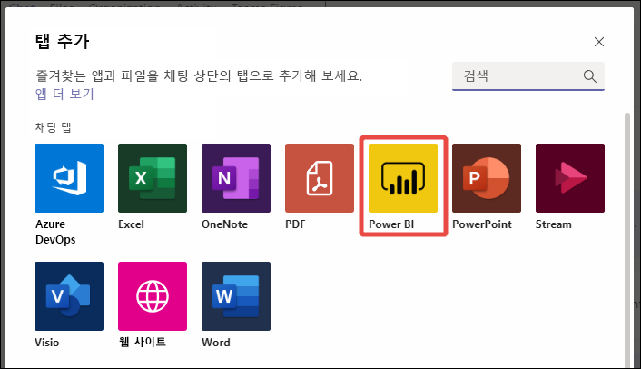
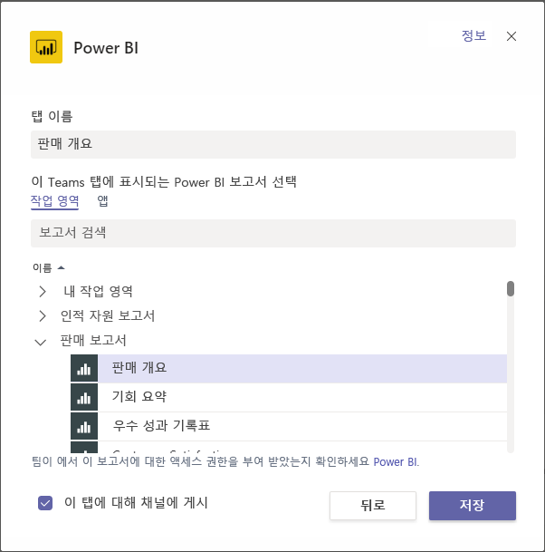
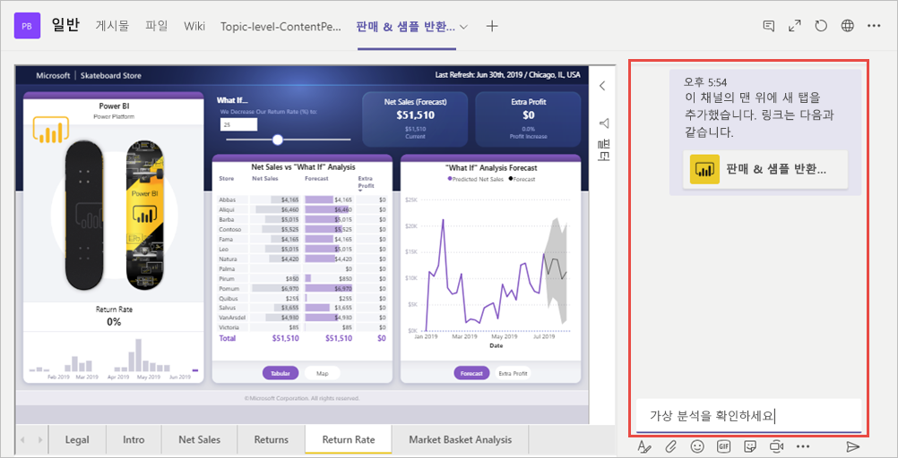

# Microsoft Teams에 Power BI 콘텐츠 포함

Microsoft Teams 채널 및 채팅에 대화형 Power BI 보고서를 쉽게 포함할 수 있습니다. 

## 요구 사항

Microsoft Teams에서 **Power BI** 탭을 사용하려면 다음 요소를 확인합니다.

- Microsoft Teams에 **Power BI** 탭이 있습니다.
- **Power BI** 탭을 사용하여 Microsoft Teams에서 보고서를 추가하려면 보고서를 호스트하는 작업 영역에서 보기 권한자 이상의 역할이 있어야 합니다. 다른 역할에 대한 자세한 내용은 [새 작업 영역의 역할](service-new-workspaces.md#roles-in-the-new-workspaces)을 참조하세요.
- Microsoft Teams의 **Power BI** 탭에서 보고서를 보려면 사용자에게 보고서를 볼 수 있는 권한이 있어야 합니다.
- 사용자는 채널 및 채팅에 대한 액세스 권한이 있는 Microsoft Teams 사용자여야 합니다.

다른 요구 사항을 포함하여 Power BI와 Microsoft Teams를 함께 사용하는 방법에 대한 배경 지식은 [Power BI를 사용하여 Microsoft Teams에서 협업](service-embed-report-microsoft-teams.md)을 참조하세요.

## Microsoft Teams에 보고서 포함

다음 단계에 따라 Microsoft Teams 채널 또는 채팅에 보고서를 포함합니다.

1. Microsoft Teams에서 채널 또는 채팅을 열고 **+** 아이콘을 선택합니다.

    

1. **Power BI** 탭을 선택합니다.

    

1. 제공된 옵션을 사용하여 작업 영역 또는 Power BI 앱에서 보고서를 선택합니다.

    

1. 탭 이름은 보고서 이름과 일치하도록 자동으로 업데이트되지만 변경할 수 있습니다.

1. **저장** 을 선택합니다.

### Power BI 탭에 포함할 수 있는 보고서

다음 유형의 보고서는 **Power BI** 탭에 포함할 수 있습니다.

- 대화형 보고서 및 페이지를 매긴 보고서
- **내 작업 영역**, 새 작업 영역 환경 및 클래식 작업 영역의 보고서
- Power BI 앱의 보고서

## 대화 시작

Power BI 보고서 탭을 Microsoft Teams에 추가하면 Microsoft Teams에서 보고서에 대한 탭 대화를 자동으로 만듭니다.

- 오른쪽 위 모서리에서 **탭 대화 표시** 를 선택합니다.

    

    첫 번째 설명은 보고서의 링크입니다. 해당 Microsoft Teams 채널의 모든 사용자가 대화에서 보고서를 보고 토론할 수 있습니다.

    

## 알려진 문제 및 제한 사항

- Microsoft Teams에서는 Power BI 보고서의 시각적 개체에서 내보낸 데이터가 자동으로 다운로드 폴더에 저장됩니다. 이 파일은 "data(*n*).xlsx"라는 Excel 파일입니다. 여기서 *n* 은 데이터를 동일한 폴더로 내보낸 횟수입니다.
- Power BI 대시보드는 Microsoft Teams의 **Power BI** 탭에 포함할 수 없습니다.
- [URL 필터](service-url-filters.md)는 Microsoft Teams의 **Power BI** 탭에서 지원되지 않습니다.
- 국가 클라우드에서는 새 **Power BI** 탭을 사용할 수 없습니다. 새 작업 영역 환경 또는 보고서를 지원하지 않는 이전 버전을 Power BI 앱에서 사용할 수 있습니다.
- 탭을 저장한 후에는 탭 설정을 통해 탭 이름을 변경하지 않습니다. **이름 바꾸기** 옵션을 사용하여 변경합니다.
- 다른 문제를 확인하려면 “Microsoft Teams에서 협업” 문서의 [알려진 문제 및 제한 사항](service-collaborate-microsoft-teams.md#known-issues-and-limitations) 섹션을 참조하세요.

## 다음 단계

- [Power BI를 사용하여 Microsoft Teams에서 협업](service-collaborate-microsoft-teams.md)

궁금한 점이 더 있나요? [Power BI 커뮤니티에 질문합니다](https://community.powerbi.com/).
