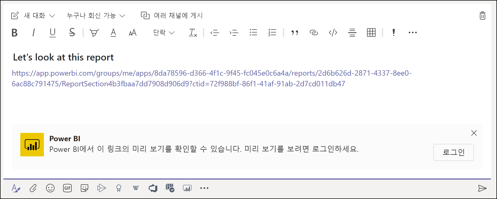
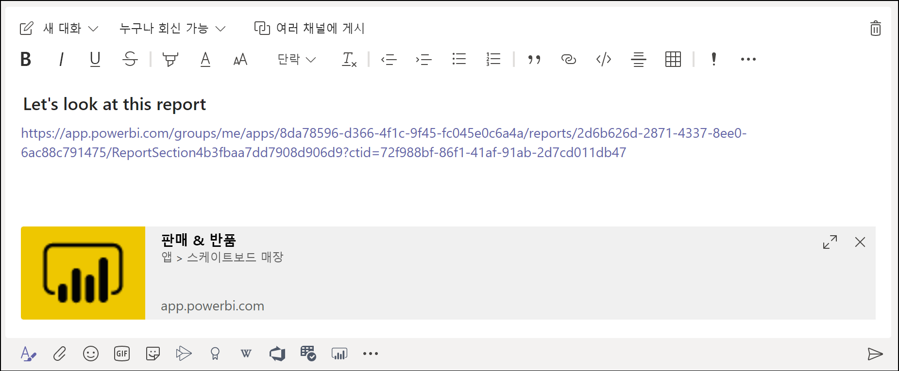
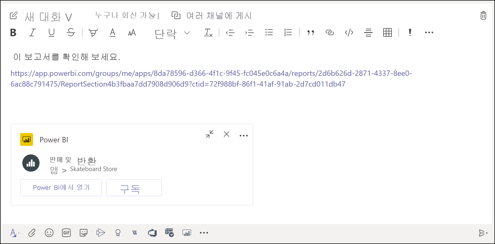

# Power BI 탭을 사용하여 Microsoft Teams에 보고서 포함

Microsoft Teams의 업데이트된 Power BI 탭을 사용하여 Microsoft Teams 채널 및 채팅에 대화형 보고서를 쉽게 포함할 수 있습니다. Microsoft Teams의 Power BI 탭을 사용하여 동료가 팀에서 사용하는 데이터를 찾고 팀 채널 내에서 데이터에 대해 논의할 수 있습니다.  보고서, 대시보드 및 앱에 대한 링크를 Microsoft Teams 메시지 상자에 붙여넣으면 링크 미리 보기에 관련 정보가 표시됩니다. 사용자는 링크를 통해 연결되는 항목을 더 쉽게 이해할 수 있습니다.

## 요구 사항

**Microsoft Teams의 Power BI 탭**이 작동하려면 다음을 확인해야 합니다.

- 사용자에게 Power BI Pro 라이선스가 있거나, 보고서가 Power BI 라이선스가 있는 [Power BI 프리미엄 용량(EM 또는 P SKU)](../admin/service-premium-what-is.md)에 포함되어 있습니다.
- Microsoft Teams에 Power BI 탭이 있습니다.
- 사용자가 Power BI 서비스에 로그인하여 보고서를 사용하기 위해 Power BI 라이선스를 활성화했습니다.
- Microsoft Teams에서 Power BI 탭을 사용하여 보고서를 추가하려면 보고서를 호스트하는 작업 영역에서 뷰어 이상의 역할이 있어야 합니다. 다른 역할에 대한 자세한 내용은 [새 작업 영역의 역할](service-new-workspaces.md#roles-in-the-new-workspaces)을 참조하세요.
- Microsoft Teams의 Power BI 탭에서 보고서를 보려면 사용자에게 보고서를 볼 수 있는 권한이 있어야 합니다.

또한 **링크 미리 보기**가 작동하려면 다음을 확인해야 합니다.
- 사용자가 Microsoft Teams의 Power BI 탭을 사용하기 위한 요구 사항을 충족시킵니다.
- 사용자가 Power BI 서비스에 로그인했습니다. 

## 보고서 포함

다음 단계에 따라 Microsoft Teams 채널 또는 채팅에 보고서를 포함합니다.

1. Microsoft Teams에서 채널 또는 채팅을 열고, **+** 아이콘을 선택합니다.

    

2. Power BI 탭을 선택합니다.

    

3. 제공된 옵션을 사용하여 작업 영역, 공유한 항목 또는 Power BI 앱에서 보고서를 선택합니다.

    

4. 탭 이름은 보고서 이름과 일치하도록 자동으로 업데이트되지만 변경할 수 있습니다. 

5. **저장**을 누릅니다.

## Power BI 탭을 포함하는 데 지원되는 보고서
다음 유형의 보고서는 Power BI 탭에 포함할 수 있습니다.

- 대화형 보고서 및 페이지를 매긴 보고서
- 내 작업 영역, 새 작업 영역 환경 및 클래식 작업 영역의 보고서
- Power BI 앱의 보고서

## 링크 미리 보기 가져오기

다음 단계에 따라 Power BI 서비스의 콘텐츠에 대한 링크 미리 보기를 가져옵니다.

1. Power BI 서비스의 보고서, 대시보드 또는 앱에 대한 링크를 복사합니다. 예를 들어 브라우저 주소 표시줄에서 링크를 복사합니다.

2. 링크를 Microsoft Teams 메시지 상자에 붙여넣습니다. 메시지가 표시되면 링크 미리 보기 서비스에 로그인합니다. 링크 미리 보기가 로드될 때까지 몇 초 정도 기다려야 할 수 있습니다.

    

3. 성공적으로 로그인하면 기본 링크 미리 보기가 표시됩니다.

    

4. 확장 아이콘을 선택하여 서식 있는 미리 보기 카드를 표시합니다.

    

5. 서식 있는 링크 미리 보기 카드에는 링크 및 관련 작업 단추가 표시됩니다.

    

6. 메시지를 보냅니다.

## 보고서에 액세스 권한 부여

Microsoft Teams에 보고서를 포함하거나 항목에 대한 링크를 보내는 경우 사용자에게 보고서를 볼 수 있는 권한이 자동으로 부여되지 않습니다. [사용자가 Power BI에서 보고서를 볼 수 있도록 허용](service-share-dashboards.md)해야 합니다. 해당 팀의 Microsoft 365 그룹을 사용하면 더 쉬워집니다.

> [!IMPORTANT]
> Power BI 서비스 내에서 보고서를 볼 수 있는 사람이 누구인지 확인하고 목록에 없는 사람에게 액세스 권한을 부여합니다.

팀의 모든 사용자가 보고서에 액세스할 수 있도록 하는 한 가지 방법은 보고서를 Power BI의 단일 작업 영역에 저장하고 해당 작업 영역에 대한 액세스 권한을 팀의 Microsoft 365 그룹에 부여하는 것입니다.

## 링크 미리 보기 

Power BI에서 다음 항목에 대한 링크 미리 보기가 제공됩니다.
- 보고서
- 대시보드
- 앱

링크 미리 보기 서비스를 사용하려면 사용자가 로그인해야 합니다. 로그아웃하려면 메시지 상자 아래쪽에서 Power BI 아이콘을 선택한 다음, 로그아웃을 선택합니다.

## 대화 시작

Power BI 보고서 탭을 Teams에 추가하면 Teams에서 보고서에 대한 탭 대화를 자동으로 만듭니다. 

- 오른쪽 위 모서리에서 **탭 대화 표시**를 선택합니다.

    

    첫 번째 설명은 보고서의 링크입니다. 해당 Teams 채널의 모든 사용자가 대화에서 보고서를 보고 토론할 수 있습니다.

    

## 알려진 문제 및 제한 사항

- Power BI는 Microsoft Teams에서 지원하는 것과 동일한 지역화된 언어를 지원하지 않습니다. 결과적으로 포함된 보고서 내에 적절한 지역화가 표시되지 않을 수 있습니다.
- Power BI 대시보드는 Microsoft Teams의 Power BI 탭에 포함될 수 없습니다.
- Power BI 라이선스 또는 보고서에 대한 권한이 없는 사용자에게는 "콘텐츠를 사용할 수 없습니다."라는 메시지가 표시됩니다.
- Internet Explorer 10을 사용하는 경우 문제가 발생할 수 있습니다. <!--You can look at the [browsers support for Power BI](../consumer/end-user-browsers.md) and for [Microsoft 365](https://products.office.com/office-system-requirements#Browsers-section). -->
- [URL 필터](service-url-filters.md)는 Microsoft Teams의 Power BI 탭에서 지원되지 않습니다.
- 국가 클라우드에서는 새 Power BI 탭을 사용할 수 없습니다. Power BI 앱에서 새 작업 영역 환경의 작업 영역 또는 보고서를 지원하지 않는 이전 버전을 사용할 수 있습니다. 
- 탭이 저장되면 탭 설정을 통해 탭 이름을 변경할 수 없습니다. [이름 바꾸기] 옵션을 사용하여 변경합니다.
- Single Sign-On이 링크 미리 보기 서비스에 지원되지 않습니다.
- 링크 미리 보기는 모임 채팅 또는 프라이빗 채널에서 작동하지 않습니다.

## 다음 단계
- [동료 및 다른 사용자와 대시보드 공유](service-share-dashboards.md)  
- [Power BI에서 앱 만들기 및 배포](service-create-distribute-apps.md)  
- [Power BI 프리미엄이란?](../admin/service-premium-what-is.md)

궁금한 점이 더 있나요? [Power BI 커뮤니티에 질문합니다.](https://community.powerbi.com/)
