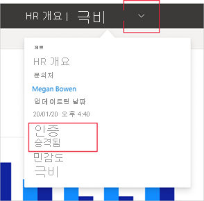

# 보증 - Power BI 콘텐츠 승격 및 인증

## 보증 개요

조직에는 Power BI 사용자가 공유하고 다시 사용할 수 있는 많은 양의 Power BI 콘텐츠가 있어 신뢰할 수 있고 권한이 부여된 콘텐츠를 식별하기가 어려울 수 있습니다. 보증은 사용자가 필요한 고품질 콘텐츠를 더 쉽게 찾을 수 있도록 하는 방법입니다. 보증된 콘텐츠에는 Power BI와 사용자가 Power BI 콘텐츠를 찾는 다른 위치(예: Excel)에서 명확하게 레이블이 지정됩니다. 또한 일부 검색에서는 우선 순위가 지정되고, 일부 목록에서는 정렬할 수 있습니다.

보증에는 **승격** 과 **인증** 두 종류가 있습니다.

* **승격**: 승격을 통해 사용자는 중요하고 다른 사용자가 사용할 가치가 있다고 생각하는 콘텐츠를 강조 표시할 수 있습니다. 이 방법은 조직 내에서 콘텐츠의 공동 사용 및 분산을 권장합니다.

    모든 콘텐츠 소유자 또는 콘텐츠가 있는 작업 영역에 대한 쓰기 권한이 있는 모든 멤버는 공유할 가치가 있다고 생각할 경우 콘텐츠를 승격할 수 있습니다.

* **인증**: 인증이란 콘텐츠가 조직의 품질 표준을 충족하고 신뢰할 수 있고 권한이 있어 조직 전체에서 사용할 수 있는 것으로 간주됨을 의미합니다.

    Power BI 관리자가 정의한 선택된 검토자 그룹에만 콘텐츠를 인증할 권한이 부여됩니다. 인증된 콘텐츠를 확인하려고 하는데 콘텐츠를 인증할 수 있는 권한이 없는 콘텐츠 소유자는 콘텐츠 인증에 대한 조직의 지침을 따라야 합니다.

    **인증은 Power BI 관리자가 조직에 대해 사용하도록 설정하고 구성한 경우에만 사용할 수 있습니다**.

아래 이미지에서는 보고서를 작성할 데이터 세트를 검색할 때 보증된 콘텐츠(승격 및 인증)를 명확하게 식별하는 방법을 보여 줍니다.

## 보증할 수 있는 콘텐츠 형식
Power BI는 현재 다음 항목에 대한 보증을 지원합니다.
* 데이터 세트
* 데이터 흐름(미리 보기)
* 보고서(미리 보기)
* 앱(미리 보기)

## 보증된 콘텐츠 식별

보증된 콘텐츠는 목록, 카드 및 기타 위치에서 배지와 아이콘으로 레이블이 지정됩니다. 기타 위치에는 Power BI와 Power BI 콘텐츠를 찾을 수 있는 위치(예: Excel)가 모두 포함됩니다. 다음 배지 및 아이콘은 보증된 콘텐츠를 식별합니다.

|배지|아이콘|
|---------|---------|
|||
|||
|||

또한 보고서나 앱에 있는 경우 헤더를 통해 보증 상태를 확인할 수 있습니다.
* 인증은 헤더와 헤더 드롭다운에 모두 표시되며, 여기에서 인증을 수행한 사용자를 확인할 수도 있습니다.

    

* 승격은 헤더 드롭다운에만 표시됩니다.
 
    

## 앱 또는 보고서의 보증 여부 결정

보증은 사용자가 찾고 사용하고 다시 공유할 수 있는 콘텐츠 항목(앱, 보고서, 데이터 세트 및 데이터 흐름)에 사용됩니다.

광범위한 대상과 데이터를 공유하려는 경우 Power BI 모범 사례는 앱을 통해 데이터를 공유하는 것입니다. 이 모범 사례를 따르면 사용자가 해당 앱을 쉽게 찾도록 할 수 있습니다. 이 경우 앱을 보증해야 합니다. 

그러나 보고서를 직접 공유하는 것이 유용한 경우에는 보고서 자체를 보증합니다. 

보고서를 공유하든 앱을 공유하든 기본 데이터 세트가 명확하고 공유할 수 있는 경우 데이터 세트도 보증하는 것이 좋습니다. 데이터 흐름에도 동일하게 적용됩니다.  

## 다음 단계

* [Power BI 콘텐츠 승격 또는 인증](service-endorse-content.md)
* [조직에 인증 사용](../admin/service-admin-setup-certification.md)(Power BI 관리자)
* 질문이 있으신가요? [Power BI 커뮤니티에 질문합니다.](https://community.powerbi.com/)