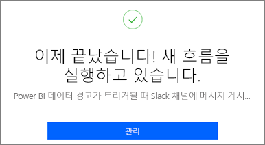
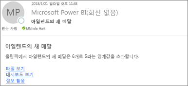
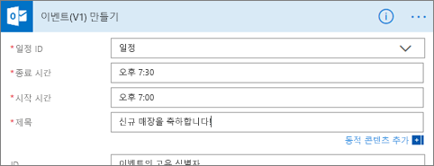
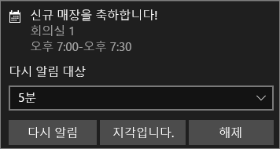

# Power Automate와 데이터 경고 통합

[Power Automate](/power-automate/getting-started)를 사용하여 Power BI를 즐겨 사용하는 앱 및 서비스와 통합할 수 있습니다. Power Automate를 사용하면 자동화된 워크플로를 만들어 알림 받기, 파일 동기화, 데이터 수집 등을 할 수 있습니다. 이 문서에서는 Power BI 데이터 경고에서 이메일 생성을 자동화합니다.

## 사전 요구 사항
이 문서에서는 흐름을 만드는 두 가지 방법, 즉 템플릿을 이용하는 방법과 처음부터 새로 만드는 방법을 보여줍니다. 과정을 따르려면 [Power BI에서 데이터 경고를 생성](../create-reports/service-set-data-alerts.md)하고 [Power Automate에 등록](https://flow.microsoft.com/#home-signup)합니다. 무료입니다!

## 템플릿에서 흐름 만들기
이 작업에서는 Power BI 데이터 경고(알림)에 의해 트리거되는 간단한 흐름을 만드는 템플릿을 사용합니다.

1. Power Automate(flow.microsoft.com)에 로그인합니다.
2. **템플릿** 을 선택하고 **Power BI** > **Power BI 데이터 경고가 트리거될 때 모든 대상 그룹에게 이메일 보내기** 를 검색합니다.
   
    :::image type="content" source="media/service-flow-integration/power-automate-templates.png" alt-text="Power BI 데이터 경고가 트리거될 때 모든 대상에게 메일을 보내는 Power Automate의 스크린샷":::

### 흐름 작성
이 템플릿에는 하나의 트리거, Power BI 데이터 경고 및 이메일을 보내기 위한 하나의 작업이 있습니다. 필드를 선택하면 Power Automate는 포함시킬 수 있는 동적 콘텐츠를 표시합니다.  이 예에서는 메시지 본문에 타일 값 및 타일 URL이 포함되어 있습니다.

1. **계속** 을 선택합니다.

    :::image type="content" source="media/service-flow-integration/power-automate-power-bi-mail.png" alt-text="Power Automate의 스크린샷, Power BI를 메일로 보냅니다.":::

1. **경고 ID** 상자에서 Power BI 데이터 경고를 선택합니다. 경고를 만드는 방법을 알아보려면 [Power BI에서 데이터 경고](../create-reports/service-set-data-alerts.md)를 참조하세요.
   
    :::image type="content" source="media/service-flow-integration/power-automate-select-alert-id.png" alt-text="경고 ID 상자에서 경고 선택의 스크린샷":::
2. 유효한 이메일 주소를 하나 이상 입력합니다.

3. Power Automate는 유지하거나 수정할 수 있는 **주제** 및 **본문** 을 자동으로 생성합니다. 본문 텍스트는 서식 지정에 HTML을 사용합니다.

    :::image type="content" source="media/service-flow-integration/power-automate-autogenerated-email.png" alt-text="Power Automate 자동 생성 이메일 텍스트의 스크린샷.":::

1. 메시지 작성이 완료되면 **다음 단계** 또는 **저장** 을 선택합니다.  흐름이 생성되고 평가가 이루어집니다.  Power Automate는 오류를 발견하면 알려줍니다.
2. 오류가 발견되면 **흐름 편집** 을 선택하여 오류를 해결하고 그렇지 않으면 **완료** 를 선택하여 새 흐름을 실행합니다.
   
   
5. 데이터 경고가 트리거되면 Power Automate는 명시된 주소로 이메일을 보냅니다.  
   
   

## 처음부터 흐름 만들기
이 작업에서는 Power BI 데이터 경고(알림)에 의해 트리거되는 간단한 흐름을 처음부터 만듭니다.

1. Power Automate(flow.microsoft.com)에 로그인합니다.
2. **만들기** > **자동화된 흐름** 을 선택합니다.

    :::image type="content" source="media/service-flow-integration/power-automate-create-automated-flow.png" alt-text="Power Automate > 자동화된 흐름 만들기의 스크린샷.":::   
3. **자동화된 흐름 빌드** 에서 흐름 이름을 지정합니다.
1. **흐름의 트리거 선택** 에서 **Power BI** 를 검색합니다.
1. **Power BI - 데이터 기반 경고가 트리거되는 경우** > **만들기** 를 선택합니다.

    :::image type="content" source="media/service-flow-integration/power-automate-build-automated-flow.png" alt-text="자동화된 흐름 빌드 스크린샷.":::

### 흐름 작성
1. **경고 ID** 상자에서 경고의 이름을 선택합니다. 경고를 만드는 방법을 알아보려면 [Power BI에서 데이터 경고](../create-reports/service-set-data-alerts.md)를 참조하세요.

    :::image type="content" source="media/service-flow-integration/power-automate-select-alert-id-scratch.png" alt-text="경고의 이름 선택 스크린샷.":::   

2. **새 단계** 를 선택합니다.
   
3. **작업 선택** 에서 **Outlook** > **이벤트 만들기** 를 검색합니다.

    :::image type="content" source="media/service-flow-integration/power-automate-choose-action-create-event.png" alt-text="작업 선택 > 이벤트 만들기의 스크린샷.":::   
4. 이벤트 필드를 입력합니다. 필드를 선택하면 Power Automate는 포함시킬 수 있는 동적 콘텐츠를 표시합니다.
   
   
5. 완료되면 **흐름 만들기** 를 선택합니다.  Power Automate가 흐름을 저장하고 평가합니다. 오류가 없는 경우 이 흐름을 실행하려면 **완료** 를 선택합니다.  새 흐름이 **내 흐름** 페이지에 추가됩니다.
   
   
6. 흐름이 Power BI 데이터 경고에 의해 트리거되면 이와 유사한 Outlook 이벤트 알림을 받게 됩니다.
   
    

## 다음 단계
* [Power Automate 시작하기](/power-automate/getting-started/)
* [Power BI 서비스에서 데이터 경고 설정](../create-reports/service-set-data-alerts.md)
* [iPhone에서 데이터 경고 설정](../consumer/mobile/mobile-set-data-alerts-in-the-mobile-apps.md)
* 궁금한 점이 더 있나요? [Power BI 커뮤니티를 이용하세요.](https://community.powerbi.com/)
