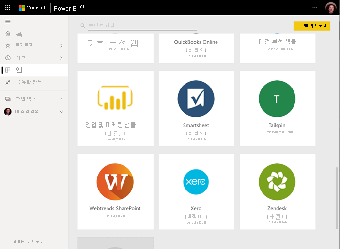
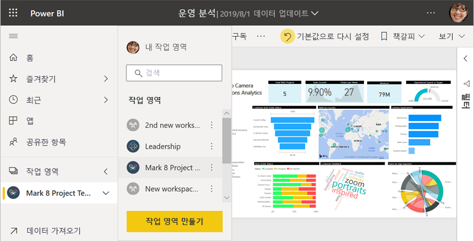
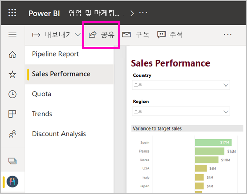
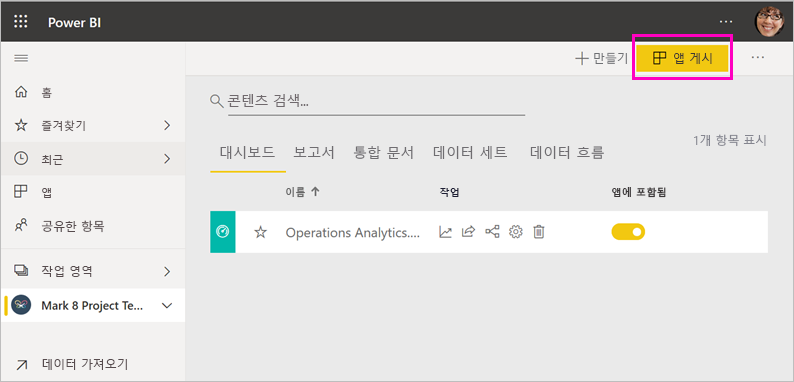
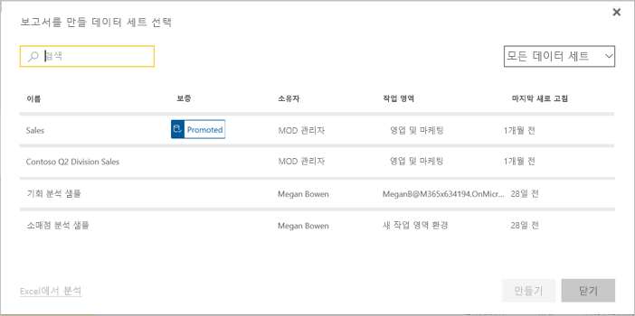

# Power BI에서 협업 및 공유하는 방법

대시보드 및 보고서를 만들었습니다. 아마도 동료와의 협업이 필요할 수 있습니다. 또는 더 널리 배포할 준비가 되었을 수 있습니다. 협업하고 보고서를 공유하는 가장 좋은 방법은 무엇일까요? 이 문서에서는 사용자가 선택할 수 있는 옵션을 비교합니다.

*Power BI 서비스의 앱*

**협업**

- 작업 영역에서 동료와 협업하여 의미 있는 보고서와 대시보드를 만듭니다.
- Microsoft Teams에서 협업합니다.

**대시보드 및 보고서 배포 또는 공유**

- 내 작업 영역 또는 다른 작업 영역에서 대시보드 또는 보고서를 공유합니다.
- Power BI 모바일 앱에서 주석을 달고 공유합니다.
- 작업 영역의 대시보드 및 보고서를 앱으로 번들링하고 더 큰 규모의 그룹이나 전체 조직에 배포합니다.
- 보안 포털 또는 공용 웹 사이트에 보고서를 포함합니다.
- 보고서를 인쇄합니다.
- Microsoft AppSource를 통해 외부 Power BI 사용자에게 배포할 수 있는 *템플릿 앱* 을 만듭니다.
 
**데이터 공유**

- 동료가 자신의 고유한 작업 영역에서 자신의 보고서에 대한 기준으로 사용할 수 있는 공유 데이터 세트를 만듭니다.
- 공통 데이터 원본을 공유하는 방법으로 데이터 흐름을 만듭니다.

선택하는 옵션에 상관 없이 콘텐츠를 공유하려면 [Power BI Pro 라이선스](../fundamentals/service-features-license-type.md)가 필요하거나 콘텐츠가 [프리미엄 용량](../admin/service-premium-what-is.md)에 있어야 합니다. 선택한 옵션에 따라 콘텐츠를 보는 동료에 대해 라이선스 요구 사항이 달라집니다. 다음 섹션에 자세한 내용이 나와 있습니다. 

## 작업 영역에서 협업

팀이 함께 작업하는 경우 간편하게 협업할 수 있도록 동일한 문서에 액세스해야 합니다. Power BI 작업 영역에서 팀은 대시보드, 보고서, 데이터 세트 및 통합 문서의 소유권 및 관리를 공유합니다. 경우에 따라 Power BI 사용자는 조직 구조에 따라 해당 작업 영역을 구성하거나 특정 프로젝트를 위한 작업 영역을 만듭니다. 다른 조직에서는 작업 영역을 사용하여 사용할 다양한 버전의 보고서 또는 대시보드를 저장합니다. 

작업 영역은 동료가 가진 사용 권한을 결정하는 역할을 제공합니다. 이러한 역할을 사용하여 작업 영역을 관리하거나, 콘텐츠를 편집 또는 배포하거나, 단지 콘텐츠를 볼 수 있는 사람을 결정할 수 있습니다. [새 작업 영역의 역할](service-new-workspaces.md#roles-in-the-new-workspaces)에 대해 자세히 알아보세요.

작업 영역은 콘텐츠의 공동 소유권을 허용하기 때문에 내 작업 영역보다 협업에 더 적합합니다. 사용자 및 전체 팀은 쉽게 업데이트를 수행하거나 다른 사용자에게 액세스 권한을 제공할 수 있습니다. 내 작업 영역은 일회성 또는 개인 콘텐츠에서 개별 사용자에 의해 사용되기에 적합합니다.

이제 동료와 공유해야 할 대시보드가 완료되었다고 가정합니다. 대시보드에 대한 액세스 권한을 제공하는 가장 좋은 방법은 무엇인가요? 대답은 다양한 요인에 따라 다릅니다. 

- 동료가 대시보드를 최신 상태로 유지하거나 작업 영역의 모든 콘텐츠에 대한 액세스가 필요한 경우 동료를 구성원 또는 참가자로 작업 영역에 추가합니다. 
- 동료가 작업 영역에서 콘텐츠를 보기만 해야 하는 경우 동료를 보기 권한자로 추가합니다.
- 동료가 작업 영역에 있는 모든 콘텐츠가 아니라 대시보드만 보면 되는 경우 대시보드를 직접 공유할 수 있습니다.
- 해당 대시보드가 많은 동료에게 배포해야 하는 대시보드 및 보고서 집합의 일부인 경우 앱을 게시하는 것이 가장 좋습니다.

[새 작업 영역을 만드는](service-create-the-new-workspaces.md) 방법을 자세히 알아보세요. 

## Microsoft Teams에서 협업

Power BI 보고서 및 Power BI 페이지를 매긴 보고서를 Microsoft Teams에 포함하여 조직에서 데이터 기반 협업을 늘립니다. Power BI 서비스에는 보고서에 대한 **Teams에서 공유** 단추가 있습니다. 개별 보고서에 대한 별도의 Power BI 탭을 추가하고 각 탭에 보고서 이름 또는 다른 이름을 지정할 수 있습니다. 

Power BI 보고서 탭을 Microsoft Teams에 추가하면 Teams에서 보고서에 대한 탭 대화를 자동으로 만듭니다. 해당 Microsoft Teams 채널의 모든 사용자가 대화에서 보고서를 보고 토론할 수 있습니다. 

:::image type="content" source="media/service-how-to-collaborate-distribute-dashboards-reports/power-bi-teams-conversation-tab.png" alt-text="Microsoft Teams 대화 탭":::

자세한 내용은 [Power BI를 사용하여 Microsoft Teams에서 협업](service-collaborate-microsoft-teams.md)을 참조하세요.

## 대시보드 및 보고서 공유

Power BI Desktop에서 보고서를 완성하여 다른 사용자가 액세스할 수 있도록 하려는 경우를 가정해 보겠습니다. 이렇게 하는 한 가지 방법은 Power BI 서비스에서 공유하는 것입니다. 내 작업 영역 또는 다른 작업 영역에 보고서를 게시합니다. 보고서와 함께 대시보드를 만들거나 이미 만들었을 수 있습니다.

콘텐츠를 공유하려면 Power BI Pro 라이선스가 필요합니다. 콘텐츠를 공유받는 사람도 라이선스가 필요합니다. 또는 콘텐츠가 [프리미엄 용량](../admin/service-premium-what-is.md)의 작업 영역에 있어야 합니다. 대시보드 또는 보고서를 공유할 경우 받는 사람은 대시보드 또는 보고서를 보고 상호 작용할 수 있습니다. 받는 사람에게 권한을 부여할 경우 받는 사람은 대시보드 또는 보고서를 편집하고, 복사본을 만들고, 자신의 동료와 공유할 수 있습니다. 공유자가 대시보드 또는 보고서에서 보는 것과 동일한 데이터가 표시됩니다. [RLS(행 수준 보안)](../admin/service-admin-rls.md)가 적용되지 않는 한, 기본 데이터 세트의 모든 데이터에 액세스할 수 있습니다.

조직 외부 사용자와도 공유할 수 있습니다. 외부 사용자는 대시보드 또는 보고서를 보고 상호 작용할 수는 있지만 공유는 할 수 없습니다. 

Power BI 서비스에서 [대시보드 및 보고서를 공유](service-share-dashboards.md)하는 방법을 자세히 알아보세요. 또는 링크에 필터를 추가하고 [보고서의 필터링된 보기를 공유](service-share-reports.md)하는 방법을 자세히 알아보세요.

## Power BI 모바일 앱에서 주석 달기 및 공유

iOS 및 Android 디바이스용 Power BI 모바일 앱에서 타일, 보고서 또는 시각적 개체에 주석을 달 수 있으며 전자 메일을 통해 다른 사람과 공유할 수 있습니다.

타일, 보고서 또는 시각적 개체의 스냅샷을 공유하고 있습니다. 메일을 보낸 당시의 스냅샷 그대로 받는 사람이 볼 수 있습니다. 메일에는 대시보드 또는 보고서에 대한 링크가 포함되어 있습니다. Power BI Pro 라이선스가 있거나 콘텐츠가 [프리미엄 용량](../admin/service-premium-what-is.md)에 있고 이미 다른 사람과 공유했다면 다른 사람이 열 수 있습니다. 타일의 스냅샷은 동일한 메일 도메인의 동료뿐만 아니라 누구에게든 보낼 수 있습니다.

자세한 내용은 iOS 및 Android 모바일 앱에서 [타일, 보고서 및 시각적 개체 주석 달기 및 공유](../consumer/mobile/mobile-annotate-and-share-a-tile-from-the-mobile-apps.md)를 참조하세요.

또한 Windows 10 디바이스용 Power BI 앱에서 [타일의 스냅샷을 공유](../consumer/mobile/mobile-windows-10-phone-app-get-started.md)할 수 있습니다. 그러나 주석을 달 수는 없습니다.

## 앱의 인사이트 배포

조직의 광범위한 대상에 대시보드를 배포하려 한다고 가정해 봅시다. 사용자는 동료와 *작업 영역* 을 만든 다음, 작업 영역에서 대시보드, 보고서 및 데이터 세트를 만들고 다듬었습니다. 이제 그룹이나 전체 조직에 대해 앱으로 게시할 대시보드 및 보고서를 선택합니다.

앱은 Power BI 서비스([https://app.powerbi.com](https://app.powerbi.com))에서 쉽게 찾아 설치할 수 있습니다. 앱에 대한 직접 링크를 비즈니스 사용자에게 보내거나, 해당 사용자가 AppSource에서 해당 앱을 검색할 수 있습니다. Power BI 관리자가 권한을 부여한 경우 동료의 Power BI 계정에 해당 앱을 자동으로 설치할 수 있습니다. [앱에 게시](service-create-distribute-apps.md)하는 방법을 자세히 알아보세요.

앱을 설치한 후에 브라우저 또는 모바일 디바이스에서 볼 수 있습니다.

사용자가 앱을 보려면 사용자에게도 Power BI Pro 라이선스가 있거나 앱을 Power BI 프리미엄 용량에 저장해야 합니다. 자세한 내용은 [Power BI 프리미엄이란?](../admin/service-premium-what-is.md)을 참조하세요.

조직 외부의 사용자에게도 앱을 게시할 수 있습니다. 외부 사용자는 앱 콘텐츠를 보고 상호 작용할 수는 있지만 다른 사용자와 공유할 수는 없습니다. 이제 모든 템플릿 앱을 만들고 모든 Power BI 고객에게 배포할 수 있습니다.

## 보안 포털 또는 공용 웹 사이트에 보고서 포함

### 보안 포털에 포함

Power BI 보고서를 사용자가 볼 것으로 예상되는 포털 또는 웹 사이트에 포함할 수 있습니다.  
Power BI 서비스의 **SharePoint Online에 포함** 및 **포함** 옵션을 사용하면 내부 사용자를 위해 보고서를 안전하게 포함할 수 있습니다. 선택하는 옵션에 관계없이 Power BI는 사용자가 콘텐츠를 보기 전에 모든 사용 권한 및 데이터 보안을 적용합니다. 보고서를 보는 사람은 적절한 라이선스가 필요합니다.  

- **SharePoint Online에 포함** 은 SharePoint Online용 Power BI 웹 파트에서 작동합니다. 보고서가 포함되는 방법에 대한 제어를 사용하여 Single Sign-On 환경을 제공합니다. 자세한 내용은 [SharePoint Online에 포함](service-embed-report-spo.md)을 참조하세요.
- **포함** 은 URL 또는 iFrame을 사용하여 포함 콘텐츠를 지원하는 모든 포털 또는 웹 사이트에서 작동합니다. 자세한 내용은 [포함](service-embed-secure.md) 옵션을 참조하세요.

### 공용 웹 사이트에 게시

**웹에 게시** 를 사용하면 블로그 게시물, 웹 사이트, 소셜 미디어 및 기타 온라인 통신에 시각화를 포함하여 전체 인터넷에 Power BI 보고서를 게시할 수 있습니다. 보고서는 인터넷 상의 누구든지 볼 수 있으며, 자신이 게시한 것을 볼 수 있는 사람을 제어할 수는 없습니다. 보는 사람은 Power BI 라이선스가 필요하지 않습니다. 자신이 편집할 수 있는 보고서만 웹에 게시할 수 있습니다. 자신과 공유되지 않았거나 앱에 없는 보고서는 웹에 게시할 수 없습니다. [웹에 게시](service-publish-to-web.md)하는 방법을 자세히 알아보세요.

>[!Warning]
>[웹에 게시](service-publish-to-web.md)를 사용해야만 콘텐츠를 내부가 아닌 공개적으로 공유합니다.

## PDF 또는 기타 정적 파일로 저장 또는 인쇄

Power BI 서비스에서 다음 항목 중 하나를 인쇄하거나 PDF로 저장하거나 다른 정적 파일 형식으로 저장할 수 있습니다.

- 전체 대시보드
- 대시보드 타일
- 보고서 페이지
- 페이지 번호를 매긴 보고서
- Power BI 서비스의 시각화. 

Power BI 보고서는 한 번에 한 페이지만 인쇄할 수 있습니다. 전체 보고서를 한 번에 인쇄할 수는 없습니다. [보고서 또는 대시보드를 정적 파일로 인쇄하거나 저장](../consumer/end-user-print.md)하는 방법을 자세히 알아보세요.

반면에 페이지가 매겨진 보고서는 인쇄하도록 설계되었습니다. 자세한 내용은 [Power BI 보고서와 페이지를 매긴 보고서 비교](../paginated-reports/paginated-reports-report-builder-power-bi.md#compare-power-bi-reports-and-paginated-reports)를 참조하세요. 

## 템플릿 앱 만들기 및 배포

*템플릿 앱* 은 공개적으로, 종종 Microsoft AppSource에 배포되도록 설계되었습니다. 앱을 구축하고, 거의 또는 전혀 코딩을 사용하지 않고 모든 Power BI 고객에게 배포할 수 있습니다. 고객은 자신의 데이터에 연결하고 자신의 계정을 인스턴스화합니다. [Power BI 템플릿 앱](../connect-data/service-template-apps-overview.md)에 대해 자세히 알아봅니다.

## 데이터 세트 공유

사실 일부 사용자는 자신의 보고서에서 고품질의 잘 설계된 데이터 모델을 만드는 데 더 능숙합니다. 아마도 본인이 이에 해당할 수 있습니다. 전체 조직은 동일한 잘 설계된 데이터 모델을 사용하여 이점을 얻을 수 있습니다. *공유 데이터 세트는* 해당 역할을 채웁니다. 모든 사용자가 사용해야 하는 데이터 모델을 사용하여 보고서를 만들 때 해당 보고서를 Power BI 서비스에 저장하고 올바른 사용자에게 사용할 권한을 부여할 수 있습니다. 그런 다음, 데이터 세트에서 해당 보고서를 작성할 수 있습니다. 이런 방식으로 모든 사용자는 자신의 보고서를 동일한 데이터를 기반으로 하며, 동일한 "버전의 사실"을 봅니다.

[공유 데이터 세트 만들기 및 사용](../connect-data/service-datasets-across-workspaces.md)에 대해 자세히 알아봅니다.

## 데이터 흐름 만들기

데이터 흐름은 개별 원본의 데이터를 통합하고 모델링을 준비하는 셀프서비스 방식입니다. 분석가는 빅 데이터를 수집, 변환, 통합 및 보강하기 위한 데이터 흐름을 만듭니다. Power BI 서비스의 작업 영역에서 데이터 흐름을 만들고 관리합니다. [데이터 흐름을 사용하여 셀프서비스 데이터 준비](../transform-model/dataflows/dataflows-introduction-self-service.md)에 대해 자세히 알아보세요.

## 고려 사항 및 제한 사항

- Power BI Report Server에서는 보고서를 공유할 수 없습니다. 대신 [사용자 자신 또는 다른 사용자를 위한 구독](/sql/reporting-services/working-with-subscriptions-web-portal)을 만들 수 있습니다.

## 다음 단계

- [동료 및 다른 사용자와 대시보드 공유](service-share-dashboards.md)
- [Power BI에서 앱 만들기 및 게시](service-create-distribute-apps.md)
- [보안 포털 또는 웹 사이트에 보고서 포함](service-embed-secure.md)

의견이 있으신가요? 제안 사항이 있으시면 [Power BI 커뮤니티 사이트](https://community.powerbi.com/)를 방문하세요.

궁금한 점이 더 있나요? [Power BI 커뮤니티를 이용하세요.](https://community.powerbi.com/)