# 새 작업 영역 환경에서 사용량 메트릭 모니터링

콘텐츠가 사용되는 방식을 알고 있으면 영향을 보여 주고 활동의 우선 순위를 정하는 데 도움이 됩니다. 사용 메트릭은 보고서 중 하나가 조직의 거대한 세그먼트에 의해 매일 사용되는 것을 보여 주고 사용자가 만든 대시보드를 전혀 보고 있지 않는 것을 보여 줄 수 있습니다. 이러한 유형의 피드백은 작업 활동 안내에 유용합니다.

최신 작업 영역에서 보고서를 만드는 경우 조직 전체에서 해당 보고서가 어떻게 사용되는지 그리고 누가 사용하는지 검색할 수 있는 향상된 사용량 메트릭 보고서에 액세스할 수 있습니다. 또한 상위 수준 성능 문제를 식별할 수 있습니다. 최신 작업 영역 환경의 향상된 사용량 보고서는 [Power BI 대시보드 및 보고서용 사용량 메트릭 모니터링](service-usage-metrics.md)에 설명된 기존 사용량 메트릭 보고서를 대체합니다.

> [!NOTE]
> Power BI 서비스에서는 사용 메트릭 보고서를 실행할 수만 있습니다. 그러나, 사용 메트릭 보고서를 저장하거나 대시보드에 고정하는 경우 모바일 디바이스에서 해당 보고서를 열고 상호 작용할 수 있습니다.

## 필수 조건

- 사용 메트릭 데이터를 실행하고 액세스하려면 Power BI Pro 라이선스가 필요합니다. 단, 사용 메트릭 기능은 할당된 라이선스에 상관없이 모든 사용자의 사용 정보를 캡처합니다.
- 보고서를 위한 향상된 사용량 메트릭에 액세스하려면 보고서가 최신 작업 영역에 있어야 하고 해당 보고서에 대한 편집 권한이 있어야 합니다.
- Power BI 관리자가 콘텐츠 작성자에 대해 사용량 메트릭을 사용 설정해 두었어야 합니다. Power BI 관리자가 사용량 메트릭에서 사용자별 데이터 수집을 사용 설정해 두었을 수도 있습니다. [관리 포털에서 이러한 옵션을 사용하도록 설정](../admin/service-admin-portal.md#control-usage-metrics)하는 방법을 알아보세요.

## 향상된 사용량 메트릭 보고서 만들기 및 보기

관리자, 구성원 또는 참가자 권한이 있는 사용자만 향상된 사용량 메트릭 보고서를 볼 수 있습니다. 뷰어 권한이 충분하지 않습니다. 보고서가 있는 최신 작업 영역에 대한 참가자가 하나 이상 있는 경우 다음 절차를 사용하여 향상된 사용량 메트릭을 표시할 수 있습니다.

1. 사용량 메트릭을 분석하려는 보고서가 포함되어 있는 작업 영역을 엽니다.
2. 작업 영역 콘텐츠 목록에서 보고서의 상황에 맞는 메뉴를 열고 **사용량 메트릭 보고서 보기**를 선택합니다. 또는 보고서를 열고 명령 모음에서 상황에 맞는 메뉴를 연 다음 **사용량 메트릭**을 선택합니다.

    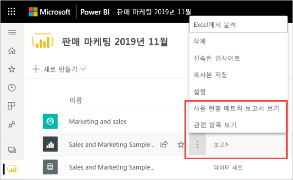

1. 처음에 이를 수행하면 Power BI에서 사용 메트릭 보고서를 만들고 준비되면 사용자에게 알려줍니다.

    

1. 결과를 보려면 **사용 메트릭 보기**를 선택합니다.
2. 이 작업을 처음으로 수행하는 경우 Power BI가 이전 사용량 메트릭 보고서를 열 수 있습니다. 향상된 사용량 메트릭 보고서를 표시하려면 오른쪽 위 모서리에서 새 사용량 보고서 해제 스위치를 **켜기**로 전환합니다.

    

    > [!NOTE]
    > 보고서가 최신 작업 영역에 있는 경우에만 새 사용량 보고서 스위치가 표시됩니다. 레거시 작업 영역은 향상된 사용량 메트릭 보고서를 제공하지 않습니다.

## 향상된 사용량 메트릭 보고서 정보

위의 절차를 수행하여 향상된 사용량 메트릭 보고서를 표시하면 Power BI는 지난 30일 동안 해당 콘텐츠에 대한 사용량 메트릭이 포함된 미리 작성된 보고서를 생성합니다. 이 보고서는 이미 익숙한 Power BI 보고서와 비슷합니다. 최종 사용자가 액세스를 부여받은 방법(웹 또는 모바일 앱 등을 통해 액세스했는지 여부)에 따라 조각화할 수 있습니다. 보고서가 변경되면 사용량 메트릭 보고서도 변경되며 매일 새 데이터로 업데이트됩니다.

> [!NOTE]
> 사용량 메트릭 보고서는 최근, 작업 영역, 즐겨찾기 또는 기타 콘텐츠 목록에 표시되지 않으며, 앱에 추가할 수 없습니다. 사용 메트릭 보고서에서 타일을 대시보드에 고정할 경우 해당 대시보드를 앱에 추가할 수 없습니다.

### 사용량 메트릭 보고서 데이터 세트

향상된 사용량 메트릭 보고서는 사용량 메트릭 보고서 데이터 세트를 기반으로 하며, 이 데이터 세트는 향상된 사용량 메트릭 보고서를 처음 시작할 때 Power BI가 자동으로 생성합니다. 그런 다음 Power BI가 데이터 세트를 매일 새로 고침합니다. 새로 고침 일정을 변경할 수는 없지만, Power BI가 사용량 메트릭 데이터를 새로 고치는 데 사용하는 자격 증명을 업데이트할 수는 있습니다. 자격 증명이 만료된 경우 또는 데이터 세트가 있는 작업 영역에서 사용량 메트릭 보고서를 처음 시작한 사용자를 제거한 경우 예약된 새로 고침을 다시 시작해야 할 수 있습니다.

### 사용량 메트릭 보고서 페이지

향상된 사용량 메트릭 보고서에는 다음과 같은 보고서 페이지가 포함되어 있습니다.

- **보고서 사용량**    보고서 뷰 및 보고서 뷰어에 대한 정보를 제공합니다(예: 날짜별로 보고서를 본 사용자 수).
- **보고서 성능**    소비 방법 및 브라우저 유형에 따라 세분화된 일반적인 보고서 열기 시간을 보여 줍니다.
- **FAQ**    자주 묻는 질문과 답변을 제공합니다(예: "뷰어"란 무엇이고 "뷰"란 무엇인가요?).

### 보고되는 메트릭은 무엇인가요?

| **호출** | **메트릭** | **설명** |
| --- | --- | --- |
| 보고서 사용량 | 보고서 뷰 | 보고서 뷰는 누군가가 보고서를 열 때마다 기록됩니다. 뷰의 정의는 이전 사용량 메트릭 보고서와 다릅니다. 보고서 페이지를 변경하는 것은 더 이상 추가 뷰로 간주되지 않습니다. |
| 보고서 사용량 | 고유한 뷰어 | 뷰어는 해당 기간 동안 한 번 이상 보고서를 연 사람입니다(AAD 사용자 계정 기준). |
| 보고서 사용량 | 뷰 추세 | 뷰 추세는 시간 경과에 따른 뷰 수 변화를 반영합니다. 이 추세는 선택한 기간의 전반부와 후반부를 비교합니다. |
| 보고서 사용량 | 날짜 슬라이서 | 보고서 사용량 페이지에서 주별 또는 격주 추세 등을 계산하기 위한 기간을 변경할 수 있습니다. 보고서 사용량 페이지의 왼쪽 아래 모서리에서 선택한 보고서에 사용할 수 있는 사용량 데이터에 대해 시작 날짜와 종료 날짜를 결정할 수 있습니다. |
| 보고서 사용량 | 순위 | 뷰 수에 따라 순위는 조직의 다른 모든 보고서와 비교하여 보고서의 인기도를 표시합니다.   |
| 보고서 사용량 | 일별 보고서 뷰 | 일별 총 뷰 수입니다. |
| 보고서 사용량 | 일별 보고서 뷰어 | 보고서를 본 사용자의 총 수입니다(AAD 사용자 계정 기준). |
| 보고서 사용량 | 배포 방법 | 사용자가 작업 영역의 구성원이 되거나, 보고서를 공유하거나, 앱을 설치하는 등의 방법으로 보고서에 액세스한 방법입니다. |
| 보고서 사용량 | 플랫폼 슬라이서 | Power BI 서비스(powerbi.com), Power BI Embedded 또는 모바일 디바이스를 통해 보고서에 액세스했는지 여부입니다. |
| 보고서 사용량 | 보고서 뷰가 있는 사용자 | 보고서를 연 사용자의 목록을 뷰 수 기준으로 정렬하여 표시합니다. |
| 보고서 사용량 | 페이지 | 보고서에 두 개 이상의 페이지가 있는 경우 표시된 페이지에서 보고서를 분할합니다. “비어 있음” 목록 옵션이 표시되면 보고서 페이지가 최근에 추가 및/또는(24시간 이내에 새 페이지의 실제 이름이 슬라이서 목록에 표시됨) 보고서 페이지가 삭제되었음을 의미합니다. “비어 있음”은 이러한 상황을 캡처합니다. |
| 보고서 성능 | 일반적인 열기 시간 | 일반적인 보고서 열기 시간은 보고서를 여는 데 걸리는 시간의 50번째 백분위 수에 해당합니다. 즉, 보고서 열기 작업의 50% 이하가 완료된 시간입니다. 또한 보고서 성능 페이지는 소비 방법 및 브라우저 유형별로 일반적인 보고서 열기 시간을 구분합니다.   |
| 보고서 성능 | 열기 시간 추세 | 열기 시간 추세는 시간 경과에 따라 보고서 열기 성능 변화를 반영합니다. 선택한 기간의 전반부의 보고서 열기 시간을 후반부의 열기 시간과 비교합니다. |
| 보고서 성능 | 날짜 슬라이서 | 보고서 성능 페이지에서 주별 또는 격주 추세를 계산하는 등의 기간을 변경할 수 있습니다. 보고서 성능 페이지의 왼쪽 아래 모서리에서 선택한 보고서에 사용할 수 있는 사용량 데이터에 대해 시작 날짜와 종료 날짜를 결정할 수 있습니다. |
| 보고서 성능 | 일별 성능 | 개별 날짜에 대해 계산된 보고서 열기 작업의 10%, 50% 및 90%에 대한 성능입니다. |
| 보고서 성능 | 7일간 성능 | 각 날짜에 대해 지난 7일 동안 계산된 보고서 열기 작업의 10%, 50% 및 90%에 대한 성능입니다. |
| 보고서 성능 | 소비 방법 | 사용자가 보고서를 연 방법입니다(예: Power BI 서비스(powerbi.com), Power BI Embedded 또는 모바일 디바이스를 사용). |
| 보고서 성능 | 브라우저 | 사용자가 보고서를 여는 데 사용한 브라우저입니다(예: Firefox, Microsoft Edge, Chrome). |

## 사용량 메트릭 보고서 자격 증명 업데이트

다음 절차를 사용하여 사용량 메트릭 보고서 데이터 세트를 가져오고 자격 증명을 업데이트할 수 있습니다.

1. 사용량 메트릭 보고서 데이터 세트를 업데이트하려는 보고서가 포함되어 있는 작업 영역을 엽니다.
2. 상단의 검은색 머리글 표시줄에서 **설정** 아이콘을 선택하고 **설정**을 선택합니다.

    

3. **데이터 세트** 탭으로 전환합니다.

1. 사용량 메트릭 보고서 데이터 세트를 선택합니다. 

    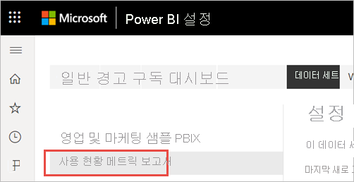
    
    현재 데이터 세트 소유자가 아닐 경우 데이터 원본 자격 증명을 업데이트하려면 소유권을 가져와야 합니다. 
    
5. **인수** 단추를 선택하고 **데이터 세트 인수 설정** 대화 상자에서 **인수**를 선택합니다.

1. **데이터 원본 자격 증명**에서 **자격 증명 편집**을 선택합니다.

    

2. **사용량 메트릭 보고서 구성** 대화 상자에서 **로그인**을 선택합니다.

    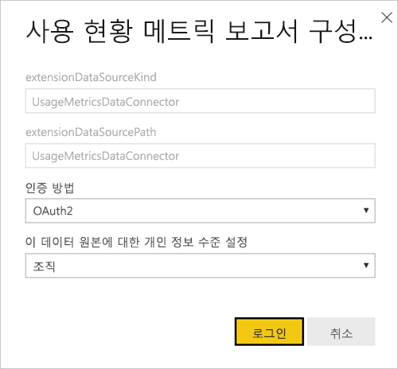

1. 로그인 시퀀스를 완료하고 데이터 원본이 성공적으로 업데이트되었다는 알림을 확인합니다.

    > [!NOTE]
    > 사용량 메트릭 보고서 데이터 세트에는 지난 30일 동안의 사용량 데이터가 포함되어 있습니다. 새 사용량 데이터를 가져오는 데 최대 24시간이 걸릴 수 있습니다. Power BI 사용자 인터페이스를 사용하여 수동 새로 고침을 트리거할 수 없습니다.

## 사용량 메트릭 보고서 사용 안 함

사용량 메트릭 보고서는 Power BI 또는 전역 관리자가 켜거나 끌 수 있는 기능입니다. 관리자는 사용자가 사용 메트릭에 대한 액세스를 갖는지 세부적으로 제어합니다. 기본적으로 조직의 모든 사용자에 대해 적용됩니다. 설정에 대한 자세한 내용은 관리 포털 문서에서 [사용 메트릭 제어](../admin/service-admin-portal.md#control-usage-metrics)를 참조하세요.

> [!NOTE]
> Power BI 테넌트 관리자만 관리 포털을 보고 설정을 편집할 수 있습니다.

## 사용량 메트릭 보고서에서 사용자 정보 제외

기본적으로 사용자별 데이터는 사용량 메트릭에서 활성화되어 있고 메트릭 보고서에는 콘텐츠 소비자 계정 정보가 포함됩니다. 관리자가 일부 또는 모든 사용자에 대해 이 정보를 표시하지 않으려는 경우, 지정된 보안 그룹 또는 전체 조직에 대한 Power BI 관리자 포털 테넌트 설정에서 콘텐츠 작성자에 대한 사용량 메트릭에 사용자별 데이터를 사용하지 않도록 설정하여 사용량 보고서에서 사용자 정보를 제외할 수 있습니다.

1. 관리 포털의 **테넌트 설정** 탭의 **감사 및 사용량 설정**에서 **콘텐츠 작성자에 대한 메트릭의 사용자별 데이터**를 확장하고 **사용 안 함**을 선택합니다.

2. **현재 사용량 메트릭 콘텐츠의 모든 기존 사용자별 데이터 삭제** 여부를 결정하고 **적용**을 선택합니다.

    

사용자 정보를 제외하면 사용량 보고서는 사용자를 이름 없음으로 나타냅니다.

전체 조직에 대한 사용량 메트릭을 사용 안 하면 관리자는 기존 사용량 메트릭 콘텐츠 모두 삭제 옵션을 사용하여 사용량 메트릭 보고서를 사용하여 빌드한 기존 보고서 및 대시보드 타일을 모두 삭제할 수 있습니다. 이 옵션은 이미 사용량 메트릭을 사용 중일 수도 있는 조직의 모든 사용자에게서 사용량 메트릭 데이터에 대한 모든 액세스를 제거합니다. 기존 사용 메트릭 콘텐츠 삭제는 되돌릴 수 없습니다.

> [!NOTE]
> Power BI 테넌트에 대한 관리자만이 관리 포털을 보고 콘텐츠 작성자에 대한 사용량 메트릭 설정에서 사용자별 데이터를 구성할 수 있습니다.

## 사용량 메트릭 보고서 사용자 지정

보고서 데이터를 자세히 살펴보거나 기본 데이터 세트를 바탕으로 자체 보고서를 작성하기 위해 몇 가지 옵션을 사용할 수 있습니다.

- **Power BI 서비스에서 [보고서의 복사본을 만듭니다](#create-a-copy-of-the-usage-report).**   **복사본 저장**을 사용하여 특정 요구에 맞게 사용자 지정할 수 있는 사용량 메트릭 보고서의 개별 인스턴스를 만듭니다.
- **새 보고서를 사용하여 [데이터 세트에 연결](#create-a-new-usage-report-in-power-bi-desktop)합니다.**   모든 작업 영역에 대해 앞의 [사용량 메트릭 보고서 데이터 세트](#usage-metrics-report-dataset) 섹션에서 설명한 대로 데이터 세트 이름은 "사용량 메트릭 보고서"입니다. Power BI Desktop을 사용하여 기본 데이터 세트를 바탕으로 사용자 지정 사용량 메트릭 보고서를 작성할 수 있습니다.
- **[Excel에서 분석을 사용](#analyze-usage-data-in-excel)합니다.**   Microsoft Excel 2010 SP1 이상에서 피벗 테이블, 차트 및 슬라이서 기능을 활용하여 Power BI 사용량 데이터를 분석할 수도 있습니다. [Excel에서 분석](service-analyze-in-excel.md) 기능에 대해 자세히 알아보세요.

### 사용량 보고서의 복사본 만들기

미리 작성된 읽기 전용 사용량 보고서의 복사본을 만들면 해당 보고서의 편집 가능한 인스턴스가 생성됩니다. 얼핏 보기에는 완전히 같아 보이지만 이 복사본에서는 편집용 보기로 보고서를 열고, 새 시각화, 필터 및 페이지를 추가하고, 기존 시각화를 수정하거나 삭제하는 등 많은 작업을 수행할 수 있습니다. 새 보고서는 현재 작업 영역에 저장됩니다.

1. 새 사용량 메트릭 보고서에서 **추가 옵션** 메뉴(...)를 선택하고 **복사본 저장**을 선택합니다.

    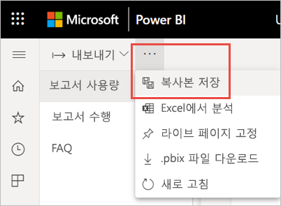

2. **보고서 저장** 대화 상자에서 이름을 입력하고 **저장**을 선택합니다.

    편집 가능한 Power BI 보고서가 생성되어 현재 작업 영역에 저장되고 보고서 복사본이 열립니다. 

3. **추가 옵션** 메뉴(...)를 선택하고 **편집**을 선택하여 편집용 보기로 전환합니다. 

    예를 들어 필터를 변경하고, 새 페이지를 추가하거나, 새 시각화를 빌드하고, 글꼴 및 색 서식을 지정할 수 있습니다.

1. 새 보고서가 현재 작업 영역의 보고서 탭에 저장되고 최근 콘텐츠 목록에 추가됩니다.

    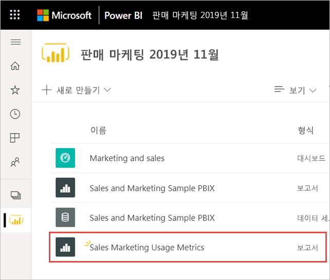

### Power BI Desktop에서 새 사용량 보고서 만들기

Power BI Desktop에서 사용량 메트릭 보고서 데이터 세트를 기반으로 새 사용량 보고서를 만들 수 있습니다. 사용량 메트릭 보고서 데이터 세트에 대한 연결을 설정하고 사용자 고유의 보고서를 만들려면 Power BI Desktop의 Power BI 서비스에 로그인해야 합니다. 

1. Power BI Desktop을 엽니다.

2. Power BI 서비스에 로그인하지 않은 경우 **파일** 메뉴에서 **로그인**을 선택합니다.

1. 사용량 메트릭 보고서 데이터 세트에 연결하려면 **홈** 리본에서 **데이터 가져오기**를 선택합니다.

4. 왼쪽 창에서 **Power Platform**을 선택한 다음 **Power BI 데이터 세트** > **연결**을 선택합니다.

    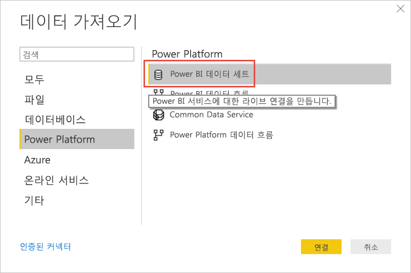

1. 원하는 데이터 세트로 스크롤하거나 검색 상자에 *사용량 메트릭 보고서*를 입력합니다. 

6. 작업 영역 열에서 올바른 데이터 세트를 선택했는지 확인한 다음 **만들기**를 선택합니다. 

    

7. 선택한 데이터 세트의 테이블, 열 및 측정값에 대 한 액세스를 제공하는 Power BI Desktop의 필드 목록을 확인합니다.

    

1. 이제 모두 동일한 사용량 메트릭 보고서 데이터 세트를 기반으로 사용자 지정 사용 보고서를 만들고 공유할 수 있습니다.

### Excel에서 사용량 데이터 분석

Excel에서 사용량 데이터에 연결하면 미리 정의된 측정값을 사용하는 피벗 테이블을 만들 수 있습니다. Excel 피벗 테이블은 Power BI 데이터 세트에 연결할 때 숫자 필드의 끌어서 놓기 집계를 지원하지 않습니다.

1. 먼저, 아직 수행하지 않은 경우 [사용량 메트릭 보고서의 복사본을 만듭니다](#create-a-copy-of-the-usage-report). 

2. 새 사용량 메트릭 보고서를 열고 **추가 옵션** 메뉴(...)를 선택한 다음 **Excel에서 분석**를 선택합니다.

    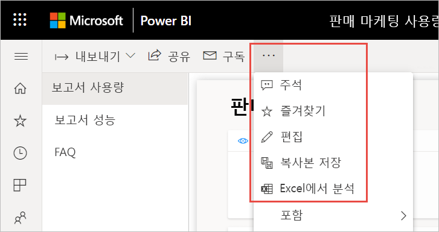

1. **먼저 몇 가지 Excel 업데이트를 수행해야 함** 대화 상자가 표시되는 경우 **다운로드**를 선택하고 Power BI 연결을 위한 최신 업데이트를 설치하거나 **이러한 업데이트를 이미 설치했음**을 선택합니다.

    

    > [!NOTE]
    > 일부 조직에서는 Excel에 필수 Excel에서 분석 업데이트 설치를 막는 그룹 정책 규칙이 있을 수 있습니다. 업데이트를 설치할 수 없는 경우 관리자에게 문의하세요.

1. 사용량 메트릭 보고서.odc 파일을 사용하여 수행할 작업을 묻는 브라우저 대화 상자에서 **열기**를 선택합니다.

    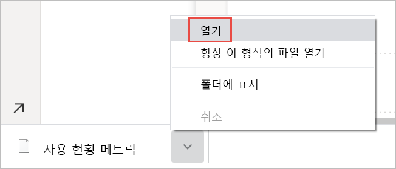

1. Power BI가 Excel을 시작합니다. .odc 파일의 파일 이름 및 경로를 확인한 다음 **사용**을 선택합니다.

    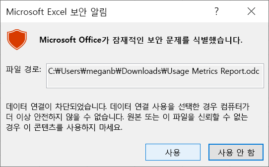

1. 이제 Excel이 열리고 빈 피벗 테이블이 있으므로 필드를 행, 열, 필터 및 값 상자로 끌어 사용량 데이터에 대한 사용자 지정 뷰를 만들 수 있습니다.

    

## 국가별 클라우드의 사용 메트릭

Power BI는 별도의 국가별 클라우드에서 사용할 수 있습니다. 이 클라우드는 서비스 제공, 데이터 보존, 액세스, 제어의 현지 규정을 위한 고유한 모델과 더불어 글로벌 버전의 Power BI와 동일한 수준의 보안, 개인 정보, 규정 준수, 투명성을 제공합니다. 지역 규정에 대한 이 고유한 모델로 인해 사용 메트릭을 국가별 클라우드에서 사용할 수 없습니다. 자세한 내용은 [국가별 클라우드](https://powerbi.microsoft.com/clouds/)를 참조하세요.

## 고려 사항 및 제한 사항

향상된 사용량 메트릭 보고서를 이전 버전과 비교할 때 차이점이 발생할 수 있음을 이해하는 것이 중요합니다. 특히 보고서 사용량 메트릭은 Power BI 서비스로부터 수집된 활동 데이터를 기반으로 합니다. 이전 버전의 사용량 메트릭 보고서에서는 클라이언트 원격 분석을 사용하는데, 이 데이터가 서비스로부터 수집된 사용량 메트릭과 항상 일치하지는 않습니다. 또한 향상된 사용량 메트릭 보고서에는 "뷰"에 대해 다른 정의가 사용됩니다. 뷰는 누군가가 보고서를 열 때마다 서비스에 기록되는 보고서 열기 이벤트입니다. 보고서 페이지를 변경하는 것은 더 이상 추가 뷰로 간주되지 않습니다.

> [!NOTE]
> 향상된 사용량 메트릭 보고서는 Power BI 서비스로부터 수집된 활동 데이터를 사용하기 때문에 이제 사용량 메트릭이 감사 로그 및 활동 로그에 있는 활동 수 집계와 일치합니다. 더 이상 일관되지 않은 네트워크 연결로 인한 활동 과소/과다 계산 때문에 뷰어 및 뷰 수가 왜곡되지 않습니다.

위와 같은 이전 및 향상된 사용량 메트릭 보고서 간 차이점 외에도 미리 보기 릴리스에 적용되는 다음 제한 사항에 유의하세요.

- 대시보드 사용량 메트릭은 이전 버전의 사용량 메트릭 보고서를 계속 사용합니다.
- 향상된 사용량 메트릭 보고서는 최신 작업 영역에 있는 보고서에만 사용할 수 있습니다. 레거시 작업 영역의 보고서는 이전 버전의 사용량 메트릭 보고서만 지원합니다.
- 보고서 성능 메트릭은 클라이언트 원격 분석을 기반으로 합니다. 특정 유형의 뷰는 성능 측정값에 포함되지 않습니다. 예를 들어 사용자가 이메일 메시지에서 보고서 링크를 선택하면 해당 뷰는 보고서 사용량에 포함되지만 성능 메트릭에는 이벤트가 아닙니다.
- 페이지를 매긴 보고서에는 보고서 성능 메트릭을 사용할 수 없습니다. 보고서 사용량 페이지의 페이지 탭과 보고서 성능 페이지의 차트는 이러한 보고서 유형에 대한 데이터를 표시하지 않습니다.
- 중첩된 그룹을 사용하는 경우 사용자 마스킹이 예상대로 작동하지 않습니다. 조직이 Power BI 관리 포털 테넌트 설정의 콘텐츠 작성자에 대한 사용량 메트릭의 사용자별 데이터를 사용하지 않도록 설정한 경우에는 최상위 수준의 구성원만 마스킹됩니다. 하위 그룹의 구성원은 계속 표시됩니다.
- 사용량 메트릭 보고서 데이터 세트를 초기화하는 데 몇 분 정도 걸릴 수 있습니다. Power BI 사용자 인터페이스가 새로 고침이 완료될 때까지 기다리지 않기 때문에 빈 사용량 메트릭 보고서를 표시합니다. 사용량 메트릭 보고서 데이터 세트 설정에서 새로 고침 기록을 확인하여 새로 고침 작업이 성공했는지 확인합니다.
- 새로 고침 중에 시간 초과가 발생하여 사용량 메트릭 보고서 데이터 세트를 초기화하지 못할 수 있습니다. 이 문제를 해결하려면 아래의 문제 해결 섹션을 참조하세요.

## 질문과 대답

위의 고려 사항 및 제한 사항 외에도 사용량 메트릭에 대한 다음 질문과 대답은 사용자 및 관리자에게 유용할 수 있습니다.

**Q:** 보고서에서 사용량 메트릭을 실행할 수 없습니다.

**A:** 소유권 또는 편집 권한이 있는 보고서에 대한 사용량 메트릭만 볼 수 있습니다.

**Q:** 기존 사용량 메트릭 보고서의 오른쪽 위 모서리에 있는 토글에 새 사용량 보고서가 보이지 않는 이유는 무엇인가요?

**A:** 향상된 사용량 메트릭 보고서는 최신 작업 영역에 있는 보고서에만 사용할 수 있습니다.

**Q:** 보고서가 포함되는 기간은 얼마입니까?

**A:** 사용량 보고서는 지난 30일 동안의 활동 데이터를 기반으로 하며 현재 날짜의 활동은 제외합니다. 보고서 사용량 페이지에서 날짜 슬라이서를 사용하여 기간 범위를 좁힐 수 있습니다(예: 지난 주 데이터만 분석).

**Q:** 가장 최근의 활동 데이터는 어디에 표시되나요?

**A:** 사용량 보고서에는 UTC 표준 시간대를 기준으로 직전일까지의 활동 데이터가 포함됩니다. 보고서에 표시되는 데이터는 데이터 세트에 대한 새로 고침 시간에도 영향을 받습니다. Power BI는 데이터 세트를 하루에 한 번 새로 고침합니다.

**Q:** 최신 상태의 데이터가 아닌 것 같습니다.

**A:** 새 활동 데이터가 사용량 보고서에 표시되는 데 최대 24시간이 걸릴 수 있습니다.

**Q:** 사용량 데이터의 데이터 원본은 무엇인가요?

**A:** 사용량 메트릭 보고서 데이터 세트는 사용자 지정 사용량 메트릭 데이터 커넥터를 사용하여 Power BI 내부 사용량 메트릭 저장소에서 데이터를 가져옵니다. 사용량 메트릭 보고서 데이터 세트 설정 페이지에서 사용량 메트릭 데이터 커넥터에 대한 자격 증명을 업데이트할 수 있습니다.

**Q:** 어떻게 데이터에 연결할 수 있나요? 또는 어떻게 기본 보고서를 변경할 수 있나요?

**A:** 미리 작성된 읽기 전용 사용량 보고서의 복사본을 만들 수 있습니다. 보고서 복사본은 동일한 사용량 메트릭 보고서 데이터 세트에 연결되며 보고서 세부 정보를 편집할 수 있습니다.

**Q:** "뷰어"란 무엇이고 "뷰"란 무엇인가요?

**A:** 뷰어는 해당 기간 동안 한 번 이상 보고서를 연 사람입니다. 뷰는 보고서 열기 이벤트입니다. 보고서 뷰는 누군가가 보고서를 열 때마다 기록됩니다.

뷰의 정의는 이전 사용량 메트릭 보고서와 다릅니다. 보고서 페이지를 변경하는 것은 더 이상 추가 뷰로 간주되지 않습니다.

**Q:** "뷰 추세"는 어떻게 계산되나요?

**A:** 뷰 추세는 시간 경과에 따른 뷰 수 변화를 반영합니다. 이 추세는 선택한 기간의 전반부와 후반부를 비교합니다. 보고서 사용량 페이지에서 날짜 슬라이서를 사용하여 주별 또는 격주 추세 등을 계산하기 위한 기간을 변경할 수 있습니다.

**Q:** "배포"와 "플랫폼"은 무엇을 의미하나요?

**A:** 배포는 뷰어가 보고서에 액세스하는 방법을 보여 줍니다(직접 공유, 작업 영역 액세스, 앱을 사용).

플랫폼은 뷰어가 보고서를 여는 데 사용한 기술을 나타냅니다(PowerBI.com, Mobile 또는 Embedded).

**Q:** 보고서 순위는 어떻게 작동하나요?

**A:** 뷰 수에 따라 순위는 조직의 다른 모든 보고서와 비교하여 보고서의 인기도를 표시합니다.

**Q:** "이름 없음 사용자"란 무엇인가요?

**A:** 조직은 사용량 보고서에서 사용자 정보를 제외하도록 결정할 수 있습니다. 사용자 정보를 제외하는 경우 사용량 보고서는 사용자를 이름 없음으로 표시합니다.

**Q:** "일반적인 보고서 열기 시간"이란 무엇인가요?

**A:** 일반적인 보고서 열기 시간은 보고서를 여는 데 걸리는 시간의 50번째 백분위 수에 해당합니다. 즉, 보고서 열기 작업의 50% 이하가 완료된 시간입니다. 또한 보고서 성능 페이지는 소비 방법 및 브라우저 유형별로 일반적인 보고서 열기 시간을 구분합니다.

**Q:** "열기 시간 추세"는 어떻게 계산되나요?

**A:** 열기 시간 추세는 시간 경과에 따라 보고서 열기 성능 변화를 반영합니다. 선택한 기간의 전반부의 보고서 열기 시간을 후반부의 열기 시간과 비교합니다. 보고서 성능 페이지에서 날짜 슬라이서를 사용하여 주별 또는 격주 추세 등을 계산하기 위한 기간을 변경할 수 있습니다.

**Q:**  이전 버전의 사용량 메트릭 보고서에는 4개의 보고서가 있지만 향상된 버전에는 3개만 표시됩니다.

**A:**  향상된 사용량 메트릭 보고서에는 지난 30일 동안 열린 보고서만 포함되며 이전 버전은 지난 90일을 포함합니다. 보고서가 향상된 사용량 메트릭 보고서에 포함되지 않은 경우 30일 넘게 사용되지 않은 것일 수 있습니다.

## 문제 해결: 데이터 세트 삭제

데이터 일관성 또는 새로 고침 문제가 의심되는 경우 기존 사용량 메트릭 보고서 데이터 세트를 삭제하는 것이 적절할 수 있습니다. 그런 다음 사용량 메트릭 보기를 다시 실행하여 연결된 향상된 사용량 메트릭 보고서에서 새 데이터 세트를 생성할 수 있습니다. 다음 단계를 수행합니다.

### 데이터 세트 삭제

1. 사용량 메트릭 보고서 데이터 세트를 초기화하려는 보고서가 포함되어 있는 작업 영역을 엽니다.

2. 상단의 검은색 머리글 표시줄에서 **설정** 아이콘을 선택하고 **설정**을 선택합니다.

    

3. **데이터 세트** 탭으로 전환하고 사용량 메트릭 보고서 데이터 세트를 선택합니다. 

    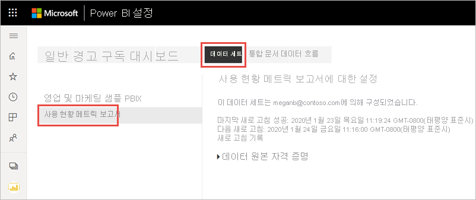

5. 브라우저의 주소 표시줄에 표시되는 URL에서 작업 영역 및 데이터 세트 ID를 복사합니다.

    

1. 브라우저에서 [https://docs.microsoft.com/rest/api/power-bi/datasets/deletedatasetingroup](https://docs.microsoft.com/rest/api/power-bi/datasets/deletedatasetingroup)으로 이동하여 **시도** 단추를 선택합니다.

    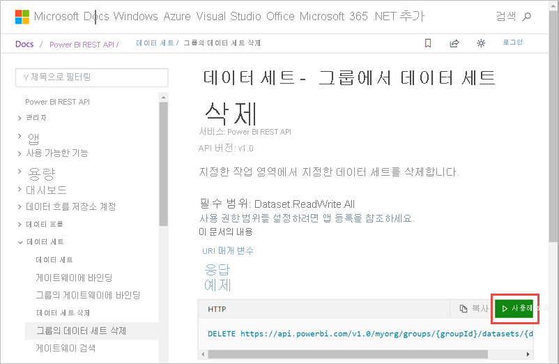

1. Power BI에 로그인하고 **groupId** 텍스트 상자에 작업 영역 ID, **datasetId** 텍스트 상자에 데이터 세트 ID를 붙여넣은 다음 **실행**을 선택합니다. 

    

1. **실행** 단추 아래에서 서비스가 응답 코드 **200**을 반환하는지 확인합니다. 이 코드는 데이터 세트 및 연결된 사용량 메트릭 보고서가 성공적으로 삭제되었음을 의미합니다.

    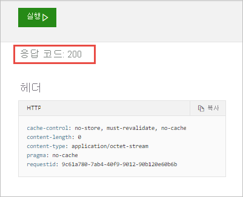

### 새 사용량 메트릭 보고서 만들기

1. Power BI 서비스로 돌아가면 데이터 세트가 없어진 것을 볼 수 있습니다.

    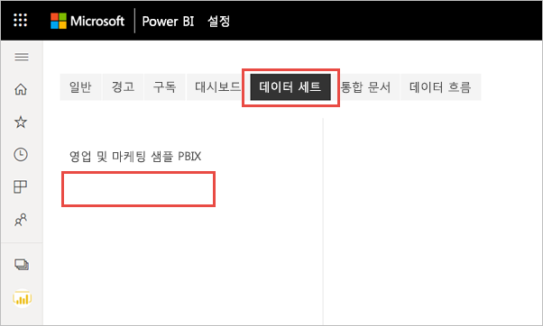

2. 보고서 목록에 사용량 메트릭 보고서가 계속 표시되면 브라우저를 새로 고침합니다.

3. [새 사용량 메트릭 보고서를 만듭니다](#create--view-an-improved-usage-metrics-report).

## 다음 단계

[관리 포털에서 Power BI 관리](../admin/service-admin-portal.md)

궁금한 점이 더 있나요? [Power BI 커뮤니티를 이용하세요.](https://community.powerbi.com/)
