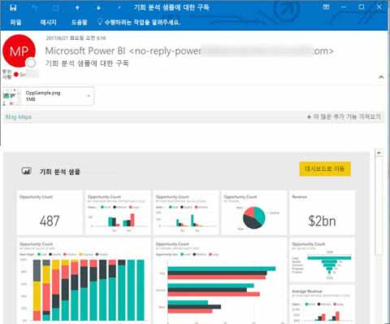
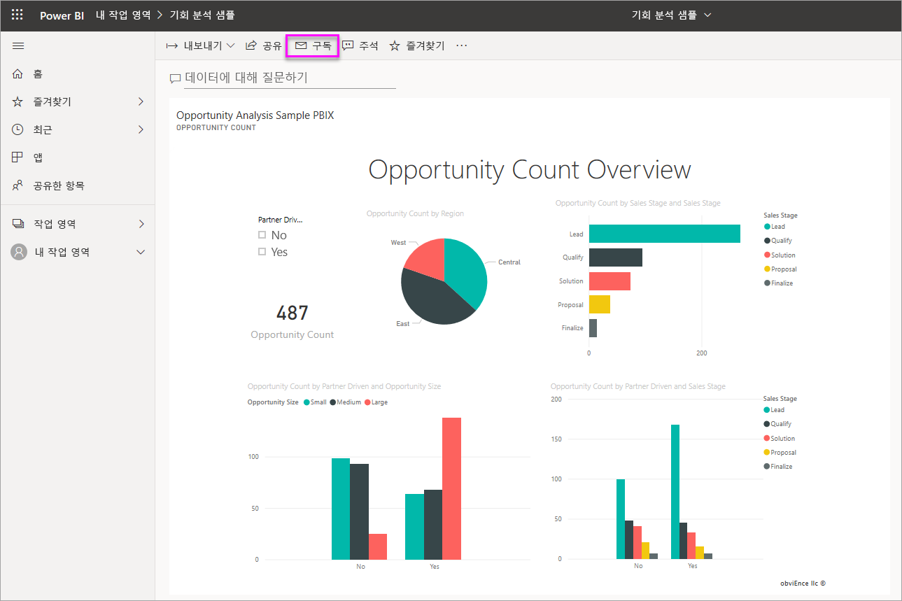
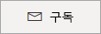
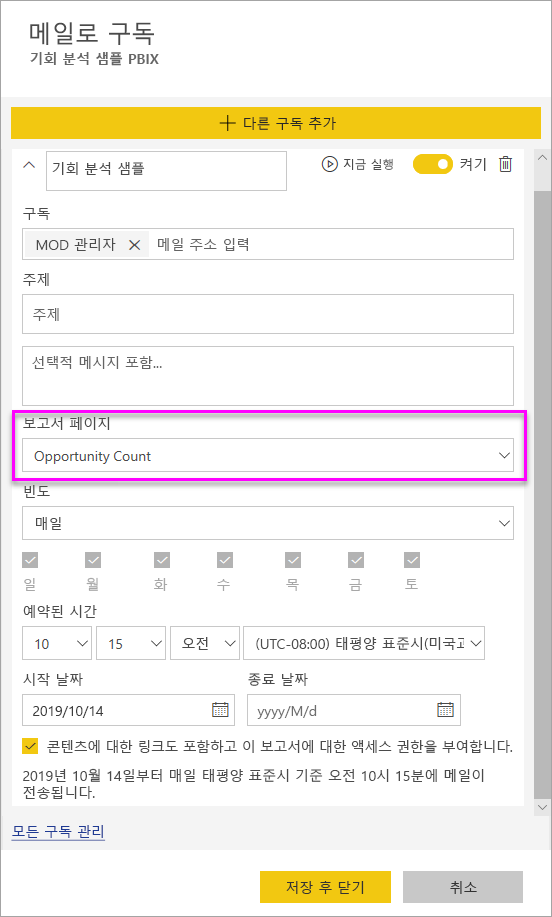
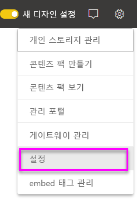
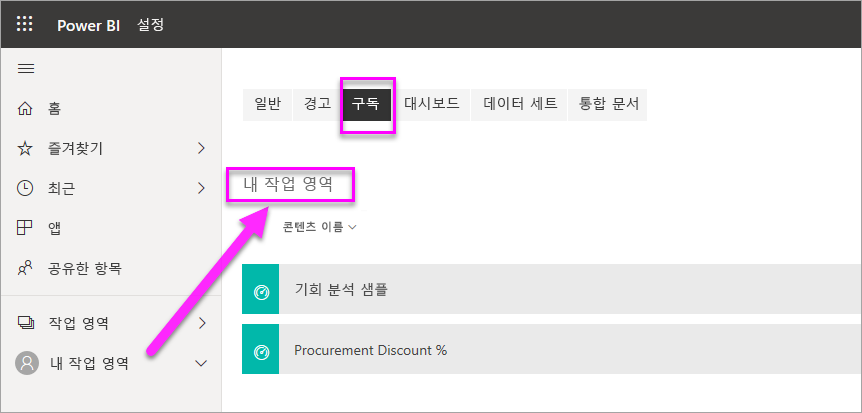

# Power BI 서비스의 보고서 및 대시보드에 자신과 다른 사용자 구독

자신과 동료에게 가장 중요한 보고서 페이지, 대시보드 및 페이지를 매긴 보고서를 구독할 수 있습니다. Power BI 메일 구독을 사용하면 다음을 수행할 수 있습니다.

- 메일 수신 빈도(초기 데이터 새로 고침 후 매일, 매주, 매시간, 매월 또는 하루에 한 번)를 결정합니다.
- 매일, 매주, 매시간 또는 매월을 선택한 경우 메일을 받을 시간을 선택합니다.
- Power BI 보고서 또는 대시보드당 24개의 서로 다른 구독을 설정합니다.  페이지를 매긴 보고서에 대해 설정할 수 있는 구독 수에는 제한이 없습니다.
- 보고서 이미지와 서비스의 보고서 링크를 포함하여 메일을 보냅니다.  Power BI 앱이 설치된 모바일 디바이스에서 이 링크를 선택하면 Power BI 웹 사이트에서 보고서 또는 대시보드를 여는 대신 Power BI 앱을 시작합니다.
- 페이지를 매긴 보고서를 구독하는 경우 전체 보고서의 첨부 파일을 포함합니다.
- Power BI 콘텐츠가 프리미엄 용량에서 호스트된 경우 테넌트 외부 사용자에게 메일을 보냅니다.  관리자는 Power BI 관리 센터의 기존 외부 공유 제어 설정을 활용하여 외부 사용자에게 메일 구독을 보낼 수 있는 사람으로 액세스를 제어할 수 있습니다.

 

## 요구 사항

구독을 **만들려면** 다음을 수행합니다.

- Power BI Pro 라이선스가 있는 사용자 
- 프리미엄 작업 영역이나 앱에서 콘텐츠를 보는 사용자는 Power BI Pro 라이선스가 없어도 해당 위치에 있는 콘텐츠를 구독할 수 있습니다. 

직접 구독을 만들려면 콘텐츠(대시보드 또는 보고서)에 대한 편집 권한이 필요하지 않지만 다른 사용자를 위해 구독 권한을 만들려면 편집 권한이 있어야 합니다.

## 대시보드, 보고서 페이지 또는 페이지를 매긴 보고서 구독

대시보드를 구독하든, 보고서를 구독하든, 또는 게시된 보고서를 구독하든, 프로세스는 유사합니다. 동일한 단추를 사용하면 Power BI 서비스 대시보드 및 보고서를 구독할 수 있습니다.

페이지를 매긴 보고서를 구독하는 것은 약간 다릅니다. 자세한 내용은 [Power BI 서비스의 페이지를 매긴 보고서에 자신과 다른 사용자 구독](../consumer/paginated-reports-subscriptions.md)을 참조하세요.
 
.

1. 대시보드 또는 보고서를 엽니다.
2. 상단의 메뉴 모음에서 **구독**을 선택하거나 봉투 아이콘 을 선택합니다.
   
    

1. 노란색 슬라이더를 사용하여 구독을 설정하거나 해제합니다. 슬라이더를 **끄기**로 설정해도 구독이 삭제되지는 않습니다. 구독을 삭제하려면 휴지통 아이콘을 선택합니다.

2. 메일은 이미 **구독** 상자에 있습니다. 동일한 도메인에 있는 다른 메일 주소를 구독에 추가할 수도 있습니다. 보고서 또는 대시보드가 [프리미엄 용량](https://docs.microsoft.com/power-bi/service-premium-what-is)에서 호스트된 경우 해당 도메인에 있는지 여부와 관계없이 다른 개별 메일 주소와 그룹 별칭을 구독할 수 있습니다. 보고서 또는 대시보드가 프리미엄 용량에서 호스트되지 않는 경우에는 다른 개인이 구독할 수 있지만, 해당 개인도 Power BI Pro 라이선스가 있어야 합니다. 자세한 내용은 아래 [고려 사항 및 문제 해결](#considerations-and-troubleshooting)을 참조하세요.

3. 메일 **제목** 및 **메시지** 세부 정보를 입력합니다.

4. 구독의 **빈도**를  **매일**, **매시간**, **매주**, **매월** 또는 **데이터 새로 고침 후(매일)** 중에서 선택합니다. 특정 요일에만 구독 메일을 받으려면 **매시간** 또는 **매주**를 선택하고 받을 요일을 선택합니다. 예를 들어 평일에만 구독 메일을 받으려면 **매주**를 선택하고 **토요일** 및 **일요일** 확인란의 선택을 취소합니다. **매월** 을 선택한 경우 구독 메일을 받을 날짜를 입력합니다.

5. **매일**, **매시간**, **매월** 또는 **매주**를 선택한 경우 구독의 **예약 시간**도 선택할 수 있습니다. 매시간 또는 15분, 30분, 45분 전에 실행해야 합니다. 오전(AM) 또는 오후/저녁(PM)을 선택합니다. 표준 시간대를 지정할 수도 있습니다. **매시간**을 선택한 경우 구독을 시작할 **예약 시간**을 선택합니다. 그러면 해당 시간부터 매시간 실행됩니다.

6. 기본적으로 구독 시작 날짜는 구독을 만든 날짜입니다. 종료 날짜를 선택할 수 있는 옵션이 있습니다. 종료 날짜를 설정하지 않으면 종료 날짜는 자동으로 시작 날짜로부터 1년 후가 됩니다. 구독이 종료되기 전에 언제든지 미래의 날짜(9999년까지)로 변경할 수 있습니다. 구독이 종료 날짜에 도달하면 다시 활성화될 때까지 중지됩니다. 예정된 종료일 전에 확장 여부를 묻는 알림을 받게 됩니다.

    아래 스크린샷에서 보고서를 구독할 때 실제 보고서 _페이지_를 구독하는 것을 의미합니다. 보고서의 여러 페이지를 구독하려면 **다른 구독 추가**를 선택한 후 다른 페이지를 선택합니다.
     
      

1. (선택 사항) 필드 콘텐츠 링크를 Power BI에 포함할지 여부와 사용자가 구독 중인 콘텐츠에 대한 액세스 권한을 부여할지 여부를 선택합니다.  링크를 포함하도록 선택한 경우 최적 환경을 위해 모든 사용자가 보고서에 액세스할 수 있는지 확인합니다.
2. **저장 후 닫기**를 선택합니다. 구독한 사용자는 선택한 빈도와 시간에 대한 대시보드 또는 보고서 페이지의 이메일과 스냅샷을 수신합니다. 전체적으로 보고서 또는 대시보드당 최대 24개의 구독을 만들 수 있으며, 각 구독마다 고유한 수신자, 시간 및 빈도를 제공할 수 있습니다. 대시보드 또는 보고서에 대해 **데이터 새로 고침 후**로 설정된 모든 구독은 첫 번째 예약된 새로 고침 후에만 메일을 보냅니다.

    > [!NOTE]
    > 저장하고 닫은 후에 구독을 편집하는 경우 이전 선택에 관계없이 구독하는 콘텐츠에 대한 액세스 권한을 사용자에게 부여하는 선택 항목이 활성화됩니다.
    >

    > [!TIP]
    > 언제든지 즉시 구독 또는 주문형으로 이메일을 보내시겠습니까? 보낼 대시보드 또는 보고서 구독에 대해 **지금 실행**을 선택합니다. 해당 특정 구독에 대한 모든 사용자에게 이메일이 전송된다는 알림이 표시됩니다. 이 작업은 보고서 또는 대시보드당 하루 24회 예약된 구독 실행의 제한에 포함되지 않습니다. 기본 데이터 세트의 데이터 새로 고침을 트리거하지 않습니다.
    >

## 구독 관리

구독을 만든 사용자만이 해당 구독을 관리할 수 있습니다. 구독 관리를 위한 화면에는 두 가지 경로가 있습니다. 첫 번째는 **메일 구독** 대화 상자에서 **모든 구독 관리**를 선택하는 것입니다(위의 4단계 참조). 두 번째는 위쪽 메뉴 모음에서 Power BI 톱니 아이콘 을 선택한 다음, **설정**을 선택하는 것입니다.

표시되는 구독은 현재 활성화된 작업 영역에 따라 달라집니다. 모든 작업 영역의 모든 구독을 동시에 확인하려면 **내 작업 영역**이 활성화되어 있는지 확인합니다. 작업 영역에 대한 도움말은 [Power BI의 작업 영역](service-create-workspaces.md)을 참조하세요.

구독은 다음과 같은 경우에 종료됩니다.

- Pro 라이선스가 만료된 경우
- 소유자가 대시보드 또는 보고서를 삭제한 경우
- 구독을 만드는 데 사용한 사용자 계정이 삭제된 경우

Power BI 관리자는 Power BI 감사 로그를 사용하여 구독 정보를 볼 수 있습니다. 세부 정보에는 다음이 포함됩니다.

- 작성자
- 만든 날짜
- 구독된 콘텐츠
- 받는 사람
- 빈도
- 수정한 사람/
- 수정한 날짜

## 고려 사항 및 문제 해결

### 일반

- 다른 BI 제품과 마찬가지로 구독을 설정하는 시간은 구독에서 처리를 시작하는 때입니다.  보고서 처리가 완료되면 구독이 큐에 대기되고 메일 받는 사람에게 전송됩니다.  모든 구독을 최대한 빠르게 처리하고 제공하기 위해 노력하고 있습니다. 그러나 경우에 따라 수요가 가장 많을 때 Power BI에서 한 번에 보낼 수 있는 구독 수로 인해 지연 시간이 늘어날 수 있습니다. 고객 대부분은 보고서를 처리하고 보내는 데 15분 넘게 지연되지 않습니다. 특정 시간과 사용량이 많은 테넌트의 경우 최대 30분이 걸릴 수도 있습니다.  구독이 예약된 시간에서 60분 이상 제공이 지연되는 경우는 없습니다.  지연이 길어지는 경우 먼저 `no-reply-powerbi@microsoft.com` 주소가 메일 공급자의 허용 목록에 포함되어 있는지 확인합니다.  포함되어 있으면 Power BI 지원에 문의하세요.
- 현재, 페이지를 매긴 보고서를 제외하고 라이브 연결 데이터 세트를 사용하는 보고서 및 대시 보드의 메일 구독은 본인 이외의 다른 사용자가 구독하는 경우 지원되지 않습니다. 보안 컨텍스트를 사용하여 다른 사용자가 페이지를 매긴 보고서를 구독할 수 있습니다. 자세한 내용은 [페이지를 매긴 보고서 구독](../consumer/paginated-reports-subscriptions.md)을 참조하세요.
- Power BI는 2개월 넘게 방문하지 않은 대시보드 및 보고서와 연결된 데이터 세트에서 자동으로 새로 고침을 일시 중지합니다. 그러나 대시보드 또는 보고서에 구독을 추가하면 방문하지 않았더라도 일시 중지되지 않습니다.
- 구독 이메일을 받지 못하면 UPN(사용자 계정 이름)이 이메일을 받을 수 있는지 확인합니다.
- 대시보드 또는 보고서가 프리미엄 용량인 경우 동료를 한 번에 하나의 메일 주소로 구독하는 대신 구독에 그룹 메일 별칭을 사용할 수 있습니다. 별칭은 현재 활성 디렉터리를 기반으로 합니다.
- 콘텐츠가 프리미엄 용량에 없는 경우 Power BI Pro 사용자만 메일 구독을 받을 수 있습니다. 
- 구독에서는 현재 책갈피를 지원하지 않습니다.
- 보고서/대시보드에 대한 액세스를 제공하는 옵션은 기존 구독을 편집할 때 항상 사용 설정된 것으로 표시됩니다.  이 옵션의 선택을 취소하고 구독을 저장하면 해당 상태가 저장됩니다. 그러나 보고서 편집을 위해 이동하면 기본적으로 선택됩니다.

### 대시보드

- 25개가 넘는 고정된 타일 또는 4개의 고정된 라이브 보고서 페이지가 있는 대시보드는 사용자에게 전송된 구독 이메일에 완벽하게 렌더링되지 않을 수 있습니다. 이러한 타일 수를 넘는 대시보드에 대한 구독은 차단되지 않습니다. 그러나 문제가 발생하면 지원되지 않는 것으로 간주됩니다. 지원되는 범위 내에서 적절하게 수정하는 것이 좋습니다.
- 드문 경우지만 이메일 구독이 받는 사람에게 전달되는 데 15분 이상 걸릴 수 있습니다. 이 경우 데이터 새로 고침 및 이메일 구독을 다른 시간에 실행하여 적절하게 전달되도록 할 것을 권장합니다. 문제가 지속되면 Power BI 지원에 문의하세요.
- 대시보드 이메일 구독의 경우 타일에 RLS(행 수준 보안)가 적용되면 해당 타일은 표시되지 않습니다.
- 대시보드 구독의 경우 일부 유형의 타일이 아직 지원되지 않습니다. 여기에는 스트리밍 타일, 비디오 타일 및 사용자 지정 웹 콘텐츠 타일이 포함됩니다.
- 테넌트 외부의 동료와 대시보드를 공유하는 경우 대시보드가 Premium 작업 영역 또는 앱에 있지 *않으면* 해당 동료를 위해 구독을 만들 수 없습니다. 따라서 사용자가 `aaron@contoso.com`인 경우 `anyone@fabrikam.com`과 공유할 수 있지만 아직 `anyone@fabrikam.com`을 구독할 수 없고 공유 콘텐츠를 구독할 수 없습니다.

### 보고서

- 보고서 이메일 구독의 경우 데이터 세트가 RLS를 사용하면 직접 구독을 만들 수 있습니다. 페이지를 매긴 보고서를 제외하고 RLS(행 수준 보안)가 적용된 보고서는 다른 사용자가 구독할 수 없습니다. 보안 컨텍스트를 사용하여 다른 사용자가 페이지를 매긴 보고서를 구독할 수 있습니다. 자세한 내용은 [페이지를 매긴 보고서 구독](../consumer/paginated-reports-subscriptions.md)을 참조하세요.
- 보고서 페이지 구독은 보고서 페이지의 이름과 연결됩니다. 보고서 페이지를 구독한 다음, 이름을 바꾸면 구독을 다시 만들어야 합니다.
- 조직은 Power BI에서 메일 구독을 사용하는 기능을 제한하는 Azure Active Directory에서 특정 설정을 구성할 수 있습니다. 이러한 제한 사항에는 리소스에 액세스할 때 다단계 인증 또는 IP 범위 제한 사항이 포함되지만 이에 국한되지는 않습니다.
- 이메일 구독은 대부분의 [사용자 지정 시각적 개체](../developer/power-bi-custom-visuals.md)를 지원하지 않습니다. 한 가지 예외는 [인증](../developer/power-bi-custom-visuals-certified.md)된 사용자 지정 시각적 개체입니다.
- 이메일 구독은 현재 R 지원 사용자 지정 시각적 개체를 지원하지 않습니다.
- 전자 메일 구독은 보고서의 기본 필터 및 슬라이서 상태와 함께 보내집니다. 구독한 후에 수행된 기본값에 대한 변경 내용은 이메일에 표시되지 않습니다. 페이지를 매긴 보고서는 이 기능을 지원하므로, 구독별로 특정 매개 변수 값을 설정할 수 있습니다.

## 다음 단계

- [Power BI 서비스의  페이지를 매긴 보고서에 자신과 다른 사용자 구독](../consumer/paginated-reports-subscriptions.md)
- 궁금한 점이 더 있나요? [Power BI 커뮤니티에 질문합니다.](https://community.powerbi.com/)    
- [블로그 게시물 읽기](https://powerbi.microsoft.com/blog/introducing-dashboard-email-subscriptions-a-360-degree-view-of-your-business-in-your-inbox-every-day/)
