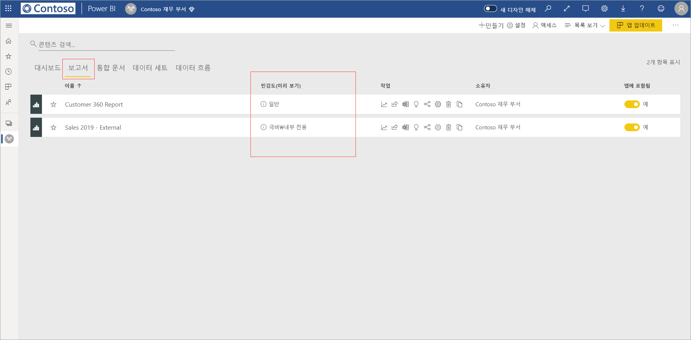
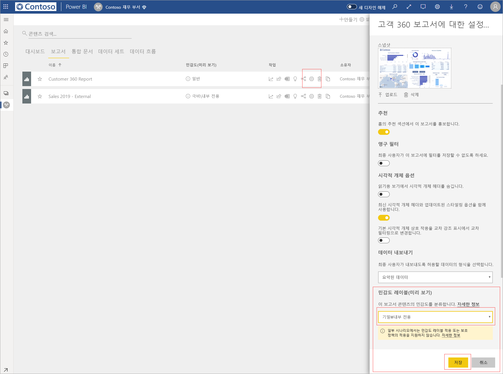
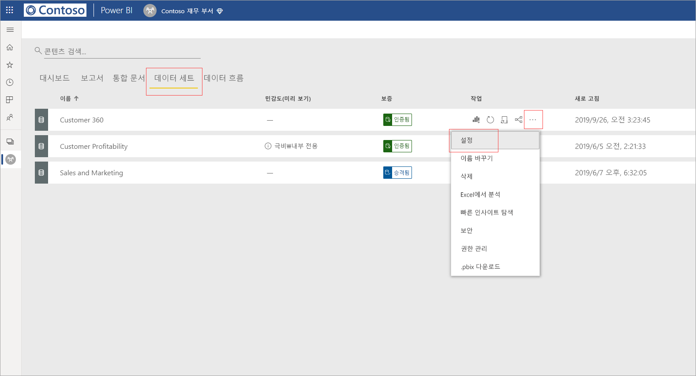
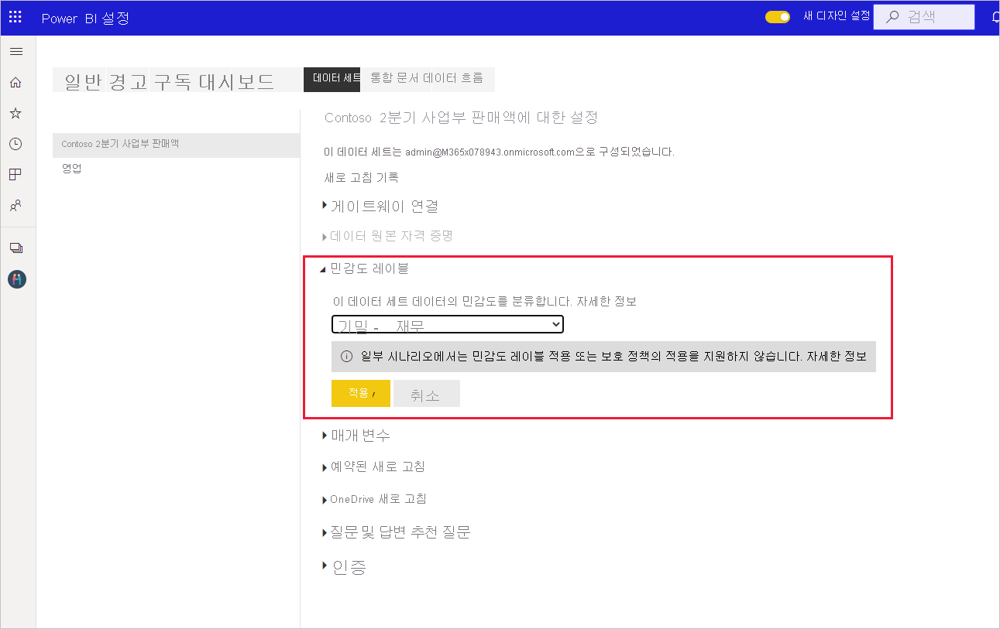
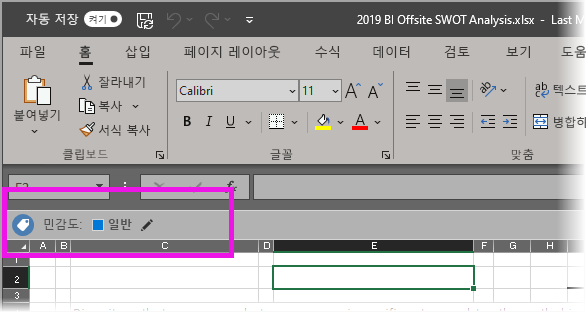

# Power BI에서 데이터 민감도 레이블 적용

보고서, 대시보드, 데이터 세트 및 데이터 흐름에 대한 Microsoft Information Protection 민감도 레이블은 무단 데이터 액세스 및 누출로부터 중요한 콘텐츠를 보호할 수 있습니다. 데이터 민감도 레이블을 사용하여 데이터에 올바른 레이블을 지정하면 권한 있는 사용자만 데이터에 액세스할 수 있습니다. 이 문서에서는 콘텐츠에 민감도 레이블을 적용하는 방법을 보여 줍니다.

Power BI에서 민감도 레이블을 적용할 수 있으려면:
* Power BI Pro 라이선스와 레이블을 추가하려는 콘텐츠에 대한 편집 권한이 있어야 합니다.
* [Power BI에서 데이터 민감도 레이블 사용](../admin/service-security-enable-data-sensitivity-labels.md#enable-data-sensitivity-labels) 문서에 설명된 대로, 데이터 민감도 레이블을 적용할 수 있는 권한이 있는 보안 그룹에 속해 있어야 합니다.
* 모든 [필수 구성 요소](../admin/service-security-data-protection-overview.md#requirements-for-using-sensitivity-labels-in-power-bi) 및 [라이선스 요구 사항](../admin/service-security-data-protection-overview.md#licensing)을 충족해야 합니다.

Power BI의 데이터 민감도 레이블에 대한 자세한 내용은 [Power BI의 데이터 보호 개요](../admin/service-security-data-protection-overview.md)를 참조하세요.

## 민감도 레이블 적용

테넌트에서 데이터 보호를 사용하도록 설정하면 대시보드, 보고서, 데이터 세트 및 데이터 흐름 목록 보기의 민감도 열에 민감도 레이블이 표시됩니다.

**보고서 또는 대시보드에 민감도 레이블을 적용하거나 변경하려면**
1. **기타 옵션(...)** 을 클릭합니다.
1. **설정**을 선택합니다.
1. 설정 사이드 창에서 적절한 민감도 레이블을 선택합니다.
1. 설정을 저장합니다.

다음 이미지는 보고서의 이러한 단계를 보여 줍니다.

**데이터 세트 또는 데이터 흐름에서 민감도 레이블을 적용하거나 변경하려면**

1. **기타 옵션(...)** 을 클릭합니다.
1. **설정**을 선택합니다.
1. 설정 사이드 창에서 적절한 민감도 레이블을 선택합니다.
1. 설정을 적용합니다.

다음 두 이미지는 데이터 세트의 이러한 단계를 보여 줍니다.

**기타 옵션(...)** 을 선택한 다음 **설정**을 선택합니다.

설정 페이지에서 민감도 레이블 섹션을 열고 원하는 민감도 레이블을 선택한 다음 **적용**을 클릭합니다.

## 민감도 레이블 제거
보고서, 대시보드, 데이터 세트 또는 데이터 흐름에서 민감도 레이블을 제거하려면 [레이블을 적용하는 데 사용된 절차와 동일한 프로시저](#applying-sensitivity-labels)를 수행하되 데이터의 민감도를 분류하라는 메시지가 표시되면 **(없음)** 을 선택합니다. 

## 내보낸 파일의 데이터 보호

민감도 레이블과 연결된 데이터 보호는 Excel, PowerPoint 및 PDF 파일로 내보낸 경우에만 데이터에 적용됩니다. Excel에서 분석, .csv로 내보내기, 데이터 세트 다운로드(.pbix), Power BI 서비스 라이브 연결, 기타 내보내기 형식에 대해서는 지원되지 않습니다. 데이터 내보내기 옵션은 Power BI 테넌트 관리자 [내보내기 설정](../service-admin-portal.md#export-and-sharing-settings)에서 제어됩니다.

민감도 레이블이 포함된 보고서에서 xcel, PowerPoint 또는 PDF 파일로 [데이터를 내보내면](https://docs.microsoft.com/power-bi/consumer/end-user-export) 민감도 레이블이 생성된 파일에 상속됩니다. 민감도 레이블이 파일에 표시되며, 사용 권한이 있는 사용자만 파일에 액세스할 수 있습니다.

## 고려 사항 및 제한 사항

다음 목록은 Power BI에서 민감도 레이블의 몇 가지 제한 사항입니다.

**일반**
* 민감도 레이블은 대시보드, 보고서, 데이터 세트 및 데이터 흐름에만 적용할 수 있습니다. 현재, [페이지를 매긴 보고서](../paginated-reports/report-builder-power-bi.md) 및 통합 문서에서는 민감도 레이블을 사용할 수 없습니다.
* Power BI 자산의 민감도 레이블은 작업 영역 목록, 계보, 즐겨찾기, 최근 항목 및 앱에 표시됩니다. 현재 “공유한 항목” 보기에는 레이블이 표시되지 않습니다. 그러나 Power BI 자산에 적용된 레이블은 표시되지 않는 경우에도 Excel, PowerPoint 및 PDF 파일로 내보낸 데이터에 항상 유지됩니다.
* 민감도 레이블은 글로벌(퍼블릭) 클라우드의 테넌트에만 지원됩니다. 다른 클라우드의 테넌트에서는 민감도 레이블이 지원되지 않습니다.
* 템플릿 앱에 대해서는 데이터 민감도 레이블이 지원되지 않습니다. 앱이 추출되고 설치될 때 템플릿 앱 작성자가 설정한 민감도 레이블은 제거되고 앱 소비자가 설치된 템플릿 앱의 아티팩트에 추가한 민감도 레이블은 앱이 업데이트될 때 손실됩니다(nothing으로 다시 설정됨).
* Power BI는 [전달 금지](https://docs.microsoft.com/microsoft-365/compliance/encryption-sensitivity-labels?view=o365-worldwide#let-users-assign-permissions), [사용자 정의](https://docs.microsoft.com/microsoft-365/compliance/encryption-sensitivity-labels?view=o365-worldwide#let-users-assign-permissions) 및 [HYOK](https://docs.microsoft.com/azure/information-protection/configure-adrms-restrictions) 보호 유형의 민감도 레이블을 지원하지 않습니다. 전달 금지 및 사용자 정의 보호 유형은 [Microsoft 365 보안 센터](https://security.microsoft.com/) 또는 [Microsoft 365 준수 센터](https://compliance.microsoft.com/)에 정의된 레이블을 참조합니다.

**내보내기**
* 레이블 및 보호 컨트롤은 데이터를 Excel, PowerPoint 및 PDF 파일로 내보낼 때만 적용됩니다. 데이터를 .csv 또는 .pbix 파일, Excel의 분석 또는 다른 내보내기 경로로 내보낼 때는 레이블 및 보호가 적용되지 않습니다.
* 내보낸 파일에 민감도 레이블 및 보호를 적용해도 콘텐츠 표시가 파일에 추가되지 않습니다. 그러나 레이블이 콘텐츠 표시를 적용하도록 구성된 경우에는 Office 데스크톱 앱에서 해당 파일을 열 때 Azure Information Protection 통합 레이블 지정 클라이언트에 의해 자동으로 적용됩니다. 데스크톱, 모바일 또는 웹앱에 대해 기본 제공 레이블을 사용하는 경우 콘텐츠 표시가 자동으로 적용되지 않습니다. 자세한 내용은 [Office 앱에서 콘텐츠 표시 및 암호화를 적용할 때](https://docs.microsoft.com/microsoft-365/compliance/sensitivity-labels-office-apps?view=o365-worldwide#when-office-apps-apply-content-marking-and-encryption)를 참조하세요.
* Power BI에서 파일을 내보내는 사용자는 민감도 레이블 설정에 따라 해당 파일에 대한 액세스 및 편집 권한을 갖습니다. 데이터를 내보내는 사용자는 파일의 소유자 권한을 얻지 못합니다.
* 데이터를 파일로 내보낼 때 레이블을 적용할 수 없는 경우 내보내기가 실패합니다. 레이블을 적용할 수 없어 내보내기가 실패했는지 확인하려면 제목 표시줄의 가운데에 있는 보고서 또는 대시보드 이름을 클릭하면 열리는 정보 드롭다운에 “민감도 레이블을 로드할 수 없습니다”라는 메시지가 표시되는지 확인합니다. 이는 보안 관리자가 적용된 레이블을 게시 취소 또는 삭제하거나 임시 시스템 문제로 인해 발생할 수 있습니다.

## 다음 단계

이 문서에서는 Power BI에서 데이터 민감도 레이블을 적용하는 방법을 설명했습니다. 다음 문서에서는 Power BI의 데이터 보호에 대해 자세히 설명합니다. 

* [Power BI의 데이터 보호 개요](../admin/service-security-data-protection-overview.md)
* [Power BI에서 데이터 민감도 레이블 사용](../admin/service-security-enable-data-sensitivity-labels.md)
* [Power BI에서 Microsoft Cloud App Security 제어 사용](../admin/service-security-using-microsoft-cloud-app-security-controls.md)