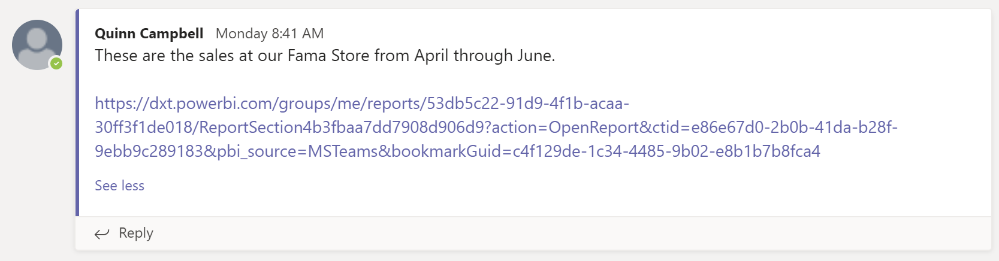

# Power BI 서비스에서 Microsoft Teams에 직접 공유

Power BI 서비스에서 Microsoft Teams에 직접 Power BI 대시보드, 보고서 및 시각적 개체를 공유할 수 있습니다. **Teams에 공유** 기능을 사용하여 Power BI 서비스에서 보고서와 대시보드를 볼 때 빠르게 대화를 시작할 수 있습니다.

## 요구 사항

Power BI에서 **Teams에 공유** 기능을 사용하려면 다음 설정을 확인합니다.

- Power BI 관리자가 Power BI 관리 포털에서 **Teams에 공유** 테넌트 설정을 사용하지 않도록 설정하지 않았습니다. 해당 설정을 사용하면 조직이 **Teams에 공유** 단추를 숨길 수 있습니다. 자세한 내용은 [Power BI 관리 포털](../admin/service-admin-portal.md#share-to-teams-tenant-setting) 문서를 참조하세요.

다른 요구 사항을 포함하여 Power BI와 Microsoft Teams를 함께 사용하는 방법에 대한 배경 지식은 [Power BI를 사용하여 Microsoft Teams에서 협업](service-collaborate-microsoft-teams.md)을 참조하세요.

## Microsoft Teams에 Power BI 콘텐츠 공유

다음 단계에 따라 Power BI 서비스에서 보고서, 대시보드 및 시각적 개체의 링크를 Microsoft Teams 채널 및 채팅에 공유합니다.

1. 다음 옵션 중 하나를 선택합니다.

   * 대시보드 또는 보고서의 작업 모음에 있는 **Teams에 공유**:

       
    
   * 단일 시각적 개체의 상황에 맞는 메뉴에 있는 **Teams에 공유**:
    
      

1. **Microsoft Teams에 공유** 대화 상자에서 링크를 보낼 팀 또는 채널을 선택합니다. 원하는 경우 메시지를 입력할 수 있습니다. 먼저 Microsoft Teams에 로그인하라는 메시지가 표시될 수 있습니다.

    

1. 링크를 보내려면 **공유** 를 선택합니다.
    
1. 링크가 기존 대화에 추가되거나 새 채팅을 시작합니다.

    

1. 링크를 선택하여 Power BI 서비스에서 항목을 엽니다.

1. 특정 시각적 개체의 상황에 맞는 메뉴를 사용한 경우 보고서가 열릴 때 시각적 개체가 강조 표시됩니다.

    

## 알려진 문제 및 제한 사항

- Power BI 라이선스 또는 보고서에 액세스할 권한이 없는 사용자에게는 "콘텐츠를 사용할 수 없습니다"라는 메시지가 표시됩니다.
- 브라우저에서 엄격한 개인 정보 설정을 사용하는 경우 **Teams에 공유** 단추가 작동하지 않을 수 있습니다. 대화 상자가 제대로 열리지 않는 경우 **문제가 있나요? 새 창에서 열어 보세요** 옵션을 사용하세요.
- **Teams에 공유** 에는 링크 미리 보기가 포함되지 않습니다.
- 링크 미리 보기와 **Teams에 공유** 는 항목을 볼 수 있는 권한을 사용자에게 부여하지 않습니다. 권한은 별도로 관리해야 합니다.
- 보고서 작성자가 시각적 개체의 **추가 옵션** 을 **끄기** 로 설정하면 시각적 개체 상황에 맞는 메뉴에서 **Teams에 공유** 단추를 사용할 수 없습니다.
- 다른 문제를 확인하려면 “Microsoft Teams에서 협업” 문서의 [알려진 문제 및 제한 사항](service-collaborate-microsoft-teams.md#known-issues-and-limitations) 섹션을 참조하세요.

## 다음 단계

- [Power BI를 사용하여 Microsoft Teams에서 협업](service-collaborate-microsoft-teams.md)

궁금한 점이 더 있나요? [Power BI 커뮤니티에 질문합니다](https://community.powerbi.com/).
