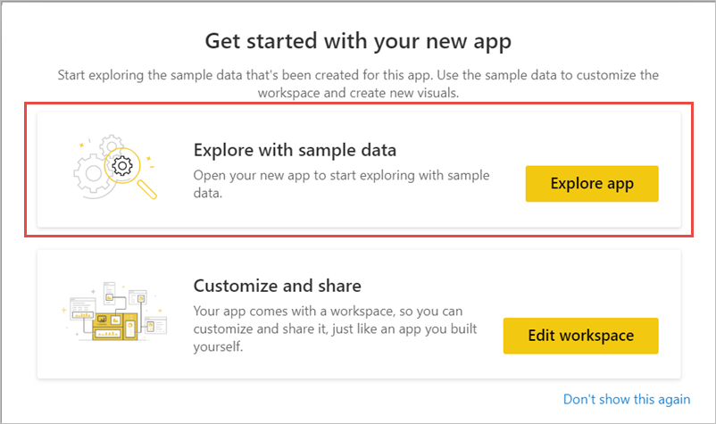
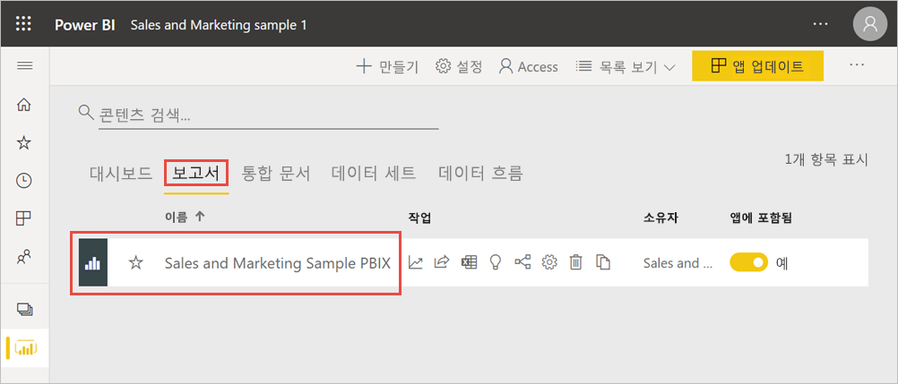
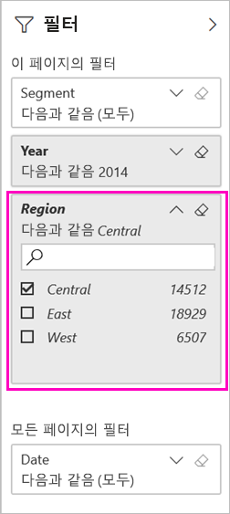
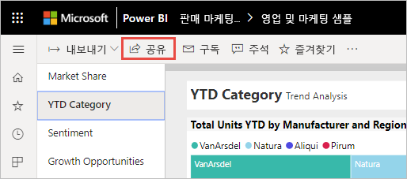
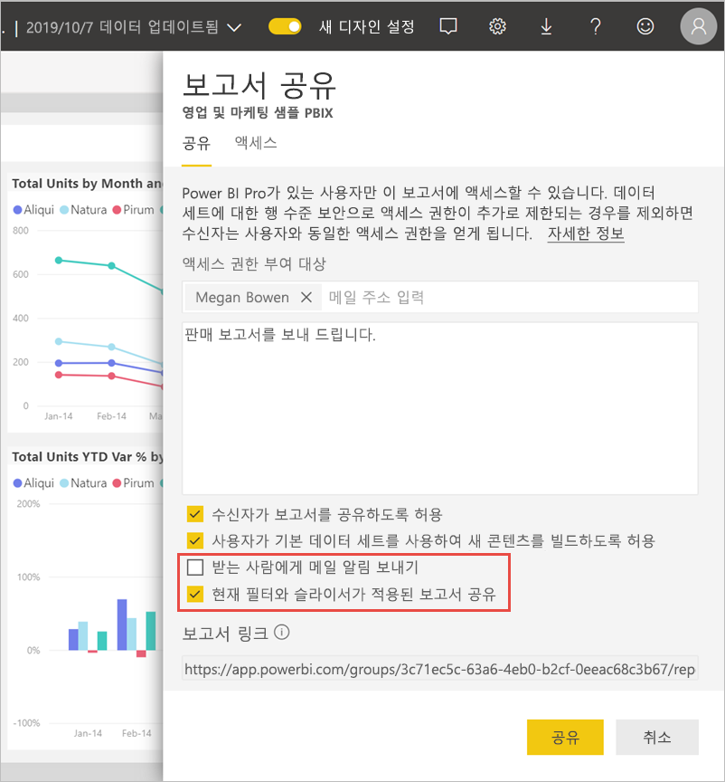
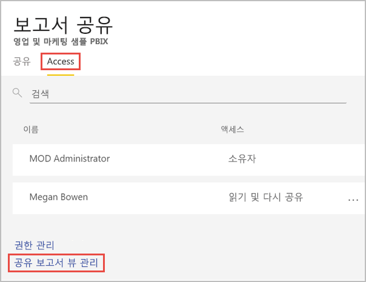
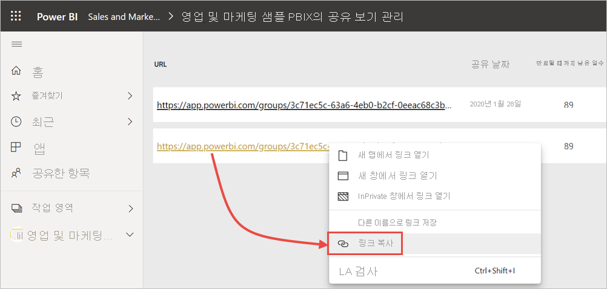

# Power BI 보고서 필터링 및 공유
다른 사람에게 대시보드 및 보고서에 대한 액세스 권한을 부여하려면 *공유*를 사용하는 것이 좋습니다. 필터링된 버전의 보고서를 공유하려면 어떻게 해야 할까요? 특정 도시, 영업 사원 또는 연도 데이터만 표시하도록 보고서를 만들려고 할 수 있습니다. 이 문서에서는 보고서를 필터링한 후 필터링된 버전을 공유하는 방법을 설명합니다. 필터링된 보고서를 공유하는 또 다른 방법은 [보고서 URL에 쿼리 매개 변수를 추가](service-url-filters.md)하는 것입니다. 두 경우 모두 받는 사람이 처음 열 때 보고서가 필터링됩니다. 받는 사람이 보고서에서 필터 선택을 삭제할 수 있습니다.

또한 Power BI는 [보고서로 공동 작업을 수행하고 보고서를 배포하는 여러 다른 방법](service-how-to-collaborate-distribute-dashboards-reports.md)도 제공합니다. 공유에서 사용자와 해당 수신자는 [Power BI Pro 라이선스](../fundamentals/service-features-license-type.md)가 필요하거나 콘텐츠는 [프리미엄 용량](../admin/service-premium-what-is.md)에 있어야 합니다. 

## 샘플 데이터를 사용하여 따라하기

이 문서에서는 Marketing and Sales 샘플 템플릿 앱을 사용합니다. 진행해 볼까요? 

1. [Marketing and Sales 샘플 템플릿 앱](https://appsource.microsoft.com/product/power-bi/microsoft-retail-analysis-sample.salesandmarketingsample?tab=Overview)을 설치합니다.
2. 앱을 선택하고 **앱 살펴보기**를 선택합니다.

   

3. 연필 아이콘을 선택하여 앱과 함께 설치한 작업 영역을 엽니다.

    

4. 작업 영역 콘텐츠 목록에서 **보고서**를 선택하고 **Sales and Marketing Sample PBIX** 보고서를 선택합니다.

    

    이제 계속 따라할 준비가 되었습니다.

## 보고서에서 필터 설정

[편집용 보기](../consumer/end-user-reading-view.md)에서 보고서를 열고 필터를 적용합니다.

이 예제에서는 영업 및 마케팅 샘플 템플릿 앱의 YTD Category 페이지를 필터링하여 **Region**이 **Central**인 값만 표시합니다. 
 

보고서를 저장합니다.

## 필터링된 보고서 공유

1. **공유**를 선택합니다.

   

2. **받는 사람에게 이메일 알림 보내기**를 선택 취소하여 필터링된 링크를 대신 보내고, **현재 필터 및 슬라이서를 사용하여 보고서 공유**를 선택한 다음 **공유**를 선택합니다.

    

4. **공유**를 다시 선택합니다.

   

5. **액세스** 탭을 선택한 다음 **공유 보고서 뷰 관리**를 선택합니다.

    

6. 원하는 URL을 마우스 오른쪽 단추로 클릭하고 **링크 복사**를 선택합니다.

    

7. 이 링크를 공유하면 받는 사람에게 필터링된 보고서가 표시됩니다. 

## 제한 사항 및 고려 사항
다음은 보고서 공유에 관해 주의해야 할 점입니다.

* 사용 권한을 관리하거나 보고서 또는 대시보드를 공유하거나 앱을 게시하여 데이터 세트를 공유하는 경우 [RLS(행 수준 보안)](../admin/service-admin-rls.md)이 액세스를 제한하지 않는 한 전체 데이터 세트에 대한 액세스 권한을 부여하게 됩니다. 보고서 작성자는 보고서를 보거나 상호 작용할 때 사용자 환경을 사용자 지정하는 기능(예: 열을 숨기기 및 시각적 개쳬 작업 제한)을 사용할 수 있습니다. 이러한 사용자 지정 사용자 환경에서는 데이터 세트에서 사용자가 액세스할 수 있는 데이터를 제한하지 않습니다. 각 사용자의 자격 증명에 따라 액세스할 수 있는 데이터를 결정하도록 데이터 세트에서 [RLS(행 수준 보안)](../admin/service-admin-rls.md)를 사용합니다.

## 다음 단계
* [Power BI에서 작업을 공유하는 방법](service-how-to-collaborate-distribute-dashboards-reports.md)
* [대시보드 공유](service-share-dashboards.md)
* 궁금한 점이 더 있나요? [Power BI 커뮤니티를 이용](https://community.powerbi.com/)하세요.
* 의견이 있으신가요? 제안 사항이 있으시면 [Power BI 커뮤니티 사이트](https://community.powerbi.com/)를 방문하세요.
