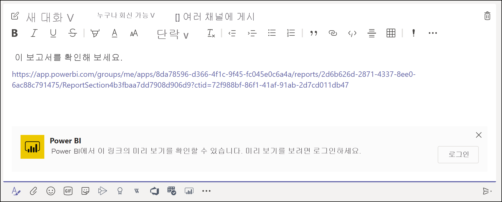
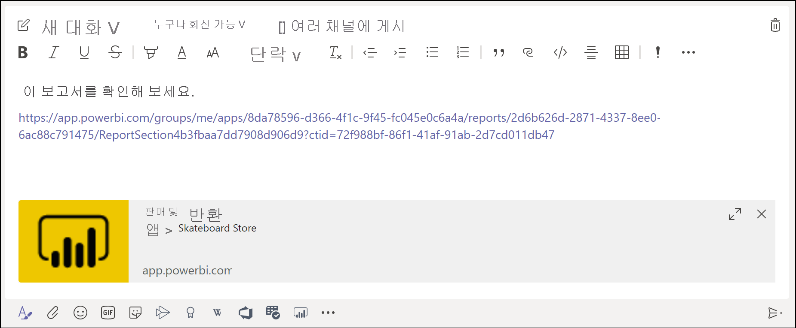
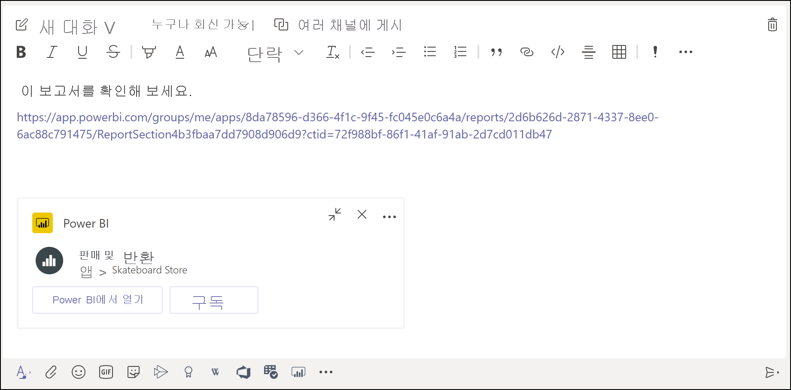

# Microsoft Teams에서 Power BI 링크 미리 보기 가져오기

보고서, 대시보드 및 앱에 대한 링크를 Microsoft Teams 메시지 상자에 붙여넣으면 링크 미리 보기에 링크에 대한 정보가 표시됩니다. Power BI에서 다음 항목에 대한 링크 미리 보기가 제공됩니다.

- 보고서
- 대시보드
- 앱

링크 미리 보기 서비스를 사용하려면 사용자가 로그인해야 합니다. 로그아웃하려면 메시지 상자 아래쪽에서 **Power BI** 아이콘을 선택합니다. 그런 다음 **로그아웃**을 선택합니다.

충족해야 하는 요구 사항을 포함하여 Power BI와 Microsoft Teams를 함께 사용하는 방법에 대한 배경 지식은 [Power BI를 사용하여 Microsoft Teams에서 협업](service-collaborate-microsoft-teams.md)을 참조하세요.

## 링크 미리 보기 가져오기

다음 단계에 따라 Power BI 서비스의 콘텐츠에 대한 링크 미리 보기를 가져옵니다.

1. Power BI 서비스의 보고서, 대시보드 또는 앱에 대한 링크를 복사합니다. 예를 들어 브라우저 주소 표시줄에서 링크를 복사합니다.

1. 링크를 Microsoft Teams 메시지 상자에 붙여넣습니다. 메시지가 표시되면 링크 미리 보기 서비스에 로그인합니다. 링크 미리 보기가 로드될 때까지 몇 초 정도 기다려야 할 수 있습니다.

    

1. 성공적으로 로그인하면 기본 링크 미리 보기가 표시됩니다.

    

1. **확장** 아이콘을 선택하여 서식 있는 미리 보기 카드를 표시합니다.

    

1. 서식 있는 링크 미리 보기 카드에는 링크 및 관련 작업 단추가 표시됩니다.

    

1. 메시지를 보냅니다.

## 알려진 문제 및 제한 사항

- 링크 미리 보기 서비스에서 Single Sign-On이 지원되지 않습니다.
- 링크 미리 보기는 모임 채팅 또는 프라이빗 채널에서 작동하지 않습니다.
- 다른 문제를 확인하려면 “Microsoft Teams에서 협업” 문서의 [알려진 문제 및 제한 사항](service-collaborate-microsoft-teams.md#known-issues-and-limitations) 섹션을 참조하세요.

## 다음 단계

- [Power BI를 사용하여 Microsoft Teams에서 협업](service-collaborate-microsoft-teams.md)

궁금한 점이 더 있나요? [Power BI 커뮤니티에 질문합니다](https://community.powerbi.com/).
