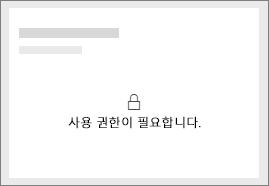
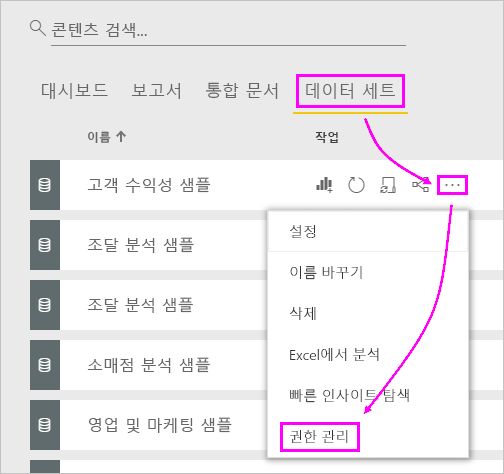
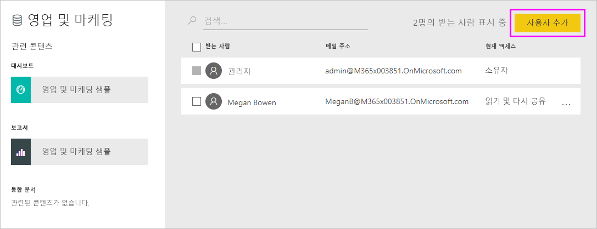
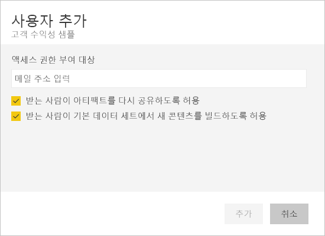
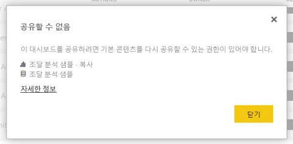

# 대시보드 및 보고서 공유 문제 해결

대시보드 또는 보고서를 다른 사용자와 공유하거나 다른 사용자가 대시보드 또는 보고서를 공유할 때 발생할 수 있는 몇 가지 일반적인 문제는 다음과 같습니다. 

## 대시보드 수신자에게 타일의 잠금 아이콘이 표시됨

공유받은 사람이 보고서를 보려고 할 때 대시보드의 잠긴 타일 또는 “사용 권한 필요” 메시지가 표시될 수 있습니다.

이 경우 기본 데이터 세트에 대한 권한을 부여해야 합니다.

1. 콘텐츠 목록에 있는 **데이터 세트** 탭으로 이동합니다.

1. 데이터 세트 옆에 있는 줄임표( **...** )와 **사용 권한 관리**를 차례로 선택합니다.

    

1. **사용자 추가**를 선택합니다.

    

1. 개인에 대한 전체 메일 주소, 메일 그룹 또는 보안 그룹을 입력합니다. 동적 메일 그룹과 공유할 수 없습니다.

    

1. **추가**를 선택합니다.

## 대시보드 또는 보고서를 공유할 수 없음

대시보드 또는 보고서를 공유하려면 기본 콘텐츠, 즉 모든 관련 보고서 및 데이터 세트를 다시 공유할 수 있는 권한이 있어야 합니다. 공유할 수 없다는 메시지가 표시되면 보고서 작성자에게 해당 보고서 및 데이터 세트에 대한 다시 공유 권한을 요청합니다.

## 대시보드 또는 보고서에 대한 액세스 권한 없음

보고서 또는 대시보드 링크를 선택할 때 "액세스 요청" 메시지가 표시된다면 볼 수 있는 권한이 없는 것입니다. [이에 대한 액세스를 요청](service-request-access.md)해야 합니다.

## 다음 단계

- [동료 및 다른 사용자와 Power BI 대시보드 및 보고서 공유](service-share-dashboards.md)
- [대시보드 및 보고서를 공동 작업 및 공유하는 방법](service-how-to-collaborate-distribute-dashboards-reports.md)
-  [필터링된 Power BI 보고서 공유](service-share-reports.md)
- 궁금한 점이 더 있나요? [Power BI 커뮤니티를 이용하세요.](https://community.powerbi.com/)
