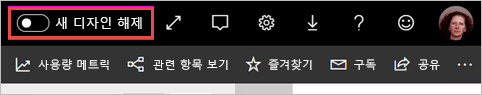
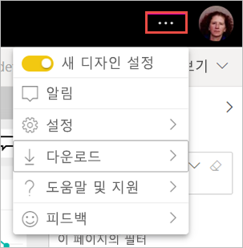

# 작업 영역 '새 디자인'(미리 보기) 옵트인

작업 영역에는 새로운 Power BI 서비스의 [새 디자인](../service-new-look.md)과 일치하는 새 모양이 있습니다. Power BI 서비스(app.powerbi.com)를 사용하는 모든 사용자는 옵트인(opt in)할 수 있습니다. 검정 머리글 표시줄에서 **새 디자인**을 켜면 보고서 및 작업 영역에 대한 새 모양에 옵트인(opt in)하게 됩니다. 클래식 및 신규의 모든 작업 영역은 새 디자인의 이점을 누릴 수 있습니다.

**Power BI Desktop**의 새 디자인에 대한 정보를 찾고 있나요? [Power BI Desktop에서 업데이트된 리본 사용](../desktop-ribbon.md)을 참조하세요.

## 새 디자인의 기능

:::image type="content" source="media/service-workspaces-new-look/power-bi-workspace-new-look-numbered.png" alt-text="설명에 대한 설명선 번호가 있는 작업 영역의 새 디자인":::

|숫자  |작동 방법 |
|---------|---------|
|    | **데이터 가져오기**: 작업 영역에 콘텐츠를 추가하기가 더 쉽습니다. **+ 새로 만들기** 단추를 선택하여 데이터에 연결하고, 파일을 열고, 보고서와 대시보드 등을 만드세요.  |
|   | **보기 전환기**: 데이터 흐름, 데이터 세트, 보고서 및 대시보드 간의 연결 및 다른 데이터 원본에 대한 연결을 보려면 **목록** 보기 및 **계보** 보기 사이를 전환합니다. |
|  | **작업 영역 내에서 검색**: 새 검색 상자에서 작업 영역의 모든 콘텐츠를 검색합니다.  |
|   | **목록 및 탭**: 작업 영역의 모든 콘텐츠는 SharePoint와 같은 대시보드, 보고서, 데이터 세트 등의 단순 목록에 있습니다. 더 이상 비어 있을 수 있는 **대시보드** 탭으로 작업 영역을 열지 않으며 콘텐츠가 어디에 있는지 궁금해합니다. 새 탭 순서는 다음과 같습니다.  **모두**: 작업 영역에서 모든 콘텐츠(대시보드, 보고서, 통합 문서, 페이지를 매긴 보고서, 데이터 세트 및 데이터 흐름)를 표시합니다.  **콘텐츠**: 작업 영역 내에서 사용을 위해 생성된 모든 콘텐츠(대시보드, 보고서, 통합 문서 및 페이지를 매긴 보고서)를 수집합니다.  **데이터 세트 + 데이터 흐름**: 쉽게 데이터를 관리할 수 있도록 작업 영역에서 모든 데이터 세트 및 데이터 흐름을 수집합니다. |
|  | **필터**: 수백 개의 아티팩트가 있는 작업 영역의 경우 필터 창에서 콘텐츠를 필터링할 수 있습니다. 필터가 적용되면 콘텐츠 목록 위에 필터가 표시됩니다. |

**빠른 작업**: 목록에서 콘텐츠를 가리키면 해당 항목에 대한 가장 일반적인 작업과 **추가 옵션**(...) 메뉴에서 사용할 수 있는 다른 작업이 표시됩니다.

:::image type="content" source="media/service-workspaces-new-look/power-bi-workspace-new-look-quick-actions.png" alt-text="새 작업 영역의 빠른 작업":::

## 새 디자인 옵트인(opt in)

Power BI 서비스 사용자는 새 디자인을 옵트인(opt in)할 수 있습니다. **새 디자인 해제**를 **새 디자인 설정**으로 밀기만 하면 됩니다.

이전 디자인으로 돌아가야 하는 경우 다시 밀어서 을 **해제**하면 됩니다. 표시되지 않는 경우 오른쪽 위 모서리에 있는 줄임표 메뉴를 선택합니다.

## 다음 단계

- [Power BI Desktop에서 업데이트된 리본 사용](../desktop-ribbon.md)
- [Power BI 서비스의 ‘새 디자인’](../service-new-look.md)
- 궁금한 점이 더 있나요? [Power BI 커뮤니티를 이용하세요.](https://community.powerbi.com/)

