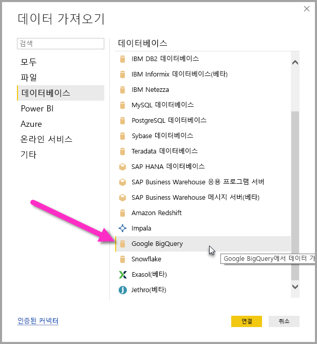
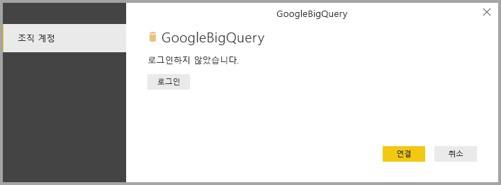
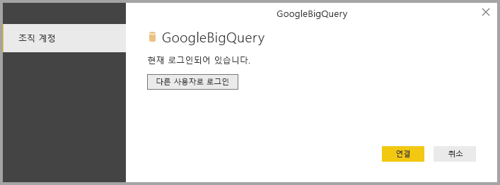
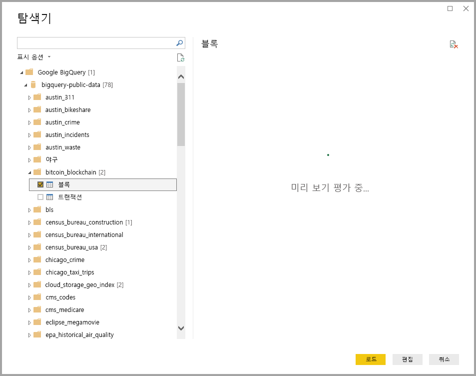

# <a name="connect-to-a-google-bigquery-database-in-power-bi-desktop"></a>Power BI Desktop에서 Google BigQuery 데이터베이스에 연결
Power BI Desktop에서 Google **BigQuery** 데이터베이스에 연결하고 Power BI Desktop의 다른 데이터 원본처럼 기본 데이터를 사용할 수 있습니다.

## <a name="connect-to-google-bigquery"></a>Google BigQuery에 연결
Google **BigQuery** 데이터베이스에 연결하려면 Power BI Desktop의 **홈** 리본에서 **데이터 가져오기** 를 선택합니다. 왼쪽에 있는 범주에서 **데이터베이스** 를 선택하면 **Google BigQuery** 가 표시됩니다.



표시되는 **Google BigQuery** 창에서 Google BigQuery 계정에 로그인하고 **연결** 을 선택합니다.



로그인하면 인증되었음을 나타내는 다음 창이 표시됩니다. 



성공적으로 연결되면 **탐색기** 창이 나타나고 서버에 사용 가능한 데이터를 표시합니다. 여기서 하나 이상의 요소를 선택하여 **Power BI Desktop** 에 가져오고 사용할 수 있습니다.



## <a name="considerations-and-limitations"></a>고려 사항 및 제한 사항
Google **BigQuery** 커넥터에서 유의해야 하는 몇 가지 제한 및 고려 사항이 있습니다.

* Google BigQuery 커넥터는 Power BI Desktop 및 Power BI 서비스에서 사용할 수 있습니다. Power BI 서비스에서는 Power BI에서 Google BigQuery로의 클라우드 간 연결을 사용하여 커넥터에 액세스할 수 있습니다.

* Google BigQuery **청구 프로젝트** 에 Power BI를 사용할 수 있습니다. 기본적으로 Power BI는 사용자에 대해 반환된 목록의 첫 번째 프로젝트를 사용합니다. 

  Power BI와 함께 사용할 때 청구 프로젝트의 동작을 사용자 지정하려면 Power BI Desktop의 **파워 쿼리 편집기** 를 통해 사용자 지정할 수 있는 원본 단계의 기본 M에서 다음 옵션을 지정합니다.

  ```
  Source = GoogleBigQuery.Database([BillingProject="Include-Billing-Project-Id-Here"])
  ```

  2020년 9월 릴리스부터 [Google BigQuery Storage API](https://cloud.google.com/bigquery/docs/reference/storage)에 대한 지원이 활성화되었습니다. 이 기능은 기본적으로 사용하도록 설정되어 있으며 “UseStorageApi” 라는 선택적 부울 인수로 제어됩니다. 일부 고객은 세부적인 사용 권한을 사용하는 경우 이 기능과 관련된 문제가 발생할 수 있습니다. 이 시나리오에서는 다음과 같은 오류 메시지가 표시될 수 있습니다.

  `ERROR [HY000] [Microsoft][BigQuery] (131) Unable to authenticate with Google BigQuery Storage API. Check your account permissions`

  Storage API에 대한 사용자 권한을 조정하여 이 문제를 해결할 수 있습니다. 다음 Storage API 권한을 할당합니다.

  - `bigquery.readsessions.create` - BigQuery Storage API를 통해 새 읽기 세션을 만듭니다.
  - `bigquery.readsessions.getData` - BigQuery Storage API를 통해 읽기 세션에서 데이터를 읽습니다.
  - `bigquery.readsessions.update` - BigQuery Storage API를 통해 읽기 세션을 업데이트합니다.

  이러한 권한은 일반적으로 BigQuery.User에서 제공됩니다. 자세한 내용은 [Google BigQuery 미리 정의된 역할 및 권한](https://cloud.google.com/bigquery/docs/access-control)을 참조하세요.
  
  위의 단계를 수행해도 문제가 해결되지 않거나 스토리지 API에 대한 지원을 사용하지 않도록 설정하려는 경우 다음과 같이 쿼리를 변경합니다.
  ```
  Source = GoogleBigQuery.Database([UseStorageApi=false])
  ```
  또는 청구 프로젝트를 이미 사용하고 있는 경우 쿼리를 다음과 같이 변경합니다.
  ```
  Source = GoogleBigQuery.Database([BillingProject="Include-Billing-Project-Id-Here", UseStorageApi=false])
  ```

## <a name="next-steps"></a>다음 단계
Power BI Desktop을 사용하여 연결할 수 있는 모든 종류의 데이터가 있습니다. 데이터 원본에 대한 자세한 내용은 다음 리소스를 확인하세요.

* [Power BI Desktop이란?](../fundamentals/desktop-what-is-desktop.md)
* [Power BI Desktop의 데이터 원본](desktop-data-sources.md)
* [Power BI Desktop에서 데이터 셰이핑 및 결합](desktop-shape-and-combine-data.md)
* [Power BI Desktop에서 Excel 통합 문서에 연결](desktop-connect-excel.md)   
* [Power BI Desktop에 데이터 직접 연결](desktop-enter-data-directly-into-desktop.md)   
