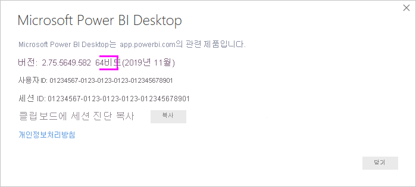
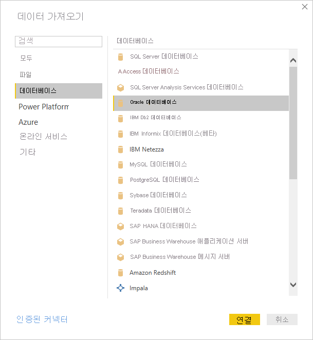
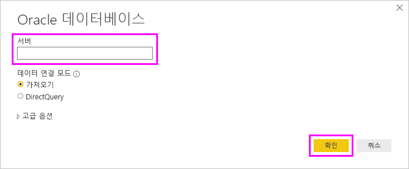
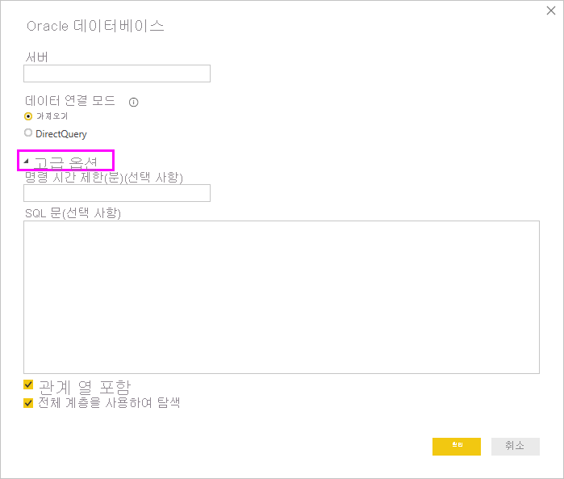

# Power BI Desktop을 사용하여 Oracle 데이터베이스에 연결
Power BI Desktop을 사용하여 Oracle 데이터베이스에 연결하려면 Power BI Desktop을 실행하는 컴퓨터에 올바른 Oracle 클라이언트 소프트웨어를 설치해야 합니다. 사용하는 Oracle 클라이언트 소프트웨어는 설치한 Power BI Desktop 버전이 32비트 또는 64비트인지에 따라 다릅니다. 또한 Oracle Server 버전에 따라 다릅니다.

지원되는 Oracle 버전: 
- Oracle Server 9 이상
- ODAC(Oracle Data Access Client) 소프트웨어 11.2 이상

> [!NOTE]
> Power BI Desktop, 온-프레미스 데이터 게이트웨이 또는 Power BI Report Server용 Oracle 데이터베이스를 구성하는 경우 [Oracle 연결 형식](https://docs.microsoft.com/sql/reporting-services/report-data/oracle-connection-type-ssrs?view=sql-server-ver15) 문서의 정보를 참조하세요. 

## 설치된 Power BI Desktop의 버전 확인
설치된 Power BI Desktop 버전을 확인하려면 **파일** > **도움말** > **정보**를 선택한 다음 **버전** 줄을 확인합니다. 다음 이미지에서 64비트 버전의 Power BI Desktop이 설치되었습니다.

## Oracle 클라이언트 설치
- Power BI Desktop 32비트 버전의 경우 [32비트 Oracle 클라이언트를 다운로드하여 설치](https://www.oracle.com/technetwork/topics/dotnet/utilsoft-086879.html)합니다.

- Power BI Desktop 64비트 버전의 경우 [64비트 Oracle 클라이언트를 다운로드하여 설치](https://www.oracle.com/database/technologies/odac-downloads.html)합니다.

> [!NOTE]
> Oracle Server와 호환되는 ODAC(Oracle Data Access Client) 버전을 선택합니다. 예를 들어 ODAC 12.x는 Oracle Server 버전 9를 항상 지원하지는 않습니다.
> Oracle 클라이언트의 Windows Installer를 선택합니다.
> Oracle 클라이언트를 설치하는 과정에서 설치 마법사를 실행하는 동안 해당 확인란을 선택하여 *컴퓨터 전체 수준에서 ASP.NET에 대한 ODP.NET 및/또는 Oracle 공급자를 구성*할 수 있는지 확인합니다. Oracle 클라이언트 마법사의 일부 버전에서는 기본적으로 확인란을 선택하고 나머지 버전에서는 그렇지 않습니다. Power BI를 Oracle 데이터베이스에 연결할 수 있도록 확인란이 선택되어 있는지 확인합니다.

## Oracle 데이터베이스에 연결
일치하는 Oracle 클라이언트 드라이버를 설치한 후에 Oracle 데이터베이스에 연결할 수 있습니다. 연결하려면 다음 단계를 수행하세요.

1. **홈** 탭에서 **데이터 가져오기**를 선택합니다. 

2. 표시되는 **데이터 가져오기** 창에서 **자세히**(필요한 경우)를 선택하고 **데이터베이스** > **Oracle 데이터베이스**를 선택한 다음, **연결**을 선택합니다.
   
   
3. 표시되는 **Oracle 데이터베이스** 대화 상자에서 **서버** 이름을 입력하고 **확인**을 선택합니다. SID가 필요한 경우 *ServerName/SID* 형식으로 지정합니다. 여기서 *SID*는 데이터베이스의 고유 이름입니다. *ServerName/SID* 형식이 작동하지 않으면 *ServerName/ServiceName*을 사용합니다. 여기서 *ServiceName*은 연결 시 사용하는 별칭입니다.

   

   > [!NOTE]
   > 로컬 데이터베이스 또는 자치 데이터베이스 연결을 사용하는 경우 연결 오류를 방지하려면 서버 이름을 따옴표로 묶어야 합니다. 
      
4. 네이티브 데이터베이스 쿼리를 사용하여 데이터를 가져오려는 경우 **Oracle 데이터베이스** 대화 상자의 **고급 옵션** 섹션을 확장할 때 표시되는 **SQL 문** 상자에 쿼리를 넣습니다.
   
   

5. **Oracle 데이터베이스** 대화 상자에 SID 또는 네이티브 데이터베이스 쿼리와 같은 선택적 정보를 포함하여 Oracle 데이터베이스 정보를 입력한 후에 **확인**을 선택하여 연결합니다.
5. Oracle 데이터베이스에서 데이터베이스 사용자 자격 증명을 요구하는 경우 메시지가 표시되면 대화 상자에서 해당 자격 증명을 입력합니다.

## 문제 해결

명명 구문이 잘못되었거나 적절히 구성되지 않은 경우 Oracle에서 여러 가지 오류가 발생할 수 있습니다.

* ORA-12154: TNS: 지정된 연결 식별자를 확인할 수 없습니다.
* ORA-12514: TNS: 수신기는 현재 연결 설명자에서 요청된 서비스를 알지 못합니다.
* ORA-12541: TNS: 수신기 없음
* ORA-12170: TNS: 연결 시간 초과가 발생함
* ORA-12504: TNS: 수신기가 CONNECT_DATA에서 SERVICE_NAME을 제공받지 못했습니다.

Oracle 클라이언트가 설치되지 않거나 제대로 구성되지 않은 경우 이 오류가 발생할 수 있습니다. 설치된 경우 tnsnames.ora 파일이 제대로 구성되어 있고 적절한 net_service_name을 사용하는지 확인합니다. net_service_name이 Power BI Desktop을 사용하는 머신과 게이트웨이를 실행하는 머신 간에 동일한지 확인해야 합니다. 자세한 내용은 [Oracle 클라이언트 설치](#install-the-oracle-client)를 참조하세요.

Oracle 서버 버전과 Oracle Data Access Client 버전 간에 호환성 문제가 발생할 수도 있습니다. 일반적으로 해당 버전을 일치시키려 하는데 일부 조합이 호환되지 않습니다. 예를 들어 ODAC 12.x는 Oracle Server 버전 9를 지원하지 않습니다.

Microsoft Store에서 Power BI Desktop을 다운로드하면 Oracle 드라이버 문제로 인해 Oracle 데이터베이스에 연결할 수 없게 됩니다. 이 문제가 발생하면 ‘개체 참조가 설정되지 않음’ 오류 메시지가 반환됩니다. 문제를 해결하려면 다음 단계 중 하나를 수행합니다.

* Microsoft Store 대신 [다운로드 센터](https://www.microsoft.com/download/details.aspx?id=58494)에서 Power BI Desktop을 다운로드합니다.

* Microsoft Store의 버전을 사용하려면 로컬 컴퓨터에서 _12.X.X\client_X_의 oraons.dll을 _12.X.X\client_X\bin_에 복사합니다. 여기서 _X_는 버전 및 디렉터리 번호를 나타냅니다.

Oracle 데이터베이스에 연결할 때 Power BI Gateway에 ‘개체 참조가 설정되지 않음’ 오류 메시지가 표시되면 [데이터 원본 관리 - Oracle](service-gateway-onprem-manage-oracle.md)의 지침을 따르세요.

Power BI Report Server를 사용하는 경우 [Oracle 연결 형식](https://docs.microsoft.com/sql/reporting-services/report-data/oracle-connection-type-ssrs?view=sql-server-ver15) 문서의 지침을 참조하세요.
