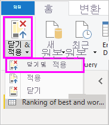
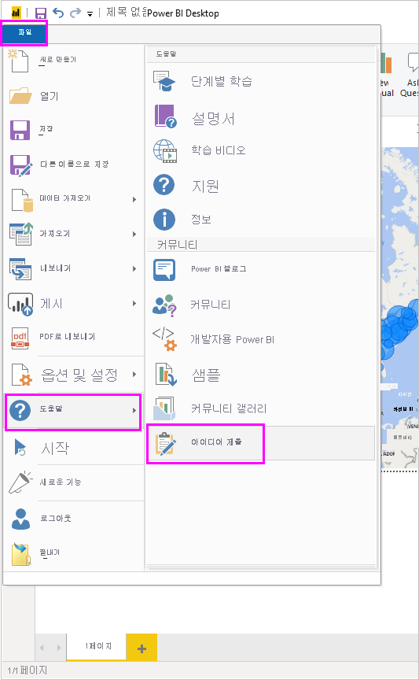

# Power BI Desktop에서 데이터 소스에 연결

Power BI Desktop을 사용하면 계속 확장되는 데이터에 쉽게 연결할 수 있습니다. Power BI Desktop이 없는 경우 여기서 [다운로드](https://go.microsoft.com/fwlink/?LinkID=521662)하여 설치할 수 있습니다.

Power BI Desktop에는 사용할 수 있는 *모든 종류*의 데이터 소스가 있습니다. 다음 이미지는 **데이터 가져오기** > **기타** > **웹**을 선택하여 데이터를 연결하는 방법을 보여줍니다.

## 데이터에 연결하는 방법 예제

이 예제에서는 **웹** 데이터 소스에 연결합니다.

사용 중지를 상상해 보세요. 은퇴를 계획 중이며, 많은 햇빛과 세금 및 의료 보험 혜택이 있는 곳에서 거주하고 싶습니다. 또는 데이터 분석가이며 고객에게 유용한 정보를 제공하려 한다고 가정해 보세요. 예를 들어 비옷을 만드는 클라이언트가 강우량이 ‘많은’ 지역에서 매출 목표를 정하도록 도울 수 있습니다. 

어떤 경우든지 이러한 항목 등에 대한 흥미로운 데이터가 있는 웹 리소스를 찾을 수 있습니다.

[https://www.bankrate.com/finance/retirement/best-places-retire-how-state-ranks.aspx](https://www.bankrate.com/finance/retirement/best-places-retire-how-state-ranks.aspx)

**데이터 가져오기** > **기타** > **웹**을 선택합니다. **웹에서** 주소를 입력하세요.

**확인**을 선택하면 Power BI Desktop의 *쿼리* 기능이 작동합니다. Power BI Desktop이 웹 리소스에 연결되고 **탐색기** 창에 해당 웹 페이지에서 찾은 내용의 결과가 반환됩니다. 이 경우 테이블 및 전체 문서가 발견되었습니다. 테이블에 관심이 있으므로 목록에서 테이블을 선택합니다. **탐색기** 창에 미리 보기가 표시됩니다.

이 시점에서 창 맨 아래에 있는 **데이터 변환**을 선택하여 테이블을 로드하기 전에 쿼리를 편집하거나 테이블을 로드할 수 있습니다.

**데이터 변환**을 선택하여 테이블을 로드하고 Power Query 편집기를 시작하세요. **쿼리 설정** 창이 표시됩니다. 표시되지 않는 경우 리본 메뉴에서 **보기**를 선택한 다음 **쿼리 설정**을 선택하여 **쿼리 설정** 창을 표시하세요. 표시되는 모양은 다음과 같습니다.

이러한 모든 점수는 숫자가 아니라 텍스트이며 숫자로 변환해야 합니다. 문제가 되지 않습니다. 열 머리글을 마우스 오른쪽 단추로 클릭하고 **형식 변경** > **정수**를 선택하여 변경하면 됩니다. 둘 이상의 열을 선택하려면 먼저 열을 하나 선택하고 Shift 키를 누른 채 인접한 열을 추가로 선택한 다음 열 머리글을 마우스 오른쪽 단추로 클릭하여 선택한 모든 열을 변경합니다. 인접하지 않은 열을 선택하려면 Ctrl 키를 사용합니다.

**쿼리 설정**에서 **적용된 단계**는 수행된 변경 내용을 반영합니다. 데이터를 추가로 변경하는 경우 Power Query 편집기가 이러한 변경 내용을 **적용된 단계** 섹션에 기록하며, 필요에 따라 조정, 다시 방문, 다시 정렬 또는 삭제할 수 있습니다.

로드된 후에도 테이블을 추가로 변경할 수 있지만 지금은 이 작업으로 충분합니다. 작업을 마치고 **홈** 리본 메뉴에서 **닫기 및 적용**을 선택하면 Power BI Desktop이 변경 사항을 적용하고 Power Query 편집기를 닫습니다.

로드한 데이터 모델을 통해 Power BI Desktop의 **보고서** 보기에서 필드를 끌어서 캔버스에 놓으면 시각화를 만들기 시작할 수 있습니다.

물론 이 모델은 단일 데이터 연결을 사용하는 간단한 방법입니다. 대부분의 Power BI Desktop 보고서는 다양한 데이터 원본에 연결하고, 요구 사항에 맞게 모양이 지정되고, 풍부한 데이터 모델을 생성하는 관계를 포함합니다.

## 다음 단계
Power BI Desktop에서 모든 종류의 작업을 수행할 수 있습니다. 해당 기능에 대한 자세한 내용은 다음 리소스를 확인하세요.

* [Power BI Desktop이란?](../fundamentals/desktop-what-is-desktop.md)
* [Power BI Desktop의 쿼리 편집기 사용 정보](../transform-model/desktop-query-overview.md)
* [Power BI Desktop의 데이터 원본](desktop-data-sources.md)
* [Power BI Desktop에서 데이터 셰이핑 및 결합](desktop-shape-and-combine-data.md)
* [Power BI Desktop의 일반적인 쿼리 작업 수행](../transform-model/desktop-common-query-tasks.md)   

사용자 의견을 제공하려는 경우 잘 했습니다! Power BI Desktop에서 **아이디어 제출** 메뉴 항목을 사용하거나 [커뮤니티 피드백](https://community.powerbi.com/t5/Community-Feedback/bd-p/community-feedback)을 방문하세요. 항상 사용자 의견에 귀를 기울이고 있습니다.

