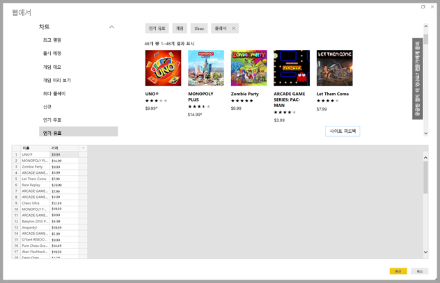
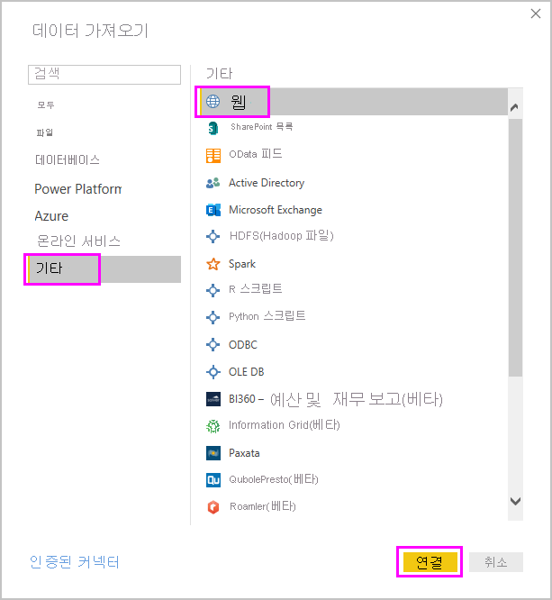
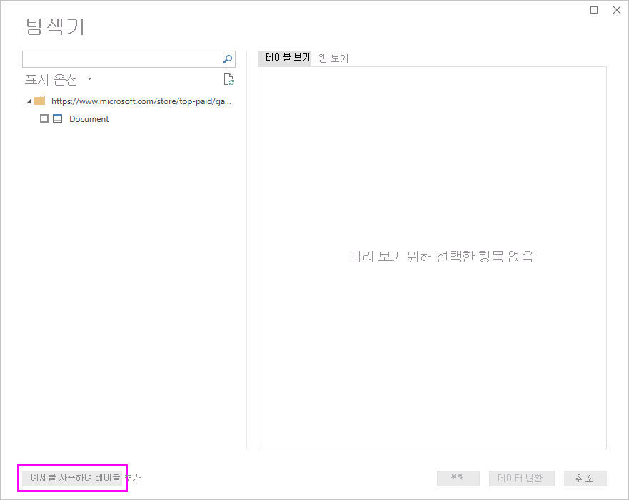
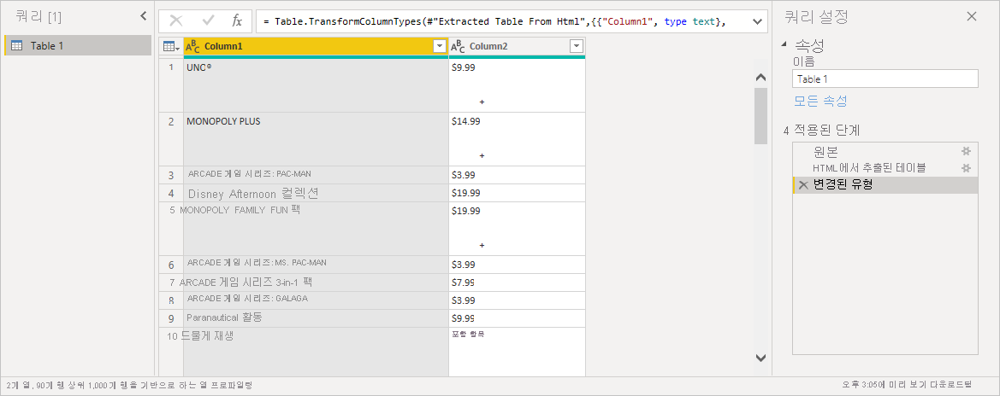

# <a name="get-webpage-data-by-providing-examples"></a>예제를 제공하여 웹 페이지 데이터 가져오기

웹 페이지에서 데이터를 가져오면 사용자가 간편하게 웹 페이지에서 데이터를 추출하고 해당 데이터를 *Power BI Desktop*으로 가져올 수 있습니다. 그러나 종종 웹 페이지의 데이터는 추출하기 쉬운 깔끔한 테이블에 있지 않습니다. 이러한 페이지에서 데이터를 가져오는 것은 데이터가 구조화되고 일관되더라도 어려운 일일 수 있습니다.

이에 대한 솔루션이 있습니다. *예제를 통해 웹에서 데이터 가져오기* 기능을 사용하면 커넥터 대화 상자에 하나 이상의 예제를 제공하여 추출하려는 데이터를 Power BI Desktop에 표시할 수 있습니다. Power BI Desktop은 페이지에서 예제와 일치하는 다른 데이터를 수집합니다. 이 솔루션을 사용하면 테이블에 있는 데이터 ‘및’ 기타 테이블 이외의 데이터를 포함하여 웹 페이지에서 모든 종류의 데이터를 추출할 수 있습니다. 



그래픽의 가격은 예시용입니다.

## <a name="using-get-data-from-web-by-example"></a>예제를 통해 웹에서 데이터 가져오기 사용

**홈** 리본 메뉴에서 **데이터 가져오기**를 선택합니다. 표시되는 대화 상자의 왼쪽 창의 범주에서 **기타**를 선택한 다음, **웹**을 선택합니다. **연결**을 선택하여 계속합니다.



**웹에서** 데이터를 추출할 웹 페이지의 URL을 입력합니다. 이 문서에서는 Microsoft Store 웹 페이지를 사용하여 이 커넥터의 작동 방식을 보여줍니다.

따라 하려는 경우 이 문서에서 사용하는 [Microsoft Store URL](https://www.microsoft.com/store/top-paid/games/xbox?category=classics)을 사용하면 됩니다.

```http
https://www.microsoft.com/store/top-paid/games/xbox?category=classics
```


**확인**을 선택하면 웹 페이지에서 자동 검색된 테이블이 표시되는 **탐색기** 대화 상자로 이동됩니다. 아래 이미지에 표시된 경우를 보면 테이블이 없습니다. **예제를 사용하여 테이블 추가**를 선택하여 예제를 제공합니다.



**예제를 사용하여 테이블 추가**는 웹 페이지의 콘텐츠를 미리 볼 수 있는 대화형 창을 제공합니다. 추출하려는 데이터의 샘플 값을 입력합니다.

이 예제에서는 페이지의 각 게임에 대한 ‘이름’ 및 ‘가격’을 추출합니다.   각 열에 대한 페이지에서 몇 가지 예제를 지정하여 작업을 수행할 수 있습니다. 예제를 입력할 때 *파워 쿼리*는 스마트 데이터 추출 알고리즘을 사용하여 예제 항목의 패턴에 맞는 데이터를 추출합니다.


> [!NOTE]
> 값 제안에는 길이가 128자보다 작거나 같은 값만 포함됩니다.

웹 페이지에서 추출된 데이터에 만족하는 경우 **확인**을 선택하여 Power Query 편집기로 이동합니다. 이 데이터를 다른 데이터 원본과 결합하는 등 더 많은 변형을 적용하거나 데이터의 모양을 지정할 수 있습니다.



여기서 시각적 개체를 만들거나 Power BI Desktop 보고서를 만들 때 웹 페이지 데이터를 사용할 수 있습니다.

## <a name="next-steps"></a>다음 단계

Power BI Desktop을 사용하여 연결할 수 있는 모든 종류의 데이터가 있습니다. 데이터 원본에 대한 자세한 내용은 다음 리소스를 확인하세요.

* [Power BI Desktop에서 예제로 열 추가](../create-reports/desktop-add-column-from-example.md)
* [Power BI Desktop에서 웹 페이지에 연결](desktop-connect-to-web.md)
* [Power BI Desktop의 데이터 원본](desktop-data-sources.md)
* [Power BI Desktop에서 데이터 셰이핑 및 결합](desktop-shape-and-combine-data.md)
* [Power BI Desktop에서 Excel 통합 문서에 연결](desktop-connect-excel.md)
* [Power BI Desktop에서 CSV 파일에 연결](desktop-connect-csv.md)
* [Power BI Desktop에 데이터 직접 연결](desktop-enter-data-directly-into-desktop.md)
