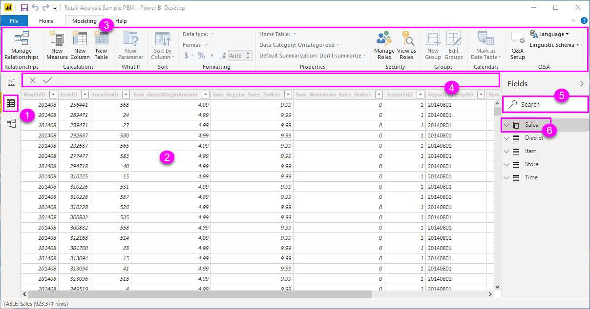
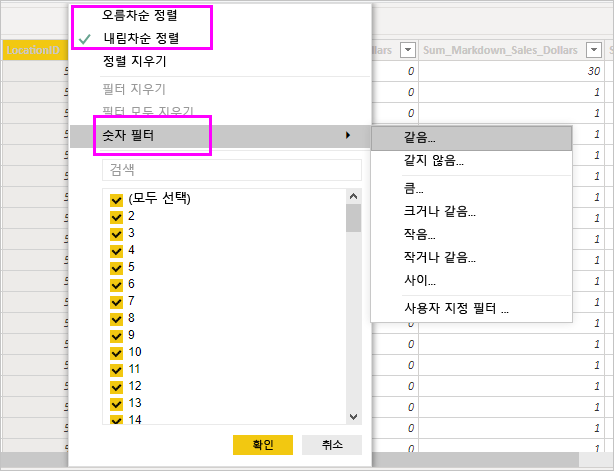

# Power BI Desktop의 데이터 뷰 사용

*데이터 보기*는 *Power BI Desktop* 모델의 데이터를 검사하고, 검색하고, 이해하는 데 도움이 됩니다. ‘Power Query 편집기’에서 테이블, 열 및 데이터를 보는 것과는 차이가 있습니다.  데이터 보기에서는 모델에 데이터를 로드한 *후*의 데이터를 보게 됩니다.

> [!NOTE]
> 데이터 보기에서는 모델에 데이터를 로드한 후 표시하므로 모든 데이터 원본이 DirectQuery를 기반으로 하는 경우 데이터 보기 아이콘이 표시되지 않습니다. 

데이터를 모델링할 때 보고서 캔버스에서 시각 효과 없이 테이블 또는 열의 실제 모습을 보려는 경우가 있습니다. 행 수준을 바로 확인하는 것이 좋습니다. 이 기능은 특히 측정치와 계산된 열을 만들거나, 데이터 형식 또는 데이터 범주를 파악해야 하는 경우 유용합니다.

데이터 보기에 있는 일부 요소를 자세히 살펴보겠습니다.

1. **데이터 보기 아이콘**. 이 아이콘을 선택하여 데이터 보기를 입력합니다.

2. **데이터 표**. 이 영역에는 선택한 테이블과 그 안의 모든 열 및 행이 표시됩니다. *보고서* 보기에서 숨겨진 열은 옅은 회색으로 표시됩니다. 열을 마우스 오른쪽 단추로 클릭하면 옵션이 표시됩니다.

3. **모델링 리본**입니다. 여기에서 관계를 관리하고, 계산을 만들며, 열의 데이터 형식, 형식, 데이터 범주를 변경할 수 있습니다.

4. **수식 입력줄**. 측정값과 계산된 열에 대한 DAX(Data Analysis Expression) 수식을 입력합니다.

5. **검색**합니다. 모델에서 테이블 또는 열을 검색합니다.

6. **필드 목록**. 데이터 표 형식으로 보려는 테이블이나 열을 선택합니다.

## 데이터 보기에서 필터링

데이터 보기에서 데이터를 필터링하고 정렬할 수도 있습니다. 각 열은 적용된 경우 정렬 방향을 나타내는 아이콘을 표시합니다.

개별 값을 필터링하거나 열의 데이터를 기반으로 고급 필터링을 사용할 수 있습니다.

> [!NOTE]
> 현재 사용자 인터페이스와는 다른 문화권에서 Power BI 모델을 만든 경우 텍스트 필드 이외 항목에 대해서는 데이터 보기 사용자 인터페이스에 검색 상자가 나타나지 않습니다. 예를 들어, 미국 영어로 만들어졌지만 스페인어로 표시되는 모델에 적용됩니다.

## 다음 단계

Power BI Desktop으로 모든 종류의 작업을 수행할 수 있습니다. 해당 기능에 대한 자세한 내용은 다음 리소스를 확인하세요.

* [Power BI Desktop이란?](../fundamentals/desktop-what-is-desktop.md)
* [Power BI Desktop을 사용한 쿼리 개요](../transform-model/desktop-query-overview.md)
* [Power BI Desktop의 데이터 형식](desktop-data-types.md)
* [Power BI Desktop에서 데이터 셰이핑 및 결합](desktop-shape-and-combine-data.md)
* [Power BI Desktop의 일반적인 쿼리 작업](../transform-model/desktop-common-query-tasks.md)
