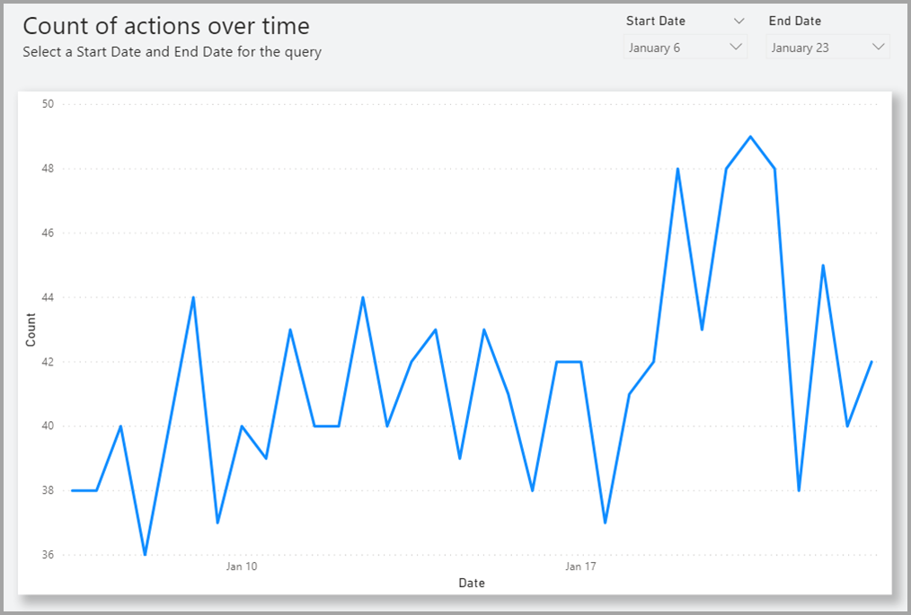

# <a name="dynamic-m-query-parameters-in-power-bi-desktop-preview"></a>Power BI Desktop의 동적 M 쿼리 매개 변수(미리 보기)

**동적 M 쿼리 매개 변수** 를 사용하면 모델 작성자는 **보고서를 보는 사람** 이 필터 또는 슬라이서를 사용하여 [M 쿼리 매개 변수](/power-query/power-query-query-parameters)의 값을 설정하도록 허용할 수 있습니다. 이렇게 하면 쿼리 성능 최적화에 특히 유용합니다. 동적 M 쿼리 매개 변수를 사용하면 모델 작성자는 필터 선택 옵션을 DirectQuery 원본 쿼리에 통합하는 방법을 추가로 제어할 수 있습니다. 

모델 작성자는 필터가 의도하는 바를 이해하면 데이터 원본에 대한 효율적인 쿼리를 작성하는 방법을 알 수 있는 경우가 많으며, 따라서 필터 선택 옵션을 적시에 원본 쿼리와 통합하여 성능을 향상하고 의도한 결과를 얻을 수 있습니다.

## <a name="enabling-dynamic-m-query-parameters"></a>동적 M 쿼리 매개 변수 사용

**동적 M 쿼리 매개 변수** 는 현재 미리 보기로 제공되며, 활성화해야만 사용할 수 있습니다. **파일 > 옵션 및 설정 > 옵션** 을 선택한 다음, 왼쪽 창에서 **미리 보기 기능** 을 선택합니다. 여기서 **동적 M 쿼리 매개 변수** 확인란을 선택합니다. 변경 내용을 적용하려면 Power BI Desktop을 다시 시작해야 할 수도 있습니다.


이 기능을 사용하기 위한 필수 구성 요소로, 하나 이상의 직접 쿼리 테이블에서 생성되어 참조되는 유효한 [M 쿼리 매개 변수](/power-query/power-query-query-parameters)가 있어야 합니다. 

> [!NOTE]
> 일부 DirectQuery 원본이 이 기능에서 지원되지 않으므로 이 문서의 [고려 사항 및 제한 사항](#considerations-and-limitations) 섹션을 확인해야 합니다.

**단일 값** 을 매개 변수에 동적으로 전달하는 예제를 단계별로 살펴보겠습니다.

1. Power BI Desktop의 **데이터** 탭에서 **파워 쿼리** 를 시작하고, 리본의 **매개 변수 관리** 단추 아래에서 **새 매개 변수** 를 선택합니다.

    

2. 그런 다음, 매개 변수에 대한 다음 정보를 입력합니다.

    

3. 추가할 매개 변수가 더 있는 경우 **새로 만들기** 를 다시 클릭합니다.

    

4. 매개 변수를 만든 후에는 M 쿼리에서 해당 매개 변수를 참조할 수 있습니다. M 쿼리를 수정하려면 수정하려는 쿼리가 있는 상태에서 고급 편집기를 엽니다.

    

5. 그 후에는 다음 이미지에서 노란색으로 강조 표시된 매개 변수를 M 쿼리에서 참조합니다. 

    

6. 매개 변수를 만들고 M 쿼리에서 해당 매개 변수를 참조했으므로, 이제 해당 매개 변수에 사용할 수 있는 값을 제공하는 열이 있는 테이블을 만들어야 합니다. 이렇게 하면 선택하는 필터에 따라 매개 변수가 동적으로 설정됩니다. 이 예제에서는 *StartTime* 매개 변수 및 *EndTime* 매개 변수를 동적 매개 변수로 만들겠습니다. 두 매개 변수에는 날짜/시간 매개 변수가 필요하기 때문에, 매개 변수의 날짜를 설정하는 데 사용할 수 있는 날짜 입력을 생성하려 합니다. 먼저 다음과 같이 새 테이블을 만듭니다.

    

7. 다음은 *StartTime* 매개 변수의 값으로 만든 첫 번째 테이블입니다.

    ```StartDateTable = CALENDAR (DATE(2016,1,1), DATE(2016,12,31))```

    

8. 다음은 EndTime 매개 변수의 값으로 만든 두 번째 테이블입니다.

    ```EndDateTable = CALENDAR (DATE(2016,1,1), DATE(2016,12,31))```

    

    > [!NOTE]
    > 실제 테이블에 없는 다른 열 이름을 사용하는 것이 좋습니다. 이름이 동일한 경우 선택한 값이 실제 쿼리에 필터로 적용됩니다.

9. *날짜* 필드가 있는 테이블이 생성되었으므로, 각 필드를 매개 변수에 바인딩할 수 있습니다. 필드를 매개 변수에 바인딩할 경우 필드에 대해 선택한 값이 변경되면 해당 값은 매개 변수에 전달되고, 매개 변수가 참조되는 쿼리를 업데이트합니다. 필드를 바인딩하려면 **모델링** 탭으로 이동하여 새로 만든 필드를 선택한 다음, **고급** 속성으로 이동합니다.

    > [!NOTE]
    > 열 데이터 형식이 M 매개 변수 형식과 일치해야 합니다.

    

10. **매개 변수에 바인딩** 에서 드롭다운을 선택하고, 필드에 바인딩하려는 매개 변수를 선택합니다.

    

    이 예제는 단일 선택 값(매개 변수를 단일 값으로 설정)에 대한 예제이므로 **다중 선택** 설정을 기본값인 **아니요** 로 유지합니다.

    

    본인의 사용 사례에 다중 선택이 필요한 경우(여러 값을 단일 매개 변수에 전달) 스위치를 **예** 로 전환하고 M 쿼리가 M 쿼리에서 여러 값을 허용하도록 올바르게 설정되었는지 확인해야 합니다. 다음은 여러 값을 허용하는 *RepoNameParameter* 예제입니다.

    

11. 다른 매개 변수에 바인딩할 다른 필드가 있는 경우 다음 단계를 반복하면 됩니다.

    

12. 마지막으로 이 필드를 슬라이서에서 또는 필터로 참조할 수 있습니다.

    

매핑된 열의 다중 선택이 **아니요** 로 설정된 경우 슬라이서에서 단일 선택 모드를 사용하거나 필터 카드에서 단일 선택을 요구해야 합니다.

## <a name="potential-security-risk"></a>잠재적 보안 위험

보고서를 읽는 사람이 M 쿼리 매개 변수의 값을 동적으로 설정할 수 있도록 허용할 경우 M 쿼리에서 매개 변수를 참조하는 방법과 해당 매개 변수에 전달되는 값에 따라 보고서를 읽는 사람이 **삽입 공격** 을 사용하여 추가 데이터에 액세스하거나 원본 시스템에 대한 수정을 트리거할 수도 있습니다.

예를 들어 다음과 같이 생성된 매개 변수가 있는 Kusto 쿼리를 가정해 보겠습니다.

```
Products
| where Category == [Parameter inserted here] & HasReleased == 'True'
 | project ReleaseDate, Name, Category, Region```
```

다음과 같이 매개 변수에 적절한 값을 전달하는 우호적인 사용자에게는 아무 문제가 없을 것입니다(예: *Games* ).

```
| where Category == 'Games' & HasReleased == 'True'
```

그러나 공격자는 다음과 같이 쿼리를 수정하는 값을 전달하여 더 많은 데이터에 액세스할 수 있습니다(예: *'Games' //* ).

```
Products
| where Category == 'Games'// & HasReleased == 'True'
| project ReleaseDate, Name, Category, Region
```

이 예제에서 공격자는 쿼리의 일부를 주석으로 변경하여 아직 릴리스되지 않은 게임 정보에 대한 액세스 권한을 얻을 수 있습니다.

**위험을 완화하는 방법**

보안 위험을 완화하려면 쿼리 내에서 M 매개 변수 값의 문자열 연결을 방지하는 것이 가장 좋습니다.  그 대신 M 엔진 및 커넥터가 최종 쿼리를 구성하도록 원본 쿼리를 폴딩하는 M 작업에서 이러한 매개 변수 값을 사용하세요. 또는 사용 가능한 경우 원본 쿼리 언어 및 커넥터에 기본 제공되는 매개 변수 전달 메커니즘을 사용합니다. 예를 들어 [Azure Data Explorer](/azure/data-explorer/kusto/query/queryparametersstatement?pivots=azuredataexplorer)는 주입 공격을 차단하도록 설계된 쿼리 매개 변수 기능이 기본 제공됩니다.

몇 가지 예제는 다음과 같습니다.

* M 쿼리의 필터링 작업을 사용하는 예제:
    ```
    Table.SelectRows(Source, (r) =\&gt; r[Columns] = Parameter)
    ```

* 원본 쿼리에서 매개 변수를 선언(또는 매개 변수 값을 원본 쿼리 함수에 입력으로 전달)하는 예제:
    ```
    declare query\_parameters (Name of Parameter : Type of Parameter);
    ```

## <a name="considerations-and-limitations"></a>고려 사항 및 제한 사항

동적 M 쿼리 매개 변수를 사용할 때 생각해야 할 몇 가지 고려 사항 및 제한 사항이 있습니다.

* 한 매개 변수를 여러 필드에 바인딩할 수 없으며 그 반대의 경우도 마찬가지입니다.
* 이 기능은 M 기반 데이터 원본에 대해서만 지원됩니다. 다음 DirectQuery 원본은 지원되지 않습니다.
    * T-SQL 기반 데이터 원본: SQL Server, Azure SQL Database, Synapse SQL 풀(즉, Azure SQL Data Warehouse) 및 Synapse SQL OnDemand 풀
    * 라이브 연결 데이터 원본: Azure Analysis Services, SQL Server Analysis Services, Power BI 데이터 세트
    * 기타 지원되지 않는 데이터 원본: Oracle, Teradata 및 관계형 SAP Hana
    * XMLA/TOM 엔드포인트 프로그래밍 기능을 통해 부분적으로 지원됨: SAP BW 및 SAP Hana 


* 지원되지 않는 기본 매개 변수 형식은 다음과 같습니다.
  * 모두
  * Duration
  * True/False
  * 이진

* 지원되지 않는 필터:
  * 상대 시간 슬라이서 또는 필터
  * 상대 날짜
  * 계층 구조 슬라이서
  * 다중 필드 포함 필터
  * 제외 필터/미해당 필터
  * 교차 강조 표시
  * 드릴다운 필터
  * 크로스드릴 필터
  * 상위 N 필터
* 지원되지 않는 작업:
  * And
  * 포함
  * 보다 작음
  * 보다 큼
  * 다음으로 시작
  * 다음으로 시작하지 않음
  * 다음이 아님
  * 포함하지 않음
  * 모두 선택
  * 공백임
  * 비어 있지 않음


## <a name="next-steps"></a>다음 단계

Power BI Desktop으로 모든 종류의 작업을 수행할 수 있습니다. 해당 기능에 대한 자세한 내용은 다음 리소스를 확인하세요.

* [Power BI에서 DirectQuery를 사용하는 방법](desktop-directquery-about.md)
* [Power BI Desktop이란?](../fundamentals/desktop-what-is-desktop.md)
* [Power BI Desktop을 사용한 쿼리 개요](../transform-model/desktop-query-overview.md)
* [Power BI Desktop의 데이터 형식](desktop-data-types.md)
* [Power BI Desktop에서 데이터 셰이핑 및 결합](desktop-shape-and-combine-data.md)
* [Power BI Desktop의 일반적인 쿼리 작업](../transform-model/desktop-common-query-tasks.md)